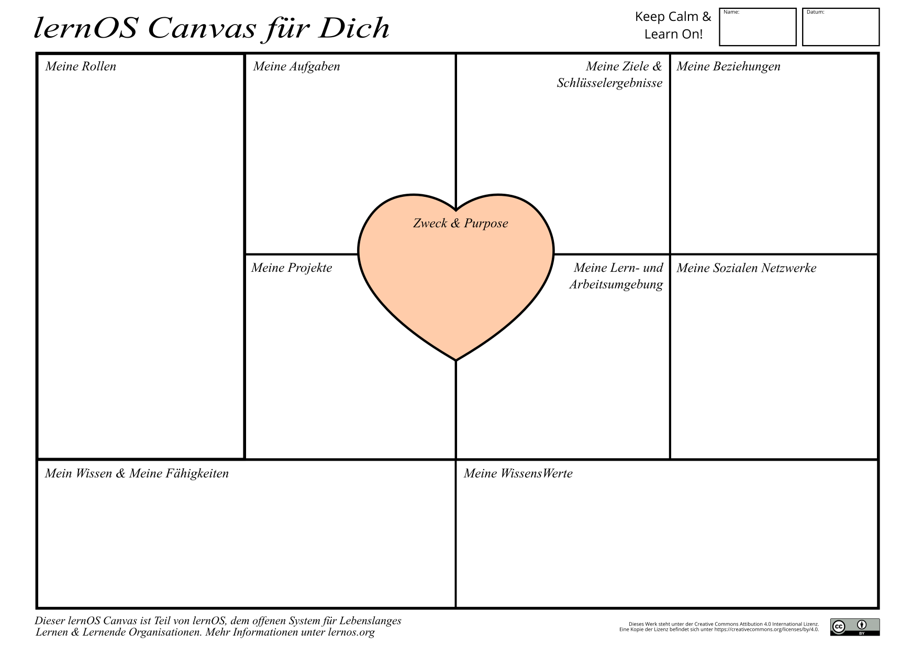

## lernOS Canvas - Überblick über Wissens- und Lernbedarfe

Ein Canvas ist eine visuelle Struktur, die für die parallele Bearbeitung mehrere Bereiche verwendet werden kann. Die Idee für den lernOS Canvas kam ursprünglich von Alex Osterwalder, der den [Business Model Canvas](https://en.wikipedia.org/wiki/Business_Model_Canvas) für die Erarbeitung von Geschäftsmodellen entwickelt hat.

Der [lernOS Canvas](https://raw.githubusercontent.com/cogneon/lernos-for-you/master/de/src/images/lernOS-Canvas-de.png) verwendet die gleiche Grundstruktur, die Benennung der Bereiche wurde aber angepasst, um die relevanten Themen des Arbeitsablaufs von lernOS auf individueller Ebene abzudecken. Bevor du in lernOS einsteigst, solltest du den Canvas einmal ausgefüllt haben, um dir Überblick über deinen aktuellen Stand zu verschaffen.

**ProTip:** Um mit dem Canvas flexibel arbeiten zu können, solltest du nie direkt darauf schreiben. Aus diesem Grund wurden Haftnotizen erfunden! 

Im oberen Teil des Canvas kannst du deinen Namen und das Datum der Erstellung bzw. letzten Änderung eintragen. Wenn du mit dem Canvas elektronisch arbeiten willst, kannst du ihn z.B. in OneNote oder ein digitales Whiteboard kopieren. Für die erste Befüllung des Canvas kannst du dir z.B. folgende Fragen stellen:

* **Zweck & Purpose:** Wofür lebst du? Was möchtest du in deinem Leben erreichen?
* **Ziele & Schlüsselergebnisse:** Welche Ziele hast du in den nächsten 12 Wochen? Welche messbaren Ergebnisse gibt es zu den Zielen?
* **Meine Rollen:** Was sind deine aktuellen Rollen? Welche Ziele ergeben sich aus diesen?
* **Meine Aufgaben:**  Was sind deine aktuellen Aufgaben? Welche Ziele ergeben sich daraus?
* **Meine Projekte:** Was sind deine aktuellen Projekte? Welche Ziele ergeben sich aus diesen?
* **Meine Sozialen Netzwerke:** Welche internen und externen sozialen Netzwerke (digital und analog) helfen dir bei der Vernetzung?
* **Meine Lern- und Arbeitsumgebung:** Wie sieht deine Lern- und Arbeitsumgebung aus (Infrastruktur, Inhalte, Tools, Methoden etc.)?
* **Mein Wissen & Meine Fähigkeiten:** Welche Wissensgebiete und Fähigkeiten sind für deine Ziele, Rollen, Aufgaben und Projekte wichtig? Was musst du noch lernen?
* **Meine Wissenswerte:** Welche WissensWerte (Dokumente, Checklisten, Videos etc.) hast du? Welche davon kannst du deinem Netzwerk anbieten?

