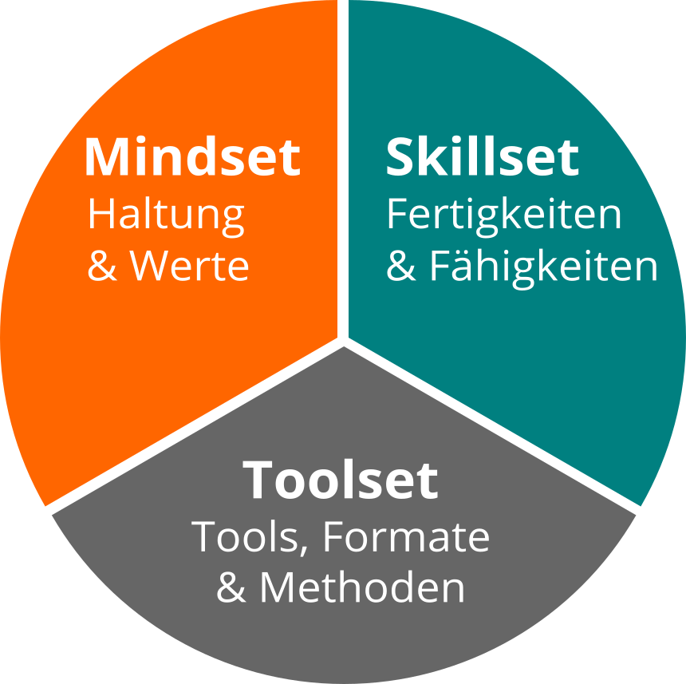

## lernOS Wheel: Mindset, Skillset und Toolset

Die Beherrschung der VUCA-Welt des 21. Jahrhunderts erfordert Offenheit
für Veränderungen und neue Ansätze. Es gibt eine Menge von Werkzeugen
und Methoden. Aber wenn du nicht offen bist, sie auszuprobieren, zu
experimentieren und zu scheitern, wird der Erfolg ausbleiben. Wie die
Leute mit den "quadratischen Rädern" im Bild unten, sind wir oft zu
beschäftigt, um die neuen Chancen zu sehen.

Bei der Anwendung neuer Handlungsweisen im Privatleben, in der Schule oder in der
Arbeit geht es nicht nur um die Verwendung digitaler Tools.
Um von "quadratischen Rädern" auf "runde Räder" umzusteigen, musst Du
auch deine Einstellung, deine Werte und deine Fähigkeiten
in die Überlegungen einbeziehen. lernOS nennt diese drei Dimensionen Mindset,
Skillset und Toolset. Sich nur auf ein oder zwei Dimensionen zu konzentrieren,
kann schon helfen. Doch für die besten Ergebnisse sollten alle drei Dimensionen im
persönlichen Entwicklungsprozess berücksichtigt werden.

### Mindset: Deine Haltung und Werte

Das Mindset kann die Haltung und Werte beschrieben werden,
die zu Handlungen und sichtbaren Ergebnissen führen. Diese 
entwickeln sich im Laufe der Zeit und bilden die Kultur von
Organisationen und der Gesellschaft. Wenn wir in der Welt handeln,
bekommen wir Feedback und lernen daraus. Im Laufe der Zeit erzeugen wir
mentale Modelle der Welt und Werte, die unser zukünftiges Handeln
leiten ([Boisot, 2004](https://www.rrojasdatabank.info/thermo/20388.pdf)). Für den Erfolg in der VUCA-Welt sind diese fünf Werte besonders wichtig (Buhse 2014 & Petry, 2014):

1. **Vernetzung** vor Isolation
2. **Vertrauen** vor Misstrauen
3. **Offenheit** vor Silos
4. **Partizipation** vor Ausgrenzung
5. **Agilität** vor Stabilität

Es gibt keine Reihenfolge in den oben genannten Werten, aber für mich persönlich ist die
[Offenheit](https://en.wikipedia.org/wiki/Openness) der zentrale Wert
für das Mindset des 21. Jahrhunderts. Damit ist die Offenheit für
neue Erfahrungen, Wissen und Ideen, aber auch das offene Teilen von Wissen, Ideen und
Inhalten gemeint (s.a. [Definition von
Offen](https://opendefinition.org)). Du solltest im Lauf der Zeit
ein "Open First Mindset" entwickeln, wie im [Open
First Manifest](http://innovationsbeirat.de/open-first) beschrieben:

**ProTip:** Dein Mindset ist nicht in den sprichwörtlichen Stein gemeißelt, es kann sich mit der Zeit verändern. Schaue dir das Video [Developing a Growth Mindset](https://www.youtube.com/watch?v=hiiEeMN7vbQ) von Carol Dweck an,
um mehr darüber zu erfahren.

### Skillset: Deine Fähigkeiten

Seit den 1980er Jahren sind Fähigkeiten, wie das Lösen von
Problemen und der Austausch mit anderen, für den eigenen Erfolg am wichtigsten. Dazu gehören insbesondere
Fähigkeiten, die in Zukunft nicht einfach durch Automatisierung und
künstliche Intelligenz ersetzt werden können. Um fit für das 21.
Jahrhundert zu werden, solltest du folgende fünf Fähigkeitsbereiche trainieren
([Framework for 21st Century Learning](http://www.p21.org/our-work/p21-framework), [DigiComp 2.1 Framework](https://ec.europa.eu/jrc/en/publication/eur-scientific-and-technical-research-reports/digcomp-21-digital-competence-framework-citizens-eight-proficiency-levels-and-examples-use)):

Du kannst die folgende Tabelle für eine Selbsteinschätzung am Anfang eines Learning Sprints nutzen. Wir nutzen die Stufen 1-5 aus dem [Dreyfus Model of Skill Acquisition](https://en.wikipedia.org/wiki/Dreyfus_model_of_skill_acquisition) (1 = Novize, 2 = Fortgeschrittener Anfänger, 3 = Kompetent, 4 = Profi, 5 = Experte). Trage deine aktuelle Stufe in die Spalte "Ist" und deine angestrebte Stufe in die Spalte "Soll". Auf der Basis kannst du den Fokus für deine Lernaktivitäten bestimmen.

| Fähigkeit | Ist | Soll |
|------------------------------|----|----|
| **Kreativität & Innovation** |  ||
| Kreativ denken |  ||
| Kreativ mit anderen arbeiten |  ||
| Innovationen umsetzen |  ||
| **Kritisches Denken & Problemlösen** |  ||
| Ermittlung von Bedürfnissen und technologischen Möglichkeiten |  ||
| Dingen effektiv auf den Grund gehen |  ||
| Urteile und Entscheidungen treffen |  ||
| Technische und nicht-technische Probleme lösen |  ||
| Kreativ Technologien zur Lösung von Problemen einsetzen |  ||
| **Kommunikation** |  ||
| Gedanken und Ideen klar und effektiv artikulieren |  ||
| Effektiv zuhören und Bedeutung erkennen |  ||
| Kommunikation nutzen, um zu informieren, zu unterrichten, zu motivieren und zu überzeugen |  ||
| Vielfältige Medien und Technologien nutzen |  ||
| Effektiv in verschiedenen Umgebungen kommunizieren |  ||
| **Kollaboration** |  ||
| Effektiv und respektvoll in gemischten Teams arbeiten |  ||
| Flexibilität und Bereitschaft zeigen sowie bei notwendigen Kompromissen unterstützen, um ein gemeinsames Ziel zu erreichen |  ||
| Verantwortung für die gemeinsame Arbeit übernehmen und einzelne Beiträge wertschätzen |  ||
| Mit digitalen Medien interagieren, sich beteiligen, austauschen und zusammenarbeiten |  ||
| Digitale Identität verwalten |  ||
| **Digital Literacy** |  ||
| Surfen, suchen, Daten, Informationen und digitale Inhalte filtern |  ||
| Auswertung und Verwaltung von Daten, Informationen und digitalen Inhalten |  ||
| Schutz digitaler Geräte und personenbezogener Daten |  ||
| Entwicklung, Integration und Überarbeitung digitaler Inhalte |  ||
| Umgang mit Urheberrechten und Lizenzen |  ||
| Programmieren, Scripten und Kodieren |  ||

**ProTip:** Das Mozilla [Web Literacy
Framework](https://learning.mozilla.org/en-US/web-literacy) bietet
Übungen zu Digital Literacy und Fähigkeiten des 21. Jahrhunderts.

### Toolset: Digitale Tools, die du verwendest

Das [Web 2.0](https://www.oreilly.com/pub/a/web2/archive/what-is-web-20.html) und
die sozialen Medien gibt es seit 2005. Nicht jeder muss alle digitalen Tools
kennen, aber man sollte einen Überblick haben, die Prinzipien kennen und
die richtigen Tools für sich auswählen. Das Conversation
Prism gibt einen guten Überblick über heute verfügbare
Web 2.0 Plattformen:

Für Einsteiger können 28 Kategorien und Dutzende von Tools
überwältigend sein. Die folgende Liste gibt daher einen Überblick über
die für lernOS wichtigsten Tools:

1.  **Office- & Produktivität**, z.B. Dropbox, Evernote,
    FreeMind, G Suite, MindManager, Office 365, OneNote, SharePoint,
    Trello, XMind
1.  **Chat & Messenger**, z.B. Google Hangouts Chat, Mattermost,
    Microsoft Teams, Rocketchat, Slack, Telegram, Threema, WeChat,
    WhatsApp
1.  **Soziale Netwerke**, z.B. IBM Connections, Jive, LinkedIn,
    Mastodon, Twitter, Workplace by Facebook, Xing, Yammer
1.  **Videokonferenz**, z.B. Google Hangouts Meet,
    GoToMeeting, Microsoft Teams, Skype, Skype for Business, WebEx,
    Zoom
1.  **Weblogs & Wikis**, z.B. Confluence, DokuWiki, LinkedIn (Artikel), MediaWiki,
    Medium, Tumblr, Wikipedia, WordPress

**ProTip:** Das [lernOS
Wiki](https://github.com/cogneon/lernos-core/wiki) enthält eine Linkliste
zu allen genannten Tools. In Zukunft wird es dort auch Tutorials zur Nutzung der Tools geben.
