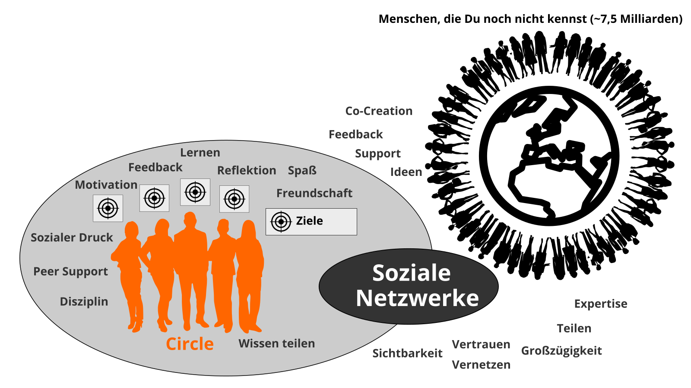

## lernOS Circle: Die Macht von "Peer Support"

Wenn du lernOS nicht alleine praktizieren möchtest, kannst du Dich in einer Gruppe von 4-5
Personen, die Learning Circle genannt wird, zusammenschließen. Ein Circle ist eine [Peer
Support](https://en.wikipedia.org/wiki/Peer_support) Gruppe, in der sich
die Mitglieder gegenseitig mit Feedback, Erfahrung, Wissen und Reflexion
helfen. Der Circle ist ein "Kreis des Vertrauens": was im Circle
passiert, bleibt im Circle! Die Circle-Mitglieder treffen sich wöchentlich
und folgen dabei einem vorgegebenen Ablauf, der den Lern- und
Entwicklungsprozess strukturiert.

Einmal pro Woche trifft sich der Learning Circle. Jedes Treffen folgt
einem vorgegebenen Ablauf (siehe Anhang) mit einem Check-in,
Übungen (Katas) und einem Check-out. Der Zeitraum für
das Weekly kann an die Bedürfnisse der Circle-Mitglieder angepasst
werden. Der vorgeschlagene Zeitraum ist Freitag zwischen 11-12 Uhr.

**ProTip:** Kata ist anderes Wort für Übung. Es kommt
aus dem Bereich des Erlernens von Programmier-Fähigkeiten im Peer-Learning-Format.
Lies mehr über dieses Format unter
[codekata.com](http://codekata.com).

Das Weekly kann als persönliches Treffen (face-2-face) oder virtuell
stattfinden. Der Circle muss Tools für die Kommunikation und Dokumentation
zwischen den Treffen definieren. Die folgenden Anwendungen haben sich in der Praxis bewährt:

- Microsoft Teams
- OneNote
- SharePoint
- Skype
- Skype for Business
- Slack
- WebEx
- WhatsApp
- Yammer
- Zoom

Wenn du in deiner Organisation ein Enterprise Social Network (ESN) wie z.B. Jive oder Connections hast, kann das für die Unterstützung von lernOS Circles auch eine gute Option sein.

**ProTip:** Wählt für möglichst einfache Benutzbarkeit ein Tool, das Kommunikation und Dokumentation gleichzeitig unterstützt, z.B. [Microsoft Teams](https://products.office.com/en-us/microsoft-teams/group-chat-software). In Microsoft Teams könnt Ihr den Kanal "Allgemein" für
Kommunikation, die Audio-/Video-Konferenz-Funktion für virtuelle Meetings und ein OneNote-Notizbuch zur Dokumentation nutzen.
