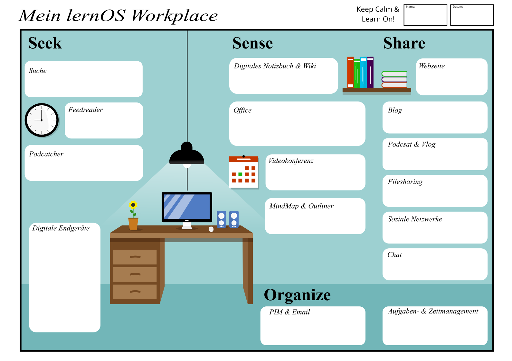

## lernOS Workplace - Deine Lernumgebung und dein Wissensarbeitsplatz

Beim Begriff des modernen Lern- und Arbeitsortest denken viele sofort an den "Digitalen Arbeitsplatz" oder das "Digitale Klassenzimmer" mit ihren vielen digitalen Tools. Deswegen sei diesem Kapitel folgendes Zitat vorangestellt:

> A fool with a tool is still a fool (Ron Weinstein)

Mindset, Skillset & Toolset statt nur Toolset: Wenn du an die Gestaltung der eigenen Lernumgebung oder des eigenen Wissenarbeitsplatzes gehst ist vielmehr eine ausgewogene Betrachtung von drei Bereichen wichtig:

* **Mindset** - Welche Haltung habe ich zum Lernen und wie zeigt sich das in meiner Lernumgebung/meinem Wissensarbeitsplatz (s.a. Growth Mindset von Carol Dweck, Open Mindset von Gary Hamel)?
* **Skillset** - wie gut sind meine Kompetenzen und Fähigkeiten in Bezug auf das Lernen (s.a. ([Framework for 21st Century Learning](http://www.p21.org/our-work/p21-framework), [DigiComp 2.1 Framework](https://ec.europa.eu/jrc/en/publication/eur-scientific-and-technical-research-reports/digcomp-21-digital-competence-framework-citizens-eight-proficiency-levels-and-examples-use))?
* **Toolset** - Nutze ich zeitgemäße Tools, Methoden und Formate in meinen Lern- und Arbeitsprozessen (s.a. [Web 2.0](https://www.oreilly.com/pub/a/web2/archive/what-is-web-20.html), [Agile Methoden](https://de.wikipedia.org/wiki/Agilit%C3%A4t_(Management)))?

Dein **lernOS Workplace** ist eine sehr individuelle Angelegenheit, du solltest dir diesen jeweils möglichst gut nach deinen Bedürfnissen gestalten. In der Regel ist dieser Platz auch nicht nur an einem Ort, sondern an mehreren. Bei Schüler_innen kann das z.B. die Schule und das eigene Zimmer sein. In Zeiten von verteilter und mobiler Arbeit kann jeder Ort dein Lern- und Arbeitsort sein.

Mit der folgenden Vorlage in Anlehnung an das [Seek>Sense>Share Frameworks](https://jarche.com/2014/02/the-seek-sense-share-framework/) von Harold Jarche kannst du deinen aktuellen lernOS Workplace beschreiben, deine Gedanken dazu mit anderen teilen und Ideen für die Zukunft entwickeln:

Das trifft auch auf den digitalen Teil der persönlichen Lernumgebung zu: alle Lernenden müssen sich geeignete Tools auswählen und einrichten.

Die folgende Tabelle zeigt Beispiele von internen (Intranet) und externen (Internet) Toolbeispielen zu den einzelnen Kategorien des lernOS Workplace:

| Tool-Kategorie                           | Beschreibung                                                 | Beispiele Internet                                           | Beispiele Intranet                                           |
| ---------------------------------------- | ------------------------------------------------------------ | ------------------------------------------------------------ | ------------------------------------------------------------ |
| **Suche**                                |                                                              | Bing, DuckDuckGo, Google                                     | Microsoft Search                                             |
| **Browser**                              |                                                              | Chrome, Edge, Firefox                                        | Chrome, Edge, Firefox                                        |
| **Feedreader**                           | Abonnieren und Empfangen von Nachrichten im Format RSS oder ATOM |                                                              |                                                              |
| **Podcatcher**                           | Abonnieren, Empfangen und Anhören von Podcasts               | Apple Podcasts App, Castro, Overcast                         | Microsoft Stream                                             |
| **Digitales Notizbuch**                  | Persönliche, digitale Notizen verwalten                      | Evernote                                                     | OneNote, Joplin                                              |
| **Wiki**                                 |                                                              | Wikipedia, Fandom                                            | Confluence, DokuWiki, MediaWiki                              |
| **Office-Paket**                         |                                                              | G Suite, Collabra                                            | Office 365, Libre Office                                     |
| **Videokonferenz-Software**              | Durchführung von Audio- und Videokonferenzen                 | Jitsi, Google Hangouts Meet, Skype                           | Zoom, GoToMeeting, Microsoft Teams, Skype for Business, WebEx, BlueJeans |
| **Mindmap-Software & Outliner**          | Erstellung und Bearbeitung von hierarchischen Themenstrukturen | Mindmeister                                                  | XMind, MindManager, Freemind, Freeplane                      |
| **Webseite**                             |                                                              | Jimdo, Squarespace, Wordpress                                | SharePoint Online, Confluence                                |
| **Weblog**                               | Schreiben und Veröffentlichen von Blog-Beiträgen             | Wordpress, Medium, LinkedIn (Artikel), Tumblr                | HCL Connections, Jive, Yammer                                |
| **Podcast- und Video-Blog-Plattform**    | Hochladen und Veröffentlichen von Audio- und Video-Blogs (vlogs) | YouTube, Vimeo, Podigee, Podcast Plattform, Wordpress + Podlove | Microsoft Stream, Kaltura, Vimp                              |
| **Filesharing**                          | Dateien in Ordnern organisieren                              | Dropbox, Google Drive                                        | OneDrive, SharePoint Online, Nextcloud                       |
| **Soziale Netzwerke & Online-Foren**     | Online-Profil pflegen, Statusnachrichten schreiben, mit anderen vernetzen | LinkedIn, Twitter, Workplace by Facebook, Xing, ResearchGate, Reddit, Stackoverflow | Yammer, HCL Connections, Jive, Discourse                     |
| **Chat**                                 | Kurznachrichten schreiben, Chat-Gruppen erstellen            | WhatsApp, Telegram, Signal, Threema, WeChat                  | Microsoft Teams, Kaizala, Slack, Mastodon, Threema, Mattermost, Rocket.Chat |
| **Personal Information Manager & Email** | E-Mail, Kalender, Kontakte etc. verwalten                    | Gmail                                                        | Outlook                                                      |
| **Aufgaben- und Zeitmanagement**         | Planung und Einhaltung von Zeiten für Aufgaben               | Trello, Todoist, Things, Omnifocus                           | Microsoft ToDo                                               |
| **Referenzmanager**                      | Verwaltung von Links und Literatur                           | Zotero, Mendeley, Liquidtext                                 |                                                              |

