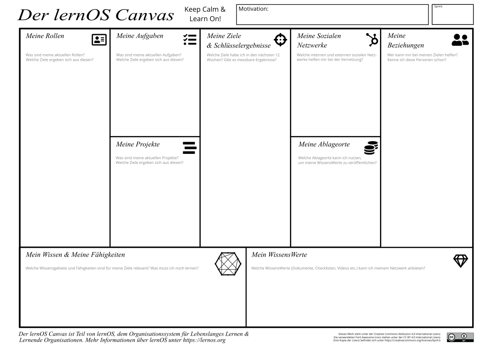

# Lernpfad

Ein lernOS Lernpfad ist eine Zusammenstellung von Übungen (Katas), mit denen du neue Fähigkeiten erlernst und im Lauf der Zeit eine neue Haltung entwickelst. Ein Lernpfad kann innerhalb eines lernOS Sprints durchlaufen werden. lernOS Einsteiger*innen (NOOBs) können zum Start aus einem  drei Lernpfaden OKR, GTD und WOL wählen.

**ProTip:** für einen Sprint sollte nur einer der drei Lernpfade gewählt werden. Alle drei Lernpfade können in aufeinanderfolgenden Sprints durchlaufen werden. Tandems und Circles sollten Lernpfade nicht mischen, da ihr sonst im Weekly nicht von den Erfahrungen der anderen profitieren könnt.

## Woche 0

Die Woche 0 ist die Woche, bevor es mit den Übungen im Lernpfad so richtig los geht. Nach Abschluss der Woche 0 sollten folgende Dinge festgelegt sein:

1. Welchen Lernpfad du verwendest
2. Ob du alleine, im Tandem oder im Circle lernst
3. Welche Hilfsmittel du zur Selbstorganisation verwendest (z.B. Videokonferenz-Tool für Circle)
4. Bei Tandem und Circle: An welchen Terminen die wöchentlichen Treffen stattfinden und wann du dir zusätzlich Lernzeit im Kalender reserviert hast.
5. Bei Tandem und Circle: ob ihr den Flipped-Classroom-Ansatz wählt und die Katas vor dem Weekly oder im Weekly macht.

Für die Woche 0 gibt es mit dem Past Forward und der Arbeit mit dem lernOS Canvas zwei zusätzliche Katas, die Klarheit schaffen können. Mit der Kata *Past Forward* verschaffst du dir in kurzer Zeit Überblick über deine aktuelle Situation, wichtige Ereignisse der Vergangenheit und vor allem deine Vision für die Zukunft. Die Kata *Visuell denken mit dem lernOS Canvas* hilft, operative Felder Aufgaben, Projekte, Zielgruppen etc. zu visualisieren und daraus Ziele für diesen oder zukünftige Sprints abzuleiten.

### Past Forward - Aus der Vergangenheit für die Zukunft lernen (Kata)

**Gestalte deine Zukunft durch Reflexion von Gegenwart und Vergangenheit und den Entwurf einer persönlichen Vision**

_**Dauer:** 30 Minuten_

Diese Kata basiert auf der Methode [The Future, Backwards](https://cognitive-edge.com/methods/the-future-backwards/) von Dave Snowden. Mit der Kata erhält man eine gute Sicht auf die persönliche Gesamtsituation durch einen Blick in die Vergangenheit und auf mögliche Zukünfte. Die Perspektive der Kata kann kurzfristig (1-2 Jahre), mittelfristig (3-5 Jahre) oder langfristig (ganzes Leben) sein.

**Anleitung:**

1. Bereite deine Past Forward Dokumentation vor ([Beispiel](https://cognitive-edge.com/wp-content/uploads/2015/01/3---ChrisFl-IMG-0058-wpcf_300x225.jpg)). Das kann im einfachsten Fall ein Blatt Papier im Querformat mit einem um 90 Grad nach rechts gedrehten "Y" darauf sein, Das Y stellt die aktuelle Situation (current state), die Vergangenheit, die Vision (heaven), die Anti-Vision (hell) sowie den "Stairway to Heaven" dar. Definiere die Zeitspanne, die du in Vergangenheit und Zukunft schauen möchtest (kurz-/mittel-/langfristig) (5 Minuten)
2. Beschreibe deine aktuelle Situation in in 3-5 kurzen Sätzen (5 Minuten)
3. Beschreibe die 3-5 Schlüssel-Ereignisse in der Vergangenheit, die zur aktuellen Situation geführt haben (5 Minuten)
4. Beschreibe deine Vision in 3-5 kurzen Sätzen (5 Minuten)
5. Beschreibe deine Anti-Vision in 3-5 kurzen Sätzen (5 Minuten)
6. Beschreibe die 3-5 Schlüssel-Aktivitäten oder -Projekte, die deine Vision Wirklichkeit werden lässt und die Anti-Vision verhindert (5 Minuten)

### Visuell denken mit dem lernOS Canvas (Kata)

Ein Canvas ist eine visuelle Struktur, die für die strukturierte Bearbeitung mehrere Bereiche parallel verwendet werden kann. Auf diese Weise verwendet man einen Canvas als visuelle Checkliste. Er kann aber auch für das Erzählen komplexer Geschichten verwendet werden. Die Idee kam ursprünglich von Alex
Osterwalder, der den [Business Model Canvas](https://en.wikipedia.org/wiki/Business_Model_Canvas) entwickelt hat. Der lernOS Canvas verwendet die gleiche Grundstruktur wie der Business Model Canvas. Doch die Benennungen der Bereiche wurden geändert, um
die Arbeitsthemen von lernOS abzudecken.

Der lernOS Canvas kann von der [lernOS Webseite](https://lernos.org) in verschiedenen Formaten heruntergeladen (z.B. PowerPoint, PDF, PNG) werden. Um mit dem Canvas flexibel arbeiten zu können, solltest du nie darauf schreiben. Aus diesem Grund wurden Haftnotizen erfunden!

Der obere Teil des Canvas enthält Motivations- oder Mission Statement (wenn du eines hast) und Nummer oder Datum des Sprints. Im Bereich "Meine Ziele & Schlüsselergebnisse" werden die Ziele für den aktuellen Sprint dokumentiert. Die Bereiche "Meine Rollen", "Meine Aktivitäten", "Meine Projekte" und "Mein Wissen & Meine Fähigkeiten" können genutzt werden, um mögliche Ziele zu identifizieren. Die Bereiche "Meine
Beziehungen" und "Meine Sozialen Netzwerke" werden zur Identifikation von Personen verwendet,
 die bei der Zielerreichung unterstützen können. Vorhandene Ressourcen (z.B. Dokumente, Checklisten, Videos etc.) werden in "Meine WissensWerte" aufgeführt. Die bei "Meine Ablageorte" aufgeführten Ablagen werden genutzt, um wertvolle Ressourcen großzügig mit dem Netzwerk zu teilen.

### Circle Moderations-Checkliste
Beim Lernen im Circle hilft Circle-Moderations-Checkliste den Moderator*innen, den Circle strukturiert zu organisieren. Ihr könnt euch in Woche 0 entscheiden, ob eine Person die Koordination über den ganzen Sprint übernimmt, oder ob ihr die Rolle rotieren lassen wollt. Kopiert euch die Checkliste am besten an einen Ort, an dem alle Mitglieder des Circles Zugriff darauf haben (z.B. OneNote, Etherpad, OneDrive, Dropbox).

**WOCHE 0 - Sprint Planung & Get Together**

Wenn Ihr Euch im Circle noch nicht kennt, lernt Euch in der Woche 0 kennen.
Plant, wann Ihr Euch trefft, welche Tools Ihr
nutzt und wer der Moderator ist.

* **Check-in:** Herzlich willkommen! *(5 Minuten)*
* **Get together:** Wer bist du? Stell Dich vor. Fünf-Minuten-Timebox
pro Circle-Mitglied. *(25 Minuten)*
* **Sprint Planung** siehe unten *(25 Minuten)*
* **Check-out:** Das nächste Treffen bestätigen. *(5 Minuten)*

Definiert einen Circle-Moderator, der sich um Event- und
Zeitmanagement kümmert. Eines der größten
Hindernisse für erfolgreiche Circle ist Disziplin und Zeitmanagement. Der Moderator ist nicht der "Chef" des
Circle, sondern ein normales Circle-Mitglied, das sich um einen
reibungslosen Ablauf kümmert. Legt fest, welchen Lernpfad ihr verwendet. Definiert Tag und Uhrzeit
des wöchentlichen Treffens. Definiert, ob Ihr Euch
persönlich oder virtuell trefft. Definiert die Tools, die Ihr
für Kommunikation und Dokumentation im Circle verwendt. Entscheidet,
welche der vorgeschlagenen Übungen Ihr im Kreis
machen wollt. Entscheidet auch, ob Ihr den lernOS Canvas
(siehe Kapitel lernOS Canvas) als unterstützendes Werkzeug verwenden möchtet.

* **Circle-Moderator:** Fest / Rotierend
* **Lernpfad:** WOL / OKR / GTD
* **Tag und Uhrzeit des Weekly:** ...
* **Wöchentliche Treffen sind:** persönlich / virtuell
* **Flipped Classroom Ansatz:** Ja / Nein
* **Verwendete Tools (können alle sie nutzen?):** ...
* **Benutzen wir den Canvas:** Ja / Nein

**ProTip:** jeder sollte die Katas "Gestalte dein Future Backwards" und "Visuell denken mit dem lernOS Canvas" in Woche 0 machen, um die richtigen Ziele für den lernOS Sprint zu finden.

**ProTip:** in vielen Fällem ist die Zeit für das Ausführen der
Übungen im Weekly zu kurz. Verwendet daher die Methode [Flipped
Classroom](https://en.wikipedia.org/wiki/Flipped_classroom): jedes
Circle-Mitglied bereitet die Übungen als "Hausaufgabe" vor,
so dass Ihr im Weekly mehr Zeit habt, die Ergebnisse zu besprechen.

**ProTip:** wenn ihr euren Circle in OneNote dokumentieren wollt oder Microsoft Teams für den Circle nutzt, schaut euch mal das [lernOS Circle Template](https://github.com/cogneon/lernos-core/tree/master/lernOS%20Circle%20Template) (verfügbar in Deutsch und Englisch) an. Darin findet ihr eine Vorlage für die Dokumentation im Circle.

**ProTip:** Wenn du das lernOS OneNote Circle Template verwendest,
kannst du ein aktuelles Foto von Deinem Canvas machen und
einfügen, damit die anderen Circle-Mitglieder es sehen und Feedback
geben können.

**WOCHE 1**

* **Check-in:** Was habe ich seit dem letzten Check-in getan? Was hat sich bei den Schlüsselergebnissen getan? Was hält mich auf? Zwei-Minuten-Timebox pro Circle-Mitglied. *(10 Minuten)*
* **WOL Lernpfad Kata:** Lege dein Ziel für die nächsten 12 Wochen fest 
* **OKR Lernpfad Kata:** Top 10 Quellen zu OKRs
* **GTD Lernpfad Kata:** Mach Dich mit den Grundlagen vertraut
* **Check-out:** Was werde ich bis zum nächsten Weekly tun? Eine-Minute-Timebox pro Circle-Mitglied. *(5 Minuten)*

**WOCHE 2**

* **Check-in:** Was habe ich seit dem letzten Check-in getan? Was hat sich bei den Schlüsselergebnissen getan? Was hält mich auf? Zwei-Minuten-Timebox pro Circle-Mitglied. *(10 Minuten)*
* **WOL Lernpfad Kata:** Wer kann dir bei deinem Ziel helfen?
* **OKR Lernpfad Kata:** Richte deine OKR-Umgebung ein
* **GTD Lernpfad Kata:** Sammeln - Mind-Sweep
* **Check-out:** Was werde ich bis zum nächsten Weekly tun? Eine-Minute-Timebox pro Circle-Mitglied. *(5 Minuten)*

**WOCHE 3**

* **Check-in:** Was habe ich seit dem letzten Check-in getan? Was hat sich bei den Schlüsselergebnissen getan? Was hält mich auf? Zwei-Minuten-Timebox pro Circle-Mitglied. *(10 Minuten)*
* **WOL Lernpfad Kata:** Teile etwas mit dem Netzwerk
* **OKR Lernpfad Kata:** Definiere OKRs für deinen Sprint 
* **GTD Lernpfad Kata:** Verarbeiten - Die 2 Minuten Regel
* **Check-out:** Was werde ich bis zum nächsten Weekly tun? Eine-Minute-Timebox pro Circle-Mitglied. *(5 Minuten)*

**WOCHE 4 & Boxenstopp 1**

* **Check-in:** Was habe ich seit dem letzten Check-in getan? Was hat sich bei den Schlüsselergebnissen getan? Was hält mich auf? Zwei-Minuten-Timebox pro Circle-Mitglied. *(10 Minuten)*
* **WOL Lernpfad Kata:** Mache Termine mit dir selbst
* **OKR Lernpfad Kata:** Finalisiere deine OKRs für den Sprint
* **GTD Lernpfad Kata:** Organisieren - Listen & Kontexte aufbauen
* **Check-out:** Was werde ich bis zum nächsten Weekly tun? Eine-Minute-Timebox pro Circle-Mitglied. *(5 Minuten)*

**WOCHE 5**

* **Check-in:** Was habe ich seit dem letzten Check-in getan? Was hat sich bei den Schlüsselergebnissen getan? Was hält mich auf? Zwei-Minuten-Timebox pro Circle-Mitglied. *(10 Minuten)*
* **WOL Lernpfad Kata:** Egosurfe dich!
* **OKR Lernpfad Kata:** Führe dein Weekly Check-In durch
* **GTD Lernpfad Kata:** Durchsehen - Der Wochenrückblick
* **Check-out:** Was werde ich bis zum nächsten Weekly tun? Eine-Minute-Timebox pro Circle-Mitglied. *(5 Minuten)*

**WOCHE 6**

* **Check-in:** Was habe ich seit dem letzten Check-in getan? Was hat sich bei den Schlüsselergebnissen getan? Was hält mich auf? Zwei-Minuten-Timebox pro Circle-Mitglied. *(10 Minuten)*
* **WOL Lernpfad Kata:** Beschreibe dich in 25 Tags
* **OKR Lernpfad Kata:** Tools für OKRs
* **GTD Lernpfad Kata:** Erledigen
* **Check-out:** Was werde ich bis zum nächsten Weekly tun? Eine-Minute-Timebox pro Circle-Mitglied. *(5 Minuten)*

**WOCHE 7**

* **Check-in:** Was habe ich seit dem letzten Check-in getan? Was hat sich bei den Schlüsselergebnissen getan? Was hält mich auf? Zwei-Minuten-Timebox pro Circle-Mitglied. *(10 Minuten)*
* **WOL Lernpfad Kata:** Aktualisiere deinen digitalen Zwilling
* **OKR Lernpfad Kata:** Scoring vs. Measuring Key Results
* **GTD Lernpfad Kata:** Projekte - Werdet wie die Kinder
* **Check-out:** Was werde ich bis zum nächsten Weekly tun? Eine-Minute-Timebox pro Circle-Mitglied. *(5 Minuten)*

**WOCHE 8 & Boxenstopp 2**

* **Check-in:** Was habe ich seit dem letzten Check-in getan? Was hat sich bei den Schlüsselergebnissen getan? Was hält mich auf? Zwei-Minuten-Timebox pro Circle-Mitglied. *(10 Minuten)*
* **WOL Lernpfad Kata:** Poste deine Top 10 Trüffel
* **OKR Lernpfad Kata:** Stretch Goals and Moonshots
* **GTD Lernpfad Kata:** Arbeite die 5 Phasen durch
* **Check-out:** Was werde ich bis zum nächsten Weekly tun? Eine-Minute-Timebox pro Circle-Mitglied. *(5 Minuten)*

**WOCHE 9**

* **Check-in:** Was habe ich seit dem letzten Check-in getan? Was hat sich bei den Schlüsselergebnissen getan? Was hält mich auf? Zwei-Minuten-Timebox pro Circle-Mitglied. *(10 Minuten)*
* **WOL Lernpfad Kata:** Welche Kanäle willst du nutzen?
* **OKR Lernpfad Kata:** What is your Confidence Level?
* **GTD Lernpfad Kata:** Die Macht des nächsten Schritts
* **Check-out:** Was werde ich bis zum nächsten Weekly tun? Eine-Minute-Timebox pro Circle-Mitglied. *(5 Minuten)*

**WOCHE 10**

* **Check-in:** Was habe ich seit dem letzten Check-in getan? Was hat sich bei den Schlüsselergebnissen getan? Was hält mich auf? Zwei-Minuten-Timebox pro Circle-Mitglied. *(10 Minuten)*
* **WOL Lernpfad Kata:** Welche Communities können dir helfen?
* **OKR Lernpfad Kata:** Individual vs. Team/Organizational OKRs
* **GTD Lernpfad Kata:** Das 6-Horizonte-Modell
* **Check-out:** Was werde ich bis zum nächsten Weekly tun? Eine-Minute-Timebox pro Circle-Mitglied. *(5 Minuten)*

**WOCHE 11**

* **Check-in:** Was habe ich seit dem letzten Check-in getan? Was hat sich bei den Schlüsselergebnissen getan? Was hält mich auf? Zwei-Minuten-Timebox pro Circle-Mitglied. *(10 Minuten)*
* **WOL Lernpfad Kata:** Schreibe einen Brief an dein zukünftiges Ich
* **OKR Lernpfad Kata:** OKR Review
* **GTD Lernpfad Kata:** Kontinuierliche Verbesserung - Der Weg zur Meisterschaft
* **Check-out:** Was werde ich bis zum nächsten Weekly tun? Eine-Minute-Timebox pro Circle-Mitglied. *(5 Minuten)*

**WOCHE 12: Retrospektive & Feier**

In dieser Woche sollte die endgültige Iteration Deiner Key Results vorliegen. Sprecht darüber und zeigt Sie im Check-in. Ihr werdet über die Erfahrungen im Circle nachdenken und darüber sprechen, wie Ihr den Prozess aufrecht erhalten könnt. Nach dem Weekly solltet Ihr Euch etwas Zeit nehmen, um Euren Erfolg zu feiern!

* **Check-in:** Was habe ich seit dem letzten Check-in getan? Zeigt die finale Iteration der Key Results. Drei-Minuten-Timebox
pro Circle-Mitglied. *(15 Minuten)*
* **Your Learning Moments:** Sprecht über die Momente im Sprint, die für euch besonders waren. Was sind eure "key learnings"? Überlegt, ob ihr diese als [lernOS Story](https://docs.google.com/forms/d/e/1FAIpQLSc9KrufUD9Mu9wstGv8ojfChRwPlq2dVi_kAUB04MuymmzUSg/viewform) für alle anderen Praktiker veröffentlichen wollt. _(20 minutes)_
* **After Action Review:** Was war der Plan für den Sprint? Was ist passiert? Gab es eine Abweichung? Was kann man daraus lernen? _(20 minutes)_
* **Check-out:** Gibt es nächste Schritte? Bleibt ihr für einen weiteren Sprint zusammen?
* **Party Time!** *(Die Dauer wählt ihr)*
