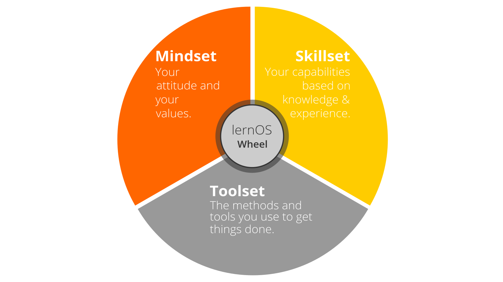
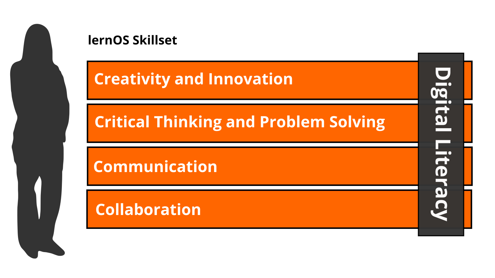
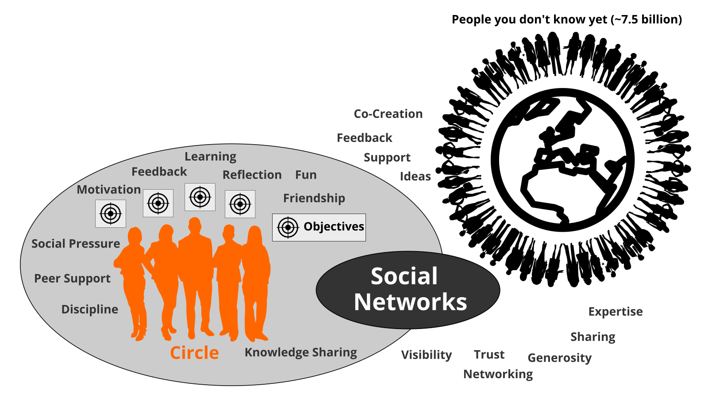

# Preface

The verb "lernos" is the future tense of "learning" in the Esperanto language (mi lernos = I will learn, ni lernos = we will learn). **lernOS** is an **operating system** for **lifelong learning** and **learning organizations**. But lernOS is not software, it's "brainware". It is a way to think and act to be successful in the 21st century as an individual, a team or a whole organization.

There are **three guides** that describe the approach on the **individual level** (lernOS for You), the **team level** (lernOS for Teams), and the **organizational level** (lernOS for Organizations).  Additionally there is the **lernOS Toolbox** describing commonly used methods and tools (e.g. Podcasting, Expert Debriefing, Barcamps, Sketchnoting). lernOS is not invented on the green field but a compilation of existing and tested methods. All guides are available under the **open Creative Commons Attribution (CC BY) license** on the [lernOS Website](https://lernos.org). 

If you have **further questions** regarding lernOS or need **peer support** you can freely join the community platform [CONNECT](https://community.cogneon.de) and the [lernOS CircleFinder](https://community.cogneon.de/c/lernos/lernos-circlefinder) or write with [#lernOS](https://twitter.com/search?q=%23lernOS) on Twitter. The mastery of lernOS is a matter of months or years not hours or days. So **Keep Calm & Learn On!**

Yours @simondueckert

# License

lernOS Guides are released under the [Creative Attribution 4.0 International](https://creativecommons.org/licenses/by/4.0/deed.en) (CC BY 4.0) license:

**You are free to:**

* **Share** - copy and redistribute the material in any medium or format.
* **Adapt** - remix, transform, and build upon the material for any purpose, even commercially.

**Under the following terms:**

- **Attribution** - You must give appropriate credit, provide a link to the license, and indicate if changes were made. You may do so in any reasonable manner, but not in any way that suggests the licensor endorses you or your use.
- **No additional restrictions** - You may not apply legal terms or technological measures that legally restrict others from doing anything the license permits.

# Introduction
We are facing enormous challenges driven by globalization, digitization, and a fast rate of technological and scientific progress. At the same time those changes  provide us with a lot of new opportunities for development. The future is uncertain and we cannot predict it. So we need to be open and ready for it (Source: [Learning Framework 2030](http://www.oecd.org/education/2030)).

To navigate through the so called [VUCA](https://en.wikipedia.org/wiki/Volatility,_uncertainty,_complexity_and_ambiguity) world of the 21st century full of volatility, uncertainty, complexity, and ambiguity teenagers, students, professionals, managers, and leaders have to upskill themselves. Everybody has to develop skills like creativity, critical thinking, communication, and collaboration. Digital literacy is important to be able to use digital tools productively. The personal motivation for development should be more than getting a well-paid job or making profit. Everybody should care about the well-being of himself, his friend & families, his communities, and the society. We need to learn what knowledge, skills, mindset, attitudes, values, methods, and tools we need to design and shape a better future together.

lernOS for You can help you to get fit for the 21st century. lernOS helps to organize the daily, weekly, and monthly activities and to learn consciously from every action. It will also promote networking with other people so you don't have to reinvent every wheel and repeat every mistake.

And the best thing is: lernOS is free, open, and easy to understand. Start using it today!

## lernOS Sprint: A 13 Week Self Learning Experience

lernOS is practiced in timeboxes of 13 weeks called learning sprints. Normally sprints run along the quarters of a year but the rhythm can be changed if necessary. The week 0 is used for the planning of the sprint. From week 1-11 a learning path suggests exercises called katas to learn something new. In week 12 a retrospective is done to reflect on the learnings.

This is what happens during a learning sprint:

- **Week 0 with the Sprint Planning:** Does everybody understand the process? When will the weekly meeting be? Will the weekly be face-to-face or virtual? Which tools are used for communication and documentation? Is everybody able to use the tools?
- **Weeks 1-11 with the Weekly Meeting:** the circle members are working on their objectives and desired results during the sprint. A learning path provide the circle members with a set of exercises called katas to build a network that supports them with achieving their objectives. The two pitstops in week 4 and week 8 help to see if everybody is still on track.
- **Week 12 with the Retrospective:** the circle members show their final results and reflect on the overall process. They also decide if they want to do another sprint together.

## lernOS Wheel: New Mindset, Skillset, and Toolset

Mastering the VUCA world of the 21st century requires to be open for change and new approaches. There are a lot of tools and methods out there. But when one is not open to give it a try, experiment, and fail there will be no success. Like the people with the "square wheels" in the image below we are often too busy to see new opportunities.

Adopting new practices in life, school, or work is not only about using digital tools. To switch from "square wheels" to "round wheels" the personal attitude, values, and skills have also to be taken into account. lernOS calls these three dimensions mindset, skillset, and toolset. To focus only on some dimensions might help. But for the best results all three should be considered in the personal development process.

### Mindset: Your Attitude and Values

The mindset can be described as the attitudes and values that lead to actions and visible results. These develop over time and form the culture of organizations and society. When we act in the world we get feedback and learn from it. Over time our mind creates mental models of the world and values that guide our future actions ([Boisot, 2004](http://www.rrojasdatabank.info/thermo/20388.pdf)). To successfully navigate the VUCA world these five values are important to be successful (Buhse 2014 & Petry, 2014):

1. **NETWORKING** over isolation
1. **TRUST** over suspiciousness
1. **OPENNESS** over silos
1. **PARTICIPATION** over exclusion
1. **AGILITY** over stability

There is no ranking in the values above but for some people [openness](https://en.wikipedia.org/wiki/Openness) seems to be the core value for a 21st century mindset. It means being open to new experiences, knowledge, and ideas as well as sharing knowledge, ideas, and content openly (see also the [Open Definition](https://opendefinition.org)). You should develop an "open first mindset" over time as described in the [Open First Manifesto](http://innovationsbeirat.de/open-first):

**ProTip:** your mindset is not fixed it can grow over time. Watch Carol Dweck's video on [Developing a Growth Mindset](https://www.youtube.com/watch?v=hiiEeMN7vbQ) to learn more about it.

### Skillset: Your Capabilities

Since the 1980s skills like solving problems and interacting with others in creative ways became most important to be successful. These are also skills that can't be easily replaced by automation and artificial intelligence in the future. To get fit for the 21st century you have to train the following skills ([Framework for 21st Century Learning](http://www.p21.org/our-work/p21-framework), [DigiComp 2.1 Framework](https://ec.europa.eu/jrc/en/publication/eur-scientific-and-technical-research-reports/digcomp-21-digital-competence-framework-citizens-eight-proficiency-levels-and-examples-use)):

You can use this table to do a self assessment at the beginning of a lernOS Sprint. The levels 1-5 are according to the [Dreyfus model of skill acquisition](https://en.wikipedia.org/wiki/Dreyfus_model_of_skill_acquisition) (1 = Novice, 2 = Advanced Beginner, 3 = Competence, 4 = Proficient, 5 = Expert). Just put your current skill level in the "As-Is" column and your desired skill level in the "To-Be" column. You can then set a focus for your learning activities.

| Skill | As-Is | To-Be |
|------------------------------|----|----|
| **Creativity and Innovation** |  |  |
| Think creatively |  |  |
| Work creatively with others |  |  |
| Implement innovations |  |  |
| **Critical Thinking And Problem Solving** |  |  |
| Identifying needs and technological responses |  |  |
| Reason effectively |  |  |
| Make judgments and decisions |  |  |
| Solve technical and non-technical problems |  |  |
| Creatively using technologies to solve problems |  |  |
| **Communication** |  |  |
| Articulate thoughts and ideas clearly and effectively |  |  |
| Listen effectively to decipher meaning |  |  |
| Use communication to inform, instruct, motivate and persuade |  |  |
| Utilize multiple media and technologies |  |  |
| Communicate effectively in diverse environments |  |  |
| **Collaboration** |  |  |
| Work effectively and respectfully with diverse teams |  |  |
| Exercise flexibility and willingness to be helpful in making necessary compromises to accomplish a common goal |  |  |
| Assume shared responsibility for collaborative work, and value the individual contributions |  |  |
| Interacting, engaging, sharing, and collaborating through digital technologies |  |  |
| Managing digital identity |  |  |
| **Digital Literacy** |  |  |
| Browsing, searching, filtering data, information and digital content |  |  |
| Evaluating and managing data, information and digital content |  |  |
| Protecting digital devices, personal data and privacy |  |  |
| Developing, integrating, and re-elaborating digital content |  |  |
| Handling Copyright and licences |  |  |
| Programming, Scripting, and Coding |  |  |

**ProTip:** the Mozilla Foundation has developed the [Web Literacy Framework](https://learning.mozilla.org/en-US/web-literacy) with a lot of exercises for developing digital literacy and 21st century skills.

### Toolset: Digital Tools You Use
With the emergence of [Web 2.0](https://www.oreilly.com/pub/a/web2/archive/what-is-web-20.html) in 2005 social media entered the stage. Not everybody needs to know all the tools but you should have an overview, know the principles, and choose the right tools for yourself. The [conversation prism](https://conversationprism.com) gives a nice overview of web 2.0 platforms available today:

For a beginner 28 categories and dozens of tools might be overwhelming. Therefore the following list provides an overview of the most relevant tools for learnOS:

1. **Office & Productivity**, e.g. Dropbox, Evernote, Freemind, G Suite, MindManager, Office 365, OneNote, SharePoint, Trello, XMind
1. **Chat & Messenger**, e.g. Google Hangouts Chat, Mattermost, Microsoft Teams, RocketChat, Slack, Telegram, Threema, WeChat, WhatsApp
1. **Social Networks**, e.g. IBM Connections, Jive, LinkedIn, Mastodon, Twitter, Workplace by Facebook, Xing, Yammer
1. **Videoconference**, e.g. Google Hangouts Meet, GoToMeeting, Microsoft Teams, Skype, Skype for Business, WebEx, Zoom
1. **Weblogs & Wikis**, e.g. Confluence, DokuWiki, LinkedIn (Article), MediaWiki, Medium, tumblr, Wikipedia, Wordpress

**ProTip:** the [lernOS Wiki](https://github.com/cogneon/lernos-core/wiki) contains a list with links to all the mentioned tools. There will be tutorials on how to use them in the future.

## lernOS Circle: The Power Of Peer Support
If you do not want to practice lernOS on your own you can do it in a group of 4-5 people called a learning circle. A circle is a [peer support](https://en.wikipedia.org/wiki/Peer_support) group in which members help each other with feedback, experience, knowledge, and reflection. The circle is a circle of trust: what happens in the circle stays in the circle! The circle members will have a weekly meeting with a standard agenda to structure the learning and development process.

A learning circle meets once a week. Each meeting has a standardized agenda with a check-in, suggested exercises called lernOS Katas (see appendix for the weekly agendas and the exercise descriptions), and a check-out. The timebox for the weekly can be adopted to the needs of the circle members, suggested timeslot is Friday between 11-12am.

**ProTip:** Kata is just another term for exercise. It comes from practicing programming skills in a peer learning format. Read more about this format at [codekata.com](http://codekata.com).

The weekly meeting can be face-to-face or virtual. The circle has to define tools for communication and documentation between the meetings. The following tools have proven to work in practice:

* Microsoft Teams
* OneNote
* SharePoint
* Skype
* Skype for Business
* Slack
* WebEx
* WhatsApp
* Yammer
* Zoom

If you have an Enterprise Social Network (ESN) like Jive or Connections in your organization that might also be a good option to support lernOS Circles.

**ProTip:** To have a good usability choose a tool that supports communication and documentation, e.g. [Microsoft Teams](https://products.office.com/en-us/microsoft-teams/group-chat-software). In Microsoft Teams you can use the channel "General" for chat-based communication, the audio/video conferencing feature for virtual meetings and a OneNote Notebook for documentation.

# Learning Paths for Newbies (NOOBs)

A learning path is a set of activities and exercises to learn something new. A learning path normally lasts for one lernOS Sprint. For learnOS beginners (newbies or noobs) we suggest to run on or more learning paths to get you in touch with the basic concepts of lernOS. Currently these learning paths are available which can be run through in one sprint each:

1. **WOL Learning Path:** The idea for this learning path is inspired by John Stepper's [Working Out Loud circle method](https://workingoutloud.com/en/circle-guides) (WOL). Due to experience and a WOL circle survey ran in 2018 the number of exercises has been reduced to 11 to fit more easy in the 13 weeks without loosing aspects of the core idea of WOL.
2. **OKR Lernpfad:** In this learning path you learn how to set your goals for a sprint with th method [Objectives & Key Results](https://rework.withgoogle.com/guides/set-goals-with-okrs/steps/introduction/) (OKR) and how to check the goals systematically every week.
3. **GTD Lernpfad:** In this learning path you get to know the method [Getting Things Done](https://gettingthingsdone.com/what-is-gtd/) (GTD) by David Allen. GTD helps you to not lose control in an environment with a lot of tasks and information.

As an individual lernOS Practitioner or lernOS Circle you can decide with which learning path you start and if you want to do more than one learning path. If you are already a GTD practitioner, OKR practitioner or if you already have finished a WOL Circle you can can skip that and choose one of the other learning paths to start with.

## WOL Learning Path

Sharing your knowledge openly and profiting from the knowledge of others helps that not everyone has to reinvent the wheel over and over again. According to the [Working Out Loud method](https://workingoutloud.com/en/circle-guides) by John Stepper, you can

1. Learn To set your own learning goal for the sprint.
2. Identify people and communities that are related to your goal.
3. Publish contributions and show appreciation to build a network in a systematic and goal-oriented way.
4. Use the support of your new network to achieve your goals faster and easier.

This learning path is a shortened to 11 exercises version of the circle method by John Stepper (31 exercises). However, the basic idea "Working Out Loud = Observable Work + Narrating Your Work" [by Bryce Williams](https://thebryceswrite.com/2010/11/29/when-will-we-work-out-loud-soon/) remains.

### Design Your Future Backwards (Kata)

**Design your future by reflecting on present and past and creating your personal vision (30 Minutes)**

This kata is based on the method [The Future, Backwards](https://cognitive-edge.com/methods/the-future-backwards/) by Dave Snowden. The kata i	s used to get a better overview of the bigger picture by looking in the past and the possible futures. The horizon of focus for the kata can be short-term (1-2 years), medium-term (3-5 years) or long-term (whole life).

**Instruction:**

1. Prepare your Future Backwards Canvas ([example](https://cognitive-edge.com/wp-content/uploads/2015/01/3---ChrisFl-IMG-0058-wpcf_300x225.jpg)). This can be a landscape piece of paper with a "Y" on it rotated by 90 degrees to the right indicating the present (current state), the past, the vision (heaven), the antivision (hell) and the stairway to heaven. Define the timespan you want to look back and forth (short-/medium-/long-term) (5 Minutes)
2. Describe the current state in 3-5 short phrases (5 Minutes)
3. Describe the 3-5 key events in the past that led to the current state (5 Minutes)
4. Describe your vision in 3-5 short phrases (5 Minutes)
5. Describe your anti-vision in 3-5 short phrases (5 Minutes)
6. Describe the 3-5 key events that need to happen to make your vision come true and avoid your anti-vision (5 Minutes)

**ProTip:** Helmut Hoensch ([@GoodTransfer](https://twitter.com/GoodTransfer)) created a [LearningSprintBooklet]() (German only) that contains a template for a future backwards.

### Think visual with the lernOS Canvas (Kata)

A canvas is a visual structure that can be used to work through several building blocks in a systematic way. This way you use a canvas as a visual checklist. It can also be used to tell a complex story. The idea came from Alex Osterwalder who invented the [business model canvas](https://en.wikipedia.org/wiki/Business_Model_Canvas). The lernOS Canvas uses the same basic structure as the business model canvas. But the names of the building blocks have been changed to reflect the topics a circle works on during a sprint.

The lernOS Canvas can be downloaded from the [lernOS Website](https://lernos.org) in different formats (e.g. PowerPoint, PDF, PNG). To be able to work with the canvas in an agile way one should NEVER write on a canvas ... that's why sticky notes were invented!

The header of the canvas contains the creation date, the number of the sprint, and a motivation/mission statement (if you have one). In the building block "My Objectives & Key Results" the goals for the current sprint are documented. The building blocks "My Roles", "My Activities", "My Projects", and "My Knowledge & Skills" can be used to identify potential objectives. "My Relationships" and "My Social Networks" can be used to identify people that can help you to achieve your objectives. Available resources (e.g. documents, checklists, videos etc.) are listed in "My Knowledge Assets". The repositories listed at "My Repositories" can be used to share assets generously with the network.

### My Objective For The Next 12 weeks (Kata)

In this kata you choose your objective for the sprint. 

_**Duration:** 25 minutes_

What do you want to accomplish in the next 12 weeks? Pick an objective that you really, really care about and you can make progress towards in the sprint. You will use Google's OKR method to define that objective. For the NOOB path it's not prio 1 to achieve the objective. Core is to learn how to achieve objectives more easy with the help of an open workstyle and the development of a network.

Select an objective for the next 12 weeks. Use the questions "Do I really, really care?", "Can I achieve it in 12 weeks?", and "Can my network help me?" to test if the objective is appropriate for the sprint. If you have problems to find a good objective think about goals that support your roles, activities, or projects. If you want to help to make the world a better place you can also choose an objective that is related to the [United Nation's 17 sustainable development goals](https://www.un.org/sustainabledevelopment/sustainable-development-goals).

Use the principles from objective & key results (OKR) to specify your objective. Define an objective and write it down below. To help you to track progress define 2-4 key results per objective. You should be able to measure the key results on a scale from 0.0-1.0. To make sure to set yourself ambitious goals a completion rate of 0.7 is regarded as a success.

_I will (objective):_ ...

_as measured by (key results):_

1. ...
1. ...
1. ...
1. ...

**Further Information:**

* Wikipedia Article [SMART Criteria](https://en.wikipedia.org/wiki/SMART_criteria)
* MIT Sloan Article [With Goals, FAST Beats SMART](https://sloanreview.mit.edu/article/with-goals-fast-beats-smart)
* TED Talk [How We Can Make the World a Better Place by 2030](https://www.youtube.com/watch?v=o08ykAqLOxk)
* Video [How Google Sets Goals: OKRs](https://www.youtube.com/watch?v=mJB83EZtAjc) with Google ventures partner Rick Klau
* Book [Introduction To OKRs](https://www.oreilly.com/business/free/files/introduction-to-okrs.pdf) by Christina Wodtke
* Book [The Beginner's Guide To OKR](https://felipecastro.com/resource/The-Beginners-Guide-to-OKR.pdf) by Felipe Castro

### People Related To Your Objective (Kata)

In this kata you will start to think about people who might help you with your objectives (Working alone is addition, working together is multiplication!).

_**Duration:** 20 minutes_

Most tasks we do have been done by others before. Most of the mistakes we make, have been made in the past already. You can gain access to knowledge and experiences related to your objectives by getting in touch with experienced people inside and outside your organization. Strong relationships are based on trust, sharing, and caring. [Dale Carnegie](https://en.wikipedia.org/wiki/Dale_Carnegie) said "You can make more friends in two months by becoming interested in other people than you can in two years by trying to get other people interested in you". So how do you get in touch with people related to your objectives and develop the relationship?

Create a list of at least ten people related to your objectives. If you don't know people by name you can also put roles or descriptions on the list (e.g. "best WoW player in wown", "a good camera man", "owner of company XY"). Use your contact lists or social networks find more people:

1. ...
1. ...
1. ...
1. ...
1. ...
1. ...
1. ...
1. ...
1. ...
1. ...

**Further Information:**

* Video [Social Networking In Plain English](https://www.youtube.com/watch?v=6a_KF7TYKVc)

### Your First Sharing Experience (Kata)

In this kata you start to share attention, knowledge, experiences, and assets with your network to build trust and get support.

_**Duration:** 20 minutes_

Sharing is caring! In the digital world sharing is often seen as giving others access to files or digital content. But it can also be as simple as sharing your attention with another person by following him, liking his content or subscribing to his website. By sharing you deepen your relationships with every contribution you make.

Go through your relationship list and look for some kind of online presence for each person (e.g. website, blog, profile in social network). Look for possibilities to share some attention. This might be a follow button, a like button, a subscribe field, a five star rating, a comment field or a contact form. Make at least five sharing experiences:

1. ...
1. ...
1. ...
1. ...
1. ...

### An Appointment With Yourself (Kata)

In this kata you will make sure that you have enough time for networking, sharing, and caring for your network. You will do this by making appointments with yourself. In this week your objectives should be stable and you should have a clear idea which people in the network might help you to get your things done.

_**Duration:** 15 minutes_

Do you spend enough time for your personal development and for working on your personal objectives? A lot of people are busy with their daily tasks and do not care enough for their development and their well-being. A good approach is to make an appointment with yourself and reserve that time for yourself in the calendar.

Check your calendar and see when an appointment with yourself fits in. One hour or even 30 minutes a week is a good starting point. Put an appointment with yourself in the calendar. If possible make it a recurring event so taking time for yourself can become a habit. Make at least five appointments:

1. ...
1. ...
1. ...
1. ...
1. ...

### Go Google Yourself! (Kata)

In this kata you will look yourself up in the intranet or internet.

_**Duration:** 10 minutes_

What do people see when they search for you online? Do they get an idea of who you are and how they might help you with your objectives? You can simulate that situation by googling yourself (often called egosurfing, egosearching or vanity search).

Open a search engine in the internet or intranet and enter your name. Open at least the first 10 search results and check if your personality and the facts about you are up-to-date. Identify possible improvements:

1. ...
1. ...
1. ...
1. ...
1. ...
1. ...
1. ...
1. ...
1. ...
1. ...

Think about what your main online profile might be (e.g. LinkedIn profile, about.me profile or profile in your enterprise social network). This will be called your "digital twin":

*My main online profile (digital twin) is ...*

**Further Information:**

* Wikipedia Article [Egosurfing](https://en.wikipedia.org/wiki/Egosurfing)
* Article [Google Yourself! Measuring the performance of personalized information resources](http://snurb.info/files/aoir2008/Google%20Yourself!%20Measuring%20the%20performance%20of%20personalized%20information%20resources%20%28AoIR%202008%29.pdf) by Thomas Nicolai and Lars Kirchhoff.

### 25 Facts About Me (Kata)

In this kata you will collect facts and personal information that might be relevant for your network and help you to connect.

_**Duration:** 25 minutes_

What are interesting facts about you that might help to connect with other people? If you apply to study at Fuqua Business School you have to write an essay with a list of 25 random things about yourself so the application team gets to know you better. When you write down facts about yourself you collect information that might help you to make new connections based on similar interests and backgrounds (e.g. "We studied in the same place 20 years ago!"). Random things about yourself might include:

* Life experiences
* Your likes/dislikes
* Where you were born/lived
* Family, kids, parents
* Schools, universities
* Workplaces in the past
* Career challenges
* Vacations
* Hobbies
* Achievements
* Fun facts
* Anything that helps to understand what makes you who YOU are

Create a list of 10 random facts about yourself. Then read the [Fuqua 25 random things do's and dont's](https://stratusadmissionscounseling.com/duke-fuqua-25-random-things-dos-donts) and expand your list to 25 things:

1. ...
1. ...
1. ...
1. ...
1. ...
1. ...
1. ...
1. ...
1. ...
1. ...
1. ...
1. ...
1. ...
1. ...
1. ...
1. ...
1. ...
1. ...
1. ...
1. ...
1. ...
1. ...
1. ...
1. ...
1. ...

**Further Information:**

* YouTube-Search ["random facts about me"](https://www.youtube.com/results?search_query=random+facts+about+me)

### Your Top 10 Assets (Kata)

In this week kata you will reflect on your top 10 knowledge assets that you can share in your network.

_**Duration:** 30 minutes_

What are the most valuable resources related to your objectives that you can share? A resource could be a book, a video, a link, a document, a checklist, a presentation etc. When you organize your resources in a way that they are linkable and shareble it will be easy for you to contribute them to your network.

Chose one of your objectives and list at least ten related resources you find useful or interesting:

1. ...
1. ...
1. ...
1. ...
1. ...
1. ...
1. ...
1. ...
1. ...
1. ...

### Update Your Digital Twin (Kata)

In this kata you will check if your digital twins like website, blog or profile do match your wishes and if not you will go out and update them.

_**Duration:** 20 minutes_

Does your main digital twin represent you in the way you want to? A lot of people register for an account in a social network and never think about updating their profile. You should keep your profile up to date and have a look at it on a regular basis (e.g. have a recurring task every three month). The facts about you, current projects and interests should be visible on that profile.

Check in the online profile if you have a nice image, a short description, and a slogan. List the improvements you want to make:

1. ...
1. ...
1. ...
1. ...
1. ...
1. ...
1. ...
1. ...
1. ...
1. ...

### Find Communities Related To Your Objectives (Kata)

In this kata you will look for communities or groups that can help you to reach your objectives.

_**Duration:** 15 minutes_

A tribe [according to Seth Godin](https://www.ted.com/talks/seth_godin_on_the_tribes_we_lead) is a group of people connected to one another, connected to a leader, and connected to an idea. Instead of tribe the term "community" or "community of practice" is also often used. A group needs only two things to be a tribe: a shared interest and a way to communicate. Tribes need leadership. Sometimes one person leads, sometimes more. Which are the communities related to your objectives?

Look for communities that are related to your objectives and find at least 10 (use e.g. [LinkedIn Groups](https://www.linkedin.com/groups), [Facebook Groups](https://www.facebook.com/groups), [Xing Groups](https://www.xing.com/communities) , [meetup.com](https://www.meetup.com), [reddit.com](https://www.reddit.com/reddits)):

1. ...
1. ...
1. ...
1. ...
1. ...
1. ...
1. ...
1. ...
1. ...
1. ...

### Contribute Your Self (Kata)

In this kata you will use the facts about yourself to make a personal connection. And you will learn that sometimes listening is more important then talking.

_**Duration:** 35 minutes_

Not all contributions in your network have to be about your objectives. Sometimes it's good to share something about yourself to make a personal connection. The list of facts about yourself might help to find interesting links to other people. Try to find these possible links and use them to make a connection.

**Exercise (20 minutes):**

Go through your facts about you and find at least one fact that might be of interest for a person on your relationship list. Write a message to that person and try to deepen the relationship with that fact as a contribution:

1. ...

### Write A Letter To Your Future Self (Kata)

In this kata you will start to envision yourself in the future by writing a letter to your future self. And you will help your network to support you by making your vision and your objectives visible on your online profiles.

_**Duration:** 35 minutes_

The letter to your future self is a classic method in self motivation and visioning. You reflect on your current situation and give your future self an advice. You write it down as a letter, address it to yourself and open it in the future. With the letter in the back of your mind chances are that your wishes become a [self-fulfilling prophecy](https://en.wikipedia.org/wiki/Self-fulfilling_prophecy).

Write a letter to your future self. Talk about who you are now (e.g. summary, fears, values, beliefs, skills, abilities, goals, hopes). Then address your future self with the things you want to stop/continue/start doing. Give yourself advice and ask yourself questions. Seal the letter and store it in a safe place or use services like [futureme.org](https://futureme.org) to send it to your future self automatically:

**Further Information:**

* Video [A Letter To My Future Self](https://www.youtube.com/watch?v=XwN0tJlXF-0)
* Article [How to Write a Letter to Your Future Self](https://www.wikihow.com/Write-a-Letter-to-Your-Future-Self)

## OKR Learning Path

Set yourself ambitious goals (objectives) and define tangible results
(key results) can be very motivating. Many people have a long
someday-maybe-list, but they don\'t get things done. The longer the
list, the bigger the hurdle to start. Google therefore uses the simple
Objectives & Key Results (OKR) method, which defines the goals for
next three months according to the [following
criteria:](https://rework.withgoogle.com/guides/set-goals-with-okrs/steps/introduction/)

-   Objectives are ambitious and may feel somewhat uncomfortable.

-   Key results are measurable on a scale from 0 - 1.0 (or 0-100%).

-   OKRs are transparent so everyone can see what others are working on.

-   The “sweet spot” for an OKR grade is 60% – 70%; if someone consistently fully attains their objectives, their OKRs aren’t ambitious enough and they need to think bigger.
    
-   Low grades should be viewed as learning opportunities to help refine the next OKRs.
    
-   In companies, OKRs are NOT(!) synonymous with employee evaluations.
    
-   OKRs are not a shared to-do list.

With the following Katas, you can learn OKRs for setting your own goals
in a sprint. It doesn\'t matter if you\'re in an organization or a
company that\'s already using OKR, or whether you\'re just using OKRs
for yourself.

### Top 10 Sources of OKRs (Kata)

**Learn about the history and basics of Objectives & Key Results
(OKRs).**

_**Duration:** 60 minutes_

The history of OKRs goes back several decades. In 1975, John Doerr took
part in a training course at Intel in which Andy Grove explained the
theory of OKRs (book tip: [High Output
Management](https://amzn.to/2O9sA4u)). In 1999 John Doerr worked for the
venture capital company Kleiner Perkins Caufield & Byers, which had just
invested in the startup Google. That way the OKR method reached
Google. In the foreword of Doerr\'s book [Measure What Matters: OKRs:
The Simple Idea that Drives 10x Growth,](https://amzn.to/2XVI1Bv) Google
founder Larry Page describes the effect of OKRs as:

> OKRs have helped lead us to 10x growth, many times over. They\'ve
> helped make our crazily bold mission of \'organizing the world\'s
> information\' perhaps even achievable. They\'ve kept me and the rest
> of the company on time and on track when it mattered the most.

In the following, I have compiled some sources with which you can
familiarize yourself with the method. Select material from the
following list and learn the basics of OKRs:

1.  [**Set Goals with OKRs**](https://rework.withgoogle.com/guides/set-goals-with-okrs/steps/introduction) (en) - if you choose only one source, take
    this one! Google describes on about 10 pages how they understand and use
    OKRs for agile goal planning.

2.  [**OKR**](https://en.wikipedia.org/wiki/OKR) (en) - English Wikipedia page on OKRs with many web links
    and sources. More information in other Wikipedia language versions
    is available via the voice switching in the left sidebar.

3.  [**How Google sets goals: OKRs**](https://www.youtube.com/watch?v=mJB83EZtAjc) (en) - Video recording (1 hour 22
    minutes) of a Startup Lab workshop with Rick Klau of Google
    Ventures, in which Rick also shows original slides by John Doerr.

4.  [**Introduction to OKRs**](https://www.oreilly.com/business/free/files/introduction-to-okrs.pdf) (en)- 37-page introduction to OKR by
    Christina Wodtke ([@cwodtke](https://twitter.com/cwodtke)) with
    the story and concrete tips for starting with OKRs.

5.  **[The Beginner\'s Guide to OKR](https://felipecastro.com/resource/The-Beginners-Guide-to-OKR.pdf)** - 50-page introduction to OKRs by
    Felipe Castro ([@meetfelipe](https://twitter.com/meetfelipe))
    with many examples and concrete tools for action.

6.  [**Objectives and Key Results: The Book**](http://okrbook.com) (en) - 31-page eBook by
    Alexander Maasik ([@AMaasik](https://twitter.com/AMaasik)) with
    basics on OKRs and examples from the weekdone software .

7.  **[Objectives and Key Results](https://www.okrs.com/2016/12/bens-white-paper)** (en) - White Paper by Ben Lamorte ()
    Operator of the website [okrs.com](https://okrs.com).

8.  [**Giant Talk Podcast**](https://www.therebegiants.com/the-official-okr-podcast) (en) - Podcast on the OKRs of There Be Giants, an OKR consultancy
    from the UK.
    
9.  [**OKR Community Report 2017**](https://www.workpath.com/wp-content/uploads/2018/10/okr-community-report2017.pdf) (en) - Survey conducted by the
    Workpath Institute with over 300 participants and case studies by
    HolidayCheck, MyMuesli and Flixbus.

10. [**OKRs and digital organizations**](https://www.workpath.com/okr-plus) (en) - Introduction to OKRs by
    [workpath](https://workpath.com), an OKR software provider from
    Munich.

### Set up your OKR environment (Kata)

**Plan time and space for your OKR process.**

_**Duration:** 30 minutes_

It doesn\'t take much for your personal OKR environment. You need to
schedule check-in time in the calendar each week (e.g. Monday
morning, 30 minutes). You also need a place to document your OKRs. This
can be analog (e.g. paper, whiteboard) or digital (e.g.
OneNote, Wiki). You have to decide whether or not to make your OKRs
public the first time. Keep in mind that the smaller the circle of
people who know your goals, the less can help you achieve your goals.

Define your OKR environment now:

-   **OKR Weekly Check-in (weekday, time):** \...

-   **OKR Documentation:** \...

### Define OKRs for your Sprint (Kata)

**Write down your objective and key results for this sprint in OKR
format.**

_**Duration:** 30 minutes_

In the last kata you (hopefully) learned a lot about the formulation of
OKRs. Now you can apply this to the planning for the running
sprint. To do this, use John Doer\'s OKR formula to formulate your objective:

*I want (objective): \...\...\.... as measured by \...\...\.... (Key
Results):*

Check your **objective** with the following criteria (source:
[Google):](https://rework.withgoogle.com/guides/set-goals-with-okrs/steps/set-objectives-and-develop-key-results/)

-   The objective is demanding and feels a bit uncomfortable.

-   The Objective uses phrases that trigger new activities (not: keep,
    continue).

-   The Objective uses phrases that describe an end state (e.g. \"climb
    the mountain\", \"ship feature Y\").

-   The Objective uses tangible and unambiguous terms. It should be
    clear to an outsider whether a goal has been achieved or not.

Check your **key results** against the following criteria:

-   Not more than three key results are defined per objective.

-   The key results express measurable milestones that bring you closer
    to the objective when you reach it.

-   The key results are measurable and can be measured on a scale of
    0.0 - 1.0 (or 0 - 100%).

-   The key results express results, not activities. The wording of a
    key result should not include words such as \"advice,\" \"help,\"
    \"analyze,\" or \"participate.\"

-   Measurable milestones should include proof of completion. And this
    evidence should be visible, credible and easily comprehensible.

### Finalize your OKRs for the Sprint (Kata)

**Check your OKRs for the sprint and freeze it.**

_**Duration:** 30 minutes_

You\'ve had a few nights to rethink your OKRs. Do you feel comfortable
and motivated by it? Do the objectives feel demanding? Do you see a
realistic chance of achieving the key results at 60-70%. Rethink your
OKRs and set yourself up for this sprint. Document the
OKRs in the OKR environment.

### Perform your Weekly Check-In (Kata)

**Start with a short OKR Weekly Check-In each week**

_**Duration:** 30 minutes_

With the OKR Weekly Check-in you can see your goals and the current
state on a weekly basis. This helps you not to lose focus and to identify and remove obstacles early.

You have already set the time of your check-in and added it as a regular date
in the calendar. Use the following questions for the OKR Weekly Check-in:

-   **Progress:** What has changed in key results since the last Weekly?

-   **Trust:** How sure am I to achieve the key results?

-   **Barriers:** What hinders my progress?

-   **Next steps:** What can I do to improve progress?

Use the next four weeks to make the check-in a weekly routine. Every week,
you\'ll learn about additional topics around OKRs in a small 15-minute
learning nugget.

### Tools for OKRs (Kata)

**Learn about some tools for OKRs.**

_**Duration:** 15 minutes_

David Allen often describes Getting Things Done (GTD) as
\"tool-agnostic\". This means that you can practice GTD independently of
special software or apps. Similarly for OKRs paper and pencil are enough,
yet many practitioners use digital tools for it. Check out examples of
OKR tools this week and decide if you want to use them:

-   **Texteditors**, e.g. Microsoft Word, Google Doc

-   **Spreadsheet**, e.g. Microsoft Excel, Google Sheets

-   **Note taking applications**, such as Microsoft OneNote, Evernote

-   **To-do list tools**, e.g. Trello, Microsoft To-Do, Microsoft
    Planner, Jira

-   **Wikis**, e.g. Mediawiki, Confluence, TiddlyWiki, Etherpad

-   **Enterprise OKR-Tools**, e.g. 7Geese, WeekDone, Workpath

### Scoring vs. Measuring Key Results (Kata)

**Understand the difference between \"scoring\" and \"measuring\" and
choose your path.**

_**Duration:** 15 minutes_

Google recommends that OKRs to measure key results always on a scale of
0-1.0. In his [Beginners Guide to OKR,](https://felipecastro.com/resource/The-Beginners-Guide-to-OKR.pdf) Felipe Castro describes some of the drawbacks of this approach under the heading \"Forget Scoring\":

-   The rating on the scale from 0 - 1.0 is very subjective

-   If you want to define per key resultin advance, what 0.3,
    0.7 etc. means, the complexity of the process increases

Therefore Felipe recommends using value-based key
results and measuring them easily. In his opinion this simplifies the
process of defining OKRs for oneself and also for teams.

Check out your key results and consider whether the process would be
simplified for you by simply measuring instead of scoring on the 0-1.0
scale. Choose an approach and adjust your key results if necessary.

### Stretch Goals and Moonshots (Kata)

**Learn the meaning of \"Strech Goals\" for setting challenging goals.**

_**Duration:** 15 minutes_

Strech Goals or Moonshot OKRs (derived from Kennedy\'s Moonshot Goal
1962) are objectives that seem impossible to achieve. For exampleinstead of asking yourself \"How do I get 10% better/faster?\" ask \"How do I
get better/faster by a factor of 10\". This forces you to leave your
comfort zone and think about other practices, skills and other know-how.

Look at your objectives and think about which you could transform into Moonshot OKRs
from and what the consequences would be for you. If you want to try
Moonshot OKRs, decide whether you want to customize the OKRs for this sprint or
a following sprint.

### What is your Confidence Level? (Kata)

**How sure are you that you will reach your OKRs?**

_**Duration:** 15 minutes_

According to Henrik-Jan van der Pol by perdoo the [OKR Confidence
Level](https://www.perdoo.com/blog/okr-confidence-levels/) shows how much you believe that the OKR is (still) achievable. Henrik-Jan proposes
the three levels \"on-track\", \"off-track\" and \"at-risk\". The estimate of an OKD confidence level is also presented by Christina Wodtke in the book Introduction to
[OKRs.](https://www.oreilly.com/business/free/files/introduction-to-okrs.pdf) She recommends a scale of 1-10, with a 1 saying \"a miracle would have
to happen\" and a 10 \"Yeah, I can do that\".

Check out the two sources and decide if you also want to have
confidence levels for your OKRs. If so, consider where and when to put
them in your documentation.

### Individual vs. Team/Organizational OKRs (Kata)

**Get to know the interaction of OKRs at the levels of the individual,
the team and the organization.**

_**Duration:** 30 minutes_

As well described in Rick Klau\'s [How Google sets goals:
OKRs](https://youtu.be/mJB83EZtAjc?t=1061) video, OKRs are not only defined at the individual level, but also at the level of teams,
departments, and the entire organization. In contrast to other target
agreement systems such as Management by
[Objectives](https://de.wikipedia.org/wiki/Management_by_Objectives)
(MbO), however, this is not a top-down process, but both top-down
(recommendation John Doerr: 40%) and bottom-up (recommendation John
Doerr: 60%).

Consider whether you can use the method in your environment, such as
your team or department in addition to your personal OKRs. Consider at
least one try to test whether your environment is open to OKRs and
how to implement it there.

### OKR Review (Kata)

**Was your OKR cycle successful and what topics are for the next one?**

_**Duration:** 60 minutes_

In Scrum, the [Sprint Review](https://www.scrumguides.org/scrum-guide.html#events-review) is used to check the results (increments) at the end of the sprint
(Inspect) and adjust them for the next sprint (Adapt) if necessary. In
Scrum, the review is different from the [Sprint Retrospective,](https://www.scrumguides.org/scrum-guide.html#events-retro) which is about team interaction, not results.

Franziska Schneider from Workpath [suggests in a blog](https://www.workpath.com/magazine/wie-sie-einen-effektiven-okr-zyklus-gestalten/) to make a review at the end of an OKR cycle and ask yourself the following questions:

-   Was I successful with my OKRs?

-   What are the topics for the next OKR cycle?

-   Where can/should I present the results of the review?

Now perform an OKR review for the current sprint and document the
results.

## GTD Learning Path

Organizing and optimizing yourself and your way of working can be very motivating. Many people today face the problem of being in the hamster wheel of daily and
routine activities not having time for value-adding things, let alone thinking about where they want to develop in the medium or long term.

All elements of GTD have been used successfully for a long time. David Allen has compiled and combined some of these methods in a way that the sum is greater than the parts.

GTD is a way to create the space in our VUCA world to make us fit for the future.

**The challenge:** You must have read the [book](https://www.amazon.de/gp/product/3492307205/ref=as_li_tl) to really understand GTD.

**The solution:** By gradually understanding the rules and principles, as well as practicing it (Katas) within the next 13 weeks, you understand the overall context and build up your individual GTD-system.

### Get to know the basics (Kata)

_**Duration:** 120-180 minutes depending on reading speed, reading depth and available/missing materials_

The basics of GTD are documentary in many places on the Internet & in
literature. Get acquainted with the basics of GTD this week and create
an environment that puts you in an optimal situation. This environment
is based on the three pillars of time, location and tools.
ThePillarTimetreatwe later.

-   Read Chapters 1, 2 & 4 in David Allen\'s book \"How to Get Things
    Done\"

-   Put your work material like storage baskets, pens, folders,
    sticky note slips together

-   Reposition your workspace(s) (Office, Home etc.)

**ProTip:** Minimize the number of your inbound baskets; 1x Office, 1x Home, 1x
electronic (e-mail).

**ProTip:** e-mails generally remain: in the e-mail system and are managed
digitally there.

**ProTip:** Forward and manage all other electronic inputs to the e-mail system.

**ProTip: **Often throwingsomething away.

**ProTip:** Active deactivation of newsletters, mail distributors, mailing
stations etc.

### Collect - Mind Sweep (Kata)

_**Duration:** 60-120 minutes depending on reading speed and number of \"loose ends\" in the head_

You\'re probably carrying a lot of things around with you in your head
and new items are coming in all the time. All these loose ends lower
your ability to focus and get things done. The following exercise will
help you to get free your head without loosing anything.

-   Read Chapter 5 in David Allen\'s book \"How to Get Things
    Done\".

-   Now write down **everything** that goes through your mind. What to
    do now & soon? What needs to be donenow? Who is to call?

-   One page per idea or task (heading is sufficient).

-   Put each sheet in your inbox.

In this exercise, the mass counts. Don\'t stop until no more items are coming.

### Processing - The 2 minute rule (Kata)

_**Duration:** 60-90 minutes depending on reading speed and number of small items_

This week you will work your inbox and consistently apply the
2-minute rule: everything that can be done in less than 2 minutes is
done immediately.

-   Read Chapter 6 in David Allen\'s book \"How to Get Things Done".
    
-   Take 10-15 minutes a day for \"small stuff\".

-   Work focused on everything from answering emails, appointments, tweets,
    likes, feedback, calls etc.

-   Unimportant stuff can be immediatly disposed (a Timer helps with
    timeboxing).

### Organize - Build Lists & Contexts (Kata)

_**Duration:** 60-120 hours depending on reading speed and deepening urge_

When organizing your tasks with GTD you have a lot of possibilities to 
individualize. But also a minimal set of lists and contexts will support you to keep the overview.

-   Read Chapter 7 in David Allen\'s book \"How to Get Things
    Done\".

-   Choose the list types you want to use (minimum: project list, action
    list, calendar and wait-for list). Important but non-essential lists
    are reference material, one-day/maybe, support material for actions,
    support material for projects.

-   Define the contexts you want to use (e.g.: \@Home,
    \@Work, \@Unterwegs, \@Besorgungen, \@Internet, \@Anruf, next
    action, \@Lesen).

An example: Do you commute regularly by train to work and back? Then you
can easily filter by contexts \@travel and \@read and only get those tasks that make sense when commuting.

**ProTip:** At the beginning, less is more. Start with a few but essential things. In the iteration phases (from week 8) the things you are missing are automatically added.

### Review - The Weekly Review (Kata)

_**Duration:** 60-120 minutes depending on reading speed and deepening urge_

The review phase in GTD has a slightly different character than the
previous phases. It is mainly used to keep your system up to date and is
therefore the heart of the system. You will only be able to rely on your
system if you go through this phase regularly. In addition to regular brief views of your system, the weekly review is
at the heart of this phase.

-   Read Chapter 8 in David Allen\'s book \"How to Get Things Done\".
    
-   Find a suitable date for the weekly review and enter it as a repeating
    event in your calendar (1-2 hours should be already).

-   Run through the weekly review once for the last week

    1.  **Everything** in the inbox which you haven\'t put there until
        then

    2.  Empty the inbox

    3.  **See** through next steps

    4.  Browse through the dates (did To-Do\'s come out of it ?)

    5.  See through upcoming dates (are To-Do\'s included for you in
        preparation for the appointment?)

    6.  Check the **Waiting-for-list**

    7.  Browse the **list of projects**

    8.  **Mind Sweeping**

**ProTip:** To make the weekly review as pleasant as possible, connect
it to things that are pleasant and fun for you. For example, your
favorite drink, favorite place, favorite music or your favorite time.

### Doing (Kata)

_**Duration:** 2-4 hours depending on reading speed_

At this stage, we choose what to do. Two basic principles will support
you in this.

-   **Four criteria for completing tasks**. Filtering tasks by
    context/time/energy/priority.

-   **The three-stage model for evaluating daily work**. Division
    into the three types of work (define tasks, predefined tasks,
    unplanned tasks).

-   Read Chapter 9 in David Allen\'s book \"How to Get Things Done\" (without the 6-step model) 
    
-   Choose the day that you want to consciously work on the complete phase

-   Consider all three types of work for your scheduling

    -   Plan time for several daily reviews (overview)

    -   Schedule time for \"Organize and Process\"

    -   Schedule time for completing scheduled tasks (enter appointments
        with yourself in the calendar)

    -   Schedule time for completing unplanned tasks (leave room in the
        calendar)

-   Your day is planned - Then get an overview of the upcoming tasks and
    get going

**ProTip:** Your calendar day should NEVER be fully planned. 20% buffer
for unplanned tasks is a good rule of thumb.

**ProTip:** When you make appointments with others always plan **5 minutes
less** (e.g.: 25 instead of 30 minutes or 55 instead of 60 minutes)-

### Projects - Become like the kids (Kata)

_**Duration:** 60-180 minutes depending on reading speed, number of projects & project size_

Projects have their own definition in GTD. Anything that takes
**more than one step** to be completed AND that can be done within a year is called
a project. Projects are more complex tasks that run in sequence or in parallel. Therefore it is important to get an idea of the target state and to go through the whole project at the
beginning.

-   Read Chapter 3 und10 in David Allen\'s book \"How to Get Things Done\".
    
-   Work through a new or existing project according to these rules and
    transfer the results to your GTD system.
    

In preparation for the following weeks, please schedule these
dates and appointment series in your calendar:

-   Once: 2-3 hours for Kata - Desk-Sweep

-   1-2 daily very short appointments (5-15 minutes) for \"Process and
    Organize\"

-   1 appointment weekly review (90-120 minutes), if not already done
    in the respective Kata

-   Collecting is done continuously or is part of the weekly review

### Work through the 5 phases (Kata)

_**Duration:** 120-240 minutes_

You have dealt intensively with the individual 5 phases of GTD in the
last 7 weeks. You\'ve got all the necessary materials, set up your
workplace, set up your individual system, prepared lists & contexts and
practiced the weekly review. And you know how to identify the next action.

Now in theory, you know everything you need to know to get the **whole
process going.** Every single phase in itself is important, but only as
a closed cycle the process will unfold its full potential for you.

You\'re ready! Starting this week, we\'ll get the whole system up and
running. Continue to work through the 5 phases of GTD this week.

**Initial - Desk Sweep**

-   Now you start to put everything around your workplace to a very
    simple exam. Take EVERY thing in your hand and ask The One Question:
    Can this be eliminated?

-   If so, dispose of it immediately, otherwise put it in your inbox.

-   Repeat this process until everything has gone through your slopes.
    Moreisnottodo.

-   Tip: Start locally (on the square) and expand your searches for
    stuff & things in a concentric way (desk surface, drawers, storage
    areas, cabinets, floors & shelves, etc.).

Then go through phases 1-5 iteratively again and again.

### The Power of the Next Step (Kata)

_**Duration:** 120-180 minutes depending on reading speed & number of projects_

According to David Allen the question "What is the next step?\"** is essential to generate measurable improvements in the process. This question forces clarity, responsibility, productivity and increased competence.

-   Read Chapters 11, 12 and 13 in David Allen\'s book \"How to Get Things
    Done\".
    
-   To all the tasks that need to be done next in your lists add the context
    \@NextAction.

-   Ad the question **\"What is the next step?\" **into your daily
    routine.

Iterate the 5 phases again this week. If it works, keep going. If
it doesn\'t work, adapt your system.

**ProTip:** Consider whether you always want to add additional
attributes when creating a new task. E.g. time required or energy
required. This will help you decide in Phase 5 what is important NOW.

**ProTip:** If possible, always formulate your (project) tasks from the
result: \"The auto-inspection is carried out\", \"The project has been
accepted\", \"The board has decided X or Y\".

### The 6-horizon model (Kata)

_**Duration:** 60-180 minutes depending on reading speed & altitude_

A third model, besides the **\"Four Criteria\"** and the **\"Three
Steps\"** from the Kata \"Complete\", can help us to reflect our own
work even better. Assuming that we are proficient on levels 0-2
(actions, projects and areas of responsibility) through the consistent
application of our GTD system. We will focus now on levels 3-5 (future
factors, orientations and intentions).

We should do this regularly, but at least once a year.

-   Read Chapter 9 (The 6-Step Model) in David Allen\'s book \"How to Get Things Done\".
    
-   Start thinking about what goals you want to set for the next 1-2
    years. Write each idea down.

-   Then focus on a time horizon that is 3-5 years in the future. Where
    do you want to be then? Where will your company be? What external
    influences will directly or indirectly affect you? Write each idea down.
    
-   Finally consider what purpose your existence had and should have had
    in a time much further than 5 years in the future. Write each idea down.
    
-   Process the notes and decide if there\'s something you really,
    really want to get going. If not, dispose all ideas.

-   Decide on the ideas that are left over, what you want to do with it.
    Such as
-   Create a new project
    
-   Put on the list Some day / Maybe
    
-   Work out even more ideas for the future (with a partner or
        friend)
    
-   Share ideas with others and ask for feedback
    
-   Get professional help (e.g. coach)
    
-   Set up an appointment in your calendar (\< 12 months) on which you
    want to repeat this exercise

**ProTip:** For this exercise, look for a place where nothing doesn\'t bother you.

**ProTip:** Choose a time at which you have a lot of energy.

**ProTip:** Make sure you don\'t have a follow-up event to this exercise.

### Continuous Improvement - The Road to Mastery (Kata)

_**Duration:** 1-3 hours depending on reading speed & number of ideas_

We have already got to know and practice two of the three stages on the
way to the mastery in the last weeks. Applying the basics and the
6-horizon model. For experts focus, orientation and creativity are still
on the agenda. It is simply a matter of using the gained time to
endlessly optimize the experience.

-   Read Chapter 15 in David Allen\'s book \"How to Get Things Done\".
    
-   Choose 1-3 ideas from the last Kata.

-   Continue to work out these ideas for concrete projects and tasks.

    -   What needs to be started now to fulfill the ideas and wishes in
        2-5 years?

    -   Discuss these ideas with people whose advice you value.

    -   Develop a network of new contacts that can help you achieve your
        goals.

-   Outsource more and more \"thinking\" to your GTD System

    -   Find an area you haven\'t captured in your GTD system yet.

    -   Integrate these areas into your GTD routines.

-   Set up an appointment in your calendar (\< 3 months) on which you
    want to repeat this exercise.

**ProTip:** The WOL Learning Path is the ideal support to help you build
a network of contacts that can help you achieve your goals.

# Stop talking, start doing!

If you read through this guide but are not practising yet you should do so NOW! To start with lernOS is really easy. These five steps will help to start smoothly:

1. **Schedule Time:** define the quarter when you begin to use lernOS. Add the time-slots for  the weekly to your calendar. This regular meeting is of particular importance if you practice in a lernOS Circle.
1. **Define Objectives and Key Results:** use week 0 to define the objectives and the measurable results for the sprint. Choose an objective you really, really care about.
1. **Find a Circle:** look for 3-4 people who want to start a sprint in the same quarter. If someone has been in a circle before he can take the role of the "Circle Moderator".
1. **Organize the Weekly Meeting:** if you don't know each other meet face-to-face in week 0. Use social networks or instant messengers to communicate between the meetings. Use video conferencing tools to organize virtual meetings.
1. **Plan, Do, Learn, Repeat:** Use the last weekly meeting in week 12 to reflect the results and the collaboration in the circle. Decide if you want to run another sprint together.

Keep Calm & Learn On! :-)

# Appendix

## Circle Moderator  Checklist

**WEEK 0 - Sprint Planning & Get Together**

When you are new to the circle you will get to know each other in week 0. You will plan when to meet, which tools to use and who is the moderator is.

* **Check-in:** Welcome Everybody! _(5 minutes)_
* **Get together:** Who are you? Introduce yourself. Five minute timebox per Circle member. _(25 minutes)_
* **Sprint Planning** see below _(25 minutes)_
* **Check-out:** Confirm the next meeting. _(5 minutes)_

Define a circle moderator who cares for event and time management. The moderator is not the "boss" of the circle but just a normal member that cares for smooth operation. Define which of the learing paths you will use. Define the day and time of your weekly circle meeting. Define if you meet face-to-face or virtually . Define the tools you use for communication and documentation in the circle. Decide which exercises from the suggested agenda you plan to do in the circle. Also decide if you want to use the lernOS Canvas (see chapter lernOS Canvas) as supporting tool.

* **Circle moderator:** ...
* **Learning path:** WOL / OKR / GTD
* **Day & time of weekly meeting:** ...
* **Weekly meetings are:** face-to-face / virtual
* **Tools used in circle:** ...
* **Do we use the Canvas:** yes / no

**ProTip:** everybody should do the Katas "Design Your Future Backwards" and "Think visual with the lernOS Canvas" in week 0 to find the right objectives for the lernOS Sprint.

**ProTip:** in a lot of circles the timebox for running an exercise in the Weekly is too short. You should use the method [inverted classroom](https://en.wikipedia.org/wiki/Flipped_classroom). Every circle member prepares the exercises as "homework" upfront so you will have more time to discuss results in the circle.

**ProTip:** if you use the lernOS OneNote Circle Template you can take a photo of the current version of the canvas and upload so the other circle members can see it and give feedback.

**WEEK 1**

* **Check-in:** What happened since the last check-in? What changed in the key results? What is slowing me down? Two minute timebox per circle member. _(10 minutes)_
* **WOL Learning Path Kata:** Share your objective(s) in the circle. The objective might be refined until week 4 but not later. _(45 minutes)_
* **OKR Learning Path Kata:** tbd.
* **GTD Learning Path Kata:** tbd.
* **Check-out:** What will I do until the next Weekly? One minute timebox per circle member. _(5 minutes)_

**WEEK 2**

* **Check-in:** What happened since the last check-in? What changed in the key results? What is slowing me down? Two minute timebox per circle member. _(10 minutes)_
* **WOL Learning Path Kata:** Share your list in the circle and let others help to complete it. _(45 minutes)_
* **OKR Learning Path Kata:** tbd.
* **GTD Learning Path Kata:** tbd.
* **Check-out:** What will I do until the next Weekly? One minute timebox per circle member. _(5 minutes)_

**WEEK 3**

* **Check-in:** What happened since the last check-in? What changed in the key results? What is slowing me down? Two minute timebox per circle member. _(10 minutes)_
* **WOL Learning Path Kata:** Discuss your sharing experiences in the circle. _(45 minutes)_
* **OKR Learning Path Kata:** Discuss the OKRs in the Circle and give each other feedback. _(45 minutes)_
* **GTD Learning Path Kata:** tbd.
* **Check-out:** What will I do until the next Weekly? One minute timebox per circle member. _(5 minutes)_

**WEEK 4 & Pitstop 1**

* **Check-in:** What happened since the last check-in? What changed in the key results? What is slowing me down? Two minute timebox per circle member. _(10 minutes)_
* **WOL Learning Path Kata:** Discuss your approaches in the circle. _(45 minutes)_
* **OKR Learning Path Kata:** Explain the final OKRs and talk about ways to achieve goals. This shows how different the approaches of the different people can be. _(45 minutes)_
* **GTD Learning Path Kata:** tbd.
* **Check-out:** What will I do until the next Weekly? One minute timebox per circle member. _(5 minutes)_

**WEEK 5**

* **Check-in:** What happened since the last check-in? What changed in the key results? What is slowing me down? Two minute timebox per circle member. _(10 minutes)_
* **WOL Learning Path Kata:** tbd. _(45 minutes)_
* **OKR Learning Path Kata:** Share how you organize your weeklys and what experiences you have with the process. _(45 minutes)_
* **GTD Learning Path Kata:** tbd.
* **Check-out:** What will I do until the next Weekly? One minute timebox per circle member. _(5 minutes)_

**WEEK 6**

* **Check-in:** What happened since the last check-in? What changed in the key results? What is slowing me down? Two minute timebox per circle member. _(10 minutes)_
* **WOL Learning Path Kata:** Share the facts about you in the circle. _(45 minutes)_
* **OKR Learning Path Kata:** Share the experiences with your OKR environments and try out other tools. _(45 minutes)_
* **GTD Learning Path Kata:** tbd.
* **Check-out:** What will I do until the next Weekly? One minute timebox per circle member. _(5 minutes)_

**WEEK 7**

* **Check-in:** What happened since the last check-in? What changed in the key results? What is slowing me down? Two minute timebox per circle member. _(10 minutes)_
* **WOL Learning Path Kata:** Present the top 10 list in the circle and discuss it. _(45 minutes)_
* **OKR Learning Path Kata:** Exchange ideas about who chose which option and for what reasons. In the
  following weeks you can talk about the effects and experiences again. _(45 minutes)_
* **GTD Learning Path Kata:** tbd.
* **Check-out:** What will I do until the next Weekly? One minute timebox per circle member. _(5 minutes)_

**WEEK 8 & Pitstop 2**

* **Check-in:** What happened since the last check-in? What changed in the key results? What is slowing me down? Two minute timebox per circle member. _(10 minutes)_
* **WOL Learning Path Kata:** tbd. _(45 minutes)_
* **OKR Learning Path Kata:** Discuss your ideas and opinions about Moonshot OKRs. _(45 minutes)_
* **GTD Learning Path Kata:** tbd.
* **Check-out:** What will I do until the next Weekly? One minute timebox per circle member. _(5 minutes)_

**WEEK 9**

* **Check-in:** What happened since the last check-in? What changed in the key results? What is slowing me down? Two minute timebox per circle member. _(10 minutes)_
* **WOL Learning Path Kata:** Talk about your lists in the circle and let the others help you to complete your list. _(45 minutes)_
* **OKR Learning Path Kata:** Discuss your decisions about the OKR confidence levels. _(45 minutes)_
* **GTD Learning Path Kata:** tbd.
* **Check-out:** What will I do until the next Weekly? One minute timebox per circle member. _(5 minutes)_

**WEEK 10**

* **Check-in:** What happened since the last check-in? What changed in the key results? What is slowing me down? Two minute timebox per circle member. _(10 minutes)_
* **WOL Learning Path Kata:** tbd. _(45 minutes)_
* **OKR Learning Path Kata:** Discuss your approaches to spreading OKRs in the organization and learn from each other. _(45 minutes)_
* **GTD Learning Path Kata:** tbd.
* **Check-out:** What will I do until the next Weekly? One minute timebox per circle member. _(5 minutes)_

**WEEK 11**

* **Check-in:** What happened since the last check-in? What changed in the key results? What is slowing me down? Two minute timebox per circle member. _(10 minutes)_
* **WOL Learning Path Kata:** If you want to share the letter with your circle members just read it out loud afterwards. _(45 minutes)_
* **OKR Learning Path Kata:** Discuss your review results. _(45 minutes)_
* **GTD Learning Path Kata:** tbd.
* **Check-out:** What will I do until the next Weekly? One minute timebox per circle member. _(5 minutes)_

**WEEK 12 - Retrospective & Celebration**

In this week the final iteration of your key results should be available. Talk about them and show them in the check-in. You will reflect on the circle experience and talk about how to sustain the process. After the weekly you should take some time to celebrate your success!

* **Check-in:** What happened since the last check-in? Show the final iteration of the key results. 3 minute timebox per circle member. _(15 minutes)_
* **Your Learning Moments:** Talk about the moments in the sprint that where special for your. What are your key learnings? Discuss if you want to publish them as [lernOS Story](https://docs.google.com/forms/d/e/1FAIpQLSc9KrufUD9Mu9wstGv8ojfChRwPlq2dVi_kAUB04MuymmzUSg/viewform) for other practitioners. _(20 minutes)_
* **After Action Review:** What was the plan for the sprint? What did happened? Is there any deviation? What can you learn from it? _(20 minutes)_
* **Check-out:** Are there any next steps? Will you stay together for another sprint?
* **Celebration time!** _(timebox is up to you)_

## Acknowledgments

lernOS is inspired by many of sources and thought leaders and is thus [standing on the shoulders of giants](https://en.wikipedia.org/wiki/Standing_on_the_shoulders_of_giants). An overview of the roots & inspirations I have compiled [in the lernos Wiki](https://github.com/cogneon/lernos-core/wiki). For this guide I would especially like to thank:

- **Hirotaka Takeuchi** and **Ikujiro Nonaka** for introducing the term scrum for agile development (1986).
- **Jeff Sutherland** and **Ken Schwaber** for the definition of scrum in [The Scrum Guide](https://scrumguides.org) (2010).
- **David Allen** for the method [Getting Things Done](https://gettingthingsdone.com) (GTD) to show the path towards the art of stress-free productivity (2001).
- **Andy Grove** for the development of the method [Objective & Key Results](https://en.wikipedia.org/wiki/OKR) (OKR) as a further development of Peter Drucker\'s management by objectives (MbO) at Intel (1980s). **John Doer** for bringing OKR to Google and **Rick Klau** from Google Ventures for his talk [How Google sets goals: OKRs](https://www.youtube.com/watch?v=mJB83EZtAjc) (2013).
- **Glyn Moody** (2006) and **Bryce Williams** (2010) for coining and defining the term Working Out Loud. **John Stepper** for the design of the 12-week WOL learning program documented in the [WOL Circle Guides](https://workingoutloud.com/en/circle-guides) (2015). **Katharina Krentz** from Bosch for her many contributions to make WOL usable in organizations to develop a learning organization.
- **Johannes Müller** and **Tobias Müller-Zielke** for the talks on OKRs and GTD at the lernOS Rockstars Camp 2019 and **Alexander Rose** for compiling the GTD learning path.

## Change History

| Version | Bearbeitet von | Beschreibung Änderung | Datum |
|---------|----------------|-----------------------|-------|
| 1.0 | Simon Dueckert | First Version of the lernOS Guide | 2018-09-17 |
| 1.0.1 | Simon Dueckert | Acknowledgement chapter added | 2018-09-17 |
| 1.1 | Simon Dueckert | OKRs als Standard-Methode für Learning Sprints, Einführung NOOB Path mit reduziertem Kata-Set, Umbenennung lernOS Sprint/Circle, Einführung von Lernpfaden | 2018-12-17 |
| 1.2 | Simon Dueckert | Guideline renamed to "lernOS Guide for You", lernOS logo added to cover page, Telegram User Group replaced by CONNECT, Mobi version (Amazon) added to output formats, generation of all output files via make.bat, Table of Contents (TOC) added to html version | 2019-03-25 |
| 1.3 | Simon Dückert | New "high level structure" for lernOS Guides applied, Order in introduction chapter changed (Sprint, Wheel, Circle), Hashtags removed from "ProTips", Placeholders for OKR and GTD learning paths added, Kata "Design Your Future Backwards" added to week 0, Kata "Think visual with the lernOS Canvas" moved to week 0, Skillset: table of skills expanded to act as self assessment tool, Number of circle support tools reduced based on WOL survey 2018, Standardized preface added, Content and structure in chapter acknowledgements improved, Standard orange backside cover added | 2019-06-17 |
| 1.4 | Simon Dückert | New learning paths for OKR and GTD added, Link to lernOS CircleFinder added to preface, Moderator checklist removed from learning path (separate markdown document now), lernOS Canvas and OneNote template moved to lernOS Core repository, Improved metadata creation for E-Book versions | 2019-09-16 |
| 1.5 | Simon Dückert | ... | 2019-16-12 |
