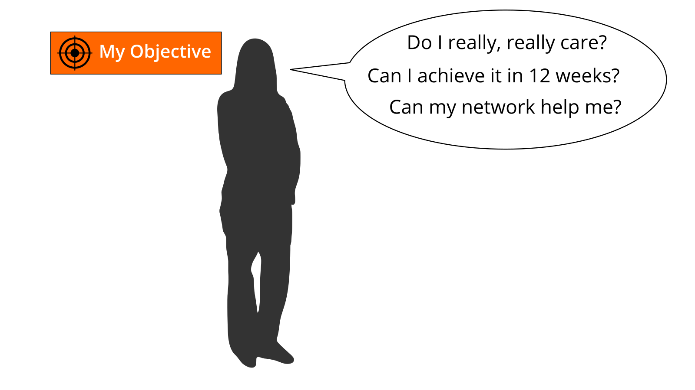

# Preface

The verb "lernos" is the future tense of "learning" in the Esperanto language (mi lernos = I will learn, ni lernos = we will learn). **lernOS** is an **operating system** for **lifelong learning** and **learning organizations**. But lernOS is not software, it's "brainware". It is a way to think and act to be successful in the 21st century as an individual, a team or a whole organization.

There are **three guides** that describe the approach on the **individual level** (lernOS for You), the **team level** (lernOS for Teams), and the **organizational level** (lernOS for Organizations).  Additionally there is the **lernOS Toolbox** describing commonly used methods and tools (e.g. Podcasting, Expert Debriefing, Barcamps, Sketchnoting). lernOS is not invented on the green field but a compilation of existing and tested methods. All guides are available under the **open Creative Commons Attribution (CC BY) license** on the [lernOS Website](https://lernos.org). 

If you have **further questions** regarding lernOS or need **peer support** you can freely join the community platform [CONNECT](https://community.cogneon.de) or write with [#lernOS](https://twitter.com/search?q=%23lernOS) on Twitter. The mastery of lernOS is a matter of months or years not hours or days. So **Keep Calm & Learn On!**

Yours @simondueckert

 Acknowledgments
================

lernOS is inspired by many of sources and thought leaders and is thus [standing on the shoulders of giants](https://en.wikipedia.org/wiki/Standing_on_the_shoulders_of_giants). An overview of the roots & inspirations I have compiled [in the lernos Wiki](https://github.com/cogneon/lernos-core/wiki). For this guide I would especially like to thank:

* **Hirotaka Takeuchi** and **Ikujiro Nonaka** for introducing the term scrum for agile development (1986).
* **Jeff Sutherland** and **Ken Schwaber** for the definition of scrum in [The Scrum Guide](https://scrumguides.org) (2010).
* **David Allen** for the method [Getting Things Done](https://gettingthingsdone.com) (GTD) to show the path towards the art of stress-free productivity (2001).
* **Andy Grove** for the development of the method [Objective & Key Results](https://en.wikipedia.org/wiki/OKR) (OKR) as a further development of Peter Drucker\'s management by objectives (MbO) at Intel (1980s). **John Doer** for bringing OKR to Google and **Rick Klau** from Google Ventures for his talk [How Google sets goals: OKRs](https://www.youtube.com/watch?v=mJB83EZtAjc) (2013).
* **Glyn Moody** (2006) and **Bryce Williams** (2010) for coining and defining the term Working Out Loud. **John Stepper** for the design of the 12-week WOL learning program documented in the [WOL Circle Guides](https://workingoutloud.com/en/circle-guides) (2015). **Katharina Krentz** from Bosch for her many contributions to make WOL usable in organizations to develop a learning organization.

# Introduction
We are facing enormous challenges driven by globalization, digitization, and a fast rate of technological and scientific progress. At the same time those changes  provide us with a lot of new opportunities for development. The future is uncertain and we cannot predict it. So we need to be open and ready for it (Source: [Learning Framework 2030](http://www.oecd.org/education/2030)).

To navigate through the so called [VUCA](https://en.wikipedia.org/wiki/Volatility,_uncertainty,_complexity_and_ambiguity) world of the 21st century full of volatility, uncertainty, complexity, and ambiguity teenagers, students, professionals, managers, and leaders have to upskill themselves. Everybody has to develop skills like creativity, critical thinking, communication, and collaboration. Digital literacy is important to be able to use digital tools productively. The personal motivation for development should be more than getting a well-paid job or making profit. Everybody should care about the well-being of himself, his friend & families, his communities, and the society. We need to learn what knowledge, skills, mindset, attitudes, values, methods, and tools we need to design and shape a better future together.

lernOS for You can help you to get fit for the 21st century. lernOS helps to organize the daily, weekly, and monthly activities and to learn consciously from every action. It will also promote networking with other people so you don't have to reinvent every wheel and repeat every mistake.

And the best thing is: lernOS is free, open, and easy to understand. Start using it today!

## lernOS Sprint: A 13 Week Self Learning Experience

lernOS is practiced in timeboxes of 13 weeks called learning sprints. Normally sprints run along the quarters of a year but the rhythm can be changed if necessary. The week 0 is used for the planning of the sprint. From week 1-11 a learning path suggests exercises called katas to learn something new. In week 12 a retrospective is done to reflect on the learnings.

This is what happens during a learning sprint:

- **Week 0 with the Sprint Planning:** Does everybody understand the process? When will the weekly meeting be? Will the weekly be face-to-face or virtual? Which tools are used for communication and documentation? Is everybody able to use the tools?
- **Weeks 1-11 with the Weekly Meeting:** the circle members are working on their objectives and desired results during the sprint. A learning path provide the circle members with a set of exercises called katas to build a network that supports them with achieving their objectives. The two pitstops in week 4 and week 8 help to see if everybody is still on track.
- **Week 12 with the Retrospective:** the circle members show their final results and reflect on the overall process. They also decide if they want to do another sprint together.

## lernOS Wheel: New Mindset, Skillset, and Toolset

Mastering the VUCA world of the 21st century requires to be open for change and new approaches. There are a lot of tools and methods out there. But when one is not open to give it a try, experiment, and fail there will be no success. Like the people with the "square wheels" in the image below we are often too busy to see new opportunities.

Adopting new practices in life, school, or work is not only about using digital tools. To switch from "square wheels" to "round wheels" the personal attitude, values, and skills have also to be taken into account. lernOS calls these three dimensions mindset, skillset, and toolset. To focus only on some dimensions might help. But for the best results all three should be considered in the personal development process.

### Mindset: Your World View

The mindset can be described as the attitudes and values that lead to actions and visible results. These values develop over time and form the culture of organizations and society. When we act in the world we get feedback and learn from it. Over time our mind creates mental models of the world and values that guide our future actions ([Boisot, 2004](http://www.rrojasdatabank.info/thermo/20388.pdf)). To successfully navigate the VUCA world these five values are important to be successful (Buhse 2014 & Petry, 2014):

1. **NETWORKING** over isolation
1. **TRUST** over suspiciousness
1. **OPENNESS** over silos
1. **PARTICIPATION** over exclusion
1. **AGILITY** over stability

There is no ranking in the values above but for some people [openness](https://en.wikipedia.org/wiki/Openness) seems to be the core value for a 21st century mindset. It means being open to new experiences, knowledge, and ideas as well as sharing knowledge, ideas, and content openly (see also the [Open Definition](https://opendefinition.org)). You should develop an "open first mindset" over time as described in the [Open First Manifesto](http://innovationsbeirat.de/open-first):

**ProTip:** your mindset is not fixed it can grow over time. Watch Carol Dweck's video on [Developing a Growth Mindset](https://www.youtube.com/watch?v=hiiEeMN7vbQ) to learn more about it.

### Skillset: Your Capabilities

Since the 1980s skills like solving problems and interacting with others in creative ways became most important to be successful. These are also skills that can't be easily replaced by automation and artificial intelligence in the future. To get fit for the 21st century you have to train the following skills ([Framework for 21st Century Learning](http://www.p21.org/our-work/p21-framework), [DigiComp 2.1 Framework](https://ec.europa.eu/jrc/en/publication/eur-scientific-and-technical-research-reports/digcomp-21-digital-competence-framework-citizens-eight-proficiency-levels-and-examples-use)):

You can use this table to do a self assessment at the beginning of a lernOS Sprint. The levels 1-5 are according to the [Dreyfus model of skill acquisition](https://en.wikipedia.org/wiki/Dreyfus_model_of_skill_acquisition) (1 = Novice, 2 = Advanced Beginner, 3 = Competence, 4 = Proficient, 5 = Expert). Just put your current skill level in the "As-Is" column and your desired skill level in the "To-Be" column. You can then set a focus for your learning activities.

| Skill | As-Is | To-Be |
|------------------------------|----|----|
| **Creativity and Innovation** |  |  |
| Think creatively |  |  |
| Work creatively with others |  |  |
| Implement innovations |  |  |
| **Critical Thinking And Problem Solving** |  |  |
| Identifying needs and technological responses |  |  |
| Reason effectively |  |  |
| Make judgments and decisions |  |  |
| Solve technical and non-technical problems |  |  |
| Creatively using technologies to solve problems |  |  |
| **Communication** |  |  |
| Articulate thoughts and ideas clearly and effectively |  |  |
| Listen effectively to decipher meaning |  |  |
| Use communication to inform, instruct, motivate and persuade |  |  |
| Utilize multiple media and technologies |  |  |
| Communicate effectively in diverse environments |  |  |
| **Collaboration** |  |  |
| Work effectively and respectfully with diverse teams |  |  |
| Exercise flexibility and willingness to be helpful in making necessary compromises to accomplish a common goal |  |  |
| Assume shared responsibility for collaborative work, and value the individual contributions |  |  |
| Interacting, engaging, sharing, and collaborating through digital technologies |  |  |
| Managing digital identity |  |  |
| **Digital Literacy** |  |  |
| Browsing, searching, filtering data, information and digital content |  |  |
| Evaluating and managing data, information and digital content |  |  |
| Protecting digital devices, personal data and privacy |  |  |
| Developing, integrating, and re-elaborating digital content |  |  |
| Handling Copyright and licences |  |  |
| Programming, Scripting, and Coding |  |  |

**ProTip:** the Mozilla Foundation has developed the [Web Literacy Framework](https://learning.mozilla.org/en-US/web-literacy) with a lot of exercises for developing digital literacy and 21st century skills.

### Toolset: Digital Tools You Use
With the emergence of [Web 2.0](https://www.oreilly.com/pub/a/web2/archive/what-is-web-20.html) in 2005 social media entered the stage. Not everybody needs to know all the tools but you should have an overview, know the principles, and choose the right tools for yourself. The [conversation prism](https://conversationprism.com) gives a nice overview of web 2.0 platforms available today:

For a beginner 28 categories and dozens of tools might be overwhelming. Therefore the following list provides an overview of the most relevant tools for learnOS:

1. **Office & Productivity**, e.g. Dropbox, Evernote, Freemind, G Suite, MindManager, Office 365, OneNote, SharePoint, Trello, XMind
1. **Chat & Messenger**, e.g. Google Hangouts Chat, Mattermost, Microsoft Teams, RocketChat, Slack, Telegram, Threema, WeChat, WhatsApp
1. **Social Networks**, e.g. IBM Connections, Jive, LinkedIn, Mastodon, Twitter, Workplace by Facebook, Xing, Yammer
1. **Videoconference**, e.g. Google Hangouts Meet, GoToMeeting, Microsoft Teams, Skype, Skype for Business, WebEx, Zoom
1. **Weblogs & Wikis**, e.g. Confluence, DokuWiki, LinkedIn (Article), MediaWiki, Medium, tumblr, Wikipedia, Wordpress

**ProTip:** the [lernOS Wiki](https://github.com/cogneon/lernos-core/wiki) contains a list with links to all the mentioned tools. There will be tutorials on how to use them in the future.

## lernOS Circle: The Power Of Peer Support
If you do not want to practice lernOS on your own you can do it in a group of 4-5 people called a learning circle. A circle is a [peer support](https://en.wikipedia.org/wiki/Peer_support) group in which members help each other with feedback, experience, knowledge, and reflection. The circle is a circle of trust: what happens in the circle stays in the circle! The circle members will have a weekly meeting with a standard agenda to structure the learning and development process.

A learning circle meets once a week. Each meeting has a standardized agenda with a check-in, suggested exercises called lernOS Katas (see appendix for the weekly agendas and the exercise descriptions), and a check-out. The timebox for the weekly can be adopted to the needs of the circle members, suggested timeslot is Friday between 11-12am.

**ProTip:** Kata is just another term for exercise. It comes from practicing programming skills in a peer learning format. Read more about this format at [codekata.com](http://codekata.com).

The weekly meeting can be face-to-face or virtual. The circle has to define tools for communication and documentation between the meetings. The following tools have proven to work in practice:

* Microsoft Teams
* OneNote
* SharePoint
* Skype
* Skype for Business
* Slack
* WebEx
* WhatsApp
* Yammer
* Zoom

If you have an Enterprise Social Network (ESN) like Jive or Connections in your organization that might also be a good option to support lernOS Circles.

**ProTip:** To have a good usability choose a tool that supports communication and documentation, e.g. [Microsoft Teams](https://products.office.com/en-us/microsoft-teams/group-chat-software). In Microsoft Teams you can use the channel "General" for chat-based communication, the audio/video conferencing feature for virtual meetings and a OneNote Notebook for documentation.

# Learning Paths for Newbies (NOOBs)

A learning path is a set of activities and exercises to learn something new. A learning path normally lasts for one lernOS Sprint. For learnOS beginners (newbies or noobs) we suggest to run on or more learning paths to get you in touch with the basic concepts of lernOS. Currently these learning paths are available:

1. **WOL Learning Path:** The idea for this learning path is inspired by John Stepper's [Working Out Loud circle method](https://workingoutloud.com/en/circle-guides) (WOL). Due to experience and a WOL circle survey ran in 2018 the number of exercises has been reduced to 11 to fit more easy in the 13 weeks without loosing aspects of the core idea of WOL.
2. **OKR Learning Path:** Will be drafted at the [lernOS Rockstars Camp](https://cogneon.de/loscamp) at 2019-06-25 in Munich.
3. **GTD Learning Path:** Will be drafted at the [lernOS Rockstars Camp](https://cogneon.de/loscamp) at 2019-06-25 in Munich.

As an individual lernOS Practitioner or lernOS Circle you can decide with which learning path you start and if you want to do more than one learning path. If you are already a GTD practitioner, OKR practitioner or if you already have finished a WOL Circle you can can skip that and choose one of the other learning paths to start with.

## WOL Learning Path

### Kata: Design Your Future Backwards

**Design your future by reflecting on present and past and creating your personal vision (30 Minutes)**

This kata is based on the method [The Future, Backwards](https://cognitive-edge.com/methods/the-future-backwards/) by Dave Snowden. The kata i	s used to get a better overview of the bigger picture by looking in the past and the possible futures. The horizon of focus for the kata can be short-term (1-2 years), medium-term (3-5 years) or long-term (whole life).

**Instruction:**

1. Prepare your Future Backwards Canvas ([example](https://cognitive-edge.com/wp-content/uploads/2015/01/3---ChrisFl-IMG-0058-wpcf_300x225.jpg)). This can be a landscape piece of paper with a "Y" on it rotated by 90 degrees to the right indicating the present (current state), the past, the vision (heaven), the antivision (hell) and the stairway to heaven. Define the timespan you want to look back and forth (short-/medium-/long-term) (5 Minutes)
2. Describe the current state in 3-5 short phrases (5 Minutes)
3. Describe the 3-5 key events in the past that led to the current state (5 Minutes)
4. Describe your vision in 3-5 short phrases (5 Minutes)
5. Describe your anti-vision in 3-5 short phrases (5 Minutes)
6. Describe the 3-5 key events that need to happen to make your vision come true and avoid your anti-vision (5 Minutes)

**ProTip:** Helmut Hoensch ([@GoodTransfer](https://twitter.com/GoodTransfer)) created a [LearningSprintBooklet]() (German only) that contains a template for a future backwards.

### Kata: Think visual with the lernOS Canvas

A canvas is a visual structure that can be used to work through several building blocks in a systematic way. This way you use a canvas as a visual checklist. It can also be used to tell a complex story. The idea came from Alex Osterwalder who invented the [business model canvas](https://en.wikipedia.org/wiki/Business_Model_Canvas). The lernOS Canvas uses the same basic structure as the business model canvas. But the names of the building blocks have been changed to reflect the topics a circle works on during a sprint.

The lernOS Canvas can be downloaded from the [lernOS Website](https://lernos.org) in different formats (e.g. PowerPoint, PDF, PNG). To be able to work with the canvas in an agile way one should NEVER write on a canvas ... that's why sticky notes were invented!

The header of the canvas contains the creation date, the number of the sprint, and a motivation/mission statement (if you have one). In the building block "My Objectives & Key Results" the goals for the current sprint are documented. The building blocks "My Roles", "My Activities", "My Projects", and "My Knowledge & Skills" can be used to identify potential objectives. "My Relationships" and "My Social Networks" can be used to identify people that can help you to achieve your objectives. Available resources (e.g. documents, checklists, videos etc.) are listed in "My Knowledge Assets". The repositories listed at "My Repositories" can be used to share assets generously with the network.

**ProTip:** if you use the lernOS OneNote Circle Template you can take a photo of the current version of the canvas and upload so the other circle members can see it and give feedback.

### Kata: My Objective For The Next 12 weeks

What do you want to accomplish in the next 12 weeks? Pick an objective that you really, really care about and you can make progress towards in the sprint. You will use Google's OKR method to define that objective. For the NOOB path it's not prio 1 to achieve the objective. Core is to learn how to achieve objectives more easy with the help of an open workstyle and the development of a network.

**Exercise (25 minutes):**

Select an objective for the next 12 weeks. Use the questions "Do I really, really care?", "Can I achieve it in 12 weeks?", and "Can my network help me?" to test if the objective is appropriate for the sprint. If you have problems to find a good objective think about goals that support your roles, activities, or projects. If you want to help to make the world a better place you can also choose an objective that is related to the [United Nation's 17 sustainable development goals](https://www.un.org/sustainabledevelopment/sustainable-development-goals).

Use the principles from objective & key results (OKR) to specify your objective. Define an objective and write it down below. To help you to track progress define 2-4 key results per objective. You should be able to measure the key results on a scale from 0.0-1.0. To make sure to set yourself ambitious goals a completion rate of 0.7 is regarded as a success.

_I will (objective):_ ...

_as measured by (key results):_

1. ...
1. ...
1. ...
1. ...

Share your objective(s) in the circle (10 minutes).

**Further Information:**

* Wikipedia Article [SMART Criteria](https://en.wikipedia.org/wiki/SMART_criteria)
* MIT Sloan Article [With Goals, FAST Beats SMART](https://sloanreview.mit.edu/article/with-goals-fast-beats-smart)
* TED Talk [How We Can Make the World a Better Place by 2030](https://www.youtube.com/watch?v=o08ykAqLOxk)
* Video [How Google Sets Goals: OKRs](https://www.youtube.com/watch?v=mJB83EZtAjc) with Google ventures partner Rick Klau
* Book [Introduction To OKRs](https://www.oreilly.com/business/free/files/introduction-to-okrs.pdf) by Christina Wodtke
* Book [The Beginner's Guide To OKR](https://felipecastro.com/resource/The-Beginners-Guide-to-OKR.pdf) by Felipe Castro

Kata: People Related To Your Objective

Most tasks we do have been done by others before. Most of the mistakes we make, have been made in the past already. You can gain access to knowledge and experiences related to your objectives by getting in touch with experienced people inside and outside your organization. Strong relationships are based on trust, sharing, and caring. [Dale Carnegie](https://en.wikipedia.org/wiki/Dale_Carnegie) said "You can make more friends in two months by becoming interested in other people than you can in two years by trying to get other people interested in you". So how do you get in touch with people related to your objectives and develop the relationship?

**Exercise (20 minutes):**

Create a list of at least ten people related to your objectives. If you don't know people by name you can also put roles or descriptions on the list (e.g. "best WoW player in wown", "a good camera man", "owner of company XY"). Use your contact lists or social networks find more people:

1. ...
1. ...
1. ...
1. ...
1. ...
1. ...
1. ...
1. ...
1. ...
1. ...

Share your list in the circle and let others help to complete it (10 minutes).

**Further Information:**

* Video [Social Networking In Plain English](https://www.youtube.com/watch?v=6a_KF7TYKVc)

Kata: Your First Sharing Experience

Sharing is caring! In the digital world sharing is often seen as giving others access to files or digital content. But it can also be as simple as sharing your attention with another person by following him, liking his content or subscribing to his website. By sharing you deepen your relationships with every contribution you make.

**Exercise (40 minutes):**

Go through your relationship list and look for some kind of online presence for each person (e.g. website, blog, profile in social network). Look for possibilities to share some attention. This might be a follow button, a like button, a subscribe field, a five star rating, a comment field or a contact form. Make at least five sharing experiences:

1. ...
1. ...
1. ...
1. ...
1. ...

Discuss your sharing experiences in the circle (20 minutes).

### Kata: An Appointment With Yourself
Do you spend enough time for your personal development and for working on your personal objectives? A lot of people are busy with their daily tasks and do not care enough for their development and their well-being. A good approach is to make an appointment with yourself and reserve that time for yourself in the calendar.

**Exercise (15 minutes):**

Check your calendar and see when an appointment with yourself fits in. One hour or even 30 minutes a week is a good starting point. Put an appointment with yourself in the calendar. If possible make it a recurring event so taking time for yourself can become a habit. Make at least five appointments:

1. ...
1. ...
1. ...
1. ...
1. ...

Discuss your approaches in the circle.

### Kata: Go Google Yourself!
What do people see when they search for you online? Do they get an idea of who you are and how they might help you with your objectives? You can simulate that situation by googling yourself (often called egosurfing, egosearching or vanity search).

**Exercise (10 minutes):**

Open a search engine in the internet or intranet and enter your name. Open at least the first 10 search results and check if your personality and the facts about you are up-to-date. Identify possible improvements:

1. ...
1. ...
1. ...
1. ...
1. ...
1. ...
1. ...
1. ...
1. ...
1. ...

Think about what your main online profile might be (e.g. LinkedIn profile, about.me profile or profile in your enterprise social network). This will be called your "digital twin":

*My main online profile (digital twin) is ...*

**Further Information:**

* Wikipedia Article [Egosurfing](https://en.wikipedia.org/wiki/Egosurfing)
* Article [Google Yourself! Measuring the performance of personalized information resources](http://snurb.info/files/aoir2008/Google%20Yourself!%20Measuring%20the%20performance%20of%20personalized%20information%20resources%20%28AoIR%202008%29.pdf) by Thomas Nicolai and Lars Kirchhoff.

### Kata: 25 Facts About Me
What are interesting facts about you that might help to connect with other people? If you apply to study at Fuqua Business School you have to write an essay with a list of 25 random things about yourself so the application team gets to know you better. When you write down facts about yourself you collect information that might help you to make new connections based on similar interests and backgrounds (e.g. "We studied in the same place 20 years ago!"). Random things about yourself might include:

* Life experiences
* Your likes/dislikes
* Where you were born/lived
* Family, kids, parents
* Schools, universities
* Workplaces in the past
* Career challenges
* Vacations
* Hobbies
* Achievements
* Fun facts
* Anything that helps to understand what makes you who YOU are

**Exercise (25 minutes):**

Create a list of 10 random facts about yourself. Then read the [Fuqua 25 random things do's and dont's](https://stratusadmissionscounseling.com/duke-fuqua-25-random-things-dos-donts) and expand your list to 25 things:

1. ...
1. ...
1. ...
1. ...
1. ...
1. ...
1. ...
1. ...
1. ...
1. ...
1. ...
1. ...
1. ...
1. ...
1. ...
1. ...
1. ...
1. ...
1. ...
1. ...
1. ...
1. ...
1. ...
1. ...
1. ...

Share the facts about you in the circle (10 minutes).

**Further Information:**

* YouTube-Search ["random facts about me"](https://www.youtube.com/results?search_query=random+facts+about+me)

### Kata: Your Top 10 Assets
What are the most valuable resources related to your objectives that you can share? A resource could be a book, a video, a link, a document, a checklist, a presentation etc. When you organize your resources in a way that they are linkable and shareble it will be easy for you to contribute them to your network.

**Exercise (30 minutes):**

Chose one of your objectives and list at least ten related resources you find useful or interesting:

1. ...
1. ...
1. ...
1. ...
1. ...
1. ...
1. ...
1. ...
1. ...
1. ...

Present the top 10 list in the circle and discuss it (10 minutes).

### Kata: Update Your Digital Twin
Does your main digital twin represent you in the way you want to? A lot of people register for an account in a social network and never think about updating their profile. You should keep your profile up to date and have a look at it on a regular basis (e.g. have a recurring task every three month). The facts about you, current projects and interests should be visible on that profile.

**Exercise (20 minutes):**

Check in the online profile if you have a nice image, a short description, and a slogan. List the improvements you want to make:

1. ...
1. ...
1. ...
1. ...
1. ...
1. ...
1. ...
1. ...
1. ...
1. ...

### Kata: Find Communities Related To Your Objectives
A tribe [according to Seth Godin](https://www.ted.com/talks/seth_godin_on_the_tribes_we_lead) is a group of people connected to one another, connected to a leader, and connected to an idea. Instead of tribe the term "community" or "community of practice" is also often used. A group needs only two things to be a tribe: a shared interest and a way to communicate. Tribes need leadership. Sometimes one person leads, sometimes more. Which are the communities related to your objectives?

**Exercise (15 minutes):**

Look for communities that are related to your objectives and find at least 10 (use e.g. [LinkedIn Groups](https://www.linkedin.com/groups), [Facebook Groups](https://www.facebook.com/groups), [Xing Groups](https://www.xing.com/communities) , [meetup.com](https://www.meetup.com), [reddit.com](https://www.reddit.com/reddits)):

1. ...
1. ...
1. ...
1. ...
1. ...
1. ...
1. ...
1. ...
1. ...
1. ...

Talk about your lists in the circle and let the others help you to complete your list.

### Kata: Contribute Your Self
Not all contributions in your network have to be about your objectives. Sometimes it's good to share something about yourself to make a personal connection. The list of facts about yourself might help to find interesting links to other people. Try to find these possible links and use them to make a connection.

**Exercise (20 minutes):**

Go through your facts about you and find at least one fact that might be of interest for a person on your relationship list. Write a message to that person and try to deepen the relationship with that fact as a contribution:

1. ...

### Kata: Write A Letter To Your Future Self
The letter to your future self is a classic method in self motivation and visioning. You reflect on your current situation and give your future self an advice. You write it down as a letter, address it to yourself and open it in the future. With the letter in the back of your mind chances are that your wishes become a [self-fulfilling prophecy](https://en.wikipedia.org/wiki/Self-fulfilling_prophecy).

**Exercise (35 minutes):**

Write a letter to your future self. Talk about who you are now (e.g. summary, fears, values, beliefs, skills, abilities, goals, hopes). Then address your future self with the things you want to stop/continue/start doing. Give yourself advice and ask yourself questions. Seal the letter and store it in a safe place or use services like [futureme.org](https://futureme.org) to send it to your future self automatically:

If you want to share the letter with your circle members just read it out loud afterwards (15 minutes).

**Further Information:**

* Video [A Letter To My Future Self](https://www.youtube.com/watch?v=XwN0tJlXF-0)
* Article [How to Write a Letter to Your Future Self](https://www.wikihow.com/Write-a-Letter-to-Your-Future-Self)

## OKR Learning Path

Will be drafted at the [lernOS Rockstars Camp](https://cogneon.de/loscamp) at 2019-06-25 in Munich.

## GTD Learning Path

Will be drafted at the [lernOS Rockstars Camp](https://cogneon.de/loscamp) at 2019-06-25 in Munich.

# Stop talking, start doing!

If you read through this guide but are not practising yet you should do so NOW! To start with lernOS is really easy. These five steps will help to start smoothly:

1. **Schedule Time:** define the quarter when you begin to use lernOS. Add the time-slots for  the weekly to your calendar. This regular meeting is of particular importance if you practice in a lernOS Circle.
1. **Define Objectives and Key Results:** use week 0 to define the objectives and the measurable results for the sprint. Choose an objective you really, really care about.
1. **Find a Circle:** look for 3-4 people who want to start a sprint in the same quarter. If someone has been in a circle before he can take the role of the "Circle Moderator".
1. **Organize the Weekly Meeting:** if you don't know each other meet face-to-face in week 0. Use social networks or instant messengers to communicate between the meetings. Use video conferencing tools to organize virtual meetings.
1. **Plan, Do, Learn, Repeat:** Use the last weekly meeting in week 12 to reflect the results and the collaboration in the circle. Decide if you want to run another sprint together.

Keep Calm & Learn On! :-)

# Change History
| Version | Bearbeitet von | Beschreibung Änderung | Datum |
|---------|----------------|-----------------------|-------|
| 1.0 | Simon Dueckert | First Version of the lernOS Guide | 2018-09-17 |
| 1.0.1 | Simon Dueckert | Acknowledgement chapter added | 2018-09-17 |
| 1.1 | Simon Dueckert | OKRs als Standard-Methode für Learning Sprints, Einführung NOOB Path mit reduziertem Kata-Set, Umbenennung lernOS Sprint/Circle, Einführung von Lernpfaden | 2018-12-17 |
| 1.2 | Simon Dueckert | Guideline renamed to "lernOS Guide for You", lernOS logo added to cover page, Telegram User Group replaced by CONNECT, Mobi version (Amazon) added to output formats, generation of all output files via make.bat, Table of Contents (TOC) added to html version | 2019-03-25 |
| 1.3 | Simon Dückert | New "high level structure" for lernOS Guides applied, Order in introduction chapter changed (Sprint, Wheel, Circle), Hashtags removed from "ProTips", Placeholders for OKR and GTD learning paths added, Kata "Design Your Future Backwards" added to week 0, Kata "Think visual with the lernOS Canvas" moved to week 0, Skillset: table of skills expanded to act as self assessment tool, Number of circle support tools reduced based on WOL survey 2018, Standardized preface added, Content and structure in chapter acknowledgements improved, Standard orange backside cover added | 2019-06-17 |
