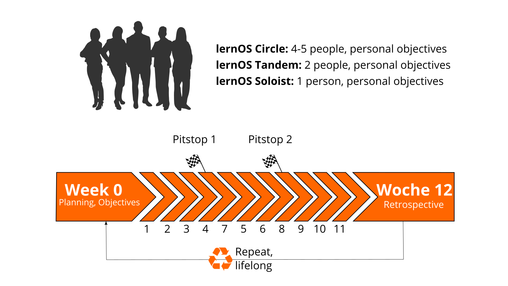

## lernOS Sprints: Lifelong Learning in 13 Weeks Timeboxes

lernOS is practiced in timeboxes of 13 weeks called learning sprints like in [scrum](https://scrumguides.org). Normally sprints run along the quarters of a year but the rhythm can be changed if necessary. A sprint can be done alone (lernOS Soloist), in pairs (lernOS Tandem) or in a group of 4-5 persons (lernOS Circle).

This is what happens during a lernOS sprint:

- **Week 0:** The sprint planning. Does everybody understand the process? When will the weekly meeting be? Which learning path is chosen? For lernOS tandems and circles: Will the weekly be face-to-face or virtual? Which tools are used for communication and documentation? Is everybody able to use the tools?
- **Weeks 1-11 with the Weekly Meeting:** It is worked on the objectives and desired results and the progress is critically reflected in the weekly. A learning path suggests exercises, which are called Katas as in [CoderDojos](https://coderdojo.com). Three learning paths are available for beginners (NOOBs): WOL learning path (open and connected working and learning), OKR learning path (targeted and focused working and learning) and GTD learning path (stress-free and productive working and learning). The recommendation is to select only one learning path per sprint and not to mix the learning paths in tandems or circles. The two pit stops in week 4 and week 8 help to see whether everyone is still on the right track.
- **Week 12 with the Retrospective:** Review of the final results of the sprint and retrospective of the entire process. For learning tandems and circles: The participants decide whether they want to stay together for another sprint.

At school and university, the pace of learning is determined by school years and semesters. In order to structure the learning afterwards in a self-organized way, the lernOS sprints are planned in extreme cases up to the end of one's life (from the cradle to the cradle), just [as Peter Drucker did it](https://www.inc.com/magazine/19970201/1169.html).
