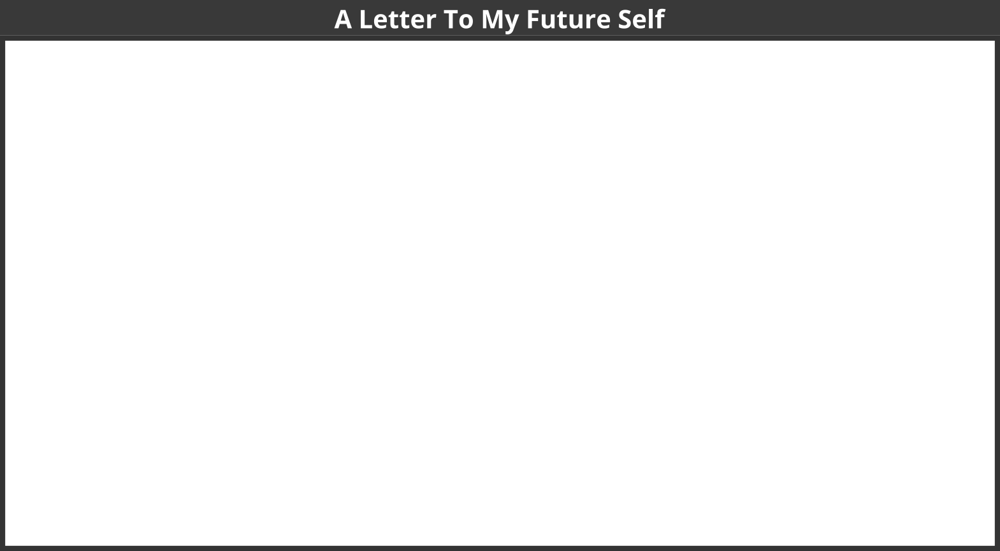

## WOL Learning Path

Sharing your knowledge openly and profiting from the knowledge of others helps that not everyone has to reinvent the wheel over and over again. According to the [Working Out Loud method](https://workingoutloud.com/en/circle-guides) by John Stepper, you can

1. Learn To set your own learning goal for the sprint.
2. Identify people and communities that are related to your goal.
3. Publish contributions and show appreciation to build a network in a systematic and goal-oriented way.
4. Use the support of your new network to achieve your goals faster and easier.

This learning path is a shortened to 11 exercises version of the circle method by John Stepper (31 exercises). However, the basic idea "Working Out Loud = Observable Work + Narrating Your Work" [by Bryce Williams](https://thebryceswrite.com/2010/11/29/when-will-we-work-out-loud-soon/) remains.

### Design Your Future Backwards (Kata)

**Design your future by reflecting on present and past and creating your personal vision (30 Minutes)**

This kata is based on the method [The Future, Backwards](https://cognitive-edge.com/methods/the-future-backwards/) by Dave Snowden. The kata i	s used to get a better overview of the bigger picture by looking in the past and the possible futures. The horizon of focus for the kata can be short-term (1-2 years), medium-term (3-5 years) or long-term (whole life).

**Instruction:**

1. Prepare your Future Backwards Canvas ([example](https://cognitive-edge.com/wp-content/uploads/2015/01/3---ChrisFl-IMG-0058-wpcf_300x225.jpg)). This can be a landscape piece of paper with a "Y" on it rotated by 90 degrees to the right indicating the present (current state), the past, the vision (heaven), the antivision (hell) and the stairway to heaven. Define the timespan you want to look back and forth (short-/medium-/long-term) (5 Minutes)
2. Describe the current state in 3-5 short phrases (5 Minutes)
3. Describe the 3-5 key events in the past that led to the current state (5 Minutes)
4. Describe your vision in 3-5 short phrases (5 Minutes)
5. Describe your anti-vision in 3-5 short phrases (5 Minutes)
6. Describe the 3-5 key events that need to happen to make your vision come true and avoid your anti-vision (5 Minutes)

**ProTip:** Helmut Hoensch ([@GoodTransfer](https://twitter.com/GoodTransfer)) created a [LearningSprintBooklet]() (German only) that contains a template for a future backwards.

### Think visual with the lernOS Canvas (Kata)

A canvas is a visual structure that can be used to work through several building blocks in a systematic way. This way you use a canvas as a visual checklist. It can also be used to tell a complex story. The idea came from Alex Osterwalder who invented the [business model canvas](https://en.wikipedia.org/wiki/Business_Model_Canvas). The lernOS Canvas uses the same basic structure as the business model canvas. But the names of the building blocks have been changed to reflect the topics a circle works on during a sprint.

The lernOS Canvas can be downloaded from the [lernOS Website](https://lernos.org) in different formats (e.g. PowerPoint, PDF, PNG). To be able to work with the canvas in an agile way one should NEVER write on a canvas ... that's why sticky notes were invented!

The header of the canvas contains the creation date, the number of the sprint, and a motivation/mission statement (if you have one). In the building block "My Objectives & Key Results" the goals for the current sprint are documented. The building blocks "My Roles", "My Activities", "My Projects", and "My Knowledge & Skills" can be used to identify potential objectives. "My Relationships" and "My Social Networks" can be used to identify people that can help you to achieve your objectives. Available resources (e.g. documents, checklists, videos etc.) are listed in "My Knowledge Assets". The repositories listed at "My Repositories" can be used to share assets generously with the network.

### My Objective For The Next 12 weeks (Kata)

In this kata you choose your objective for the sprint. 

_**Duration:** 25 minutes_

What do you want to accomplish in the next 12 weeks? Pick an objective that you really, really care about and you can make progress towards in the sprint. You will use Google's OKR method to define that objective. For the NOOB path it's not prio 1 to achieve the objective. Core is to learn how to achieve objectives more easy with the help of an open workstyle and the development of a network.

Select an objective for the next 12 weeks. Use the questions "Do I really, really care?", "Can I achieve it in 12 weeks?", and "Can my network help me?" to test if the objective is appropriate for the sprint. If you have problems to find a good objective think about goals that support your roles, activities, or projects. If you want to help to make the world a better place you can also choose an objective that is related to the [United Nation's 17 sustainable development goals](https://www.un.org/sustainabledevelopment/sustainable-development-goals).

Use the principles from objective & key results (OKR) to specify your objective. Define an objective and write it down below. To help you to track progress define 2-4 key results per objective. You should be able to measure the key results on a scale from 0.0-1.0. To make sure to set yourself ambitious goals a completion rate of 0.7 is regarded as a success.

_I will (objective):_ ...

_as measured by (key results):_

1. ...
1. ...
1. ...
1. ...

**Further Information:**

* Wikipedia Article [SMART Criteria](https://en.wikipedia.org/wiki/SMART_criteria)
* MIT Sloan Article [With Goals, FAST Beats SMART](https://sloanreview.mit.edu/article/with-goals-fast-beats-smart)
* TED Talk [How We Can Make the World a Better Place by 2030](https://www.youtube.com/watch?v=o08ykAqLOxk)
* Video [How Google Sets Goals: OKRs](https://www.youtube.com/watch?v=mJB83EZtAjc) with Google ventures partner Rick Klau
* Book [Introduction To OKRs](https://www.oreilly.com/business/free/files/introduction-to-okrs.pdf) by Christina Wodtke
* Book [The Beginner's Guide To OKR](https://felipecastro.com/resource/The-Beginners-Guide-to-OKR.pdf) by Felipe Castro

### People Related To Your Objective (Kata)

In this kata you will start to think about people who might help you with your objectives (Working alone is addition, working together is multiplication!).

_**Duration:** 20 minutes_

Most tasks we do have been done by others before. Most of the mistakes we make, have been made in the past already. You can gain access to knowledge and experiences related to your objectives by getting in touch with experienced people inside and outside your organization. Strong relationships are based on trust, sharing, and caring. [Dale Carnegie](https://en.wikipedia.org/wiki/Dale_Carnegie) said "You can make more friends in two months by becoming interested in other people than you can in two years by trying to get other people interested in you". So how do you get in touch with people related to your objectives and develop the relationship?

Create a list of at least ten people related to your objectives. If you don't know people by name you can also put roles or descriptions on the list (e.g. "best WoW player in wown", "a good camera man", "owner of company XY"). Use your contact lists or social networks find more people:

1. ...
1. ...
1. ...
1. ...
1. ...
1. ...
1. ...
1. ...
1. ...
1. ...

**Further Information:**

* Video [Social Networking In Plain English](https://www.youtube.com/watch?v=6a_KF7TYKVc)

### Your First Sharing Experience (Kata)

In this kata you start to share attention, knowledge, experiences, and assets with your network to build trust and get support.

_**Duration:** 20 minutes_

Sharing is caring! In the digital world sharing is often seen as giving others access to files or digital content. But it can also be as simple as sharing your attention with another person by following him, liking his content or subscribing to his website. By sharing you deepen your relationships with every contribution you make.

Go through your relationship list and look for some kind of online presence for each person (e.g. website, blog, profile in social network). Look for possibilities to share some attention. This might be a follow button, a like button, a subscribe field, a five star rating, a comment field or a contact form. Make at least five sharing experiences:

1. ...
1. ...
1. ...
1. ...
1. ...

### An Appointment With Yourself (Kata)

In this kata you will make sure that you have enough time for networking, sharing, and caring for your network. You will do this by making appointments with yourself. In this week your objectives should be stable and you should have a clear idea which people in the network might help you to get your things done.

_**Duration:** 15 minutes_

Do you spend enough time for your personal development and for working on your personal objectives? A lot of people are busy with their daily tasks and do not care enough for their development and their well-being. A good approach is to make an appointment with yourself and reserve that time for yourself in the calendar.

Check your calendar and see when an appointment with yourself fits in. One hour or even 30 minutes a week is a good starting point. Put an appointment with yourself in the calendar. If possible make it a recurring event so taking time for yourself can become a habit. Make at least five appointments:

1. ...
1. ...
1. ...
1. ...
1. ...

### Go Google Yourself! (Kata)

In this kata you will look yourself up in the intranet or internet.

_**Duration:** 10 minutes_

What do people see when they search for you online? Do they get an idea of who you are and how they might help you with your objectives? You can simulate that situation by googling yourself (often called egosurfing, egosearching or vanity search).

Open a search engine in the internet or intranet and enter your name. Open at least the first 10 search results and check if your personality and the facts about you are up-to-date. Identify possible improvements:

1. ...
1. ...
1. ...
1. ...
1. ...
1. ...
1. ...
1. ...
1. ...
1. ...

Think about what your main online profile might be (e.g. LinkedIn profile, about.me profile or profile in your enterprise social network). This will be called your "digital twin":

*My main online profile (digital twin) is ...*

**Further Information:**

* Wikipedia Article [Egosurfing](https://en.wikipedia.org/wiki/Egosurfing)
* Article [Google Yourself! Measuring the performance of personalized information resources](http://snurb.info/files/aoir2008/Google%20Yourself!%20Measuring%20the%20performance%20of%20personalized%20information%20resources%20%28AoIR%202008%29.pdf) by Thomas Nicolai and Lars Kirchhoff.

### 25 Facts About Me (Kata)

In this kata you will collect facts and personal information that might be relevant for your network and help you to connect.

_**Duration:** 25 minutes_

What are interesting facts about you that might help to connect with other people? If you apply to study at Fuqua Business School you have to write an essay with a list of 25 random things about yourself so the application team gets to know you better. When you write down facts about yourself you collect information that might help you to make new connections based on similar interests and backgrounds (e.g. "We studied in the same place 20 years ago!"). Random things about yourself might include:

* Life experiences
* Your likes/dislikes
* Where you were born/lived
* Family, kids, parents
* Schools, universities
* Workplaces in the past
* Career challenges
* Vacations
* Hobbies
* Achievements
* Fun facts
* Anything that helps to understand what makes you who YOU are

Create a list of 10 random facts about yourself. Then read the [Fuqua 25 random things do's and dont's](https://stratusadmissionscounseling.com/duke-fuqua-25-random-things-dos-donts) and expand your list to 25 things:

1. ...
1. ...
1. ...
1. ...
1. ...
1. ...
1. ...
1. ...
1. ...
1. ...
1. ...
1. ...
1. ...
1. ...
1. ...
1. ...
1. ...
1. ...
1. ...
1. ...
1. ...
1. ...
1. ...
1. ...
1. ...

**Further Information:**

* YouTube-Search ["random facts about me"](https://www.youtube.com/results?search_query=random+facts+about+me)

### Your Top 10 Assets (Kata)

In this week kata you will reflect on your top 10 knowledge assets that you can share in your network.

_**Duration:** 30 minutes_

What are the most valuable resources related to your objectives that you can share? A resource could be a book, a video, a link, a document, a checklist, a presentation etc. When you organize your resources in a way that they are linkable and shareble it will be easy for you to contribute them to your network.

Chose one of your objectives and list at least ten related resources you find useful or interesting:

1. ...
1. ...
1. ...
1. ...
1. ...
1. ...
1. ...
1. ...
1. ...
1. ...

### Update Your Digital Twin (Kata)

In this kata you will check if your digital twins like website, blog or profile do match your wishes and if not you will go out and update them.

_**Duration:** 20 minutes_

Does your main digital twin represent you in the way you want to? A lot of people register for an account in a social network and never think about updating their profile. You should keep your profile up to date and have a look at it on a regular basis (e.g. have a recurring task every three month). The facts about you, current projects and interests should be visible on that profile.

Check in the online profile if you have a nice image, a short description, and a slogan. List the improvements you want to make:

1. ...
1. ...
1. ...
1. ...
1. ...
1. ...
1. ...
1. ...
1. ...
1. ...

### Find Communities Related To Your Objectives (Kata)

In this kata you will look for communities or groups that can help you to reach your objectives.

_**Duration:** 15 minutes_

A tribe [according to Seth Godin](https://www.ted.com/talks/seth_godin_on_the_tribes_we_lead) is a group of people connected to one another, connected to a leader, and connected to an idea. Instead of tribe the term "community" or "community of practice" is also often used. A group needs only two things to be a tribe: a shared interest and a way to communicate. Tribes need leadership. Sometimes one person leads, sometimes more. Which are the communities related to your objectives?

Look for communities that are related to your objectives and find at least 10 (use e.g. [LinkedIn Groups](https://www.linkedin.com/groups), [Facebook Groups](https://www.facebook.com/groups), [Xing Groups](https://www.xing.com/communities) , [meetup.com](https://www.meetup.com), [reddit.com](https://www.reddit.com/reddits)):

1. ...
1. ...
1. ...
1. ...
1. ...
1. ...
1. ...
1. ...
1. ...
1. ...

### Contribute Your Self (Kata)

In this kata you will use the facts about yourself to make a personal connection. And you will learn that sometimes listening is more important then talking.

_**Duration:** 35 minutes_

Not all contributions in your network have to be about your objectives. Sometimes it's good to share something about yourself to make a personal connection. The list of facts about yourself might help to find interesting links to other people. Try to find these possible links and use them to make a connection.

**Exercise (20 minutes):**

Go through your facts about you and find at least one fact that might be of interest for a person on your relationship list. Write a message to that person and try to deepen the relationship with that fact as a contribution:

1. ...

### Write A Letter To Your Future Self (Kata)

In this kata you will start to envision yourself in the future by writing a letter to your future self. And you will help your network to support you by making your vision and your objectives visible on your online profiles.

_**Duration:** 35 minutes_

The letter to your future self is a classic method in self motivation and visioning. You reflect on your current situation and give your future self an advice. You write it down as a letter, address it to yourself and open it in the future. With the letter in the back of your mind chances are that your wishes become a [self-fulfilling prophecy](https://en.wikipedia.org/wiki/Self-fulfilling_prophecy).

Write a letter to your future self. Talk about who you are now (e.g. summary, fears, values, beliefs, skills, abilities, goals, hopes). Then address your future self with the things you want to stop/continue/start doing. Give yourself advice and ask yourself questions. Seal the letter and store it in a safe place or use services like [futureme.org](https://futureme.org) to send it to your future self automatically:

**Further Information:**

* Video [A Letter To My Future Self](https://www.youtube.com/watch?v=XwN0tJlXF-0)
* Article [How to Write a Letter to Your Future Self](https://www.wikihow.com/Write-a-Letter-to-Your-Future-Self)
