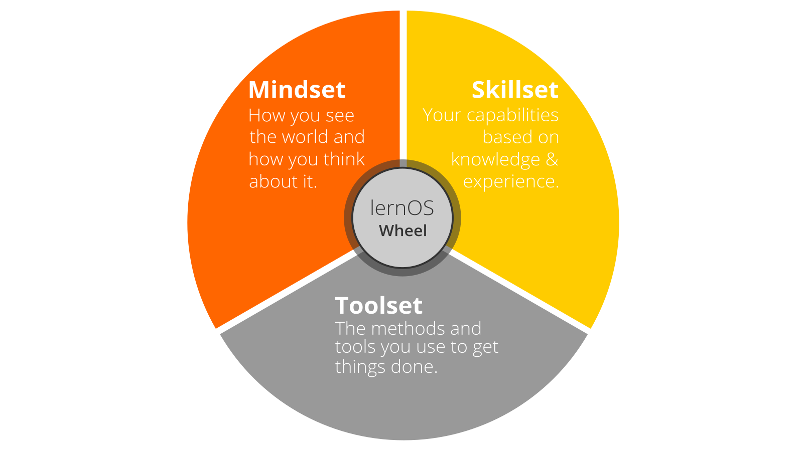
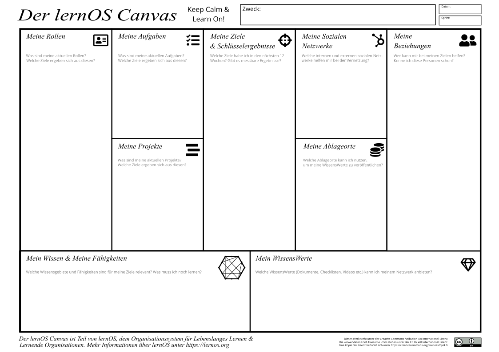

> Hat sich ihr Umfeld in der Vergangenheit stark verändert und verändert
> sich immer noch?
>
> Ist die Zusammenarbeit und die Beherrschung digitaler Tools wichtig
> für Ihren Erfolg?
>
> Müssen Sie laufend neue Fähigkeiten erlernen?
>
> Dann habe ich diesen Leitfaden für Sie geschrieben! \@simondueckert

Einstieg mit lernos
===================

lernos für Individuen ist eine Selbstverwaltungs Methode für Menschen,
die im 21. Jahrhundert Leben und arbeiten. Um in diesem Jahrhundert
erfolgreich zu sein, muss man sich fortlaufend lernen, organisieren und
entwickeln. Egal ob Sie ein Teenager, ein Student, ein junger Profi, ein
leitender Experte, ein Manager oder Anführer. lernos bringt die besten
Elemente aus bestehenden Methoden zusammen (ein großes Dankeschön an
alle Schöpfer und Mitwirkenden), um diese Fähigkeiten des 21.
Jahrhunderts zu erlernen:

-   **Ziele und zentrales Ergebniss (okr):** eine Methode, die von Andy
    Grove und John Doerr entwickelt wurde, um Ziele und laserscharfen
    Fokus in dem, was wir tun, zu verwalten.

-   **Dinge erledigen (GTD):** eine Methode, die von David allen
    entwickelt wurde, um all das Zeug und die Informationsüberlastung zu
    bewältigen, mit der wir täglich zu tun haben. Grundlage.

-   **Arbeiten laut (WOL):** eine Methode, die von Bryce Williams
    geprägt und von John Stepper bereichert wurde, um sich systematisch
    mit Menschen zu vernetzen, die uns helfen könnten, unsere Ziele zu
    erreichen.

Wenn Sie noch nie von den drei oben genannten Methoden gehört haben,
sollten Sie mit dem lesen beginnen über Sie, um sich einen ersten
Überblick zu verschaffen. Wenn Sie sich entscheiden, mit lernos zu
beginnen, ist der empfohlene Weg, 3-4 andere Personen zu finden und eine
Peer-Support-Gruppe zu werden, die als \"lernos Circle\" bezeichnet
wird. Entscheiden Sie, wann Sie beginnen und sich für eine Stunde in
einem sogenannten \"lernos Sprint\" treffen. Verwenden die
vordefinierten Agenden für die \"lernos Weekly\" in diesem Leitfaden.
Machen Sie eine Retrospektive nach dem Sprint und entscheiden Sie, ob
Sie mit den gleichen Kreis Mitgliedern einen weiteren Sprint laufen
wollen.

Wenn Sie Unterstützung bei der Suche nach Kreis Mitgliedern benötigen,
können Sie die kostenlose [Circlefinder App](http://circlefinder.app/).
Wenn Sie unsicher sind oder weitere Fragen haben, können Sie [Schließen
Sie sich der lernos User Group auf Telegram an](https://t.me/lernos)
oder schreiben Sie mit dem [hashtag \#lernOS auf
Twitter](https://twitter.com/search?q=%23lernOS).

Die Annahme von lernos ist nicht eine Frage von Stunden oder Tagen,
sondern von Monaten oder Jahren. Also Ruhe bewahren und lernen!

Warum lernos?
=============

Wir leben in einer Welt des ständigen Wandels. Technischer Fortschritt
wie Mechanisierung, Massenproduktion und Automatisierung lin der
Vergangenheit zu großen Veränderungen. Mit der Erfindung des Transistors
begann die digitale Transformation. Die Verarbeitungsleistung von
Computern wächst jährlich mit einer exponentiellen Geschwindigkeit. Aus
diesem Grund verändert sich auch unsere Umwelt im 21. Jahrhundert
befindet immer schnellerY.

Die Welt, in der wir leben, ist eine Welt voller Volatilität,
Unsicherheit, Komplexität und Mehrdeutigkeit (VUCA). In einer solchen
Umgebung müssen bewährte Methoden und Werkzeuge aus der Vergangenheit
Frage gestellt. Wir müssen uns von einer einmaligen Ausbildung zu einem
selbstgesteuerten lebendige l entwickelnVerdienen. Wir müssen neue
Fähigkeiten erwerben, neue digitale Werkzeuge einsetzen und eine neue
Denkweise entwickeln, um erfolgreich zu sein.

lernos kann helfen, sich fit für das 21. Jahrhundert zu machen. lernos
ist ein Betriebssystem für lebendige Lern-und Lernorganisationen. Der
Satz \"Mi Lernos \"bedeutet\" Ich werde lernen \"in Esperanto. lernos
hilft dabei, die täglichen Aufgaben zu organisieren und bewusst von
jeder Aktivität zu lernen. Es wird auch die Vernetzung mit anderen
Menschen fördern. Auf diese Weise muss nicht jedes Rad neu erfunden
werden und nicht jeder Fehler muss Wiederholt. Und das beste ist: lernos
ist wirklich leicht zu verstehen. Fangen wir an.

lernos Wheel-Mentalität, skillset und Toolset als Erfolgsfaktoren
=================================================================

Die Beherrschung des digitalen Zeitalters und der Wissensgesellschaft
des 21. Jahrhunderts erfordert Offenheit für Veränderungen und neue
Ansätze. Es gibt eine Menge von Werkzeugen und Methoden. Aber wenn man
nicht offen ist, es auszuprobieren und mit neuen Ansätzen zu
experimentieren, bleibt der Erfolg Weg. Wie die Leute mit den
\"quadratischen Rädern\" im Bild unten sind wir oft zu beschäftigt, um
zu sehen neue Möglichkeiten und Chancen.

{width="5.833333333333333in"
height="3.28125in"}

lernos Wheel People

Bei der Einführung neuer Praktiken geht es nicht nur darum, neue
digitale Werkzeuge oder ausgefallene Methoden wie Design-denken,
Abschaum und lautes arbeiten zu verwenden (Remeber: ein Narr mit einem
Werkzeug ist immer noch ein Narr). Zum Wechsel von \"Square wHeels
\"zu\" Runden Rädern \"müssen die Grundannahmen über die Welt, die
persönlichen Fähigkeiten und die verwendeten Methoden und Werkzeuge
berücksichtigt werden. lernos nennt diese drei Dimensionen Denkweise,
skillset und Toolset. Fokussierung auf nur ein oder zwei der drei
Dimensionen könnten schon helfen. Aber für die besten Ergebnisse sollten
alle drei Dimensionen berücksichtigt werden.

{width="5.833333333333333in"
height="3.28125in"}

lernos Rad

Denkweise-ihre Weltanschauung
-----------------------------

Die Denkweise kann als Annahmen, Überzeugungen, Wahrnehmungen, Gedanken,
Gefühle und Werte beschrieben werden, die zu einerKTIONEN und sichtbare
Artefakte. Diese sichtbaren Artefakte sind alles, was man sehen, hören
und fühlen kann. In einer Organisation können Artefakte Strukturen,
Hierarchien, Prozesse, Architekturen, Bürodesign, physische Umwelt und
IKT-Infrastruktur sein. Der einemssary-Werte zur erfolgreichen
Verwendung von lernos werden in der Präambel der [Manifest für
menschliche
Führung](https://fuehrung-erfahren.de/wp-content/uploads/2018/02/Manifesto-for-Human-Leadership.pdf):

> Wir glauben an die Kreativität und Motivation von Menschen. Wir
> betrachten die menschliche Führung als entscheidend in einer hoch
> vernetzten und hochkomplexen Welt. Wir verstehen die Aufgabe der
> Führung, das Leben zu dienen und nach Bedingungen zu streben, unter
> denen die Menschen in ihrer Vielfalt einen Beitrag zum besten p
> leisten können.ossible Art und Weise, in der Sie sich entwickeln und
> effektiv zusammenarbeiten können.

Das Kernprinzip einer Denkweise des 21. Jahrhunderts ist
[Offenheit](https://en.wikipedia.org/wiki/Openness). Das bedeutet, offen
zu sein für neue Erfahrungen, wissen und Ideen sowie der offene
Austausch von wissen, Ideen und Inhalten (z.b. durch die [offene
Definition](https://opendefinition.org/)). Sie sollten im Laufe der Zeit
eine \"offene erste Denkweise\" entwickeln, wie Sie in der [Offenes
erstes Manifest](http://innovationsbeirat.de/open-first/):

{width="5.833333333333333in"
height="5.833333333333333in"}

Offenes erstes Manifest von \@ib\_neudenker

**Protip:** Ihre Denkweise steht nicht fest, Sie können eine neue
Denkweise entwickeln. Sehen Sie sich das Video von Carol Dweck an
[Entwicklung einer Wachstums
Mentalität](https://www.youtube.com/watch?v=hiiEeMN7vbQ) um mehr darüber
zu erfahren.

Skillset-ihre Fähigkeiten
-------------------------

Seit den 1980er Jahren dominieren Fähigkeiten wie die Lösung von
nicht-routinemäßigen Problemen und die Interaktion mit anderen auf
kreative Weise. Auch Automatisierung, künstliche Intelligenz und
Maschine LeArning wird eine Menge von Aktivitäten ersetzen, die von
Menschen in der Vergangenheit durchgeführt wurden. Um sich für das 21.
Jahrhundert fit zu machen, müssen daher viele neue Fähigkeiten erworben
werden. Dieses neue skillset kann als eine Kombination aus dem [Digicomp
2,1
Framework](https://ec.europa.eu/jrc/en/publication/eur-scientific-and-technical-research-reports/digcomp-21-digital-competence-framework-citizens-eight-proficiency-levels-and-examples-use)
für digitale Kompetenzen und die [P21 Rahmen für das Lernen des 21.
Jahrhunderts](http://www.p21.org/our-work/p21-framework) mit den 4C
Lern-und Innovationsfähigkeiten (Kreativität, kritisches Denken,
Kommunikation, Kollaboration):

1.  **Kreativität und Innovation**

-   Kreativ denken

-   Kreativ mit anderen arbeiten

-   Innovatio implementierenNs

1.  **Kritisches Denken und Problem Lösung**

-   Ermittlung von Bedürfnissen und technologischen Reaktionen

-   Grund effektiv

-   Urteile und Entscheidungen treffen

-   Technische und nicht technische Probleme lösen

-   Kreativ mit Technologien zur Lösung von Problemen

1.  **Kommunikation**

-   Artikulieren wennHTS und Ideen klar und effektiv

-   Hören Sie effektiv auf, Bedeutung zu entschlüsseln

-   Kommunikation nutzen, um zu informieren, zu unterrichten, zu
    motivieren und

-   Nutzen Sie mehrere Medien und Technologien

-   Kommunizieren Sie effektiv in verschiedenen Umgebungen
    (einschließlich mehrsprachig, multi-Cultural)

1.  **Zusammenarbeit**

-   Effektiv und respektvoll mit diversen Teams arbeiten

-   Flexibilität und Bereitschaft üben, bei notwendigen Kompromissen
    hilfreich zu sein, um ein gemeinsames Ziel zu erreichen

-   Übernahme der gemeinsamen Verantwortung für die gemeinsame Arbeit
    und Wert der einzelnen Beiträge

-   Interaktion, Engagement, Austausch und Zusammenarbeit durch digitale
    Technologien

-   Digitale Identität verwalten

1.  **Informationen, Daten und Web-Alphabetisierung**

-   Surfen, suchen, filtering Daten, Informationen und digitale Inhalte

-   Auswertung und Verwaltung von Daten, Informationen und digitalen
    Inhalten

-   Verwaltung von Daten, Informationen und digitalen Inhalten

-   Schutz digitaler Geräte

-   Schutz personenbezogener Daten und Datenschutz

1.  **Digitale Content-Erstellung**

-   Entwicklung digital Content

-   Digitale Inhalte integrieren und neu ausarbeiten

-   Umgang mit Urheberrechten und Lizenzen

-   Programmierung, Scripting und Codierung

**Protip:** die Mozilla Foundation hat die [Web Literacy
Framework](https://learning.mozilla.org/en-US/web-literacy) mit vielen
Übungen zur Entwicklung digitaler Alphabetisierung und Fähigkeiten des
21. Jahrhunderts.

Toolset-Methoden und Werkzeuge, die Sie verwenden
-------------------------------------------------

Mit dem Aufkommen von [Web
2,0](https://www.oreilly.com/pub/a/web2/archive/what-is-web-20.html) in
2005 Social Media und neue Methoden kamen auf. Nicht jeder muss alle
Werkzeuge und Methoden kennen, aber es ist eine gute Idee, einen
Überblick zu haben, die Prinzipien zu kennen und die richtigen Werkzeuge
für sich selbst zu wählen. Das Gespräch Prism gibt einen Überblick über
Web 2,0 Plattforms heute verfügbar:

{width="5.351170166229221in"
height="4.006688538932633in"}

Konversation Prism 5,0 von Brian Solis und jess3, conversationprism.com

Für einen Anfänger könnte dieses Prisma mit 28 Kategorien und Dutzenden
von Werkzeugen überwältigend sein. Um mit der folgenden Kurzliste zu
beginnen, gibt es einen kompakten Überblick über die MoSt relevante
Werkzeuge (aphabetical Order):

1.  **Digitales Notebook:** Evernote, OneNote, TiddlyWiki

2.  **File Sharing:** Dropbox, Google Drive, Office 365, onedrive,
    SharePoint

3.  **Messenger:** Microsoft Teams, Slack, threema, WeChat, WhatsApp,
    Telegram

4.  **Mind Mapping:** FreeMind, Ithoughts, MindManager, MINDMEISTER,
    XMind

5.  **Soziales Netzwerk:** professionelle soziale Netzwerke (LinkedIn,
    Xing, Twitter) sowie Unternehmens soziale Netzwerke (Jive, Yammer,
    IBM-Verbindungen, Arbeitsplatz durch Facebook)

6.  **Video-Sharing:** Kaltura, Vimeo, ViMP, YouTube

7.  **Webkonferenzen:** Google Hangout, GoToMeeting, Microsoft Teams,
    Skype, Skype für Unternehmen, WebEx, Zoom

8.  **Weblog:** Medium, Tumblr, WordPress (Tipp: soziale Netzwerke
    bieten oft Blog-Funktionen)

9.  **Wiki:** Confluence, MediaWiki, Wikipedia

10. **Arbeitskoordination:** asana, MICRosoft Planner, Microsoft to-do,
    trello

Neben technischen Werkzeugen steht auch eine neue Reihe hilfreicher
Methoden zur Verfügung. Gute Beispiele sind BarCamps,
Praxisgemeinschaften, Coworking, Design-denken, shipit-Tage (Alias
FedEx-Tage), Zukunft rückwärts, immer tHings done, Hackathon,
Wissenslandkarte, erlernte Lektionen, massive offene Online-Kurse,
Podcast, Screencast, Scrum, und das Arbeiten laut. Das richtige Toolset
hängt stark von Ihrem Leben oder Ihrem Beruf ab.

lernos Circle-von Talking the Talk bis Walking the Spaziergang
==============================================================

Genug Theorie. Sie haben über die richtige Denkweise, Geschicklichkeit
und Toolset für das 21. Jahrhundert gelesen. Jetzt ist es an der Zeit zu
üben. Sie werden dies in einem Zeitraum von drei Monaten tun, genannt
lernos Sprints. Um Peer-Support zu haben, sollten Sie nicht auf Ihrem
eigenen b übenUT in einer Gruppe von 4-5 Personen namens lernos Circle.
Ein Kreis ist ein [Peer
Support](https://en.wikipedia.org/wiki/Peer_support) Gruppe, in der sich
die Mitglieder gegenseitig mit Feedback, Erfahrung, wissen und Reflexion
helfen. Der lernos-Kreis ist ein Kreis des Vertrauens: was im Kreis
passiert, bleibt im Kreis! Die kreismitglieder werden wöchentlich ein
Treffen mit einer Standard-Agenda haben, um Ihren Lernprozess Schritt
für Schritt zu strukturieren.

{width="5.833333333333333in"
height="3.28125in"}

lernos Circle

Der Kreis trifft sich wöchentlich in einem Treffen mit dem Namen lernos
weekly. die Wochenzeitung ist eine kurze Zeremonie, um Ergebnisse zu
verfolgen, Übungen zu üben und sich für die nächste Woche zu motivieren.
Im Kreis definiert jedes Mitglied persönliche Ziele und gewünschte
Ergebnisse. Circle-Mitglieder lernen, sich zu teilen und Netzwerk zu
bauen, um ein Netzwerk von Vertrauen und Beziehungen, die helfen, die
persönlichen Ziele zu erreichen.

lernos Sprint-Agile Planung und Ausführung
==========================================

Kreismitglieder sollen Kreise wechseln können, wenn Sie wollen. Daher
müssen die Kreise denselben Rhythmus haben. Aus diesem Grund hat lernOS
wird in sogenannten Sprints von jeweils einem Vierteljahr (13 Wochen)
praktiziert. So besteht ein Jahr aus vier lernos-Sprints:

  Datum                Sprint
  -------------------- ---------
  **01.01.-31,03.:**   01/yyyy
  **01.04.-30,06.:**   02/yyyy
  **01.07.-30,09.:**   03/yyyy
  **01.10.-31,12.:**   04/yyyy

In der Woche 0 findet die Sprint Planung statt: versteht jeder den
Vorgang? Wann wird das wöchentliche Treffen stattfinden? Welche Übungen
werden für die Wochen ausgewählt? Wird das wöchentliche Treffen von
Angesicht zu Angesicht oder virtuell organisiert? Welche Werkzeuge für
die Communicatio verwendet werdenn und Dokumentation im Sprint? Ist
jeder in der Lage, die Werkzeuge zu verwenden? Zusätzlich kann die Woche
0 für die strategische Planung genutzt werden: Was ist der Zweck? Was
ist der wahre Norden? Was ist die Mission? Was sind bahnbrechende Ziele
für die Zukunft? Was Ziele sein könntetives für den nächsten Sprint?

{width="5.833333333333333in"
height="3.28125in"}

lernos Sprint

In den Wochen 1-12 findet das wöchentliche Treffen statt, wie es im
Kapitel \"lernos Circle\" beschrieben wird. Die kreismitglieder arbeiten
im Sprint an Ihren gewünschten Ergebnissen. Sie bauen ein Netzwerk auf,
das Sie mit Ach unterstütztIhre Ziele zu erreichen. Die beiden
\"Pitstops\" in Woche 4 und Woche 8 helfen, zu sehen, ob noch alle auf
der Strecke sind. Wenn in der wöchentlichen Sitzung keine zusätzlichen
Übungen gemacht werden, dauert es 15 Minuten. Wenn zusätzliche Übungen
gewählt werden, werden bis zu 60 Minuten necessary für das treffen. Die
Dokumentation für jede Übung ist im Kapitel \"lernos Kata Katalog\" zu
haben.

lernos Weekly-treffen Sie Ihre kreismitglieder jede Woche
=========================================================

Einmal in der Woche trifft sich ein lernos-Kreis. Jede Woche hat eine
standardisierte Agenda mit einem Check-in, ein Check-out, und schlug
Übungen namens lernos Katas. Die Zeitleiste für die Wochenzeitung kann
auf die persönlichen Bedürfnisse übernommen werden (empfohlene Timeslot:
Freitag zwischen 11 und 12 Uhr):

-   **15 Minuten wöchentliches treffen:** nur Check-in und Check-out, um
    den Fortschritt zu verfolgen

-   **30-60 Minuten wöchentliches treffen:** LIKE 15 Minuten plus
    Übungen aus dem lernos Kata Katalog

In der Sprint Planung in der Woche 0 können die kreismitglieder
entscheiden, welche Übungen Sie im Kreis machen wollen und welche Sie
sich anpassen oder auslassen wollen. Das wöchentliche Treffen könnte
Face-to-FA seinCE oder virtuell. In jedem Fall sollte der Kreis zwischen
den wöchentlichen Treffen eine digitale Infrastruktur für Kommunikation
und Dokumentation einrichten. Die folgende Tabelle zeigt einige
Werkzeuge, die in der Praxis bewährt sind (mehr dazu finden Sie in der
[lernos wiki](https://github.com/simondueckert/lernos/wiki)):

  Tool A-Z                                                              Kommunikation   Dokumentation
  --------------------------------------------------------------------- --------------- ---------------
  Enterprise Social Network (ESN), z.b. IBM Connections, Jive, Yammer   **X**           **X**
  appear.in                                                             X               
  E-mail                                                                X               
  Evernote                                                                              X
  Facebook Group                                                        **X**           **X**
  Facebook Messenger                                                    X               
  Google doc                                                                            X
  Google Hangout                                                        X               
  Gotomeeting                                                           X               
  Jitsi                                                                 X               
  Microsoft Teams                                                       **X**           **X**
  Skype                                                                 X               
  Slack                                                                 X               
  Telegramm                                                             X               
  Threema                                                               X               
  Webex                                                                 X               
  WeChat                                                                X               
  Whatsapp                                                              X               
  Zoom                                                                  X               

**Protip:** Um eine gute Usability zu haben, wählen Sie ein Tool, das
Kommunikation und Dokumentation unterstützt, z.b. eine [Facebook
Group](https://www.facebook.com/help/1629740080681586) Oder [Microsoft
Teams](https://products.office.com/en-us/microsoft-teams/group-chat-software).
In einer Facebook-Gruppe kann man den Aktivitäts Strom zur Kommunikation
nutzen und [gruppendocs](https://www.facebook.com/help/203003559734725)
zur Dokumentation. In Microsoft-Teams können Sie den Kanal \"General\"
für com verwendenmunication und Wiki-Seiten oder ein OneNote-Notebook
zur Dokumentation.

Woche 0-zusammenkommen & Sprint Planung
---------------------------------------

Wenn Sie neu im Kreis sind, werden Sie sich in der Woche 0 kennenlernen.
Sie planen die administrativen Dinge wie wann Sie sich treffen, welche
Werkzeuge für unse, wer ist der Moderator etc. Eines der größten
Hindernisse für den kreisbetrieb ist Disziplin und Zeitmanagement. Sie
sollten die Grundregeln für den Betrieb des Kreises bis zum Ende der
Woche 0 festlegen.

-   **Check-in:** Alle willkommen! *(5 Minuten)*

-   **Zusammenkommen:** , die Bist du? Vorstellen. Fünf-Minuten-timebox
    pro Kreis Mitglied. *(25. Minute)*

-   **Sprint Planung** siehe unten *(25. Minute)*

-   **Check-out:** Was werde ich bis zur nächsten Woche tun? Eine Minute
    timebox pro Kreis Mitglied. *(5 Minuten)*

Definieren Sie einen Kreis Vermittler, der sich ums für Event-und
Zeitmanagement. Der Moderator ist nicht der \"Boss\" des Kreises,
sondern nur ein normales Mitglied, das sich um den reibungslosen Betrieb
kümmert. Definieren Sie den Tag und die Uhrzeit Ihres wöchentlichen
Kreis Treffens (Vorschlag: Freitag, 11-12 Uhr). Definieren Sie, ob Sie
Face-to-Gesicht oder virtuell. Wenn Sie für virtuelle wöchentliche
Diskussion gehen, wenn die Wochen 4, 7 und 12 von Angesicht zu Angesicht
durchgeführt werden könnten. Wenn Sie das Tool, das Sie für die
Web-Konferenz verwenden, virtuell definieren (z.b. Skype for Business,
Zoom, appear.in). Entscheiden Sie, ob Sie weitere Werkzeuge für Co
verwendenmmunication (z.b. WhatsApp, threema, Telegram, WeChat) und
Dokumentation (z.b. OneNote, Evernote). Sprechen Sie auch über die
Themen aus dem lernos-Rad (Mentalität, Geschicklichkeit, Toolset) und
wenn Sie einige der dort aufgeführten Bereiche verbessern wollen.

-   **Circle facilitatoR:** \...

-   **Tag/Uhrzeit des wöchentlichen Treffens:** \... (legen Sie es jetzt
    in Ihren Kalender!:-)

-   **Wöchentliche Treffen sind:** Face-to-Face/Virtual

-   **Werkzeuge, die im Kreis verwendet werden:** \... (testen, ob jeder
    die Werkzeuge benutzen kann)

Woche 1-Ihre Sprint-Ziele
-------------------------

In dieser Woche wählen Sie Ihre Ziele für diesen Sprint (ein oder
mehrere, max. 5). Die Ziele könnten bis Woche 4, aber nicht später im
Sprint verfeinert werden. Sie werden auch anfangen, über Menschen
nachzudenken, die Ihnen bei ihren Zielen helfen könnten (denken Sie
daran: Working Aleine ist Addition, die Zusammenarbeit ist
Multiplikation!).

-   **Check-in:** Was geschah seit dem letzten Check-in? Was hat sich in
    den wichtigsten Ergebnissen geändert? Was verlangsamt mich? Zwei
    minütige timebox pro Kreis Mitglied. *(10 Minuten)*

-   **Übung:** [Warum bist du
    hier?](https://github.com/simondueckert/lernos/blob/master/lernOS%20Guide/en/lernOS-Guide-en.md#why-are-you-here)
    *(10 Minuten)*

-   **Übung:** [Meine Ziele für die nächsten 12
    Wochen](https://github.com/simondueckert/lernos/blob/master/lernOS%20Guide/en/lernOS-Guide-en.md#my-objectives-for-the-next-12-weeks)
    *(25. Minute)*

-   **Übung:** [Menschen, die mit Ihrem Ziel
    (en)](https://github.com/simondueckert/lernos/blob/master/lernOS%20Guide/en/lernOS-Guide-en.md#people-related-to-your-objectives)
    *(20 Minuten)*

-   **Check-out:** Was werde ich bis zur nächsten Woche tun? Eine Minute
    timebox pro Kreis Mitglied. *(5 Minuten)*

Woche 2-shAring ist fürsorglich
-------------------------------

In dieser Woche werden Sie über die Quantität und Qualität der
Beziehungen nachdenken, die mit ihren Zielen zusammenhängen. Sie werden
auch anfangen, Aufmerksamkeit, wissen, Erfahrungen und Vermögenswerte
mit Ihrem Netzwerk zu teilen, um Vertrauen aufzubauen und Unterstützung
zu erhalten.

-   **Check-in:** Was geschah seit dem letzten Check-in? Was hat sich in
    den wichtigsten Ergebnissen geändert? Was verlangsamt mich? Zwei
    minütige timebox pro Kreis Mitglied. *(10 Minuten)*

-   **Übung:** [Starke oder schwache
    Bindungen?](https://github.com/simondueckert/lernos/blob/master/lernOS%20Guide/en/lernOS-Guide-en.md#strong-or-weak-ties)
    *(5 Minuten)*

-   **Übung:** [Ihre erste Erfahrungs
    Erfahrung](https://github.com/simondueckert/lernos/blob/master/lernOS%20Guide/en/lernOS-Guide-en.md#your-first-sharing-experience)
    *(40 Minuten*

-   **Check-out:** Was werde ich bis zur nächsten Woche tun? Eine Minute
    timebox pro Kreis Mitglied. *(5 Minuten)*

Woche 3-nutzen Sie den Netzwerk-Effekt
--------------------------------------

In dieser Woche werden Sie sicherstellen, dass Sie genügend Zeit haben,
um Ihr Netzwerk zu vernetzen, zu teilen und zu pflegen. Sie wird dies
tun, indem Sie Termine mit sich selbst machen. Sie werden auch darüber
nachdenken, wie Sie das Intranet oder Internet nutzen, um mehr Menschen
zu erreichen.

-   **Check-in:** Was geschah seit dem letzten Check-in? Was hat sich in
    den wichtigsten Ergebnissen geändert? Was verlangsamt mich? Zwei
    Minuten timebox pro Kreis Mitglied. *(10 Minuten)*

-   **Übung:** [Ein Termin mit sich
    selbst](https://github.com/simondueckert/lernos/blob/master/lernOS%20Guide/en/lernOS-Guide-en.md#an-appointment-with-yourself)
    *(15 Minuten)*

-   **Übung:** [Web-Scale Networking
    nutzen](https://github.com/simondueckert/lernos/blob/master/lernOS%20Guide/en/lernOS-Guide-en.md#use-web-scale-networking)
    *(15 Minuten)*

-   **Übung:** [Soziales Lob
    üben](https://github.com/simondueckert/lernos/blob/master/lernOS%20Guide/en/lernOS-Guide-en.md#practice-social-praise)
    *(15 Minuten)*

-   **Check-out:** Was werde ich bis zur nächsten Woche tun? Eine Minute
    timebox pro Kreis Mitglied. *(5 Minuten)*

Woche 4-PitStop 1
-----------------

In dieser Woche sollten Ihre Ziele stabil sein, und Sie sollten eine
klare Vorstellung haben, welche Leute im Netzwerk Ihnen helfen könnten,
ihre Arbeit zu erledigen. Nehmen Sie sich diese Woche für einen kurzen
\"PitStop\" zum Nachdenken, wenn alles gut für Sie und den Kreis
funktioniert. Die nächsten vier Wochen werden Sie sich darauf
konzentrieren, an der ersten Iteration ihrer wichtigsten Ergebnisse zu
arbeiten.

-   **Check-in:** Was geschah seit dem letzten Check-in? Was hat sich in
    den wichtigsten Ergebnissen geändert? Was verlangsamt mich? Zwei
    minütige timebox pro Kreis Mitglied. *(10 Minuten)*

-   **Übung:** [Ton der Stimme in der
    Online-Kommunikation](https://github.com/simondueckert/lernos/blob/master/lernOS%20Guide/en/lernOS-Guide-en.md#tone-of-voice-in-online-communication)
    *(15 Minuten)*

-   **Übung:** [Eine nützliche Ressource
    teilen](https://github.com/simondueckert/lernos/blob/master/lernOS%20Guide/en/lernOS-Guide-en.md#sharing-a-useful-resource)
    *(30 Minuten)*

-   **Check-out:** Was werde ich bis zur nächsten Woche tun? Eine Minute
    timebox pro Kreis mEmber. *(5 Minuten)*

Woche 5-Wer bin ich?
--------------------

In dieser Woche hätten die Arbeiten an der ersten Iteration ihrer
wichtigsten Ergebnisse beginnen sollen. Ziel ist es, eine [Minimum
tragfähiges
Produkt](https://en.wikipedia.org/wiki/Minimum_viable_product) (etwas,
das funktioniert und das können Sie zeigen) bis Ende der Woche 8. Sie
werden auch anfangen, darüber nachzudenken, welche Fakten und
persönlichen Informationen für Ihr Netzwerk relevant sein könnten.

-   **Check-in:** Was geschah seit dem letzten Check-in? Was hat sich in
    den wichtigsten Ergebnissen geändert? Was ist Slowing Me Down? Zwei
    minütige timebox pro Kreis Mitglied. *(10 Minuten)*

-   **Übung:** [25 zufällige Fakten über
    mich](https://github.com/simondueckert/lernos/blob/master/lernOS%20Guide/en/lernOS-Guide-en.md#25-random-facts-about-me)
    *(25. Minute)*

-   **Übung:** [Tragen Sie
    selbst](https://github.com/simondueckert/lernos/blob/master/lernOS%20Guide/en/lernOS-Guide-en.md#contribute-your-self)
    *(20 Minuten)*

-   **Check-out:** Was werde ich bis zur nächsten Woche tun? Eine Minute
    timebox pro Kreis Mitglied. *(5 Minuten)*

Woche 6-Update your digital Twin
--------------------------------

In dieser Woche werden Sie sich im Intranet oder Internet umschauen.
Wenn Ihre digitalen Zwillinge (z.b. Website, Blog, Profil) nicht mit
Ihren Erkenntnissen aus der letzten Woche übereinstimmen, werden Sie
Ihre Profile aktualisieren.

-   **Überprüfenin** Was geschah seit dem letzten Check-in? Was hat sich
    in den wichtigsten Ergebnissen geändert? Was verlangsamt mich? Zwei
    minütige timebox pro Kreis Mitglied. *(10 Minuten)*

-   **Übung:** [Gehen Sie Google
    selbst!](https://github.com/simondueckert/lernos/blob/master/lernOS%20Guide/en/lernOS-Guide-en.md#go-google-yourself)
    *(10 Minuten)*

-   **Übung:** [Aktualisieren Sie Ihren digitalen
    Twin](https://github.com/simondueckert/lernos/blob/master/lernOS%20Guide/en/lernOS-Guide-en.md#update-your-digital-twin)
    *(20 Minuten)*

-   **Übung:** [Zeit für die Herstellung von
    Verbindungen](https://github.com/simondueckert/lernos/blob/master/lernOS%20Guide/en/lernOS-Guide-en.md#spend-time-on-making-connections)
    *(15 Minuten)*

-   **Check-out:** Was werde ich bis zur nächsten Woche tun? Eine Minute
    timebox pro Kreis Mitglied. *(5 Minuten)*

Woche 7-ihre Vision geht Digital
--------------------------------

In dieser Woche werden Sie daran arbeiten, die erste Iteration Ihres
minimalen lebensfähigen Produktes zu beenden. Sie werden auch anfangen,
sich vorzustellen, dass ichn die Zukunft, indem Sie einen Brief an Ihr
zukünftiges selbst schreiben. Und Sie werden Ihrem Netzwerk dabei
helfen, Sie zu unterstützen, indem Sie Ihre Vision und ihre Ziele auf
Ihren Online-Profilen sichtbar machen.

-   **Check-in:** Was geschah seit dem letzten Check-in? Was hat sich in
    den wichtigsten Ergebnissen geändert? Was verlangsamt mich? Zwei
    minütige timebox pro Kreis Mitglied. *(10 Minuten)*

-   **Übung:** [Schreiben Sie einen Brief an Sier Future
    Self](https://github.com/simondueckert/lernos/blob/master/lernOS%20Guide/en/lernOS-Guide-en.md#write-a-letter-to-your-future-self)
    *(35 Minuten)*

-   **Übung:** [Ihre Ziele
    teilen](https://github.com/simondueckert/lernos/blob/master/lernOS%20Guide/en/lernOS-Guide-en.md#share-your-objectives)
    *(10 Minuten)*

-   **Check-out:** Was werde ich bis zur nächsten Woche tun? Eine Minute
    timebox pro Kreis Mitglied. *(5 Minuten)*

Woche 8-PitStop 2
-----------------

In dieser Woche sollte die erste Iteration ihrer wichtigsten Ergebnisse
vorliegen. Reden Sie darüber oder zeigen Sie Sie im Check-in. Als Sie
erfahren haben, dass Sie gezögert haben, an Ihrem Schlüssel-Re zu
arbeitenSultS Sie werden über einige \"Procrastination Gegenmaßnahmen\"
erfahren.

-   **Check-in:** Was geschah seit dem letzten Check-in? Was hat sich in
    den wichtigsten Ergebnissen geändert? Was verlangsamt mich? Zwei
    minütige timebox pro Kreis Mitglied. *(10 Minuten)*

-   **Übung:** [Stop
    Procrastination!](https://github.com/simondueckert/lernos/blob/master/lernOS%20Guide/en/lernOS-Guide-en.md#stop-procrastination)
    *(20 Minuten)*

-   **Übung:** [Erstellen Sie Ihr eigenes Burn Down
    Diagramm](https://github.com/simondueckert/lernos/blob/master/lernOS%20Guide/en/lernOS-Guide-en.md#create-your-own-burn-down-chart)
    *(10 Minuten)*

-   **Übung:** [Anderen helfen, sich
    anzuschließen](https://github.com/simondueckert/lernos/blob/master/lernOS%20Guide/en/lernOS-Guide-en.md#help-others-to-connect)
    *(15 Minuten)*

-   **Check-out:** Was werde ich bis zur nächsten Woche tun? Eine Minute
    timebox pro Kreis Mitglied. *(5 Minuten)*

9. Woche-Ihr Wissens Vermögen
-----------------------------

In dieser Woche werden Sie mit der Arbeit an der zweiten Iteration ihrer
wichtigsten Ergebnisse beginnen. In Additiauf Sie reflektieren Sie Ihre
Top-10-Wissenswerte und die Wissensbereiche, die Sie zu Ihrem Netzwerk
beitragen können.

-   **Check-in:** Was geschah seit dem letzten Check-in? Was hat sich in
    den wichtigsten Ergebnissen geändert? Was verlangsamt mich? Zwei
    minütige timebox pro Kreis Mitglied. *(10 Minuten)*

-   **Übung:** [Ihre
    Top-10-Assets](https://github.com/simondueckert/lernos/blob/master/lernOS%20Guide/en/lernOS-Guide-en.md#your-top-10-assets)
    *(30 Minuten)*

-   **Übung:** [Die Dinner Table
    University](https://github.com/simondueckert/lernos/blob/master/lernOS%20Guide/en/lernOS-Guide-en.md#the-dinner-table-university)
    *(15 Minuten)*

-   **Check-out:** Was werde ich bis zur nächsten Woche tun? Eine Minute
    timebox pro CIRCLe Member. *(5 Minuten)*

Woche 10-Networking und Sharing Time
------------------------------------

In dieser Woche werden Sie eine Checkliste verwenden, um weitere
Vermögenswerte zu finden, die im Netzwerk geteilt werden können. Sie
werden ein Zeitmanagement-System erstellen, das sicherstellt, dass Sie
genügend Zeit für Networking haben und ShariNg. Und Sie werden lernen,
dass manchmal zuhören wichtiger ist als senden.

-   **Check-in:** Was geschah seit dem letzten Check-in? Was hat sich in
    den wichtigsten Ergebnissen geändert? Was verlangsamt mich? Zwei
    minütige timebox pro Kreis Mitglied. *(10 Minuten)*

-   **Übung:** [Was kann ich
    beitragen?](https://github.com/simondueckert/lernos/blob/master/lernOS%20Guide/en/lernOS-Guide-en.md#what-can-i-contribute)
    *(20 Minuten)*

-   **Übung:** [Meine Vernetzung und Sharing
    Time](https://github.com/simondueckert/lernos/blob/master/lernOS%20Guide/en/lernOS-Guide-en.md#my-networking-and-sharing-time)
    *(10 Minuten)*

-   **Übung:** [Versuchen Sie diese verrückte Methode namens
    \"Fragen\"!](https://github.com/simondueckert/lernos/blob/master/lernOS%20Guide/en/lernOS-Guide-en.md#try-this-crazy-method-called-asking)
    *(15 Minuten)*

-   **Check-out:** Was werde ich bis zur nächsten Woche tun? Eine Minute
    timebox pro Kreis Mitglied. *(5 Minuten)*

Woche 11-die Macht der Gemeinden
--------------------------------

In dieser Woche werden Sie nach Gemeinden suchen, die mit zu Ihren
Zielen. Sie werden lernen, die DNA von Gemeinschaften zu entschlüsseln.
Sie werden auch darüber nachdenken, eine eigene Gemeinschaft zu gründen,
um Ihre Ziele zu unterstützen.

-   **Check-in:** Was geschah seit dem letzten Check-in? Was hat sich in
    den wichtigsten Ergebnissen geändert? Was verlangsamt mich? Zwei
    minütige timebox pro Kreis Mitglied. *(10 Minuten)*

-   **Übung:** [Finden Sie Gemeinschaften, die mit Ihrem OBJEC verbunden
    sindtives](https://github.com/simondueckert/lernos/blob/master/lernOS%20Guide/en/lernOS-Guide-en.md#find-communities-related-to-your-objectives)
    *(15 Minuten)*

-   **Übung:** [Wer sind die ersten und zweiten
    Tänzer?](https://github.com/simondueckert/lernos/blob/master/lernOS%20Guide/en/lernOS-Guide-en.md#who-are-the-first-and-second-dancers)
    *(15 Minuten)*

-   **Übung:** [Wollen Sie eine eigene Community
    Gründen?](https://github.com/simondueckert/lernos/blob/master/lernOS%20Guide/en/lernOS-Guide-en.md#do-you-want-to-start-your-own-community)
    *(15 Minuten)*

-   **Check-out:** Was werde ich bis zur nächsten Woche tun? One Minute
    timebOchse pro Kreis Mitglied. *(5 Minuten)*

Woche 12-reflektieren und feiern
--------------------------------

In dieser Woche sollte die endgültige Iteration ihrer wichtigsten
Ergebnisse vorliegen. Reden Sie darüber oder zeigen Sie Sie im Check-in.
Sie werden über die Kreis Erfahrung reflektieren und darüber nachdenken,
wie man Sustadabei. Nach der Woche sollten Sie sich etwas Zeit nehmen
und ihren Erfolg feiern!

-   **Check-in:** Was geschah seit dem letzten Check-in? Was hat sich in
    den wichtigsten Ergebnissen geändert? Was verlangsamt mich? Zwei
    minütige timebox pro Kreis Mitglied. *(10 Minuten)*

-   **Übung:** [Ihr
    Eureka-Moment](https://github.com/simondueckert/lernos/blob/master/lernOS%20Guide/en/lernOS-Guide-en.md#your-eureka-moment)
    *(15 Minuten)*

-   **Übung:** [Erstellen Sie Ihre
    Zeitkapsel](https://github.com/simondueckert/lernos/blob/master/lernOS%20Guide/en/lernOS-Guide-en.md#create-your-time-capsule)
    *(15 Minuten)*

-   **Übung:** [Wiederholung ist der Schlüssel zur
    Meisterschaft](https://github.com/simondueckert/lernos/blob/master/lernOS%20Guide/en/lernOS-Guide-en.md#repetition-is-the-key-to-mastery)
    *(15 Minuten)*

-   **Check-out:** Partyzeit! *(5 Minuten)*

lernos Kata Katalog-Übungen, um sich selbst zu qualifizieren
============================================================

Wie werden Sie ein großartiger Musiker? Es ist gut to kennen Sie die
Theorie und um die Mechanik ihres Instruments zu verstehen. Es hilft
auch, wenn man Talent hat. Aber echte Meisterschaft kommt vom üben, der
Anwendung der Theorie immer und immer wieder, mit Feedback, um jedes Mal
besser zu werden. lernos verwendet einen Katalog von exercises rief
\"Katas\" an, um neue Fähigkeiten auszubilden. Die Standard-Agenda für
die wöchentliche Sitzung Referenz einige der Katas. Auf diese Weise
können eine oder mehrere Übungen während eines 12-wöchigen
selbstgesteuerten Lernprogramms im Kreis geübt werden.

**Protip:** in viel circlEs ist die timebox für das Ausführen einer
Übung im Kreis zu kurz. Sie können die Methode verwenden [umgekehrtes
Klassenzimmer](https://en.wikipedia.org/wiki/Flipped_classroom): jedes
Kreis Mitglied bereitet die Übungen als \"Hausaufgaben\" vor, so dass
Sie hamehr Zeit, um Ergebnisse im Kreis zu besprechen.

[Warum bist du hier?](\l)
-------------------------

Was ist Ihre Motivation, sich diesem Kreis anzuschließen? Zu oft
versuchen wir, die Dinge zu ändern, indem wir mit neuen Methoden und
Werkzeugen beginnen, aber das \"Warum\" ist unklar. Simon Sinek erklärte
mit seinem \"goldenen Kreis\", dass man mit dem \"Warum\" beginnen und
dann über das \"wie\" und das \"was\" nachdenken solle.

{width="5.833333333333333in"
height="3.28125in"}

Warum bist du hier?

**Übung (10 Minuten):**

Vervollständigen Sie den Satz: *Ich bin diesem Kreis beigetreten,
weil\...*

Teilen Sie Ihre Gründe im Kreis.

**Further Informationen:**

-   Video [Wie große Führungspersönlichkeiten zum Handeln
    anregen](https://www.ted.com/talks/simon_sinek_how_great_leaders_inspire_action)
    mit Simon sinek

[Meine Ziele für die nächsten 12 wirEks](\l)
--------------------------------------------

Was wollen Sie in den nächsten zwölf Wochen erreichen? Wählen Sie ein
Ziel, das Sie wirklich interessiert, und Sie können Fortschritte in
Richtung im Sprint zu machen. Das Ziel könnte ein offenes und
exploratives sein wie \"Ich will etwas über digitale leadersh lernenIP
\". Es könnte Ihnen helfen, die intelligenten oder schnellen Kriterien
zu nutzen, um Ihr Ziel zu formulieren (siehe unten). Sie können auch die
okr-Methode von Google verwenden, um messbare Schlüsselergebnisse zu
erhalten (siehe Protip).

{width="5.833333333333333in"
height="3.28125in"}

Meine Ziele für die nächsten 12 Wochen

**Smart Criteria (von George Doran):**

-   **SpeciFic:** einen speziellen Verbesserungs Bereich anvisieren.

-   **Messbare:** quantifizieren oder zumindest einen Indikator für den
    Fortschritt suggerieren.

-   **Erreichbar:** Vergewissern Sie sich, dass das Ziel realistisch
    ist.

-   **Relevanten:** motivieren Sie sich durch Ziele, die Ihnen am
    meisten sorgen.

-   **Zeitlich gebunden:** Geben Sie an, wann die Ergebnisse erzielt
    werden können.

**Schnelle Kriterien (durch das strategische Agility-Projekt):**

-   **Häufig diskutiert:** Ziele sollten in laufende Diskussionen
    eingebettet werden, um den Fortschritt zu überprüfen, Ressourcen
    zuzuweisen, Initiativen zu priorisieren und Feedback zu geben.

-   **Ehrgeizige:** Ziele sollten schwierig, aber nicht unmöglich zu
    erreichen sein.

-   **Bestimmten:** Ziele werden in konkrete Metriken und Meilensteine
    übersetzt, die Klarheit darüber erzwingen, wie man jedes Ziel
    erreicht und den Fortschritt misst.

-   **Transparent:** Ziele und aktuelle Performance ShoULD öffentlich
    gemacht werden, damit alle Mitarbeiter sehen können.

**Übung (25 Minuten):**

Wählen Sie ein Ziel für die nächsten 12 Wochen. Verwenden Sie die Fragen
\"muss ich wirklich, wirklich aufpassen?\", \"kann ich das in 12 Wochen
erreichen?\", und \"kann mein Netzwerk mir helfen?\", um zu testen, ob
das Ziel ansprechbar istIATE für den Sprint. Wenn Sie Probleme haben,
ein gutes Ziel zu finden, denken Sie an Ziele, die ihre Rollen,
Aktivitäten oder Projekte unterstützen. Wenn Sie dazu beitragen wollen,
die Welt zu einem besseren Ort zu machen, können Sie auch ein Ziel
wählen, das mit dem [17 nachhaltige Entwicklungsziele der Vereinten
Nationen](https://www.un.org/sustainabledevelopment/sustainable-development-goals/).

**Protip:** Verwenden Sie die Prinzipien von Ziel-und Schlüssel
Ergebnissen (okr), um Ihr Ziel anzugeben. Definieren Sie ein Ziel und
schreiben Sie es auf Unten. Um Ihnen zu helfen, den Fortschritt zu
verfolgen, definieren Sie 2-4 Schlüsselergebnisse pro Ziel. Sie sollten
in der Lage sein, die wichtigsten Ergebnisse auf einer Skala von 0,0-1.0
zu messen. Um sich ehrgeizige Ziele zu setzen, gilt eine Fertigstellungs
Rate von 0,7 als Erfolg.

*I will (OBJECtive):* \...

*gemessen an (Schlüsselergebnisse):*

1.  ...

2.  ...

3.  ...

4.  ...

Teilen Sie Ihre Ziele (n) im Kreis (10 Minuten).

**lernos Canvas:** Ziele in den Baustein \"meine Ziele\" setzen. Sie
können auch weitere klebrige Notizen für die wichtigsten Ergebnisse
hinzufügen.

**Weitere Informationen:**

-   Wikipedia-Artikel [Kluge
    Kriterien](https://en.wikipedia.org/wiki/SMART_criteria)

-   MIT Sloan article [Mit Toren, schnelle Beats
    Smart](https://sloanreview.mit.edu/article/with-goals-fast-beats-smart/)

-   Ted Talk [Wie wir die Welt durch 2030 zu einem besseren Ort machen
    können](https://www.youtube.com/watch?v=o08ykAqLOxk)

-   Video [Wie Google Ziele setzt:
    okrs](https://www.youtube.com/watch?v=mJB83EZtAjc) mit Google
    Ventures Partner Rick Klau

-   Buch [Einführung in
    okrs](https://www.oreilly.com/business/free/files/introduction-to-okrs.pdf)
    von Christina Wodtke

-   Buch [The Beginner es Guide to
    okr](https://felipecastro.com/resource/The-Beginners-Guide-to-OKR.pdf)
    von Felipe Castro

[Menschen, die mit ihren Zielen verbunden sind](\l)
---------------------------------------------------

Die meisten Aufgaben, die wir erledigen, haben andere schon früher
erledigt. Die meisten Fehler, die wir machen, sind schon in der
Vergangenheit gemacht worden. Sie können Zugang zu wissen und
Erfahrungen erhalten relan Ihre Ziele gewöhnt, indem Sie mit Menschen
innerhalb und außerhalb Ihres Unternehmens in Kontakt treten. Starke
Beziehungen basieren auf Vertrauen, teilen und Fürsorge. [Dale
Carnegie](https://en.wikipedia.org/wiki/Dale_Carnegie) sagte: \"Sie
können mehr machen Freunde in zwei Monaten, indem Sie sich für andere
Menschen interessieren, als Sie können in zwei Jahren, indem Sie
versuchen, andere Menschen für Sie interessiert zu bekommen \". Wie
kommt man also mit Menschen in Kontakt, die mit ihren Zielen in
Verbindung stehen und die Beziehung entwickeln?

**Übung (20 Minuten):**

Erstellen Sie eine Liste von mindestens zehn Personen, die mit ihren
Zielen in Zusammenhang stehen. Wenn Sie die Leute nicht namentlich
kennen, können Sie auch Rollen oder Beschreibungen auf die Liste setzen
(z.b. \"Head of HR in Company XY\"). Nutzen Sie ihre Kontaktlisten oder
interne und externe soziale Netzwerke, die Sie nutzen mehr Menschen zu
finden.

1.  ...

2.  ...

3.  ...

4.  ...

5.  ...

6.  ...

7.  ...

8.  ...

9.  ...

10. ...

Teilen Sie Ihre Liste im Kreis und lassen Sie andere helfen, Sie zu
vervollständigen (10 Minuten).

**lernos Canvas:** Sammeln Sie Personen im Zusammenhang mit Ihrem Ziel
in den Baustein \"meine Beziehungen\". Sie können Sie nach Priorität
oder intern/extern sortieren, wenn Sie möchten.

**Weitere Informationen:**

-   Video [Soziale Netzwerke in schlichtem
    Englisch](https://www.youtube.com/watch?v=6a_KF7TYKVc)

[Starke oder schwache Bindungen?](\l)
-------------------------------------

How stark ist das Verhältnis zu den Menschen, die mit ihren Zielen
verbunden sind? Die Verbindung zwischen den Menschen in einem sozialen
Netzwerk kann durch die Menge der zusammen verbrachten Zeit, die
emotionale Intensität, das Niveau der Intimität und des Vertrauens, und
die gegenseitige Servi definiert werdenCES (gegenseitig helfen). Es gibt
drei Ebenen [zwischenmenschliche
Bindungen](https://en.wikipedia.org/wiki/Interpersonal_ties) haben
können:

1.  **Abwesend:** man kennt sich nicht

2.  **Schwach:** Du bist irgendwie verbunden, du hast Interaktionen in
    der Vergangenheit gehabt

3.  **Starke:** You regelmäßig interagieren, treffen, einander helfen

**Übung (5 Minuten):**

Nehmen Sie Ihre Beziehungs Liste und bewerten Sie jede Beziehung als 1
(abwesend), 2 (schwach) oder 3 (stark), um eine Vorstellung davon zu
bekommen, welche Beziehungen in Zukunft vertieft werden sollten.
Markieren Sie die Beziehungen thbei Ihnen wollen Sie sich in Zukunft
vertiefen.

**lernos Canvas:** Legen Sie die Noten (1-3) auf die klebrigen Noten in
Abschnitt \"meine Beziehungen\".

**Weitere Informationen:**

-   Video [Soziale Netzwerke und einen Job
    bekommen](https://www.youtube.com/watch?v=g3bBajcR5fE) mit Mark
    Granovetter

-   Artikel [Die Stärke schwacher
    Bindungen](http://www.cs.umd.edu/~golbeck/INST633o/granovetterTies.pdf)
    von Mark Granovetter

[Ihre erste Erfahrungs Erfahrung](\l)
-------------------------------------

Teilen ist Fürsorge! In der digitalen Welt wird Sharing oft als Zugang
zu Dateien oder digitalen Inhalten in einem Online-Raum gesehen. Aber es
kann auch so einfach sein, wie die Aufmerksamkeit mit einer anderen
Person zu teilen, indem man ihm folgt, seinen Inhalt mag oder
subscriBing auf seine Website. Indem Sie teilen, vertiefen Sie Ihre
Beziehungen mit jedem Beitrag, den Sie machen, und die Leute in Ihrem
Netzwerk werden mehr bereit sein, Sie mit ihren Zielen zu unterstützen.
Wissenswerte und digitale Vermögenswerte haben eines gemeinsam: Sie sind
reSources, die durch den Einsatz zunehmen! Tipp: Achten Sie auf
Rechts-und Datenschutzfragen, wenn Sie wissen oder Inhalte aus Ihrer
Organisation mit externen teilen.

**Übung (40 Minuten):**

Gehen Sie durch ihre Beziehungs Liste und suchen Sie nach einer Art
Online-PresENCE für jede Person (z.b. Website, Blog, Profil im sozialen
Netzwerk). Suchen Sie nach Möglichkeiten, um etwas Aufmerksamkeit zu
teilen. Dies kann ein Follow-Button, ein like-Button, ein
Abonnement-Feld, eine fünf-Sterne-Bewertung, ein Kommentarfeld oder ein
Kontaktformular sein. Machen mindestens fünf Erfahrungsaustausch:

1.  ...

2.  ...

3.  ...

4.  ...

5.  ...

Besprechen Sie Ihre Erfahrungsaustausch im Kreis (20 Minuten).

**lernos Canvas:** Wenn Sie Leute aus ihrer Beziehungs Liste in einem
internen oder externen sozialen Netzwerk finden, listet das Netzwerk im
Baustein \"My Social netwoRKS \".

[Ein Termin mit sich selbst](\l)
--------------------------------

Verbringen Sie genügend Zeit für Ihre persönliche Entwicklung und für
die Arbeit an Ihren persönlichen Zielen? Viele Menschen sind mit ihren
täglichen Aufgaben beschäftigt und kümmern sich nicht genug für ihre
Entwicklung und Ihr Wohlbefinden. Ein guter Ansatz ist es, einen Termin
mit sich selbst zu vereinbaren und diese Zeit in Ihrem Kalender zu
reservieren. Ein Freitagnachmittag oder ein anderer Tag ohne regelmäßige
Veranstaltungen funktioniert gut.

**Übung (15 Minuten):**

Überprüfen Sie Ihren Kalender aND sehen Sie, wann ein Termin mit sich
selbst passt. Eine Stunde oder sogar 30 Minuten pro Woche ist ein guter
Ausgangspunkt. Setzen Sie einen Termin mit sich in den Kalender. Wenn
möglich, machen Sie es zu einem wiederkehrenden Ereignis, so dass die
Zeit für sich selbst zur Gewohnheit werden kann. Make at lOst fünf
Termine:

1.  ...

2.  ...

3.  ...

4.  ...

5.  ...

Besprechen Sie Ihre Zugänglichkeit im Kreis.

[Web-Scale Networking nutzen](\l)
---------------------------------

Wenn Sie mit Individuen interagieren, wachsen Sie Ihr Netzwerk im Laufe
der Zeit. Aber wenn man mit ganzen Gruppen interagiert oder Communitäten
können Sie Ihre Reichweite skalieren. Sie werden für immer mehr Menschen
sichtbar und ihre Beiträge bringen Wert auf die Gruppe. Beispiele für
solche Gruppen sind Online-Communities, Praxisgemeinschaften,
Nutzergruppen, Diskussionsforen und regelmäßige Meetups.

**Exercise (15 Minuten):**

Suchen Sie im Internet (z.
[LinkedIn-Gruppen](https://www.linkedin.com/groups), [Facebook
Groups](https://www.facebook.com/groups), [XING
Groups](https://www.xing.com/communities),
[Meetup.com](https://www.meetup.com),
[Reddit.com](https://www.reddit.com/reddits/)) oder Intranet (z.b.
Enterprise Social Network, Soziales Intranet), um mindestens fünf
Gruppen zu finden, die mit ihren Zielen in Zusammenhang stehen:

1.  ...

2.  ...

3.  ...

4.  ...

5.  ...

Besprechen Sie die Gruppen Listen im Kreis und erhalten Sie weitere
Anregungen. Einen kleinen Beitrag für mindestens eine der Gruppen danach
leisten.

**lernos Canvas:** Verwenden Sie den Baustein \"meine sozialen
Netzwerke\", um Gruppen oder Gemeinschaften aufzulisten, die mit Ihrem
Ziel in Zusammenhang stehen.

[Soziales Lob üben](\l)
-----------------------

Wie fühlt es sich an, wenn jemand Ihr Wissen oder Ihre Inhalte nutzt und
hinterher einfach \"Danke\" sagt? Fast jeder weiß das zu schätzen. Es
ist also eine gute Gewohnheit, keine Inhalte zu nehmen oder ceine
Selbstverständlichkeit, aber seien Sie dankbar und bringen Sie Ihre
Dankbarkeit zumindest von Zeit zu Zeit zum Ausdruck.

**Übung (15 Minuten):**

Denken Sie an zwei Beispiele, in denen wissen oder Inhalte einer anderen
Person Ihnen geholfen haben, ihre Ziele zu erreichen. Erstellen Sie eine
Nachricht (eine private und eine Öffentlichkeit), um ihre Dankbarkeit
gegenüber dieser Person auszudrücken. Das könnte eine private
e-Mail-Nachricht oder ein Kommentar in einem Blog oder sozial Profil
sein:

1.  ...

2.  ...

**lernos Canvas:** Fügen Sie zwei Personen hinzu, die Ihnen vor dem
Baublock \"meine Beziehungen\" geholfen haben.

[Ton der Stimme in der Online-Kommunikation](\l)
------------------------------------------------

Haben Sie den gleichen Ton, wenn Sie online kommunizieren, dann haben
Sie im wirklichen Leben? Schreiben Sie e-Mails mit dem gleichen Ton, wie
Sie mit der Person in einem Gesicht sprechen würden-zu-Face-treffen? Oft
ist der Ton in der Online-Kommunikation härter und rauer, als er sein
sollte. Das gilt für e-Mails, Nachrichten, Diskussionsforen und
Blog-Kommentare. Das ist ein Hindernis für die Entwicklung von Vertrauen
und einem unterstützenden Netzwerk.

**Übung (15 Minuten):**

Gehen Sie durch Ihren e-Mail-Inbox oder Ihre Nachrichten in sozialen
Netzwerken Welche e-Mail zeigt einen Mangel an Empathie oder einen
falschen Ton? Stellen Sie sich vor, Sie sind der Absender. Welche Art
von Botschaft hätte die Chance erhöht, eine wertvolle Antwort zu
bekommen? Finden Sie mindestens fünf examplEs

1.  ...

2.  ...

3.  ...

4.  ...

5.  ...

Diskutieren Sie die Beispiele im Kreis.

**Weitere Informationen:**

-   Video [E-Mail im wirklichen
    Leben](https://www.youtube.com/watch?v=HTgYHHKs0Zw)

[Eine nützliche Ressource teilen](\l)
-------------------------------------

Wann war das letzte Mal Sie haben eine wertvolle Ressource mit einer
Person oder Gruppe geteilt, ohne danach gefragt zu werden? Wie könnten
Sie eine solche Ressource in einer Weise präsentieren, um jemanden auf
Sie aufmerksam zu machen?

**Übung (30 Minuten):**

Denken Sie an Ressourcen, die für die Menschen auf Ihrer Beziehungs
Liste wertvoll sein könnten. Das können Links, Videos, Bücher, Artikel,
Podcasts, Dokumente oder alles andere sein. Stellen Sie eine Liste mit 5
Ressourcen zusammen:

1.  ...

2.  ...

3.  ...

4.  ...

5.  ...

Finden Sie mindestens drei Personen in ihrer Beziehung Liste, die an der
Ressource interessiert sein wird. Senden Sie eine Nachricht an diese
Menschen mit der Ressource angehängt oder einen Link auf die Ressource.
Erklären Sie den Kontext und warum Sie die Nachricht senden und auch,
warum Sie denken, dass die Ressource für den Empfänger wertvoll sein
könnte.

1.  ...

2.  ...

3.  ...

Besprechen Sie die geteilten Ressourcen und wie Sie Sie im Kreis teilten
(10 Minuten).

**lernos Canvas:** Sammeln Sie fünf Ressourcen, die für die Menschen in
ihrer Beziehungs Liste im Baustein \"mein Wissens Vermögen\" wertvoll
sein könnten.

[25 zufällige Fakten über mich](\l)
-----------------------------------

Was sind interessante Fakten über Sie, die Ihnen helfen könnten, sich
mit anderen Menschen zu verbinden? Wenn Sie sich für ein Studium an der
Fuqua Business School bewerben, müssen Sie einen Essay mit einer Liste
von 25 zufälligen Dingen über sich selbst schreiben, damit die
Bewerbungs Team lernt Sie besser kennen. Wenn Sie Fakten über sich
selbst aufschreiben, sammeln Sie Informationen, die Ihnen helfen
könnten, neue Verbindungen zu knüpfen, die auf ähnlichen Interessen und
Hintergründen basieren (z.b. \"Wir haben vor 20 Jahren an der gleichen
Stelle studiert!\"). Zufällige thIngs über sich selbst könnte
beinhalten:

-   Lebenserfahrungen

-   Ihre Vorlieben/Abneigungen

-   Wo Sie geboren wurden/lebten

-   Familie, Kinder, Eltern

-   Schulen, Universitäten

-   Arbeitsplätze in der Vergangenheit

-   Berufliche Herausforderungen

-   Urlaub

-   Hobbys

-   Leistungen

-   Lustige Fakten

-   Alles, was hilft zu verstehen, was dich macht, wer du bist

**Übung (25 Minuten):**

Erstellen Sie eine Liste von 10 zufälligen Fakten über sich selbst. Dann
lesen Sie die [Fuqua 25 zufällige Dinge tun es und Don \'
s](https://stratusadmissionscounseling.com/duke-fuqua-25-random-things-dos-donts/)
und erweitern Sie Ihre Liste auf 25 Dinge:

1.  ...

2.  ...

3.  ...

4.  ...

5.  ...

6.  ...

7.  ...

8.  ...

9.  ...

10. ...

11. ...

12. ...

13. ...

14. ...

15. ...

16. ...

17. ...

18. ...

19. ...

20. ...

21. ...

22. ...

23. ...

24. ...

25. ...

Teilen Sie die Fakten über Sie im Kreis (10 Minuten). Sie könnten dies
tun, indem Sie Ihre Liste herum geben und andere kreismitglieder
schreiben lassene weitere Beziehungen dazu.

**lernos Canvas:** Scannen Sie die Liste der Fakten über Sie. Wenn einer
der Tatsachen auf wissensdomänen oder Fertigkeiten hinweist, stellen Sie
Sie in den Baustein \"mein Wissen & können\".

**Weitere Informationen:**

-   YouTube-Suche [\"zufällige Fakten über
    mich\"](https://www.youtube.com/results?search_query=random+facts+about+me)

[Tragen Sie selbst](\l)
-----------------------

Nicht alle Beiträge in Ihrem Netzwerk müssen über Ihre Ziele sein.
Manchmal ist es gut, etwas über sich selbst zu teilen, um eine
persönliche Verbindung herzustellen. Die Liste der Fakten über sich
selbst könnte helfen, interessante Links zu anderen Menschen zu finden.
Versuchen zu finden Diese möglichen Links und nutzen Sie, um eine
Verbindung herzustellen.

**Übung (20 Minuten):**

Gehen Sie durch ihre Fakten über Sie und finden Sie mindestens eine
Tatsache, die für eine Person auf Ihrer Beziehungs Liste interessant
sein könnte. Schreiben Sie eine Nachricht an diese Person und versuchen
Sie, die Beziehung zu dieser Tatsache als Beitrag:

1.  ...

[Gehen Sie Google selbst!](\l)
------------------------------

Was sehen die Leute, wenn Sie im Internet oder Intranet nach Ihnen
suchen? Bekommen Sie eine Vorstellung davon, wer und ihre Ziele sind und
wie SieLP you? Sie können diese Suche simulieren, indem Sie sich selbst
googeln (oft als egosurfing, EgoSearch oder Eitelkeits Suche
bezeichnet).

{width="5.833333333333333in"
height="1.4583333333333333in"}

Gehen Sie Google selbst auf Google.com oder in einer
Intranet-Suchmaschine

**Übung (10 Minuten):**

Öffnen Sie Ihre Suchmaschine der Wahl und geben Sie Ihre nAme. Das
könnte die Internetsuche oder auch die Intranet-Suche sein. Öffnen Sie
mindestens die ersten 10 Suchergebnisse und prüfen Sie, ob Ihre
Persönlichkeit, Ihre Angebote und ihre Ziele so dargestellt werden, wie
Sie es sich wünschen, und mögliche Verbesserungen identifizieren:

1.  ...

2.  ...

3.  ...

4.  ...

5.  ...

6.  ...

7.  ...

8.  ...

9.  ...

10. ...

Denken Sie darüber nach, was ihr wichtigstes Online-Profil sein könnte
(z.b. LinkedIn-Profil, about.me-Profil oder Profil in Ihrem Unternehmens
sozialen Netzwerk). Dies wird Ihr \"digitaler Zwilling\" genannt, der
Sie online repräsentiert:

*Mein wichtigstes Online-Profil (Digital TWin) ist\...*

**lernos Canvas:** soziale Netzwerke hinzufügen Sie finden Profile von
sich selbst im Baustein \"meine sozialen Netzwerke\".

**Weitere Informationen:**

-   Wikipedia Artikel
    [Egosurfing](https://en.wikipedia.org/wiki/Egosurfing)

-   Artikel [Google yourself! Messung der Leistungsfähigkeit
    personalisierter
    Informationsressourcen](http://snurb.info/files/aoir2008/Google%20Yourself!%20Measuring%20the%20performance%20of%20personalized%20information%20resources%20%28AoIR%202008%29.pdf)
    von THomas Nicolai und Lars Kirchhoff.

[Aktualisieren Sie Ihren digitalen Twin](\l)
--------------------------------------------

Stellt Ihr wichtigstes Online-Profil oder Ihr \"digitaler Zwilling\" Sie
so dar, wie Sie es wollen? Viele Leute registrieren sich für ein Konto
in einem sozialen Netzwerk und denken Sie nie daran, Ihr Profil zu
aktualisieren. Sie sollten Ihr Profil auf dem neuesten standhalten und
sich regelmäßig anschauen (z.b. alle drei Monate eine wiederkehrende
Aufgabe haben). Die Fakten über Sie, aktuelle Projekte, aktuelle
Interessen, Schlüssel Wissensbereiche, und Ziele, für die Sie
Unterstützung benötigen, sollten auf diesem Profil sichtbar sein.

**Übung (20 Minuten):**

Gehen Sie durch das Online-Profil und überprüfen Sie, ob Sie ein schönes
Bild, eine kurze Beschreibung und einen Slogan haben. Prüfen Sie, ob
Ihre Ziele und Ihre offenen Fragen sichtbar sind im Profil. Listet die
Verbesserungen auf, die Sie gemacht haben oder machen wollen:

1.  ...

2.  ...

3.  ...

4.  ...

5.  ...

6.  ...

7.  ...

8.  ...

9.  ...

10. ...

**lernos Canvas:** Markieren Sie das soziale Netzwerk, das Ihr
wichtigstes Online-Profil im Baustein \"meine sozialen Netzwerke\"
enthält.

[Zeit für die Herstellung von Verbindungen](\l)
-----------------------------------------------

Wie verbinden Sie sich mit anderen Menschen in sozialen Netzwerken? Von
courcse gibt es einen Connect-Button oder laden Sie den Knopf in allen
Netzen, aber um nur die Standard-Nachricht zu verwenden, ist keine sehr
höfliche Art, sich mit fremden zu verbinden. Die meisten sozialen
Netzwerke bieten Funktionen, um die Nachricht beim Verbinden anzupassen.
Diese Option sollten Sie immer nutzen.

**Übung (10 Minuten):**

Gehen Sie durch ihre Beziehungs Liste und finden Sie jemanden, den Sie
noch nicht kennen (Stufe 1). Suchen Sie diese Person in sozialen
Netzwerken im Internet oder Intranet. Verbinden Sie sich mit der Person
und schreiben Sie eine angepasste Nachricht (fügen Sie Informationen
wie: Warum verbinde ich? Was schätze ich? Was habe ich zu bieten?):

1.  ...

[Schreiben Sie einen Brief an Ihr zukünftiges selbst](\l)
---------------------------------------------------------

Der Brief an dein zukünftiges selbst ist eine klassische Methode in der
Selbstmotivation und im visionieren. Sie reflektieren Ihre aktuelle
Situation und geben Ihrem zukünftigen selbst einen Rat. Sie schreiben es
als Brief, fügen SieSie für sich selbst zu kleiden und in der Zukunft zu
öffnen. Mit dem Brief im Hinterkopf sind die Chancen, dass Ihre Wünsche
zu einem [sich selbst erfüllende
Prophezeiung](https://en.wikipedia.org/wiki/Self-fulfilling_prophecy).

**Übung (35 Minuten):**

Schreibe eine Brief an Ihr zukünftiges selbst. Sprechen Sie darüber, wer
Sie jetzt sind (z.b. Alter, Zusammenfassung, Ängste, Schlüsselwerte,
Überzeugungen, Fähigkeiten, Fähigkeiten, Ziele, Hoffnungen). Dann
adressieren Sie Ihr zukünftiges selbst mit den Dingen, die Sie
stoppen/weitermachen/anfangen wollen. Geben Sie sich Ratschläge und
Fragen Sie Ihreselbst Fragen. Besiegeln Sie den Brief und speichern Sie
ihn an einem sicheren Ort oder nutzen Sie Dienstleistungen wie
[futureme.org](https://futureme.org) um es zu Ihrem zukünftigen selbst
zu schicken:

-   ...

-   ...

-   ...

-   ...

-   ...

-   ...

-   ...

-   ...

-   ...

-   ...

-   ...

-   ...

-   ...

-   ...

-   ...

-   ...

-   ...

-   ...

-   ...

-   ...

Wenn Sie den Brief mit ihren Kreis Mitgliedern teilen möchten, lesen Sie
ihn anschließend laut (15 Minuten).

**Weitere Informationen:**

-   Video [Ein Brief an mein zukünftiges
    selbst](https://www.youtube.com/watch?v=XwN0tJlXF-0)

-   Artikel [Wie schreibt man einen Brief an die Zukunft
    selbst](https://www.wikihow.com/Write-a-Letter-to-Your-Future-Self)

[Ihre Ziele teilen](\l)
-----------------------

Eine gute Möglichkeit, andere mit Ihnen in Verbindung zu bringen, um
Ihnen bei Ihrem Ziel zu helfens ist es, ihre Ziele offen sichtbar zu
machen. Sie können dies tun, indem Sie Sie auf Ihre Online-Profile
setzen oder ein Status-Update darüber schreiben.

**Übung (10 Minuten):**

Überprüfen Sie Ihre Ziele, um zu sehen, welche für andere sichtbar sein
sollen. Überprüfen Sie die sozialen Netzwerke, die Sie nutzen, um die
Möglichkeiten zu finden, ihre Ziele dort zu dokumentieren. Setzen Sie
Ihre Ziele auf Ihre Online-Profile. Wenn Sie Leute kennen, die helfen
könnten, bereits zu meldeny Sie, indem Sie die \@mention Funktion
verwenden, wenn vorhanden. Finden Sie mindestens fünf Möglichkeiten:

1.  ...

2.  ...

3.  ...

4.  ...

5.  ...

[Stop Procrastination!](\l)
---------------------------

Haben Sie manchmal das Gefühl, dass Sie eine beabsichtigte
Vorgehensweise freiwillig verzögern, obwohl Sie erwarten für die
Verzögerung schlechter gestellt werden? Das ist die Definition von
[Zaudern](https://en.wikipedia.org/wiki/Procrastination). Schätzungen
gehen davon aus, dass mehr als 90% der Menschen zögern. Um die
verschlettung zu überwinden, gibt es einige gegenmeasures:

-   Seien Sie sich der Gewohnheiten und Gedanken bewusst, die zu
    verschlebieren führen.

-   Suchen Sie Hilfe für selbstzerstörerische Probleme wie Angst, Angst,
    Konzentrationsschwierigkeiten, schlechtes Zeitmanagement,
    Unentschlossenheit und Perfektionismus.

-   Bewerten Sie Ihre eigenen Ziele, stärken, wirakheiten und
    Prioritäten.

-   Setzen Sie realistische Ziele und entwickeln Sie eine persönliche
    positive Verbindung zwischen den Aufgaben und den konkreten,
    sinnvollen Zielen.

-   Umstrukturierung der Aktivitäten des täglichen Lebens.

-   Ändern Sie Ihre Umgebung für die neu gewonnene Perspektive. Zum
    Beispiel eliminiertoder Lärm oder Ablenkung zu minimieren;
    Anstrengungen in relevante Fragen gesteckt; Tag-träumen reduzieren.

-   Disziplinieren Sie sich auf die Prioritäten, die Sie setzen.

-   Motivieren Sie sich mit unterhaltsamen Aktivitäten, geselligen und
    konstruktiven Hobbys.

-   Probleme in kleinen Blöcken von TI angehenmich, anstatt zu
    versuchen, ganze Probleme auf einmal zu lösen und dann
    eingeschüchtert zu werden.

-   Um einen Rückfall zu verhindern, stärken Sie Ihre vorgegebenen Ziele
    auf der Grundlage von Bedürfnissen und lassen Sie sich in
    ausgewogener Weise für geleistete Aufgaben belohnen.

**Übung (20 Minuten):**

Gehen durch die Liste der Verzögerung-Counter-Maßnahmen und
identifizieren Sie diejenigen, die Ihnen helfen könnten:

1.  ...

2.  ...

3.  ...

4.  ...

5.  ...

6.  ...

7.  ...

8.  ...

9.  ...

10. ...

**Weitere Informationen:**

-   Video und Infografik [15 Möglichkeiten, Procrastination zu
    überwinden und Dinge zu
    erledigen](https://www.entrepreneur.com/article/240262)

[Erstellen Sie Ihr eigenes Burn Down Diagramm](\l)
--------------------------------------------------

Wie sehen Sie, wenn Sie auf dem Weg zu Ihren Zielen vorankommen? Im
Agile Projektmanagement [Burn Down
Charts](https://en.wikipedia.org/wiki/Burn_down_chart) werden verwendet,
um den Fortschritt grafisch darzustellen. Auf einem Burn-Down-Diagramm
werden die abgeschlossenen Aufgaben im Laufe der Zeit verfolgt. Sie
beginnen mit der Summe der Aufgaben und erreichen NULL, wenn eine
Aufgabe Abgeschlossen.

**Übung (10 Minuten):**

Denken Sie darüber nach, wie Sie mit einem Burn-Down-Diagramm den
Fortschritt in Richtung ihrer Ziele messen und visualisieren können.
Dies könnte die messbaren Schlüsselergebnisse die Aufgaben sein, die Sie
tun müssen, um die Ergebnisse zu erstellen. Sie können Papier oder Stift
verwenden oder jede Software, die die Aufgaben Verfolgung auf visuelle
Weise unterstützt.

**lernos Canvas:** Mark beendete die wichtigsten Ergebnisse wie im
Baustein \"meine Ziele und Schlüsselergebnisse\" laufend.

**Weitere Informationen:** \* Video [Wie man den Sprint Burndown
einsetzt](https://www.youtube.com/watch?v=GokN-50Jt4A)

[Anderen helfen, sich anzuschließen](\l)
----------------------------------------

Haben Sie schon einmal soziale Netzwerke genutzt, um Menschen
miteinander zu verbinden? Die meisten internen und externen sozialen
Netzwerke unterstützen diese Funktion. Sie können Wählen Sie zwei
Profile aus und nutzen Sie eine Funktion, um die Menschen einander
vorzustellen. Sie können es direkt tun oder ther Personen um Erlaubnis
im Voraus bitten.

**Übung (15 Minuten):**

Überprüfen Sie die sozialen Netzwerke, mit denen Sie sehen, ob es eine
Funktion für die Einführung von Personen gibt (z.. in LinkedIn heißt es
\"Share profile\"). Überprüfen Sie Ihre Beziehungs Liste, um zu sehen,
wer vom Kennenlernen der anderen profitieren könnte. Entscheiden Sie, ob
Sie zuerst um Erlaubnis bitten oder einfach nur die ausgewählten
Personen vorstellen möchten. Entwurf einer kurzen e-Mail, um zwei
Personen aus Ihre Beziehungs Liste:

*Hallo\... und\..., ich möchte, dass Sie sich gegenseitig vorstellen,
weil\...*

**Weitere Informationen:** \* Video [Soziale Netzwerke in schlichtem
Englisch](https://www.youtube.com/watch?v=6a_KF7TYKVc)

[YoIhre Top-10-Assets](\l)
--------------------------

Was sind die wertvollsten Vermögenswerte, die mit ihren Zielen verbunden
sind, die Sie teilen könnten? Ein Vermögenswert könnte ein Buch, ein
Video, ein Link, ein Dokument, eine Checkliste, eine Präsentation etc.
sein. Wenn Sie Ihr Vermögen in einer Weise organisieren, sind Sie linbar
und shareble es wird einfach für Sie sein, Sie in Ihr Netzwerk
einzubringen.

**Übung (30 Minuten):**

Wählen Sie eines ihrer Ziele und Listen Sie mindestens zehn Verwandte
Vermögenswerte auf, die Sie nützlich oder interessant finden:

1.  ...

2.  ...

3.  ...

4.  ...

5.  ...

6.  ...

7.  ...

8.  ...

9.  ...

10. ...

Stellen Sie die Top-10-Liste im Kreis vor und lassen Sie andere helfen,
Sie zu verlängern (10 Minuten).

**lernos Canvas:** Sammeln Sie die wertvollen Vermögenswerte, die mit
ihren Zielen im Baustein \"mein Wissens Vermögen\" verbunden sind.

[Der dinner Table University](\l)
---------------------------------

Nutzen Sie informelle Situationen, um zu lernen (z.b. Mittagessen)? Leo
Buscaglia nannte dies die [Dinner Table
University](http://unprovenpervert.blogspot.com/2008/05/our-dinner-table-university-by-leo.html).
Sein Vater sagte: \"es ist so viel zu lernen. Obwohl wir dumm geboren
sind, bleiben nur die dummen so \". Nach dem Abendessen fragte der Vater
die Kinder \"Sag mir, was du heute gelernt hast\". So wird jede Mahlzeit
zu einer Lernmöglichkeit. In Organisationen können Sie diese Wi übenTh
Methoden wie Lunch & Learn oder Walk & Talk.

**Übung (15 Minuten):**

Denken Sie darüber nach, was Sie seit der letzten Woche gelernt haben:

1.  ...

2.  ...

3.  ...

4.  ...

5.  ...

Teilen Sie die Erkenntnisse im Kreis. Diskutieren Sie, wenn Sie diese
Art des informellen Lernens fortsetzen wollen.

**lernos Canvas:** Sammeln Sie wissensdomänen und Fertigkeiten, die Sie
im Baustein \"mein Wissen & können\" gelernt haben.

[Was kann ich beitragen?](\l)
-----------------------------

Haben Sie eine klare Vorstellung, was Sie zu Ihrem Netzwerk beitragen
können? Oft erfinden wir nicht bweil wir wissen nicht, was wir teilen
oder schreiben sollen. [Forschung
zeigt](https://www.researchgate.net/publication/259390661_The_Contextual_Nature_of_Enterprise_Social_Networking_A_Multi_Case_Study_Comparison)
dass es typische Aktivitäten in sozia gibtl Networks können Sie als
Checkliste für Ihre Beiträge verwenden:

-   **Diskussion und Meinung:** In sozialen Netzwerken diskutieren die
    Nutzer über allgemeine Angelegenheiten, aktuelle Angelegenheiten,
    Politik, industrybezogene Nachrichten, etc.

-   **Veranstaltungs Meldungen:** soziale Netzwerke werden genutzt, um
    Informati zu versendenüber bevorstehende Veranstaltungen (Workshops,
    Webinare etc.), die für andere interessant sein könnten.

-   **IDEA Generation:** Als Teil der IDEA Generation-Praxis wird das
    soziale Netzwerk genutzt, um andere nach ihren Beiträgen und Ideen
    zu einem Produkt oder Projekt zu Fragen.

-   **Informelle tAlk:** Das soziale Netzwerk ermöglicht es auch,
    informelle, nicht arbeitsbezogene Gespräche zu führen (z.b. über
    Sportveranstaltungen, Hobbys und andere allgemeine Interessen) oder
    Witze und lustige Äußerungen zu Posten.

-   **Informationsspeicher:** Manchmal ist das soziale Netzwerk
    verwendet, um Informationen für zukünftige Referenzen für sich
    selbst oder für andere zu speichern.

-   **Problem Lösung:** Nutzer greifen häufig auf das soziale Netzwerk
    zurück, um andere um Hilfe zu bitten, etwa indem Sie ein bestimmtes
    Problem skizzieren oder andere auffordern, eine Ressource zu finden,
    die notwendig ist, um zu lösen. ein Problem.

-   **Gesellschaftliches Lob:** Um Erfolgsgeschichten auszutauschen oder
    die Leistungen der Menschen für die breitere Gruppe anzuerkennen,
    nutzen die Nutzer auch das soziale Netzwerk, um anderen dafür zu
    danken, etwas zu tun.

-   **Status Aktualisierungen:** Soziale Netzwerke im öffentlichen Web
    sind oft wirEd zu berichten, was jemand derzeit tut.

-   **Arbeitskoordination:** Manchmal wird das soziale Netzwerk genutzt,
    um Aufgaben an andere zu delegieren, Anfragen nach Interesse an
    Aufgaben zu stellen, die personell besetzt werden müssen, oder nach
    Aufgabenzuweisungen zu Fragen und Ersatzkapazitäten anzubieten.

**Übung (20 Minuten):**

Für jeden Artikel in der Checkliste oben notieren Sie sich, was ihre
möglichen Beiträge für die Zukunft sein könnten:

1.  ...

2.  ...

3.  ...

4.  ...

5.  ...

6.  ...

7.  ...

8.  ...

Besprechen Sie Ihre Liste im Kreis und lassen Sie die anderen Sie
unterstützen, um die Liste zu erweitern.

[Meine Vernetzung und Sharing Time](\l)
---------------------------------------

Haben Sie ein TimeSlot in Ihrem Kalender für die Vernetzung mit Menschen
und das Teilen in Ihrem Netzwerk blockiert? Haben Sie eine klare Idee,
mit wem Sie sich vernetzen können, wenn es einen plötzlichen freien
Schlitz in einem vollen packe gibtd Day? Wenn Sie klare Zeitpläne und
Ideen haben, was Sie teilen sollen, wird es für Sie viel einfacher sein,
Networking zu machen und eine Gewohnheit zu teilen.

**Übung (10 Minuten):**

Überprüfen Sie Ihren Kalender für die nächsten Wochen und blockieren Sie
mindestens fünf Zeitnischen für Networking und Sharing. Go durch ihre
Beziehungs Liste Wählen Sie Leute aus, mit denen Sie sich in naher
Zukunft vernetzen möchten:

1.  ...

2.  ...

3.  ...

4.  ...

5.  ...

**Weitere Informationen:**

-   Artikel [Google nahm seine 20% zurück, aber andere Unternehmen
    machen Mitarbeiter-Nebenprojekte für Sie
    arbeiten](https://www.fastcompany.com/3015963/google-took-its-20-back-but-other-companies-are-making-employee-side-projects-work-for-them)

[Versuchen Sie diese verrückte Methode namens \"Fragen\"!](\l)
--------------------------------------------------------------

Haben Sie manchmal das Gefühl, dass Sie einige Informationen, Ratschläge
oder Erfahrungen von jemand anderem verwenden könnten? Anstatt zu warten
und zu hoffen, versuchen Sie diese verrückte Methode namens \"AskIng \"!
Wenn Sie Personen wählen, die Sie auch in der Vergangenheit unterstützt
haben, erhalten Sie normalerweise die Unterstützung

**Übung (15 Minuten):**

Finden Sie jemanden auf Ihrer Beziehungs Liste, der Ihnen bei ihren
Zielen helfen könnte. Formulieren Sie eine Nachricht, die die andere
Person einlädt, Ihnen zu helfen:

-   ...

-   ...

-   ...

-   ...

-   ...

Diskutieren Sie die Botschaften im Kreis.

[FIND Gemeinden im Zusammenhang mit ihren Zielen](\l)
-----------------------------------------------------

Ein Stamm [Laut Seth
Godin](https://www.ted.com/talks/seth_godin_on_the_tribes_we_lead) ist
eine Gruppe von Menschen miteinander verbunden, mit einem Führer
verbunden und mit einer Idee verbunden. Statt des Stammes wird oft auch
der Begriff \"Gemeinschaft\" oder \"Gemeinschaft der Praxis\" verwendet.
Eine Gruppe braucht nur zwei Dinge, um ein Stamm zu sein: ein
gemeinsames Interesse und eine Art zu kommunizieren. Stämme brauchen
Führung. Manchmal führt eine Person, manchmal mehr. Die Leute wollen
connection und Wachstum und etwas Neues. Sie wollen Veränderung. Welche
Stämme sind mit ihren Zielen verbunden?

**Übung (15 Minuten):**

Suchen Sie nach Gemeinschaften, die mit ihren Zielen in Zusammenhang
stehen, und finden Sie mindestens 10 (verwenden Sie z.b.
[LinkedIn-Gruppen](https://www.linkedin.com/groups), [Facebook
Groups](https://www.facebook.com/groups), [XING
Groups](https://www.xing.com/communities) ,
[Meetup.com](https://www.meetup.com),
[Reddit.com](https://www.reddit.com/reddits/)):

1.  ...

2.  ...

3.  ...

4.  ...

5.  ...

6.  ...

7.  ...

8.  ...

9.  ...

10. ...

Sprechen Sie über Ihre Listen im Kreis und lassen Sie die anderen Ihnen
helfen, Ihre Liste zu vervollständigen.

[Wer sind die ersten und zweiten Tänzer?](\l)
---------------------------------------------

Man kann keinen Stamm ohne Anführer haben-und man kann auch kein
Anführer ohne Stamm sein. Sind Sie in der Lage, die Führer der Stämme zu
identifizieren, die mit ihren Zielen verbunden sind? Wer war die erste
Person, die die Bewegung begann? Welche Menschen sich dem Stamm
anschlossen,im frühen Stadium?

**Übung (15 Minuten):**

Wählen Sie nun die Community aus Ihrer Liste aus, die am engsten mit
Ihrem Ziel verbunden ist:

*Meine Gemeinschaft der Wahl ist\...*

Das Video ansehen [Erster Follower: Führungs Unterricht von Dancing
Guy](https://www.youtube.com/watch?v=fW8amMCVAJQ). Versuchen Sie nun, so
viel wie möglich über diese Gemeinschaft herauszufinden. Wer hat damit
angefangen? Wer hat sich früh angeschlossen? Was sind die
Kernbotschaften? Wie sind die Wege zu interagieren? Welche Möglichkeiten
haben Sie, sich dem c anzuschließenommunity:

-   ...

-   ...

-   ...

-   ...

-   ...

**lernos Canvas:** Fügen Sie Gemeindeleiter und Kerngemeinde Mitglieder
in Ihre Beziehungs Liste ein.

[Wollen Sie eine eigene Community Gründen?](\l)
-----------------------------------------------

Können Sie sich vorstellen, ihren eigenen Stamm zu gründen oder
Gemeinschaft? Wenn Sie keine Gemeinschaft finden, die mit ihren Zielen
in Zusammenhang steht, müssen Sie vielleicht eine neue starten. Wie Sie
in Beispielen gesehen haben, nach denen Sie gesucht haben, ist es
möglich, ihre eigenen zu starten, wenn nötig. Du wirst der erste Tänzer
sein und über die Zeit nachdenken müssen und Ort, wo man es anfangen
soll.

**Übung (15 Minuten):**

Entscheiden Sie, ob es notwendig ist, eine eigene Community zu Gründen:

*Ja/Nein*

Wenn ja, erstellen Sie eine Idee, wie ihre Rolle als \"First Dancer\"
aussehen könnte:

-   ...

-   ...

-   ...

-   ...

-   ...

Erstellen Sie eine Liste von mindestens zehn Personen, die ihre \"SEcond
Dancers \":

1.  ...

2.  ...

3.  ...

4.  ...

5.  ...

6.  ...

7.  ...

8.  ...

9.  ...

10. ...

Die Ergebnisse im Kreis besprechen.

**Weitere Informationen:**

-   Artikel [Einführung in die
    Praxisgemeinschaften](http://wenger-trayner.com/introduction-to-communities-of-practice/)
    von Etienne Wenger.

-   Video [Gelegenes lernen und
    Praxisgemeinschaften](https://www.youtube.com/watch?v=roKJbwCLNBs)
    mit Etienne Wenger

-   Infografik [Gemeinschaften der Praxis pflegen-ein schneller
    Start-Up-Guide](http://ec.europa.eu/employment_social/equal_consolidated/data/document/0709-cop-guide_en.pdf)
    von Etienne Wenger

-   Website [Der Community Roundtable](https://communityroundtable.com/)

[Ihr Eureka-Moment](\l)
-----------------------

Die [Eureka Moment](https://en.wikipedia.org/wiki/Eureka_effect) bezieht
sich auf die gemeinsame menschliche Erfahrung, plötzlich ein bisher
unverständliches Problem oder Konzept zu verstehen. Wenn Sie an die
ersten Wochen ihres Kreises zurückdenken, was hat sich seitdem
verändert? Warum sind Sie pKunst der Bewegung? Welche Einblicke haben
Sie in Bezug auf Ihre Ziele, ihre Werte, ihre Beziehungen und ihre
Arbeitspraktiken gewonnen.

**Übung (15 Minuten):**

Denken Sie an Ihr persönliches \"Warum\" Sie Teil eines Kreises sind:

*Ich bin Teil der Bewegung/Kreis becauSe\...*

Reflektieren Sie die letzten 12 Wochen und denken Sie darüber nach, was
ihr \"Eureka Moment\" war. Beschreiben Sie es so kurz wie möglich:

*Mein persönlicher Eureka-Moment war\...*

-   ...

-   ...

-   ...

-   ...

-   ...

-   ...

-   ...

-   ...

-   ...

-   ...

Sprechen Sie über Ihre Eureka-Momente im Kreis.

[Erstellen Sie Ihre Zeitkapsel](\l)
-----------------------------------

Eine [Zeitkapsel](https://en.wikipedia.org/wiki/Time_capsule) ist ein
Cache von Waren oder Informationen, in der Regel als eine Methode der
Kommunikation mit zukünftigen Menschen gedacht-wie Ihr zukünftiges
selbst. Wie der Brief an Ihre Zukunft selbst kann eine Zeitkapsel
verwendet werden, um die [sich selbst erfüllende
Prophezeiung](https://en.wikipedia.org/wiki/Self-fulfilling_prophecy).
Was Sie in die Zeitkapsel stecken, wird in Zukunft Realität werden.

**Übung (15 Minuten):**

Wählen Sie eine Zeit in einer zukünftigen Zukunft, die nicht allzu weit
entfernt ist (z.b. einige Sprints voraus). Wen willst du dann sein?
Welche Fähigkeiten haben Sie sich entwickelt haben wollen? Welche
Beziehungen wollen Sie haben? Schreiben Sie es auf:

-   ...

-   ...

-   ...

-   ...

-   ...

-   ...

-   ...

-   ...

-   ...

-   ...

Legen Sie es in eine physische Zeitkapsel oder Umschlag und schreiben
Sie das Datum, um in der Kapsel zu öffnen. Wenn Sie es auf digitale
Weise tun, können Sie Dienste wie
[futureme.org](https://www.futureme.org/) oder legen Sie einfach eine
Veranstaltung mit dem Inhalt in Ihren Kalender.

**Weitere Informationen:**

-   Video [Top 10 der unglaublichsten Zeitkapsel
    Befunde](https://www.youtube.com/watch?v=d9tNcboMwTE)

[Wiederholung ist der Schlüssel zur Meisterschaft](\l)
------------------------------------------------------

Seien Sie ehrlich: als Sie Ihren ersten Sprint begonnen haben, haben Sie
so etwas wie \"OMG 13 Wochen\... so long\" gedacht? Aber man konnte den
Sprint beenden. Meisterschaft im digitalen Co zu entwickelnnnected
Wissensgesellschaft des 21. Jahrhunderts müssen Sie weiter praktizieren.
Zu einem [Experte](https://en.wikipedia.org/wiki/Expert) in einer Domäne
kann bis zu 10,000 Stunden oder 10 Jahre dauern.

**Übung (15 Minuten):**

Reflektieren Sie das Organization des Kreises in diesem Sprint (z.b. Tag
& Zeit der Wochenzeitung, timeboxen, Werkzeuge, die im Kreis zu
verwenden sind) und entscheiden, was Sie weiterhin tun oder in einem
anderen Sprint ändern würden (Bitte fügen Sie Ideen und Verbesserungen
an [lerNOS.Fider.IO](https://lernos.fider.io/)):

-   ...

-   ...

-   ...

Entscheiden Sie, ob Sie in diesem Kreis für den nächsten Sprint zusammen
bleiben wollen:

*Ja/Nein*

Wenn ja, aber jemand will den Kreis verlassen, das ist völlig in
Ordnung. Vielleicht an Bord anderer Mitglieder, um die Vielfalt im Kreis
zu erhöhen (Sie können die [Circlefinder App](https://circlefinder.app)
neue Cirlce-Mitglieder zu finden):

1.  ...

2.  ...

3.  ...

4.  ...

5.  ...

Wenn Ihnen die Kreis Erfahrung gefallen hat: entwickeln Sie einige
Ideen, wie Sie den Ansatz in Ihrem Netzwerk oder bei der Arbeit
verbreiten. Welche Maßnahmen könnten auch anderen helfen, einen Kreis zu
Gründen:

-   ...

-   ...

-   ...

-   ...

-   ...

Feiern Sie den fertigen Sprint z.b., indem Sie zum Mittag-/Abendessen
ausgehen. You Might schreiben Sie auch ein Status-Update oder Blog-Post
und Posten Sie ein selfie ihres Kreises, um andere wissen zu lassen,
dass Sie ein Finisher sind! Bewahren Sie Ruhe und lernen Sie weiter!

**Weitere Informationen:**

-   [Malcolm Gladwell am 10.000
    Stunden-Regel](https://www.youtube.com/watch?v=XS5EsTc_-2Q)

[Ihre Zukunft rückwärts](\l)
----------------------------

Was ist das große ganze in Ihrem (Arbeits-) Leben? Können Sie den Zweck
ihrer täglichen Aktivitäten in einem Satz erläutern? Eine gute Übung, um
sich ein klares Bild zu machen, ist eine Kombination aus [Zukunft
rückwärts](http://cognitive-edge.com/methods/the-future-backwards/) von
Dave Snowden und den [Golden
Circle](https://www.youtube.com/watch?v=IPYeCltXpxw) von Simon sinek.
Dies kann in einer Gruppe geschehen (z.b. departement oder Projektteam)
oder auf eigene Faust. In einer sehr kurzen zeitbox schauen Sie sich
Ihren aktuellen Zustand, ihre Vergangenheit, Ihre gewünschte Zukunft
(Vision), Ihre Anti-Vision und die wichtigsten Meilensteine in Richtung
Ihrer gewünschten Zukunft an.

**Übung:**

1.  Entscheiden Sie, ob Sie die Zukunft Backwa machen wollenRDS auf
    operativer Ebene (1 Sprint rückwärts/vorwärts), auf taktischem
    Niveau (1 Jahr rückwärts/vorwärts) oder auf strategischer Ebene (3-5
    rückwärts nach vorne).

2.  Bereiten Sie ein Whiteboard oder ein a3-Papier mit einer
    horizontalen Linie (Zeitachse, z.b. +/-1 Jahr), gewünschter Zukunft
    und AntiZukunft. Sie können die Form eines \"Y\", das 90 Grad im
    Uhrzeigersinn gedreht wurde, verwenden.

3.  Nehmen Sie 5x5 Minuten zeitboxen, um Ihren aktuellen Zustand, ihre
    Vergangenheit, Ihre gewünschte Zukunft (Vision), Ihre Anti-Vision
    und Ihre Meilensteine oder bahnbrechende Ziele in Richtung der
    gewünschten Zukunft zu beschreiben. in 3-5 Kugel Punkten jeweils.

4.  Versuchen Sie, ihren Zweck als ein Leitbild zu beschreiben, das
    Ihnen hilft, sich in ihrer täglichen Arbeit zu fokussieren. Das
    Leitbild sollte einen Aktionsteil (was Sie tun), ein Produkt oder
    einen Output-Teil (was Sie liefern) und einen Kunden oder target
    Gruppe. Ein Beispielsatz könnte sein: \"Ich gebe die beste Pizza für
    die Kunden Stadt weit\" (Quelle [Geschäfts Motivations
    Modell](https://www.omg.org/spec/BMM/1.3/PDF), s. 28).

Über die Ergebnisse im Kreis sprechen.

lernos Canvas-verwenden Sie es als checklist und um Ihre Geschichte zu erzählen
===============================================================================

Eine Leinwand ist eine visuelle Struktur, die genutzt werden kann, um
mehrere Themenbereiche systematisch zu bearbeiten (Leinwand als
Checkliste). Es kann auch verwendet werden, um eine komplexe Geschichte
zu erzählen. Die Idee kam von Alex Osterwalder, der die [Geschäftsmodell
Leinwand](https://en.wikipedia.org/wiki/Business_Model_Canvas). Diese
Leinwand wird verwendet, um ein Geschäftsmodell für eine Organisation zu
entwerfen. Statt einen Businessplan in einem linearen Dokument zu
schreiben, wird die Leinwand visuell und agil verwendet.e Way. Die
lernos-Leinwand verwendet die gleiche Grundstruktur wie das
Geschäftsmodell Canvas. Doch die Namen der Bausteine wurden geändert, um
die Themen zu reflektieren, an denen ein Kreis während eines Sprints
arbeitet.

{width="5.833333333333333in"
height="4.124368985126859in"}

lernos Canvas

Der Header der Leinwand enthält das Entstehungsdatum, die Anzahl des
Sprints und das Leitbild von Woche 0. Im Baustein \"meine Ziele &
Schlüsselergebnisse\" werden die Ziele für den aktuellen Sprint
dokumentiert. Das Gebäude blockiert \"meine Rollen\", \"My Activität
\",\" meine Projekte \"und\" mein Wissen & können \"können genutzt
werden, um potenzielle Ziele zu identifizieren. \"meine Beziehungen\"
und \"meine sozialen Netzwerke\" können genutzt werden, um Menschen
innerhalb und außerhalb der Organisation zu identifizieren, die helfen
können, die Ziele zu erreichen. SociAl-Netzwerke können intern (z.b.
Enterprise Social Network, Jive, Yammer, Verbindungen) oder extern (z.b.
LinkedIn, Twitter, Research Gate) sein. Verfügbare Wissenswerte (z.b.
Dokumente, Checklisten, Videos etc.) sind in \"mein Wissens Vermögen\"
aufgeführt. Der repositdie bei \"My Depots\" aufgeführten ories können
verwendet werden, um Vermögenswerte großzügig mit dem Netzwerk zu
teilen.

Die lernos-Leinwand kann von der [lernos Depot auf
GitHub](https://github.com/simondueckert/lernos) in verschiedenen
Formaten (z.b. powerpoint, PDF, PNG). Um auf agile Weise mit der
Leinwand arbeiten zu können, sollte man nie auf eine Leinwand
schreiben\... Deshalb wurden klebrige Noten erfunden!

**Protip:** Wenn Sie einen lernos memex (z.b. OneNote) verwenden, können
Sie ein Foto von der aktuellen Version der Leinwand machen und pUT es in
der Memex. So können auch die anderen kreismitglieder das sehen.

lernos memex-holen Sie sich Dinge aus dem Kopf und in einem System, dem Sie Vertrauen
=====================================================================================

Laut David allen ist unser Geist gut dafür, Ideen zu haben, die Sie
nicht halten. Deshalb brauchen wir einen Weg, um tHings aus dem Kopf und
in ein System, dem wir Vertrauen. In seinem 1945 Artikel [Wie wir
vielleicht denken](https://en.wikipedia.org/wiki/As_We_May_Think)
Vannevar Bush nannte ein solches System einen \"memex\" (Memory
Extender). Bushs Version der memex war eine Personal Schreibtisch auf
Basis von Mikrofilm und mechanischen Steuerungen. Aber seine memex kann
auch als eine frühe Vision von Hypertext und wiki-Systemen gesehen
werden.

Im digitalen Zeitalter sind Werkzeuge wie [Microsoft
OneNote](https://products.office.com/en-US/onenote) kann die Ro
spielenLe von einem persönlichen Memex. Im Gegensatz zur physikalischen
Version kann OneNote auf einem Desktop-Computer, aber auch mobil auf
einem Smartphone oder Tablet eingesetzt werden. OneNote kann mehrere
Notebooks gleichzeitig verarbeiten. Informationen in einem Notebook
können in Abschnitten organisiert werden, Seiten und Unterseiten. Mit
der wiki-Funktion können auch Seiten miteinander verknüpft werden. Die
Inhalte auf jeder Seite können frei formatiert werden und können auch
Tabellen, Bilder, Audio und Video enthalten. Ein Notebook kann mit
Coworker geteilt werden, um gleichzeitig daran zu arbeiten. Inhalt fRom
das Internet kann einfach in OneNote mit dem [OneNote Web
Clipper](https://www.onenote.com/clipper).

{width="5.833333333333333in"
height="3.28125in"}

lernos memex (OneNote Version)

Bei der Verwendung von OneNote im Kreis kann ein Abschnitt durch die
wöchentlichen Treffen und die CIR strukturiert werden.CLE-Mitglieder.
Die Seite für jedes wöchentliche Treffen enthält die Tagesordnung, die
Übungen und die Links zu den Übungen. Jeder fertige Tagesordnungspunkt
kann wie durch ein Häkchen markiert werden. Die Seiten für die
kreismitglieder enthalten Überschriften für alle erforderlichen
DokumentationenIon im Kreis (z.b. Ziele, Beziehungs Liste, Soziales
Netzwerk, Fakten über mich). Auf diese Weise können alle kreismitglieder
die Dokumentation aller anderen sehen.

**Protip:** Sie können eine OneNote-Vorlage herunterladen, die für
lernos-Kreise und WOL-Kreise verwendet werden kann [aus dem lernos-Depot
auf
GitHub](https://github.com/simondueckert/lernos/raw/master/lernOS%20Templates/lernOS-Circle-Template.onepkg).

Hören Sie auf zu reden, fangen Sie an!
======================================

Wenn Sie durch diese Anleitung lesen, aber noch nicht praktizieren,
sollten Sie dies tun NOw! Mit lernos zu beginnen, ist wirklich einfach.
Diese fünf Schritte werden helfen, reibungslos zu beginnen:

1.  **Öffnungszeiten:** definieren Sie das Viertel, wenn Sie die
    Verwendung von lernos beginnen. Fügen Sie die Zeitnischen für die
    Wochenzeitung in Ihren Kalender ein. Dieses regelmäßige Treffen ist
    von besonderer Bedeutung, wenn Sie in einem lernos-Kreis
    praktizieren.

2.  **Ziele und wichtige Ergebnisse definieren:** Verwenden Sie Woche 0,
    um die Ziele zu definieren und die messbaren Ergebnisse für den
    Sprint. Wenn Sie lernos neben Ihrem täglichen Geschäft praktizieren,
    wählen Sie einfach ein zusätzliches Ziel, das Sie wirklich betreuen.

3.  **Einen Kreis finden:** Suchen Sie nach 3-4 Menschen, die im selben
    Quartal einen Sprint starten wollen. Wenn jemanden im Kreis, bevor
    er die Rolle des \"Circle-Moderators\" übernehmen kann.

4.  **Organisieren Sie den wöchentlichen Check-in:** Wer sich im Kreis
    nicht kennt, trifft sich für die erste Woche von Angesicht zu
    Angesicht. Nutzen Sie soziale Netzwerke oder Instant Messenger, um
    zwischen den ich zu kommunizierenetings. Nutzen Sie Webkonferenz
    Werkzeuge, um virtuelle Meetings zu organisieren.

5.  **Planen, tun, lernen, wiederholen:** Nutzen Sie das letzte Treffen
    des Sprints, um die Ergebnisse und die Zusammenarbeit im Kreis zu
    reflektieren. Entscheiden Sie, ob Sie einen weiteren Sprint
    gemeinsam laufen wollen.

Ruhe bewahren und lernen! :-)
