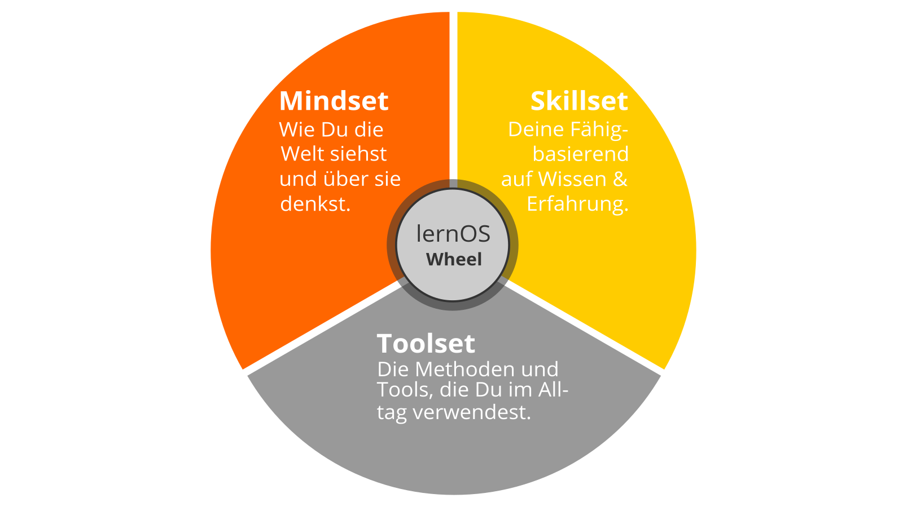
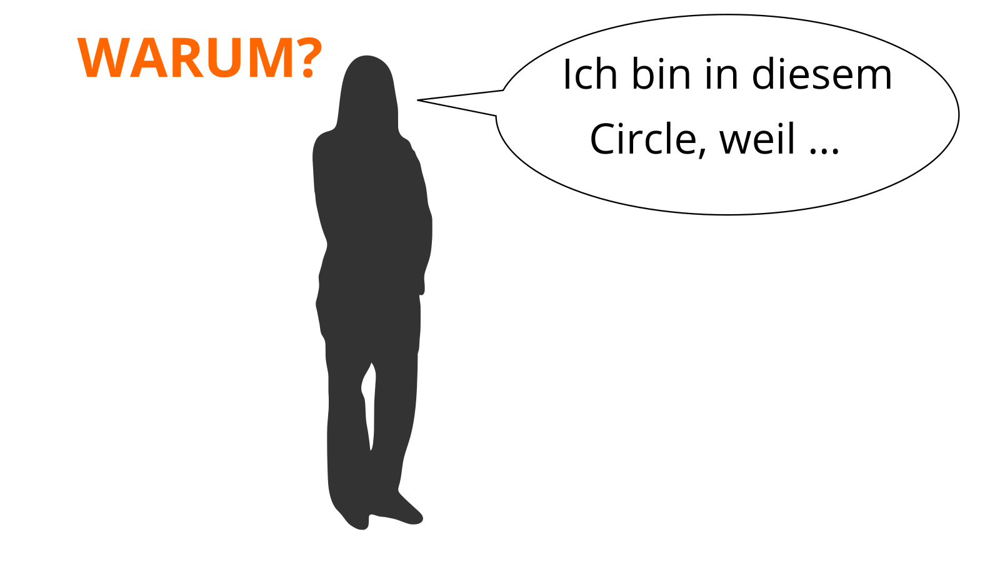
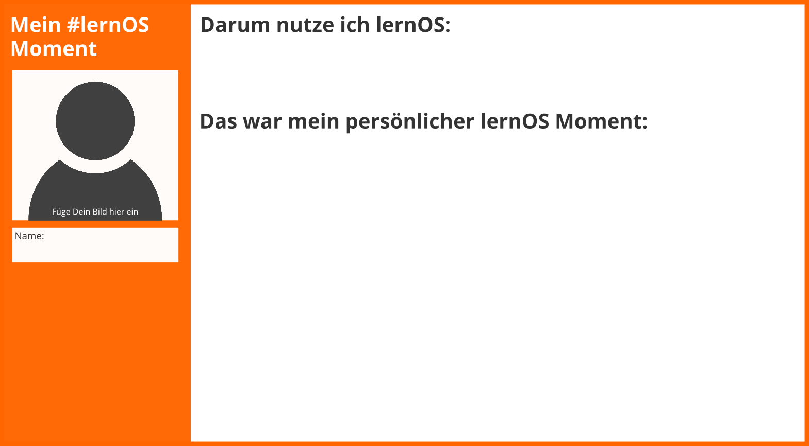
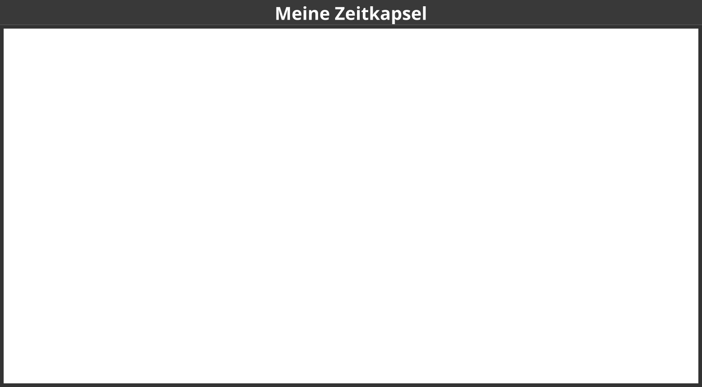

Vorwort
=======

lernOS ist eine Methode zur Selbstorganisation für Menschen, die im 21.
Jahrhundert leben und arbeiten. Um heute erfolgreich zu sein, muss man
ständig lernen, sich organisieren und weiterentwickeln. Niemand
sonst ist für diesen Prozess verantwortlich. Man muss sich selber darum
kümmern (selbstgesteuertes, lebenslanges Lernen).

Wenn Du Dich entscheidest mit lernOS zu beginnen, schlage ich vor, dass
Du 3-4 andere Personen findest und einen sog.
lernOS Circle als Peer-Support-Gruppe gründest. Lasst Euch dann von diesem Leitfaden durch eine
13-wöchigen Lernreise leiten, die lernOS Sprint genannt wird. Macht danach eine
Retrospektive und entscheidet, ob Ihr einen weiteren Durchlauf
machen wollt. Das kann mit den gleichen Leuten
oder mit anderen sein.

Wenn Du Unterstützung beim Finden von Mitstreitern benötigst, kannst
Du bei Freunden und im eigenen Netzwerk fragen oder die kostenlose
[Circlefinder App](https://circlefinder.app) verwenden. Wenn Du weitere Fragen
hast, werde Mitglied in der [lernOS Nutzer Gruppe](https://t.me/lernOS)
auf Telegram oder schreibe mit dem [Hashtag \#lernOS auf
Twitter](https://twitter.com/search?q=%23lernOS).

Die Meisterschaft in lernOS ist eine Frage von Monaten oder Jahren, nicht
von Stunden oder Tage. Also: Keep Calm & Learn On!

\@simondueckert

Warum lernOS?
=============

Wir stehen vor enormen Herausforderungen, die durch Globalisierung,
Digitalisierung sowie schnelle technologische und wissenschaftliche
Entwicklung angetrieben werden. Gleichzeitig bieten uns diese
Veränderungen viele neue Entwicklungsmöglichkeiten. Die Zukunft ist
ungewiss und wir können Sie nicht vorhersagen. Wir müssen also offen
und bereit dafür sein (Quelle: [Learning Framework
2030](https://www.oecd.org/education/2030)).

Um durch die sogenannte
[VUCA](https://en.wikipedia.org/wiki/Volatility,_uncertainty,_complexity_and_ambiguity)
-Welt des 21. Jahrhunderts voller Volatilität, Unsicherheit, Komplexität
und Mehrdeutigkeit zu navigieren, müssen sich Teenager, Studenten, Fachleute, Manager und
Führungskräfte ständig weiterentwickeln. Jeder muss Fähigkeiten
wie Kreativität, kritisches Denken, Kommunikation und Kollaboration
erlernen. Digital Literacy ist die Kompetenz, mit Hilfe digitaler Tools lesen und schreiben, sowie an gemeinsamten Aktivitäten teilhaben zu können.
Sie wichtig, um digitale Werkzeuge produktiv einsetzen zu können. Die Motivation für die
persönliche Entwicklung sollte dabei mehr sein, als einen gut bezahlten Job zu bekommen
oder Profit zu machen. Jeder sollte sich um das eigene Wohlergehen, aber auch das Wohl
seiner Freunde und Familie, seiner Communities und der Gesellschaft
kümmern. Wir müssen lernen, welches Wissen, Fähigkeiten, Denkweisen,
Einstellungen, Werte, Methoden und Werkzeuge wir brauchen, um gemeinsam
eine bessere Zukunft zu gestalten.

lernOS kann Dir helfen, Dich fit für das 21. Jahrhundert zu machen.
lernOS ist ein "Betriebssystem" für Lebenslanges Lernen und Lernende Organisationen.
Der Satz "Mi lernos" bedeutet "Ich werde lernen" in Esperanto.
lernOS hilft Dir, Deine Aktivitäten
zu organisieren und bewusst aus jeder Aktion zu lernen. Es fördert außerdem die
Vernetzung mit anderen Menschen, damit Du nicht jedes Rad neu
erfinden und jeden Fehler wiederholen musst.

Und das Beste ist: lernOS ist frei, offen und leicht zu verstehen. Da Inhalte und Arbeitshilfen unter derDu
offenen Creative Commons Attribution 4.0 Lizenz (CC BY) stehen, kannst Du Dir alle Materialien
herunterladen, sie verwenden und gemäß Deinen Wünsche anpassen. Starte heute damit!

lernOS Wheel: Neues Mindset, Skillset und Toolset
=================================================

Die Beherrschung der VUCA-Welt des 21. Jahrhunderts erfordert Offenheit
für Veränderungen und neue Ansätze. Es gibt eine Menge von Werkzeugen
und Methoden. Aber wenn Du nicht offen bist, sie auszuprobieren, zu
experimentieren und zu scheitern, wird der Erfolg ausbleiben. Wie die
Leute mit den "quadratischen Rädern" im Bild unten sind wir oft zu
beschäftigt, um die neuen Chancen zu sehen.

Bei der Anwendung neuer Handlungsweisen im Privatleben, in der Schule oder in der
Arbeit geht es nicht nur um die Verwendung digitaler Tools.
Um von "quadratischen Rädern" auf "runde Räder" umzusteigen, musst Du
auch Deine Einstellung, Deine Werte und Deine Fähigkeiten
in die Überlegungen einbeziehen. lernOS nennt diese drei Dimensionen Mindset,
Skillset und Toolset. Sich nur auf einige Dimensionen zu konzentrieren,
kann schon helfen. Doch für die besten Ergebnisse sollten alle drei Dimensionen im
persönlichen Entwicklungsprozess berücksichtigt werden.

Mindset: Deine Weltanschauung
-------------------------------

Das Mindset kann als die Einstellung und die Werte beschrieben werden,
die zu Handlungen und sichtbaren Ergebnissen führen. Diese Werte
entwickeln sich im Laufe der Zeit und bilden die Kultur von
Organisationen und der Gesellschaft. Wenn wir in der Welt handeln,
bekommen wir Feedback und lernen daraus. Im Laufe der Zeit erzeugen wir
mentale Modelle der Welt und Werte, die unser zukünftiges Handeln
leiten ([Boisot,
2004](https://www.rrojasdatabank.info/thermo/20388.pdf)). Für den Erfolg in der
VUCA-Welt sind diese fünf Werte besonders wichtig (Buhse 2014 & Petry, 2014):

1.  **Vernetzung** vor Isolation
1.  **Vertrauen** vor Misstrauen
1.  **Offenheit** vor Silos
1.  **Partizipation** vor Ausgrenzung
1.  **Agilität** vor Stabilität

Es gibt keine Reihenfolge in den oben genannten Werten, aber für einige ist die
[Offenheit](https://en.wikipedia.org/wiki/Openness) der zentrale Wert
für das Mindset des 21. Jahrhunderts. Damit ist die Offenheit für
neue Erfahrungen, Wissen und Ideen, aber auch das offene Teilen von Wissen, Ideen und
Inhalten gemeint (s.a. [Definition von
Offen](https://opendefinition.org)). Du solltest im Lauf der Zeit
ein "Open First Mindset" entwickeln, wie im [Open
First Manifest](http://innovationsbeirat.de/open-first) beschrieben:

**\#ProTip:** Dein Mindset ist nicht in den sprichwörtlichen Stein gemeiselt, es kann mit der Zeit
verändern. Schaue Dir das Video [Developing a
Growth Mindset](https://www.youtube.com/watch?v=hiiEeMN7vbQ) von Carol Dweck an,
um mehr darüber zu erfahren.

Skillset: Deine Fähigkeiten
---------------------------

Seit den 1980er Jahren sind Fähigkeiten wie das Lösen von
Problemen und der Austausch mit anderen für den eigenen Erfolg am wichtigsten. Dazu gehören insbesondere
Fähigkeiten, die in Zukunft nicht einfach durch Automatisierung und
künstliche Intelligenz ersetzt werden können. Um fit für das 21.
Jahrhundert zu werden, solltest Du folgende fünf Fähigkeitsbereiche trainieren
([Framework for 21st Century Learning](http://www.p21.org/our-work/p21-framework), [DigiComp 2.1 Framework](https://ec.europa.eu/jrc/en/publication/eur-scientific-and-technical-research-reports/digcomp-21-digital-competence-framework-citizens-eight-proficiency-levels-and-examples-use)):

| Fähigkeitsbereich | Fähigkeit |
|---------------|-------|
| **Kreativität & Innovation** | Kreativ denken |
| | Kreativ mit anderen arbeiten |
| | Innovationen umsetzen |
| **Kritisches Denken & Problemlösen** | Ermittlung von Bedürfnissen und technologischen Möglichkeiten |
| | Dingen effektiv auf den Grund gehen |
| | Urteile und Entscheidungen treffen |
| | Technische und nicht-technische Probleme lösen |
| | Kreativ Technologien zur Lösung von Problemen einsetzen |
| **Kommunikation** | Gedanken und Ideen klar und effektiv artikulieren |
| | Effektiv zuhören und Bedeutung erkennen |
| | Kommunikation nutzen, um zu informieren, zu unterrichten, zu motivieren und zu überzeugen |
| | Vielfältige Medien und Technologien nutzen |
| | Effektiv in verschiedenen Umgebungen kommunizieren |
| **Kollaboration** | Effektiv und respektvoll in gemischten Teams arbeiten |
| | Flexibilität und Bereitschaft zeigen sowie bei notwendigen Kompromissen unterstützen, um ein gemeinsames Ziel zu erreichen |
| | Verantwortung für die gemeinsame Arbeit übernehmen und einzelne Beiträge wertschätzen |
| | Mit digitalen Medien interagieren, sich beteiligen, austauschen und zusammenarbeiten |
| | Digitale Identität verwalten |
| **Digital Literacy** | Surfen, suchen, Daten, Informationen und digitale Inhalte filtern |
| | Auswertung und Verwaltung von Daten, Informationen und digitalen Inhalten |
| | Schutz digitaler Geräte und personenbezogener Daten |
| | Entwicklung, Integration und Überarbeitung digitaler Inhalte |
| | Umgang mit Urheberrechten und Lizenzen |
| | Programmieren, Scripten und Kodieren |

**\#ProTip:** das Mozilla [Web Literacy
Framework](https://learning.mozilla.org/en-US/web-literacy) bietet
Übungen zu Digital Literacy und Fähigkeiten des 21. Jahrhunderts.

Toolset: Digitale Tools, die Du verwendest
------------------------------------------

Das [Web 2.0](https://www.oreilly.com/pub/a/web2/archive/what-is-web-20.html) und
die sozialen Medien gibt es seit 2005. Nicht jeder muss alle digitalen Tools
kennen, aber man sollte einen Überblick haben, die Prinzipien kennen und
die richtigen Tools für sich auswählen. Das Conversation
Prism gibt einen guten Überblick über heute verfügbare
Web 2.0 Plattformen:

Für Einsteiger können 28 Kategorien und Dutzende von Tools
überwältigend sein. Die folgende Liste gibt daher einen Überblick über
die für lernOS wichtigsten Tools:

1.  **Office- & Produktivität**, z.B. Dropbox, Evernote,
    FreeMind, G Suite, MindManager, Office 365, OneNote, SharePoint,
    Trello, XMind
1.  **Chat & Messenger**, z.B. Google Hangouts Chat, Mattermost,
    Microsoft Teams, Rocketchat, Slack, Telegram, Threema, WeChat,
    WhatsApp
1.  **Soziale Netwerke**, z.B. IBM Connections, Jive, LinkedIn,
    Mastodon, Twitter, Workplace by Facebook, Xing, Yammer
1.  **Videokonferenz**, z.B. Google Hangouts Meet,
    GoToMeeting, Microsoft Teams, Skype, Skype for Business, WebEx,
    Zoom
1.  **Weblogs & Wikis**, z.B. Confluence, DokuWiki, LinkedIn (Artikel), MediaWiki,
    Medium, Tumblr, Wikipedia, WordPress

**\#ProTip:** Das [lernOS
Wiki](https://github.com/simondueckert/lernOS/wiki) enthält eine Linkliste
zu allen genannten Tools. In Zukunft wird es dort auch Tutorials zur Nutzung der Tools.

lernOS Circle: Die Macht von "Peer Support"
===========================================

Du hast jetzt über das richtige Mindset, Skillset und Toolset für
das 21. Jahrhundert gelesen. Jetzt ist es an der Zeit, in die Praxis zu gehen. Du
solltest nicht alleine üben, sondern in einer Gruppe von 4-5
Personen, die lernOS Circle genannt wird. Ein Circle ist eine [Peer
Support](https://en.wikipedia.org/wiki/Peer_support) Gruppe, in der sich
die Mitglieder gegenseitig mit Feedback, Erfahrung, Wissen und Reflexion
helfen. Der lernOS Circle ist ein "Kreis des Vertrauens": was im Circle
passiert, bleibt im Circle! Die Circle-Mitglieder treffen sich wöchentlich
und folgen dabei einem vorgegebenen Ablauf, der den Lern-und
Entwicklungsprozess strukturiert.

Das lernOS Weekly ist ein Treffen, um Ergebnisse zu verfolgen, Übungen zu
machen (sog. Katas) und sich gegenseitig für die anstehenden Aktionen zu
motivieren. Im Circle definiert jedes Mitglied persönliche Ziele und
gewünschte Ergebnisse. Circle-Mitglider lernen zu teilen, sich zu
vernetzen sowie Vertrauen und Beziehungen aufzubauen.

lernOS Sprint: Eine 13-wöchige Selbstlernreise
==============================================

lernOS wird in Zeiträumen von 13 Wochen, die lernOS Sprint genannt werden, praktiziert.
Normalerweise laufen die Sprints jeweils in einem Quartal des Jahres.
Dieser Rhythmus kann bei Bedarf aber auch angepasst werden. Die Woche 0 wird
für die Planung des Sprints genutzt. Ab Woche 1-12 findet das
Weekly statt.

Das passiert in einem lernOS Sprint:

* **Woche 0: die Sprint Planung. Versteht jeder den Vorgang? Wann
wird das wöchentliche Treffen stattfinden? Wird das Weekly
als persönliches Treffen oder virtuell stattfinden? Welche Tools
werden für die Kommunikation und Dokumentation verwendet? Ist jeder
in der Lage, die Tools zu verwenden? Welche Übungen werden für
die Wochen 1-12 ausgewählt?
* **Wochen 1-12:  die Circle-Mitglieder treffen sich wöchentlich im Weekly und
arbeiten im Sprint an Ihren Zielen und gewünschten Ergebnissen. Sie
bauen ein Netzwerk auf, das sie bei der Erreichung ihrer Ziele
unterstützt. Die beiden Boxenstopps in Woche 4 und Woche 8 helfen,
zu sehen, ob noch alle auf der Strecke sind.

lernOS Weekly: Auf Kurs bleiben und sich kontinuierlich weiterbilden
====================================================================

Einmal pro Woche trifft sich der lernOS Circle. Jedes Treffen folgt
einem vorgegebenen Ablauf (siehe Anhang) mit einem Check-in, einem Check-out und
Übungen (Katas siehe Anhang). Der Zeitraum für
das Weekly kann an die Bedürfnisse der Circle-Mitglieder angepasst
werden, vorgeschlagene Zeitraum ist Freitag zwischen 11-12 Uhr:

* **15 Minuten Weekly:** nur Check-in und Check-out, um
den Fortschritt zu verfolgen (OKR-Style)
* **30-60 Minuten Weeekly:** wie das 15-minütige
Weekly und zusätzlich Übungen aus dem lernOS Kata Katalog, um neue
Fähigkeiten zu erlernen (WOL-Style)

**\#ProTip:** Kata ist anderes Wort für Übung. Es kommt
aus dem Bereich des Erlernens von Programmier-Fähigkeiten im Peer-Learning-Format.
Lies mehr über dieses Format unter
[codekata.com](http://codekata.com).

Das Weekly kann als persönliches Treffen (face-2-face) oder virtuell
stattfinden. Der Circle muss Tools für die Kommunikation und Dokumentation
zwischen den wöchentlichen Treffen definieren. Die folgende Tabelle
schlägt in der Praxis erprobte Werkzeuge vor:

| Tool A-Z | Kommunikation | Dokumentation |
|----------|---------------|---------------|
| Enterprise Social Network (ESN), z.b. IBM Connections, Jive, Yammer | **X** | **X** |
| appear.in | X | |
| E-mail | X | |
| Evernote | X | |
| Facebook Group | **X** | **X** |
| Facebook Messenger | X | |
| Google doc |  | X |
| Google Hangout | X | |
| Gotomeeting | X | |
| Jitsi | X | |
| Microsoft Teams | **X** | **X** |
| Skype | X | |
| Slack | X | |
| Telegramm | X | |
| Threema | X | |
| Webex | X | |
| WeChat | X | |
| Whatsapp | X | |
| Zoom | X | |

**\#ProTip:** Wählt für möglichst einfache Benutzbarkeit ein Tool, das
Kommunikation und Dokumentation gleichzeitig unterstützt, z.B. eine [Facebook
Gruppe](https://www.facebook.com/help/1629740080681586) oder [Microsoft
Teams](https://products.office.com/en-us/microsoft-teams/group-chat-software).
In einer Facebook-Gruppe könnt Ihr den Aktivitätsstrom für
die Kommunikation und
[Gruppen-Dokumente](https://www.facebook.com/help/203003559734725) zur
Dokumentation nutzen. In Microsoft Teams könnt Ihr den Kanal "Allgemein" für
Kommunikation und Wiki-Seiten oder ein OneNote-Notizbuch zur
Dokumentation nutzen.

lernOS Canvas: Strukturiere Dein Denken visuell
===============================================

Ein Canvas ist eine visuelle Struktur, die für die strukturierte Bearbeitung
mehrere Bereiche parallel verwendet werden kann. Auf diese Weise verwendet
man einen Canvas als visuelle Checkliste. Er kann aber auch verwendet
werden, um eine komplexe Geschichte zu erzählen. Die Idee kam ursprünglich von Alex
Osterwalder, der den [Business Model
Canvas](https://en.wikipedia.org/wiki/Business_Model_Canvas) entwickelt hat. Der
lernOS Canvas verwendet die gleiche Grundstruktur wie der
Business Model Canvas. Doch die Benennungen der Bereiche wurden geändert, um
die Arbeitsthemen des Circles abzudecken.

**\#ProTip:** Der lernOS Canvas kann von der [lernOS
Webseite](https://lernOS.org) in verschiedenen Formaten heruntergeladen
(z.B. PowerPoint, PDF, PNG) werden. Um mit dem Canvas flexibel arbeiten zu können,
solltest Du nie darauf schreiben. Aus diesem Grund wurden
Haftnotizen (z.B. Post-it) erfunden!

Der obere Teil des Canvas enthält
Motivations- oder Mission Statement (wenn Du eines hast) und Nummer oder Datum des Sprints. Im
Bereich "Meine Ziele & Schlüsselergebnisse" werden die Ziele für den
aktuellen Sprint dokumentiert. Die Bereiche "Meine Rollen", "Meine
Aktivitäten", "Meine Projekte" und "Mein Wissen & Meine Fähigkeiten" können
genutzt werden, um mögliche Ziele zu identifizieren. Die Bereiche "Meine
Beziehungen" und "Meine Sozialen Netzwerke" werden zur Identifikation von Personen verwendet,
die bei der Zielerreichung
unterstützen können. Vorhandene Ressourcen (z.B. Dokumente, Checklisten, Videos
etc.) werden in "Meine WissensWerte" aufgeführt. Die bei "Meine
Ablageorte" aufgeführten Ablagen werden genutzt, um wertvolle Ressourcen
großzügig mit dem Netzwerk zu teilen.

**\#ProTip:** Alle Übungen, die im Canvas dokumentiert
werden können, sind mit "lernOS Canvas: ..." in der Übungsbeschreibung
markiert.

**\#ProTip:** Wenn Du das lernOS OneNote Circle Template verwendest,
kannst Du ein aktuelles Foto von Deinem Canvas machen und
einfügen, damit die anderen Circle-Mitglieder es sehen und Feedback
geben können.

Stop talking, start doing!
==========================

Wenn Du diesen Leitfaden gelesen hast, lernOS aber noch nicht aktiv umsetzt,
solltest Du jetzt damit beginnen! Mit lernOS zu starten ist wirklich einfach.
Diese fünf Schritte werden Dir beim reibungslosen Start helfen:

1.  **Zeit einplanen:** definiere das Quartal, in dem Du mit lernOS
starten möchtest. Trage Dir die Zeiten für das
Weekly in den Kalender ein. Dieser regelmäßige Termin ist
besonders wichtig, wenn Du lernOS in einem Circle
praktizierst.
1.  **Ziele und Schlüsselergebnisse definieren:** nutze Woche
0, um Deine Ziele und messbare Ergebnisse für den Sprint
festzulegen. Wähle ein Ziel, das Dir wirklich, wirklich am Herzen liegt.
1.  **Einen Circle gründen:** suche nach 3-4 Mitstreitern, die im selben
Quartal einen Sprint starten wollen. Wenn jemand schon in einem anderen Circle
war, kann er die Rolle des Circle-Moderator übernehmen.
1.  **Organisiere das Weekly:** wenn Ihr Euch im Circle nicht kennt,
trefft Euch in Woche 0 am besten persönlich. Nutzt
soziale Netzwerke oder Messenger, um zwischen den Treffen zu
kommunizieren. Nutzt Videokonferenzen, um virtuelle
Treffen zu organisieren.
1.  **Plan, Do, Learn, Repeat:** Nutzt das letzte
Weekly in der Woche 12, um die Ergebnisse und die
Zusammenarbeit im Kreis zu reflektieren. Entscheidet, ob Ihr
einen weiteren Sprint gemeinsam durchlaufen wollt.

Keep Calm & Learn On! :-)

Anhang
======

lernOS Weekly Agenda
---------------------------

### Woche 0: Get Together & Sprint Planung

Wenn Ihr Euch im Circle noch nicht kennt, lernt Euch in der Woche 0 kennen.
Plant, wann Ihr Euch trefft, welche Tools Ihr
nutzt und wer der Moderator ist.

* **Check-in:** Herzlich willkommen! *(5 Minuten)*
* **Get together:** Wer bist du? Stell Dich vor. Fünf-Minuten-Timebox
pro Circle-Mitglied. *(25 Minuten)*
* **Sprint Planung** siehe unten *(25 Minuten)*
* **Check-out:** Das nächste Treffen bestätigen. *(5 Minuten)*

Definiert einen Circle-Moderator, der sich um Event- und
Zeitmanagement kümmert. Eines der größten
Hindernisse für erfolgreiche Circle ist Disziplin und Zeitmanagement. Der Moderator ist nicht der "Chef" des
Circle, sondern ein normales Circle-Mitglied, das sich um einen
reibungslosen Ablauf kümmert. Definiert Tag und Uhrzeit
des wöchentlichen Treffens. Definiert, ob Ihr Euch
persönlich oder virtuell trefft. Definiert die Tools, die Ihr
für Kommunikation und Dokumentation im Circle verwendt. Entscheidet,
welche der vorgeschlagenen Übungen Ihr im Kreis
machen wollt. Entscheidet auch, ob Ihr den lernOS Canvas
(siehe Kapitel lernOS Canvas) als unterstützendes Werkzeug verwenden möchtet.

* **Circle-Moderator:** ...
* **Tag und Uhrzeit des Weekly:** ...
* **Wöchentliche Treffen sind:** persönlich / virtuell
* **Verwendete Tools (können alle sie nutzen?):** ...
* **Übungen (Katas), die wir verwenden wollen:** alle (WOL-Style) / einige
(Mixed-Modus) / keine (OKR-Style)
* **Benutzen wir den Canvas:** Ja / Nein

**\#ProTip:** in vielen Fällem ist die Zeit für das Ausführen der
Übungen im Weekly zu kurz. Verwendet daher die Methode [Flipped
Classroom](https://en.wikipedia.org/wiki/Flipped_classroom): jedes
Circle-Mitglied bereitet die Übungen als "Hausaufgabe" vor,
so dass Ihr im Weekly mehr Zeit habt, die Ergebnisse zu besprechen.

### Woche 1: Deine Sprint Ziele

In dieser Woche wählst Du Deine Ziele für den Sprint. Die Ziele
können bis zur Woche 4 verfeinert werden, aber nicht später. Du
wirst zusätzlich Personen identifizieren, die Dich bei Deinen
Zielen unterstützen können (Alleine arbeiten ist Addition, gemeinsam arbeiten ist Multiplikation!).

* **Check-in:** Was habe ich seit dem letzten Check-in getan? Was hat sich bei
den Schlüsselergebnissen getan? Was hält mich auf? Zwei-Minuten-Timebox
pro Circle-Mitglied. *(10 Minuten)*
* **Kata 1:** Warum bin ich hier? *(10 Minuten)*
* **Kata 2:** Meine Ziele für die nächsten 12 Wochen *(25 Minuten)*
* **Kata 3:** Menschen, die mit meinen Zielen zu tun haben *(20 Minuten)*
* **Check-out:** Was werde ich bis zum nächsten Weekly tun? Eine-Minute-Timebox
pro Circle-Mitglied. *(5 Minuten)*

### Woche 2: Sharing is Caring

In dieser Woche wirst Du über Anzahl und Qualität der
Beziehungen nachdenken, die mit Deinen Zielen zusammenhängen. Du wirst
auch anfangen, Aufmerksamkeit, Wissen, Erfahrungen und Wertvolles
mit Deinem Netzwerk zu teilen, um Vertrauen aufzubauen und Unterstützung
zu erhalten.

* **Check-in:** Was habe ich seit dem letzten Check-in getan? Was hat sich bei
den Schlüsselergebnissen getan? Was hält mich auf? Zwei-Minuten-Timebox
pro Circle-Mitglied. *(10 Minuten)*
* **Kata 4:** Starke oder schwache Bindungen? *(5 Minuten)*
* **Kata 5:** Deine erste Erfahrung des Teilens *(40 Minuten)*
* **Check-out:** Was werde ich bis zum nächsten Weekly tun? Eine-Minute-Timebox
pro Circle-Mitglied. *(5 Minuten)*

### Woche 3: Nutze den Netzwerkeffekt

In dieser Woche wirst Du sicherstellen, dass Du genügend Zeit zum
Vernetzen, Teilen und Pflegen Deines Netzwerks hast. Du wirst dazu
Termine mit Dir selbst vereinbaren. Außerdem wirst Du auch darüber
nachdenken, wie Du das Netz nutzen kannst, um mehr Menschen
zu erreichen.

* **Check-in:** Was habe ich seit dem letzten Check-in getan? Was hat sich bei
den Schlüsselergebnissen getan? Was hält mich auf? Zwei-Minuten-Timebox
pro Circle-Mitglied. *(10 Minuten)*
* **Kata 6:** Ein Termin mit Dir selbst *(15 Minuten)*
* **Kata 7:** Das Netz zur Skalierung nutzen *(15 Minuten)*
* **Kata 8:** Soziale Wertschätzung üben *(15 Minuten)*
* **Check-out:** Was werde ich bis zum nächsten Weekly tun? Eine-Minute-Timebox
pro Circle-Mitglied. *(5 Minuten)*

### Woche 4: Boxenstopp 1

In dieser Woche sollten Deine Ziele stabil sein. Außerdem solltest Du eine
klare Vorstellung davon haben, welche Leute im Netzwerk Dir helfen können,
die Ziele zu erreichen. Nehmt Euch diese Woche Zeit für einen kurzen "Boxenstopp" und überlegt,
ob der Circle für Euch gut funktioniert. In den nächsten vier Wochen wirst Du Dich darauf
konzentrieren, an der ersten Version Deiner Schlüsselergebnisse zu
arbeiten.

* **Check-in:** Was habe ich seit dem letzten Check-in getan? Was hat sich bei
den Schlüsselergebnissen getan? Was hält mich auf? Zwei-Minuten-Timebox
pro Circle-Mitglied. *(10 Minuten)*
* **Kata 9:** Der Ton in der Online-Kommunikation *(15
Minuten)*
* **Kata 10:** Eine nützliche Ressource teilen *(30 Minuten)*
* **Check-out:** Was werde ich bis zum nächsten Weekly tun? Eine-Minute-Timebox
pro Circle-Mitglied. *(5 Minuten)*

### Woche 5: Wer bin ich?

In dieser Woche hat die Arbeit an der ersten Version Deiner
Schlüsselergebnisse begonnen. Dein Ziel ist es, einen funktionsfähiges und vorzeigbares Ergebnis (auch [Minimum
Viable Product](https://en.wikipedia.org/wiki/Minimum_viable_product) genannt) bis zum Ende der Woche 8 erstellt zu haben.
Außerdem wirst Du persönlichen Informationen und Fakten sammeln, die für Dein Netzwerk relevant sein könnten.

* **Check-in:** Was habe ich seit dem letzten Check-in getan? Was hat sich bei
den Schlüsselergebnissen getan? Was hält mich auf? Zwei-Minuten-Timebox
pro Circle-Mitglied. *(10 Minuten)*
* **Kata 11:** 25 Fakten über mich *(25 Minuten)*
* **Kata 12:** Bringe Dein ICH ein *(20 Minuten)*
* **Check-out:** Was werde ich bis zum nächsten Weekly tun? Eine-Minute-Timebox
pro Circle-Mitglied. *(5 Minuten)*

### Woche 6: Aktualisiere Deinen digitalen Zwilling

In dieser Woche wirst Du Dich selbst im Netz suchen.
Wenn Deine "digitalen Zwillinge" wie z.B. Webseiten, Blogs oder Profile nicht mit
den Fakten aus der letzten Woche übereinstimmen, wirst Du Sie
aktualisieren.

* **Check-in:** Was habe ich seit dem letzten Check-in getan? Was hat sich bei
den Schlüsselergebnissen getan? Was hält mich auf? Zwei-Minuten-Timebox
pro Circle-Mitglied. *(10 Minuten)*
* **Kata 13:** Google Dich selbst! *(10 Minuten)*
* **Kata 14:** Aktualisiere Deinen digitalen Zwilling *(20 Minuten)*
* **Kata 15:** Beim Vernetzen Zeit nehmen *(15 Minuten)*
* **Check-out:** Was werde ich bis zum nächsten Weekly tun? Eine-Minute-Timebox
pro Circle-Mitglied. *(5 Minuten)*

### Woche 7: Veröffentliche Deine Vision

In dieser Woche wirst Du die erste Version Deiner
Schlüsselergebnisse fertigstellen. Du wirst außerdem
Deine eigene Zukunft vorhersehen, indem Du einen Brief an Dein zukünftiges
Ich schreibst. Und wirst Deinem Netzwerk dabei helfen, Dich zu
unterstützen, indem Du Vision und Ziele auf Deinen
Online-Profilen sichtbar machst.

* **Check-in:** Was habe ich seit dem letzten Check-in getan? Was hat sich bei
den Schlüsselergebnissen getan? Was hält mich auf? Zwei-Minuten-Timebox
pro Circle-Mitglied. *(10 Minuten)*
* **Kata 16:** Ein Brief an mein zukünftiges Ich *(35 Minuten)*
* **Kata 17:** Meine Ziele teilen *(10 Minuten)*
* **Check-out:** Was werde ich bis zum nächsten Weekly tun? Eine-Minute-Timebox
pro Circle-Mitglied. *(5 Minuten)*

### Woche 8: Boxenstopp 2

In dieser Woche sollte die erste Version der Schlüsselergebnisse
vorliegen. Rede darüber und zeige Sie im Check-in. Wenn Du
es nicht geschafft hast, mit der Arbeit an den
Schlüsselergebnissen zu beginnen, wirst Du etwas über Prokrastination (Aufschieberitis)
und mögliche Gegenmaßnahmen erfahren.

* **Check-in:** Was habe ich seit dem letzten Check-in getan? Was hat sich bei
den Schlüsselergebnissen getan? Was hält mich auf? Zwei-Minuten-Timebox
pro Circle-Mitglied. *(10 Minuten)*
* **Kata 18:** Stoppe die Prokrastination! *(20 Minuten)*
* **Kata 19:** Erstelle Dein eigenes Burn-Down-Chart *(10 Minuten)*
* **Kata 20:** Anderen beim Vernetzen helfen *(15 Minuten)*
* **Check-out:** Was werde ich bis zum nächsten Weekly tun? Eine-Minute-Timebox
pro Circle-Mitglied. *(5 Minuten)*

### Woche 9: Deine WissensWerte

In dieser Woche wirst Du mit der Arbeit an der zweiten Version Deiner
Schlüsselergebnisse beginnen. Darüber hinaus reflektierst Du Deine
Top 10 Ressourcen, die Du in Deinem Netzwerk teilen kannst.

* **Check-in:** Was habe ich seit dem letzten Check-in getan? Was hat sich bei
den Schlüsselergebnissen getan? Was hält mich auf? Zwei-Minuten-Timebox
pro Circle-Mitglied. *(10 Minuten)*
* **Kata 21:** Meine Top 10 WissensWerte *(30 Minuten)*
* **Kata 22:** Meine Universität beim Abendessen *(15 Minuten)*
* **Check-out:** Was werde ich bis zum nächsten Weekly tun? Eine-Minute-Timebox
pro Circle-Mitglied. *(5 Minuten)*

### Woche 10: Zeit für Networking & Sharing

In dieser Woche wirst Du eine Checkliste möglicher Ressourcen verwenden, um weitere
WissensWerte zu identifizieren, die Du mit Deinem Netzwerk teilen kannst.
Du wirst Dir zusätzlich ein eigenes Zeitmanagement-System einrichten, das
Dir genügend Zeit für Networking und Sharing einplant. Und Du wirst
lernen, dass zuhören manchmal wichtiger ist, als reden.

* **Check-in:** Was habe ich seit dem letzten Check-in getan? Was hat sich bei
den Schlüsselergebnissen getan? Was hält mich auf? Zwei-Minuten-Timebox
pro Circle-Mitglied. *(10 Minuten)*
* **Kata 23:** Was kann ich beitragen? *(20 Minuten)*
* **Kata 24:** Meine Zeit für Networking & Sharing *(10 Minuten)*
* **Kata 25:** Probiere eine verrückte Methode: Fragen! *(15 Minuten)*
* **Check-out:** Was werde ich bis zum nächsten Weekly tun? Eine-Minute-Timebox
pro Circle-Mitglied. *(5 Minuten)*

### Woche 11: Die Stärke von Communities

In dieser Woche wirst Du Gruppen und Communities suchen, die mit Deinen
Zielen in Zusammenhang stehen. Du wirst lernen, die "DNA" von
Communities zu entschlüsseln. Du wirst außerdem darüber nachdenken,
eine eigene Community zu gründen, die Deine Ziele zu unterstützt.

* **Check-in:** Was habe ich seit dem letzten Check-in getan? Was hat sich bei
den Schlüsselergebnissen getan? Was hält mich auf? Zwei-Minuten-Timebox
pro Circle-Mitglied. *(10 Minuten)*
* **Kata 26:** Finde Communities, die mit Deinen Zielen in Verbindung stehen *(15 Minuten)*
* **Kata 27:** Wer sind die "first & second dancer"? *(15 Minuten)*
* **Kata 28:** Willst Du eine eigene Community gründen? *(15 Minuten)*
* **Check-out:** Was werde ich bis zum nächsten Weekly tun? Eine-Minute-Timebox
pro Circle-Mitglied. *(5 Minuten)*

### Woche 12: Reflektiert und feiert

In dieser Woche sollte die fertige Version Deiner
Schlüsselergebnisse vorliegen. Rede darüber im Check-in und zeige sie.
Ihr werdet außerdem über Eure Erfahrungen im Circle und dessen Fortführung sprechen.
Nach dem Weekly solltet Ihr Euch etwas Zeit nehmen, um den erfolgreichen Abschluss zu feiern!

* **Check-in:** Was habe ich seit dem letzten Check-in getan? Was hat sich bei
den Schlüsselergebnissen getan? Was hält mich auf? Zwei-Minuten-Timebox
pro Circle-Mitglied. *(10 Minuten)*
* **Kata 29:** Dein lernOS Moment *(15 Minuten)*
* **Kata 30:** Erstelle Deine Zeitkapsel *(15 Minuten)*
* **Kata 31:** Wiederholung ist der Schlüssel zur Meisterschaft *(15 Minuten)*
* **Check-out:** Party Time! *(5 Minuten)*

lernOS Kata Katalog: Übungen zum selbstgesteuerten Lernen
---------------------------------------------------------

Wie wird man ein großartiger Musiker? Man sollte die Theorie
kennen und die Mechanik des Instruments verstehen. Auch
Talent ist hilfreich. Aber echte Meisterschaft kommt vom Üben, der
Anwendung der Theorie immer wieder. Am Besten mit Feedback nach jeder Übung, um
besser zu werden. lernOS verwendet einen Katalog von Übungen
(Katas), um neue Fähigkeiten zu erlernen. Im Programm des
wöchentlichen Treffens werden einige Katas vorgeschlagen, um von Woche zu Woche
und schrittweise neue Fähigkeiten zu erlernen.

### Kata 1: Warum bin ich hier?

Was ist Deine Motivation, Dich diesem Circle anzuschließen? Zu oft
versuchen wir etwas zu verändern, indem wir neue Methoden und
Werkzeugen einsetzen. Dabei bleibt das "Warum" oft unklar. Simon Sinek erklärt
mit seinem "Golden Circle", dass man mit dem "Warum" beginnen und
erst dann über das "Wie" und das "Was" nachdenken sollte.

**Übung (10 Minuten):**

Vervollständige den Satz: *Ich bin in diesem Circle, weil ...*

Teilt Eure Beweggründe im Circle.

**Weitere Informationen:**

* Video [How Great Leaders Inspire Action](https://www.ted.com/talks/simon_sinek_how_great_leaders_inspire_action)
mit Simon Sinek

### Kata 2: Meine Ziele für die nächsten 12 Wochen

Was willst Du in den nächsten zwölf Wochen erreichen? Wähle ein oder mehrere
Ziele, die Dir wirklich, wirklich am Herzen liegen und die Du
im Sprint erreichen kannst. Es kann helfen, die SMART oder
FAST Kriterien zur Zieleformulierung zu nutzen (siehe unten). Du kannst zusätzlich auch
die OKR-Methode von Google verwenden, um messbare Schlüsselergebnisse zu
definieren (siehe ProTip unten).

**SMART Kriterien** (von George Doran):

* **Specific:** einen speziellen Bereich für Verbesserungsmaßnahmen definieren.
* **Measurable:** Ziel quantifizieren oder zumindest einen Indikator für den Fortschritt vorschlagen.
* **Achievable:** Sicherstellen, dass das Ziel realistisch ist.
* **Relevant:** Durch Ziele motivieren, die bedeutsam sind.
* **Time-bound:** Einen Zeitpunkt für die Erzielung der Ergebnisse angeben.

**FAST Kriterien** (vom Strategic Agility Projekt):

* **Frequently discussed:** Ziele sollten in laufende Diskussionen
eingebettet werden, um den Fortschritt zu überprüfen, Ressourcen
zuzuweisen, Initiativen zu priorisieren und Feedback zu geben.
* **Ambitious:** Ziele sollten ambitioniert, aber nicht unmöglich zu
erreichen sein.
* **Specific:** Ziele werden in konkrete Metriken und Meilensteine
übersetzt, die Klarheit darüber schaffen, wie man das Ziel
erreicht und den Fortschritt misst.
* **Transparent:** Ziele und aktueller Fortschritt sollten öffentlich
gemacht werden, damit alle Beteiligten sie sehen können.

**Übung (25 Minuten):**

Wähle ein Ziel für die nächsten 12 Wochen. Verwende die Fragen
"Ist es mir wirklich, wirklich wichtig?", "Kann ich es in 12 Wochen
erreichen?", und "Kann mein Netzwerk helfen?", um zu testen, ob
das Ziel für den Sprint geeignet ist. Wenn Du Probleme hast, ein gutes
Ziel zu finden, denke an Ziele zu Deine Rollen, Aktivitäten oder
Projekten. Wenn Du dazu beitragen möchstes, die Welt zu einem
besseren Ort zu machen, kannst Du Dir auch ein Ziel wählen aus dem Bereich der [17
Ziele für nachhaltige Entwicklung der Vereinten
Nationen](https://www.un.org/sustainabledevelopment/sustainable-development-goals) wählen.

**\#ProTip:** Verwende die Methode Objective & Key Results
(OKR), um Dein Ziel genauer zu beschreiben. Schreibe unten Dein Ziel auf.
Definiere 2-4 Schlüsselergebnisse pro Ziel, um Dir bei der Fortschrittkontrolle zu helfen.
Du solltest die Schlüsselergebnisse auf einer Skala von 0,0-1,0
messen können. Um sich ehrgeizige Ziele zu setzen, gilt eine Fertigstellungsrate
von 0,7 als Erfolg.

*Ich will (Ziel):* \...

*gemessen an (Schlüsselergebnisse):*

1.  ...
1.  ...
1.  ...
1.  ...

Teile Deine Ziele im Circle (10 Minuten).

**lernOS Canvas:** Ziele im Bereich "Meine Ziele & Schlüsselergebnisse" dokumentieren. Du
kannst weitere Haftnotizen für die Schlüsselergebnisse hinzufügen.

**Weitere Informationen:**

* Wikipedia Artikel [SMART Criteria](https://en.wikipedia.org/wiki/SMART_criteria)
* MIT Sloan Artikel [With Goals, FAST Beats SMART](https://sloanreview.mit.edu/article/with-goals-fast-beats-smart)
* Ted Talk [How We Can Make the World a Better Place by 2030](https://www.youtube.com/watch?v=o08ykAqLOxk)
* Video [How Google Sets Goals: OKRs](https://www.youtube.com/watch?v=mJB83EZtAjc) mit Google
Ventures Partner Rick Klau
* Buch [ Introduction To OKRs](https://www.oreilly.com/business/free/files/introduction-to-okrs.pdf) von Christina Wodtke
* Buch [The Beginner’s Guide To OKR](https://felipecastro.com/resource/The-Beginners-Guide-to-OKR.pdf)
von Felipe Castro

### Kata 3: Menschen, die mit meinen Zielen zu tun haben

Die meisten unserer Aufgaben haben andere schon früher
erledigt. Die meisten unserer Fehler, sind schon in der
Vergangenheit gemacht worden. Du kannst Zugang zu diesem Wissen und
diesen Erfahrungen erhalten, indem Du mit
erfahrenen Menschen in Kontakt trittst.
Starke Beziehungen basieren auf Vertrauen, Teilen und Fürsorge. [Dale
Carnegie](https://en.wikipedia.org/wiki/Dale_Carnegie) sagte: "Sie
können mehr Freunde in zwei Monaten gewinnen, indem Sie sich für andere
Menschen interessen, als wenn Sie zwei Jahre versuchen, andere Menschen
für sich zu interessieren". Wie kommst Du also mit Menschen in
Kontakt, die mit Deinen Zielen in Verbindung stehen und wie kannst Du eine Beziehung
mit ihnen aufbauen?

**Übung (20 Minuten):**

Erstelle eine Liste von mindestens zehn Personen, die mit Deinen
Zielen in Zusammenhang stehen. Wenn Du die Leute nicht namentlich
kennst, kannst Du auch Rollen oder Beschreibungen auf die Liste setzen
(z.b. "Bester WoW-Spieler in der Stadt", "Ein guter Kameramann",
"Besitzer der Firma XY"). Nutze Deine Kontaktlisten oder
soziale Netzwerke, um mehr Personen zu finden:

1.  ...
1.  ...
1.  ...
1.  ...
1.  ...
1.  ...
1.  ...
1.  ...
1.  ...
1. ...

Teile Deine Liste im Circle und helft Euch gegenseitig, sie zu
vervollständigen (10 Minuten).

**lernOS Canvas:** Sammle die mit Deinen Zielen verbundenen Personen,
im Bereich "Meine Beziehungen". Du kannst sie z.B. nach Priorität sortieren.

**Weitere Informationen:**

* Video [Social Networking In Plain English](https://www.youtube.com/watch?v=6a_KF7TYKVc)

### Kata 4: Starke oder schwache Bindungen?

Wie stark ist die Beziehung zu den Menschen, die mit Deinen Zielen
verbunden sind? Die Verbindung zwischen Menschen in einem sozialen
Netzwerk kann durch die zusammen verbrachte Zeit, die
emotionale Intensität, die Nähe, das Vertrauen und
gegenseitige Hilfestellung definiert werden. Es gibt drei Ebenen
von ["interpersonal ties"](https://en.wikipedia.org/wiki/Interpersonal_ties):

1.  **Absent:** Ihr kennt Euch nicht
2.  **Weak:** Ihr seid lose verbunden und habt einige Interaktionen in der Vergangenheit gehabt
3.  **Strong:** Ihr interagiert regelmäßig, trefft Euch und helft Euch gegenseitig

**Übung (5 Minuten):**

Bewerte jede Beziehung in Deiner Beziehungsliste mit 1
(Absent), 2 (Weak) oder 3 (Strong).
Markiere die Beziehungen, die Du in Zukunft vertiefen möchtest.

**lernOS Canvas:** Schreibe die Bewertungen auf die Haftnotizen im
Bereich "Meine Beziehungen".

**Weitere Informationen:**

* Video [Social Networks and Getting a Job](https://www.youtube.com/watch?v=g3bBajcR5fE) mit Mark Granovetter
* Artikel [The Strength Of Weak Ties](http://www.cs.umd.edu/~golbeck/INST633o/granovetterTies.pdf)
von Mark Granovetter

### Kata 5: Deine erste Erfahrung des Teilens

Sharing is caring! In der digitalen Welt wird das Teilen oft als Bereitstellen
von Dateien oder digitalen Inhalten gesehen. Aber es
geht auch viel einfacher: teile Deine Aufmerksamkeit mit einer anderen
Person, z.B. indem Du ihr folgst, ihre Inhalt "likest" oder Dir ihre
Website abonnierst. Indem Du Aufmerksamkeit teilst, vertiefst Du Deine
Beziehungen mit jedem Beitrag, den Du machst.

**Übung (40 Minuten):**

Suche nach einer Online-Präsenz für jede Person in Deiner Beziehungsliste (z.b. Website, Blog, Profil im sozialen
Netzwerk). Suche nach Möglichkeiten, Aufmerksamkeit zu
teilen. Das kann ein Follow-Button, ein Like-Button, ein
Abonnement-Button, eine 5-Sterne-Bewertung, ein Kommentarfeld oder ein
Kontaktformular sein. Mache mindestens fünf Erfahrungen, Aufmerksamkeit zu teilen:

1.  ...
1.  ...
1.  ...
1.  ...
1.  ...

Besprecht Eure Erfahrungen im Circle (20 Minuten).

**lernOS Canvas:** Wenn Du Personen aus Deiner Beziehungsliste in einem
sozialen Netzwerk findest, liste das Netzwerk im
Bereich "Meine sozialen Netzwerke" auf.

### Kata 6: Ein Termin mit Dir selbst

Nimmst Du Dir ausreichend Zeit für Deine persönliche Entwicklung und für
die Arbeit an Deinen Zielen? Viele Menschen sind mit ihren
täglichen Aufgaben beschäftigt und kümmern sich nicht genug um Ihre
Entwicklung und Ihr Wohlbefinden. Ein guter Ansatz ist es, einen Termin
mit sich selbst zu vereinbaren und sich diese Zeit im Kalender zu
reservieren.

**Übung (15 Minuten):**

Überprüfe Deinen Kalender und suche nach möglichen Terminen mit Dir
selbst. Eine Stunde oder sogar 30 Minuten pro Woche ist ein guter
Ausgangspunkt. Trage Dir einen Termin mit Dir selbst in den Kalender ein.
Mache ihn nach Möglichkeit zu einem wiederkehrenden Termin, damit
diese Zeit für Dich zur Gewohnheit wird. Finde mindestens fünf Termine:

1.  ...
1.  ...
1.  ...
1.  ...
1.  ...

Besprecht Eure Ansätze im Circle.

### Kata 7: Das Netz zur Skalierung nutzen

Wenn Du Dich mit einzelnen Personen austauscht, wächst Dein Netzwerk im Laufe
der Zeit. Aber wenn Du mit ganzen Gruppen oder Communities in Beziehung
trittst, kannst Du Deine Reichweite deutlich vergrößern ([Netzwerk-Effekt](https://de.wikipedia.org/wiki/Netzwerkeffekt)). Du wirst
für mehr Menschen sichtbar und der Wert Deiner Beiträge skaliert. Beispiele für
solche Gruppen sind Online-Communities, Communities of Practice,
User Groups, Diskussionsforen und regelmäßig stattfindende Stammtische und Meetups.

**Übung (15 Minuten):**

Suche im Netz mindestens fünf
Gruppen, die mit Deinen Zielen in Zusammenhang stehen (z.B.
[LinkedIn-Gruppen](https://www.linkedin.com/groups), [Facebook
Groups](https://www.facebook.com/groups), [XING
Groups](https://www.xing.com/communities),
[Meetup.com](https://www.meetup.com),
[Reddit.com](https://www.reddit.com/reddits),
Enterprise Social Network, Soziales Intranet):

1.  ...
1.  ...
1.  ...
1.  ...
1.  ...

Besprich die Listen im Circle und erhalte weitere
Anregungen. Leiste im Anschluss mindestens einen kleinen Beitrag in einer der Gruppen.

**lernOS Canvas:** Liste im Bereich "Meine Sozialen
Netzwerke" Gruppen oder Communities auf, die mit Deinen
Zielen in Zusammenhang stehen.

### Kata 8:  Soziale Wertschätzung üben

Wie fühlt es sich an, wenn jemand Deine Ideen oder Ressourcen nutzt und
hinterher einfach "Danke" sagt? Jeder weiß das zu schätzen. Es
ist also eine gute Angewohnheit, Inhalte oder Beiträge nicht als
selbstverständlich zu nehmen, sondern dankbar zu sein und diese
Dankbarkeit auch auszudrücken.

**Übung (15 Minuten):**

Überlege zwei Beispiele, bei denen Ideen oder Ressourcen einer
anderen Person Dir geholfen haben, Dein Ziele zu erreichen. Erstelle
jeweils eine Nachricht (mindestens eine davon im Netz öffentlich), um Deine Dankbarkeit
gegenüber diesen Personen auszudrücken. Das kann eine private
E-Mail oder ein Kommentar in einem Blog oder Profil sein:

1.  ...
1.  ...

**lernOS Canvas:** Fügen die beiden Personen im Bereich "Meine Beziehungen" hinzu.

### Kata 9: Der Ton in der Online-Kommunikation

Hast Du den gleichen Tonfall, bei der Online-Kommunikation im Vergleich zum direkten, persönlichen Kontakt?
Schreibst Du E-Mails mit dem gleichen Ton, wie
Du mit der Person in einem Treffen von Angesicht zu Angesicht sprechen würdest? Oft
ist der Ton in der Online-Kommunikation härter und rauer, als er sein
sollte. Das gilt für E-Mails, Nachrichten, Diskussionsforen und
Blog-Kommentare gleichermaßen. Das ist ein Hindernis für die Entwicklung von Vertrauen
und den Aufbau eines Netzwerks von Unterstützern.

**Übung (15 Minuten):**

Gehe durch Deine E-Mail-Inbox oder die Nachrichten in Deinen sozialen
Netzwerken. Welche Nachrichten zeigen einen Mangel an Empathie oder einen
falschen Ton? Stelle Dir vor, Du bist der Absender. Welche Art
von Botschaft hätte die Chance erhöht, die gewünschte Antwort zu
erhalten? Finde mindestens fünf Beispiele:

1.  ...
1.  ...
1.  ...
1.  ...
1.  ...

Diskutiere die Beispiele im Circle.

**Weitere Informationen:**

* Video [Email In Real Life](https://www.youtube.com/watch?v=HTgYHHKs0Zw)

### Kata 10: Eine nützliche Ressource teilen

Wann hast Du das letzte Mal eine wertvolle Ressource mit einer Person
oder Gruppe geteilt, ohne danach gefragt worden zu sein? Wie könntest Du
eine solche Ressource so bereitstellen, dass sie die gewünschte Aufmerksamkeit erregt?

**Übung (30 Minuten):**

Denke an Ressourcen, die für die Menschen auf
Deiner Beziehungsliste wertvoll sein könnten. Das können z.B. Links, Videos,
Bücher, Artikel, Podcasts oder Dokumente sein. Stelle
eine Liste mit fünf Ressourcen zusammen:

1.  ...
1.  ...
1.  ...
1.  ...
1.  ...

Finde mindestens drei Personen auf Deiner Beziehungliste, die sich
für die Ressource interessieren könnten. Sende eine Nachricht an
diese Menschen mit einem Link auf die Ressource. Erkläre in der
Nachricht, warum Du die Nachricht sendest und auch, warum
die Ressource für den Empfänger wertvoll sein könnte.

1.  ...
1.  ...
1.  ...

Besprecht die geteilten Ressourcen und die Art der Bereitstellung im Circle (10 Minuten).

**lernOS Canvas:** Sammele die fünf Ressourcen im Bereich "Meine WissensWerte".

### Kata 11: 25 Fakten über mich

Welche interessanten Fakten über Dich können Dir helfen, Dich mit
anderen Menschen zu vernetzen? Wenn Du Dich für ein Studium an der
Fuqua Business School bewerben willst, musst Du einen Aufsatz mit einer Liste
von 25 zufälligen Dingen über Dich selbst schreiben, damit das
Bewerbungsteam Dich besser kennenlernt. Wenn Du die Fakten über dich selbst
aufschreibst, sammele Informationen, die Dir helfen könnten, neue
Beziehungen zu knüpfen, die auf ähnlichen Interessen und Hintergründen
basieren (z.B. "Wir haben vor 20 Jahren am gleichen Ort
studiert!"). Fakten über Dich selbst sind beispielsweise:

* Lebenserfahrungen
* Deine Vorlieben/Abneigungen
* Wo Du geboren wurdest/lebst
* Familie, Kinder, Eltern
* Schulen, Universitäten
* Arbeitsplätze in der Vergangenheit
* Berufliche Herausforderungen
* Urlaub
* Hobbys
* Leistungen
* Lustige Fakten
* Alles, was hilft zu verstehen, was Dich ausmacht und wer du bist

**Übung (25 Minuten):**

Erstelle eine Liste von zehn Fakten über Dich selbst. Dann
lies die ["Fuqua 25 random things do’s and dont’s"](https://stratusadmissionscounseling.com/duke-fuqua-25-random-things-dos-donts)
und erweitere Deine Liste auf 25 Fakten:

1.  ...
2.  ...
3.  ...
4.  ...
5.  ...
6.  ...
7.  ...
8.  ...
9.  ...
10. ...
11. ...
12. ...
13. ...
14. ...
15. ...
16. ...
17. ...
18. ...
19. ...
20. ...
21. ...
22. ...
23. ...
24. ...
25. ...

Teile Deine Fakten über Dich im Circle (10 Minuten).

**lernOS Canvas:** Wenn einige der Fakten auf Wissensgebiete oder Fähigkeiten hindeutet, dokumentiere
sie im Bereich "Mein Wissen & Meine Fähigkeiten".

**Weitere Informationen:**

* YouTube-Suche ["random facts about me"](https://www.youtube.com/results?search_query=random+facts+about+me)

### Kata 12: Bringe Dein ICH ein

Nicht alle Beiträge in Deinem Netzwerk müssen zu Deinen Zielen sein.
Manchmal teilt man besser etwas über sich selbst, um eine
persönliche Verbindung herzustellen. Die Liste der Fakten über Dich
kann helfen, interessante Querbeziehungen zu anderen Menschen zu finden.
Versuche solche zu finden und verwende sie, um eine Verbindung herzustellen.

**Übung (20 Minuten):**

Gehe durch die Fakten über Dich und finde mindestens ein
Fakt, das für eine Person auf Deiner Beziehungsliste interessant
sein könnte. Schreibe eine Nachricht an diese Person und versuche,
die Beziehung anhand dieses Fakts zu vertiefen:

1.  ...

### Kata 13: Google Dich selbst!

Was sehen Menschen, die Dich im Netz
suchen? Bekommen sie eine Vorstellung davon, wer Du bist und wie sie
Dir bei Deinen Zielen helfen können? Du kannst diese Situation
simulieren, indem Du Dich selbst googelst (oft als egosurfing, egosearch
oder vanity search bezeichnet).

**Übung (10 Minuten):**

Öffne eine Suchmaschine im Netz und gebe
Deinen Namen ein. Öffne mindestens die ersten zehn Suchergebnisse und
prüfe, ob Deine Persönlichkeit und die Fakten über Dich auf dem
neuesten Stand sind. Identifiziere mögliche Verbesserungsmaßnahmen:

1.  ...
2.  ...
3.  ...
4.  ...
5.  ...
6.  ...
7.  ...
8.  ...
9.  ...
10. ...

Denke darüber nach, was Dein zentrales Online-Profil sein könnte
(z.B. LinkedIn-Profil, about.me-Profil oder Profil im Enterprise
Social Network). Dieses Profil wird im Folgenden Dein "digitaler Zwilling" genannt.
Der digitale Zwilling repräsentiert Dich im Netz:

*Mein zentrales Online-Profil (Digital Twin) ist ...*

**lernOS Canvas:** füge die sozialen Netzwerke mit Profilen von
Dir im Bereich "Meine Sozialen Netzwerke" hinzu.

**Weitere Informationen:**

* Wikipedia Artikel [Egosurfing](https://en.wikipedia.org/wiki/Egosurfing)
* Artikel [Google Yourself! Measuring the performance of personalized information resources](https://snurb.info/files/aoir2008/Google%20Yourself!%20Measuring%20the%20performance%20of%20personalized%20information%20resources%20%28AoIR%202008%29.pdf) von Thomas Nicolai und Lars Kirchhoff.

### Kata 14: Aktualisiere Deinen digitalen Zwilling

Stellt Dein digitaler Zwilling Dich so dar, wie Du es möchtest? Viele
Menschen melden sich in einem sozialen Netzwerk an und
aktualisieren Ihr Profil nie mehr. Du solltest Dein Profil
auf dem neuesten Stand halten und regelmäßig überprüfen (z.B.
wiederkehrende Aufgabe alle drei Monate). Die Fakten über Dich, aktuelle
Projekte und aktuelle Interessen sollten auf dem Profil
sichtbar sein.

**Übung (20 Minuten):**

Überprüfe im Online-Profil, ob Du ein ansprechendes Bild, eine kurze Beschreibung und einen Slogan hast.
Liste Verbesserungsideen auf, die Du umsetzen möchtest:

1.  ...
2.  ...
3.  ...
4.  ...
5.  ...
6.  ...
7.  ...
8.  ...
9.  ...
10. ...

**lernOS Canvas:** Markiere das soziale Netzwerk mit Deinem
zentralen Online-Profil im Bereich "Meine Sozialen Netzwerke".

### Kata 15: Beim Vernetzen Zeit nehmen

Wie kontaktierst Du andere Menschen in sozialen Netzwerken?
Natürlich gibt es einen Vernetzen- oder Einladen-Button, aber nur die Standard-Nachricht
zu verwenden, ist keine sehr höfliche Art. Die meisten sozialen
Netzwerke bieten Funktionen, um die Nachricht bei der Kontaktaufnahme anzupassen.
Nutze diese Option für mehr Erfolg bei der Vernetzung.

**Übung (10 Minuten):**

Finde jemanden in Deiner Beziehungsliste, den Du
noch nicht kennst (Bewertung 1). Suche diese Person in sozialen
Netzwerken. Vernetze Dich mit der Person
und schreibe eine passende Nachricht. Füge Informationen
wie den Grund der Kontaktaufnahme, Wertschätzung und mögliche Angebote hinzu.

1.  ...

### Kata 16: Ein Brief an mein zukünftiges Ich

Der Brief an Dein zukünftiges Ich ist eine klassische Methode zur
Selbstmotivation. Du reflektierst Deine aktuelle
Situation und gibst Deinem zukünftigen Ich einen Rat. Du schreibst den
Brief, adressierst ihn an Dich selbst und öffnest ihn in der
Zukunft. Mit dem Brief im Hinterkopf erhöht sich die Wahrscheinlichkeit, dass Deine Wünsche
eine [sich selbst erfüllende
Prophezeiung](https://en.wikipedia.org/wiki/Self-fulfilling_prophecy) werden.

**Übung (35 Minuten):**

Schreibe einen Brief an Dein zukünftiges Ich. Sprich
darüber, wer Du jetzt bist (z.b. Zusammenfassung, Ängste,
Werte, Überzeugungen, Fähigkeiten, Fertigkeiten, Ziele,
Hoffnungen). Dann erläutere Deinem zukünftigen Ich die Dinge,
die Du stoppen/weitermachen/anfangen möchtest. Gib ihm
Ratschläge und stelle ihm Fragen. Verschließe den Brief und
verwahre ihn an einem sicheren Ort oder nutze Online-Dienste
wie [futureme.org](https://futureme.org) um ihn automatisch an Dein
zukünftiges selbst zu senden:

Wenn Du den Brief mit Deinen Circle-Mitgliedern teilen möchten, lies
ihn anschließend laut vor (15 Minuten).

**Weitere Informationen:**

* Video [A Letter To My Future Self](https://www.youtube.com/watch?v=XwN0tJlXF-0)
* Artikel [How to Write a Letter to Your Future Self](https://www.wikihow.com/Write-a-Letter-to-Your-Future-Self)

### Kata 17: Meine Ziele teilen

Deine Ziele öffentlich sichtbar zu machen, ist für andere eine gute Möglichkeit,
sich mit Dir zu vernetzten. Du kannst dazu z.B. Deine Ziele auf
Dein Online-Profil setzen oder ein Status-Update darüber schreiben.

**Übung (10 Minuten):**

Lege für Deine Ziele fest, welche für andere sichtbar sein
sollen. Überprüfe Deine sozialen Netzwerke und finde
Möglichkeiten, die Ziele dort zu dokumentieren. Schreibe Deine
Ziele dann in Deine Online-Profile. Wenn Du Leute kennst, die helfen
könnten, verwende die \@mention Funktion, um sie zu benachrichtigen.
Finde mindestens fünf Möglichkeiten, Ziele sichtbar zu machen:

1.  ...
2.  ...
3.  ...
4.  ...
5.  ...

### Kata 18: Stoppe die Prokrastination!

Hast Du manchmal das Gefühl, dass Du geplante
Aktivitäten freiwillig verzögerst, obwohl Du dich dadurch schlechter fühlst? Das ist
die Definition von [Prokrastination](https://en.wikipedia.org/wiki/Procrastination). Schätzungen
gehen davon aus, dass mehr als 90% der Menschen prokrastinieren.
Um Prokrastination zu überwinden, gibt es einige Gegenmaßnahmen:

* Sei Dir der Gewohnheiten und Gedanken bewusst, die zu
Prokrastination führen.
* Suche Hilfe für selbstzerstörerische Probleme wie Angst,
Konzentrationsschwierigkeiten, schlechtes Zeitmanagement,
Unentschlossenheit und Perfektionismus.
* Bewerten Deine eigenen Ziele, Stärken, Schwächen und Prioritäten.
* Setze Dir realistische Ziele und entwickle eine persönliche
positive Verbindung zwischen den Aufgaben und den konkreten, sinnvollen Zielen.
* Strukturiere Deine Aktivitäten des täglichen Lebens.
* Ändere Deine Umgebung für die neu gewonnene Perspektive. Beseitige oder reduziere zum
Beispiel Geräusche oder Ablenkungen, reduziere Tagträume.
* Diszipliniere Dich die Prioritäten zu verfolgen, die Du gesetzt hast.
* Motiviere Dich mit unterhaltsamen Aktivitäten, geselligen und Hobbys.
* Gehe Probleme in kleinen Zeitblöcken an, anstatt zu versuchen, ganze
Probleme auf einmal zu lösen und sich davon einschüchtern zu lassen.
* Lasse Dich in angemessener Weise für geleistete Aufgaben belohnen.

**Übung (20 Minuten):**

Finde Punkte in der Liste oben, die Dir weiterhelfen könnten:

1.  ...
2.  ...
3.  ...
4.  ...
5.  ...
6.  ...
7.  ...
8.  ...
9.  ...
10. ...

**Weitere Informationen:**

* Video und Infografik [15 Ways to Overcome Procrastination and Get Stuff Done](https://www.entrepreneur.com/article/240262)

### Kata 19: Erstelle Dein eigenes Burn-Down-Chart

Wie kannst Du erkennen, ob Du auf dem Weg zu Deinen Zielen vorankommst? Im
Projektmanagement werden [Burn-Down-
Charts](https://en.wikipedia.org/wiki/Burn_down_chart) verwendet,
um Fortschritt grafisch darzustellen. Auf einem Burn-Down-Chart
werden die abgeschlossenen Aufgaben über die Zeit aufgetragen. Man
beginnt mit der Summe aller Aufgaben und erreicht die Null, wenn alle
Aufgaben erledigt sind.

**Übung (10 Minuten):**

Überlege Dir, ob Du mit einem Burn-Down-Chart den
Fortschritt in Richtung Deiner Ziele messen und visualisieren könntest. Du
kannst Papier und Stift oder jedes andere Tool verwenden, das Aufgabenverfolgung auf visuelle Weise unterstützt.

**lernOS Canvas:** Markiere erstellte Schlüsselergebnisse im
Bereich "Meine Ziele und Schlüsselergebnisse" als erledigt oder streiche sie durch.

**Weitere Informationen:**

* Video [How to use The Sprint Burndown](https://www.youtube.com/watch?v=GokN-50Jt4A)

### Kata 20: Anderen beim Vernetzen helfen

Hast Du schon mal ein soziales Netzwerk genutzt, um andere Menschen
miteinander zu vernetzen? Die meisten sozialen
Netzwerke unterstützen diese Funktion. Du kannst zwei Profile auswählen
und Menschen sich gegenseitig vorstellen. Du kannst das sofort machen
oder vorher um Erlaubnis bitten.

**Übung (15 Minuten):**

Schaue in Deinen sozialen Netzwerke, eine Funktion
zur gegenseitigen Vorstellung von Personen vorhanden ist (z.B. in LinkedIn
die Funktion "Share profile"). Suche in Deiner Beziehungsliste nach Personen,
die vom gegenseitigen Kennenlernen profitieren könnten. Entscheide
Dich, ob Du vor der Vorstellung um Erlaubnis bitten möchtest. Entwerfe eine kurze Nachricht, um
die ausgewählten Personen zu vernetzen:

*Hallo ... und ..., ich möchte Euch gegenseitig vorstellen, weil ...*

**Weitere Informationen:**

* Video [Social Networking in Plain English](https://www.youtube.com/watch?v=6a_KF7TYKVc)

### Kata 21: Meine Top 10 WissensWerte

Was sind die wichtigsten Ressourcen im Zusammenhang mit Deinen Zielen,
die Du teilen kannst? Eine Ressource kann ein
Buch, ein Video, ein Link, ein Dokument, eine Checkliste, eine
Präsentation etc. sein. Wenn Deine Ressourcen einfach
per Link teilbar sind, kannst Du sie unkompliziert im Netzwerk zu teilen.

**Übung (30 Minuten):**

Wähle eines Deiner Ziele und schreibe mindestens zehn
Ressourcen auf, die dafür nützlich oder interessant sind:

1.  ...
2.  ...
3.  ...
4.  ...
5.  ...
6.  ...
7.  ...
8.  ...
9.  ...
10. ...

Stelle Deine Top 10 Liste im Circle vor und besprecht sie (10 Minuten).

**lernOS Canvas:** Sammele die WissensWerte im Bereich "Mein WissensWerte".

### Kata 22: Meine Universität beim Abendessen

Nutzt Du informelle Situationen wie das Mittagessen, um zu lernen? Leo
Buscaglia nannte dies die [Dinner Table
University](https://unprovenpervert.blogspot.com/2008/05/our-dinner-table-university-by-leo.html).
Sein Vater sagte: "Es gibt so viel zu lernen. Obwohl wir dumm geboren
sind, bleiben nur die Dummen dumm". Nach dem Abendessen fragte sein Vater
die Kinder "Sag mir, was Du heute gelernt hast". So wird jede Mahlzeit
zu einer Lerngelegenheit. In Organisationen kann man das mit Methoden
wie Lunch & Learn oder Walk & Talk umsetzen.

**Übung (15 Minuten):**

Denke darüber nach, was Du seit der letzten Woche gelernt hast:

1.  ...
2.  ...
3.  ...
4.  ...
5.  ...

Teile die Erkenntnisse im Circle. Diskutiert, ob Ihr diese Art
des informellen Lernens in der Zukunft fortsetzen wollt.

**lernOS Canvas:** Sammele Wissensgebiete und Fähigkeiten im
Bereich "Mein Wissen & Meine Fähigkeiten".

### Kata 23: Was kann ich beitragen?

Hast Du eine klare Vorstellung davon, was Du in Deinem Netzwerk beitragen
kannst? Oft tragen wir nichts bei, weil wir nicht wissen, was wir teilen
oder schreiben sollen. Die [Forschung
zeigt](https://www.researchgate.net/publication/259390661_The_Contextual_Nature_of_Enterprise_Social_Networking_A_Multi_Case_Study_Comparison)
dass es in sozialen Netzwerken typische Aktivitäten des Teilens gibt:

* **Diskussion und Meinung:** In sozialen Netzwerken diskutieren die
Nutzer über allgemeine Angelegenheiten, aktuelle Angelegenheiten,
Politik, industrybezogene Nachrichten, etc.
* **Veranstaltungsmitteilungen:** soziale Netzwerke werden genutzt, um
Informationen über bevorstehende Veranstaltungen (Workshops,
Webinare etc.) zu verbreiten, die für andere von Interesse sein könnten.
* **Ideengenerierung:** Als Teil der Ideenfindung wird das
soziale Netzwerk genutzt, um andere nach ihren Beiträgen und Ideen zu Fragen.
* **Informelle Gespräche:** Das soziale Netzwerk ermöglicht es auch,
informelle, nicht arbeitsbezogene Gespräche zu führen (z.B. über
Sportveranstaltungen, Hobbys und andere allgemeine Interessen) oder
Witze und lustige Äußerungen zu posten.
* **Informationsspeicher:** Manchmal wird das soziale Netzwerk
genutzt, um Informationen für sich selbst oder für andere zu speichern.
* **Problemlösen:** Nutzer bitten über das soziale Netzwerk
andere um Hilfe, etwa indem Sie ein bestimmtes
Problem skizzieren oder andere auffordern, eine Ressource zu finden,
die notwendig ist, um ein Problem zu lösen.
* **Soziales Lob:** Um Erfolgsgeschichten auszutauschen oder
die Leistungen der Menschen für die Gruppe anzuerkennen,
verwenden die Nutzer das soziale Netzwerk auch zum Bedanken.
* **Status Updates:** Soziale Netzwerke
werden oft genutzt, um über aktuelle Aktivitäten zu berichten.
* **Arbeitskoordination:** Manchmal wird das soziale Netzwerk genutzt,
um Aufgaben an andere zu delegieren oder Aufgaben zur Erledigung bereitzustellen.

**Übung (20 Minuten):**

Notiere für jeden Punkt in der Checkliste oben, was Deine
möglichen Beiträge in Zukunft sein könnten:

1.  ...
2.  ...
3.  ...
4.  ...
5.  ...
6.  ...
7.  ...
8.  ...

Besprich Deine Liste im Circle.

### Kata 24: Meine Zeit für Networking & Sharing

Hast Du Zeitfenster im Kalender für die Vernetzung mit Menschen
und das Teilen im Netzwerk blockiert? Hast Du eine klare
Vorstellung, mit wem Du Dich vernetzen könntest, wenn es eine
plötzliche freie Zeit in einem vollgepackten Tag gibt? Wenn Du klare
Zeiten und Ideen hast, was Du mit wem teilen kannst, wird das für Dich viel
einfacher sein, zu Netzwerken und das Teilen wird zur Gewohnheit.

**Übung (10 Minuten):**

Prüfe den Kalender für die nächsten Wochen und blockiere
mindestens fünf Zeitfenster für Networking und Sharing. Gehe durch
Deine Beziehungsliste und wähle die Personen aus, mit denen Du Dich in
Zukunft vernetzen möchten:

1.  ...
2.  ...
3.  ...
4.  ...
5.  ...

**Weitere Informationen:**

* Artikel [Google Took Its 20% Back, But Other Companies Are Making Employee Side Projects Work
For Them](https://www.fastcompany.com/3015963/google-took-its-20-back-but-other-companies-are-making-employee-side-projects-work-for-them)

### Kata 25: Probiere eine verrückte Methode: Fragen!

Hast Du manchmal das Gefühl, dass Du Informationen, Ratschläge
oder Erfahrungen von anderen gut gebrauchen könntest? Anstatt zu warten
und zu hoffen, probiere die verrückte Methode namens "Fragen"!
Wenn Du Menschen fragst, die Du in der Vergangenheit unterstützt
hast, bekommst Du normalerweise auch Hilfe.

**Übung (15 Minuten):**

Finde jemanden auf Deiner Beziehungsliste, der Dir bei Deinen
Zielen helfen kann. Formuliere eine Nachricht, die die andere
Person einlädt, Dir zu helfen:

*   ...
*   ...
*   ...
*   ...
*   ...

Diskutiere die Nachrichten im Circle.

### Kata 26: Finde Communities, die mit Deinen Zielen in Verbindung stehen

Ein "Tribe" ist [laut Seth
Godin](https://www.ted.com/talks/seth_godin_on_the_tribes_we_lead)
eine Gruppe von Menschen, die mit einem Anführer und einer Idee verbunden ist.
Anstelle von Tribe wird oft auch
der Begriff "Community" oder "Community of Practice" (Praxisgemeinschaft) verwendet.
Eine Gruppe braucht zwei Dinge zur Interaktion: ein
gemeinsames Interesse und eine Möglichkeit zu kommunizieren. Communities brauchen
Führung. Manchmal führt eine Person, manchmal mehrere. Welches sind die
Communities, die mit Deinen Zielen in Zusammenhang stehen?

**Übung (15 Minuten):**

Suche nach Communities, die mit Deinen Zielen in Zusammenhang
stehen, und finde mindestens zehn (verwende z.B.
[LinkedIn-Gruppen](https://www.linkedin.com/groups), [Facebook
Groups](https://www.facebook.com/groups), [XING
Groups](https://www.xing.com/communities) ,
[Meetup.com](https://www.meetup.com),
[Reddit.com](https://www.reddit.com/reddits)):

1.  ...
2.  ...
3.  ...
4.  ...
5.  ...
6.  ...
7.  ...
8.  ...
9.  ...
10. ...

Sprich über die Liste im Circle und helft Euch gegenseitig beim Vervollständigen.

### Kata 27: Wer sind die „first & second dancer“?

Es gibt nach Godin keinen Tribe ohne Anführer. Und man kann auch kein
Anführer sein ohne Tribe. Kannst Du die Schlüsselpersonen der
Communities identifizieren, die mit Deinen Zielen zu tun haben? Wer
war die erste Person, die die Bewegung begann? Welche Menschen haben
sich der Community frühzeitig angeschlossen?

**Übung (15 Minuten):**

Wähle die Community aus Deiner Liste, die sehr eng mit Deinem Ziel
verbunden ist:

*Meine Community der Wahl ist ...*

Schau Dir das Video [First Follower: Leadership Lessons from Dancing Guy](https://www.youtube.com/watch?v=fW8amMCVAJQ) an.
Versuche so viel wie möglich über die gewählte Community herauszufinden. Wer hat sie
gegründet? Wer hat sich frühzeitig angeschlossen? Was sind die
Kernbotschaften? Wie sind die Möglichkeiten der Interaktion? Welche Möglichkeiten
hast Du, der Community beizutreten?

-   ...
-   ...
-   ...
-   ...
-   ...

**lernOS Canvas:** Füge die Schlüsselpersonen der Community und Kernmitglieder
im Bereich "Meine Beziehungen" hinzu.

### Kata 28: Willst Du eine eigene Community gründen?

Kannst Du Dir vorstellen, Deinen eigenen Tribe oder
Community zu gründen? Wenn Du keine Community findest, die mit
Deinen Zielen in Zusammenhang steht, musst Du vielleicht eine neue
starten? Du wirst selber der "first dancer" sein sowie über Zeit und Ort
nachdenken, die Community zu gründen.

**Übung (15 Minuten):**

Entscheide, ob die Gründung einer eigenen Community notwendig ist:

*Ja / Nein*

Wenn ja, erstelle eine erste Idee, wie Deine Rolle als "first dancer"
aussehen könnte:

-   ...
-   ...
-   ...
-   ...
-   ...

Erstelle eine Liste von mindestens zehn Personen, die Deine
"second dancer" sein könnten:

1.  ...
2.  ...
3.  ...
4.  ...
5.  ...
6.  ...
7.  ...
8.  ...
9.  ...
10. ...

Besprich Deine Ergebnisse im Circle.

**Weitere Informationen:**

* Artikel [Introduction to communities of practice](http://wenger-trayner.com/introduction-to-communities-of-practice)
von Etienne Wenger.
* Video [Situated Learning and Communities of Practice](https://www.youtube.com/watch?v=roKJbwCLNBs)
mit Etienne Wenger
* Infografik [Cultivating Communities of Practice - A Quick Start-Up Guide](http://ec.europa.eu/employment_social/equal_consolidated/data/document/0709-cop-guide_en.pdf)
von Etienne Wenger
* Website [The Community Roundtable](https://communityroundtable.com)

### Kata 29: Dein lernOS Moment

Der [Eureka Moment](https://en.wikipedia.org/wiki/Eureka_effect) bezieht
sich auf die menschliche Erfahrung, plötzlich ein bisher
unverständliches Problem oder Konzept zu verstehen. Wenn Du an die
ersten Wochen Deines Circle zurückdenkst, was hat sich seitdem
verändert? Warum bist Du Teil der Bewegung geblieben? Welche Einsichten hast Du
in Bezug auf Deine Ziele, Deine Werte, Deine Beziehungen und Deine Praktiken
gewonnen?

**Übung (15 Minuten):**

Denke darüber nach, "warum" Du Teil des Circle bist.
Reflektiere die letzten 12 Wochen und denke darüber nach, was
Dein persönlicher "lernOS Moment" war. Beschreiben diesen so kurz wie
möglich:

Sprecht über Eure lernOS Momente im Circle.

**\#ProTip:** Du kannst Deinen lernOS Moment ausschneiden und an Deine
Tür oder in Dein Zimmer hängen, um andere teilhaben zu lassen und aus
Deinen Einsichten zu lernen.

### Kata 30: Erstelle Deine Zeitkapsel

Eine [Zeitkapsel](https://en.wikipedia.org/wiki/Time_capsule) ist ein
Behälter für Dinge oder Informationen, die für die Kommunikation mit Menschen
in der Zukunft dient (z.B. Dein zukünftiges Ich).
Wie der Brief an Dein zukünftiges Ich kannst Du eine Zeitkapsel
verwenden, um die [sich selbst erfüllende
Prophezeiung](https://en.wikipedia.org/wiki/Self-fulfilling_prophecy) zu unterstützen.
Was Du in die Zeitkapsel steckst, wird in Zukunft Realität werden.

**Übung (15 Minuten):**

Wähle  einen Zeitpunkt in nicht allzu ferner Zukunft. Wer willst Du
dann sein? Welche Fähigkeiten willst Du entwickelt haben? Welche
Beziehungen willst Du haben? Schreibe es für die Zeitkapsel auf:

Lege den Text in eine Zeitkapsel oder einen Umschlag und schreibe
das Datum darauf, zu dem Du die Kapsel öffnen willst. Wenn Du eine digitale Zeitkapsel verwenden möchtest,
kannst Du Dienste wie
[futureme.org](https://www.futureme.org) verwenden oder einfach einen Eintrag in
Deinem digitalen Kalender anlegen.

**Weitere Informationen:**

* Video [Top 10 Most Incredible Time Capsule Findings](https://www.youtube.com/watch?v=d9tNcboMwTE)

### Kata 31: Wiederholung ist der Schlüssel zur Meisterschaft

Sei ehrlich: als Du Deinen ersten Sprint begonnen hast, hast Du gedacht:
"Oh weh, 13 Wochen, so lang"? Aber dann hast Du den
Sprint doch beendet. Um Meisterschaft zu entwickeln, musst Du weiter üben. Um [Experte](https://en.wikipedia.org/wiki/Expert) in einem Bereich zu werden,
kann es bis zu 10,000 Stunden oder 10 Jahre dauern.

**Übung (15 Minuten):**

Reflektiert die Organisation des Circle in diesem Sprint (z.B. Tag
und Zeit des Weekly, Zeitfenster, im Circle verwendete Tools
) und entscheidet, was Ihr in einem anderen Sprint wieder so tun oder
ändern würdet (fügt Ideen und Verbesserungsvorschläge gerne unter
[lernOS.Fider.IO](https://lernos.fider.io) hinzu):

*   ...
*   ...
*   ...

Entscheidet, ob Ihr in diesem Circle für einen weiteren Sprint zusammen bleiben wollt:

*Ja / Nein*

Wenn jemand den Kreis verlassen möchte, ist das völlig in
Ordnung. Vielleicht nehmt Ihr neue Mitglieder mit an Bord, um die Vielfalt im Circle
zu erhöhen (Ihr könnt z.B. die [Circlefinder App](https://circlefinder.app)
verwenden, um neue Circle-Mitglieder zu finden):

1.  ...
2.  ...
3.  ...
4.  ...
5.  ...

Wenn Dir Erfahrungen im Circle gefallen haben: entwickle einige
Ideen, wie Du diesen Ansatz im eigenen Netzwerk oder bei der Arbeit
verbreiten kannst. Welche Maßnahmen können anderen dabei helfen, einen eigenen Circle zu
gründen:

* ...
* ...
* ...
* ...
* ...

Feiert den Abschluss des Sprint z.B. mit einem gemeinsamen Mittag- oder Abendessen.
Du kannst auch ein Status-Update oder einen Blog-Beitrag schreiben und
ein Selfie Deines Circle posten. Dann wissen andere, dass Ihr "Finisher" seid!

**Weitere Informationen:**

* [Malcolm Gladwell on the 10,000 hour Rule](https://www.youtube.com/watch?v=XS5EsTc_-2Q)
