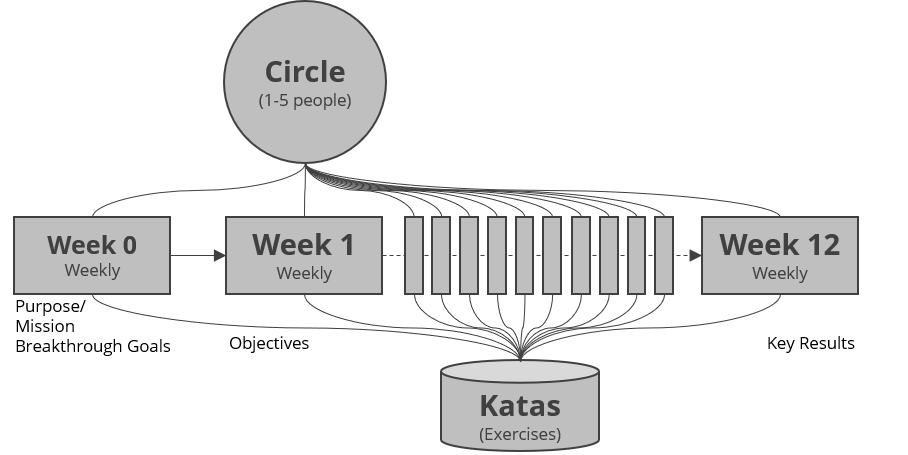

> Did your environment change a lot in the past and is still changing? 
> Is collaboration and mastering digital tools important for your success? 
> Do you have to learn new skills on an ongoing basis? 
>
> Then I wrote this guide for you! 
> [@simondueckert](https://twitter.com/simondueckert)

# Why lernOS?
We live and work in a world of constant change. Due to technical progress with mechanization, mass production and automation people face change since a very long time. But with the invention of the digital technology we live in an age of digital transformation. And since computing power grows at an exponential rate also the change of our environment gets faster and faster.

This is also called a VUCA World, a world that is volatile, uncertain, complex, and ambiguous (Lawrence, 1991). Trends like globalization and urbanization amplify this development. In such an environment values, methods, and tools for living and working in the 21st century have to be updated. The digital transformation and the knowledge society become the driving forces for the future.

Individuals and organizations (for-profit and non-profit) have to adapt to that new situation to be successful in this century. As an individual you have to have to practice a lifestyle of self-directed lifelong learning. You have to acquire new digital skills and also use new digital tools to be productive. As an organization you have to become a learning organization. A learning organization is able to create, acquire, and transfer knowledge, and also to modify its behaviour according to new knowledge and insights (Garvin, 2008).

Fortunately  not all knowledge has to be created from scratch, not every wheel has to be reinvented and not all mistakes have to be repeated. If you have an open mindset and connect with other people inside and outside your organization you will be standing on the shoulders of giants. Working fully networked in contrast to working in silos has a benefit of over 30 percent (McKinsey, 2010).

Digital tools like wikis, weblogs and social networks can help you to connect and learn with other people independent of time and space. To make use of this new possibilities you have to acquire new digital skills. But you don't have to be a digital native to learn these skills. Everybody can learn them: one small step at a time.

lernOS is an operating system for livelong learning and learning organizations. The name is derived from Esperanto (mi lernos: I will learn, ni lernos: We will learn). lernOS will help you and your organization to develop the necessary 21st century skills. lernOS can be used on individual, team, and organizational level. You can use lernOS just on your own or practice it in a group of 4-5 people called a lernOS Circle.

This guide will help you to take the first steps on a lifelong journey.

# lernOS Wheel - Mindset, Skillset, and Toolset as Success Factors

Mastering the Digital Age and the Knowledge Society of the 21st century is not a matter of implementing the right (digital) tools and methods. Starting with the right mindset and learning new skills is crucial. The lernOS Wheel brings together these success factors as mindset, skillset, and toolset:

# lernOS Circle - From Talking The Talk to Walking the Walk
Of course you can practice lernOS on your own. But it is more fun and also easier if you practice it in a group of 4-5 people called a lernOS Circle. A Circle is a [peer support](https://en.wikipedia.org/wiki/Peer_support) group where people help each other by providing knowledge, experience, emotional, social and practical help. The lernOS Circle is a "circle of trust" so what happens in the Circle stays in the Circle.

In a lernOS Circle every Circle member chooses one or more individual objectives. For each objective one defines key results which measure (on a scale from 0.0 to 1.0) if the objective is reached. The objectives should be ambitious so that a key result completion rate of 0.7 is considered a success.

The lernOS Circle meets each week in a 30-60 minutes Check-In with the agenda described above. The Check-in can be face-to-face or virtual. If Circle members don't know each other it might be good to have the first Check-Ins face-to-face to get to know each others and build trust.

Tools that might help to organize communication and documentation for Circles (see [lernOS Wiki](https://github.com/simondueckert/lernos/wiki) for application links):

* **Web Conferencing** like Skype for Business, Skype, Zoom, GoToMeeting, Circuit
* **Instant Messengers** like Threema, Microsoft Teams, Slack, WhatsApp, WeChat, Telegram, Signal, RocketChat
* **Enterprise Social Networks** like Jive, Yammer, IBM Connections, Lithium, Workplace by Facebook
* **Personal Notebooks** like OneNote, Evernote, TiddlyWiki, Etherpad
* **File Hosting Services** like Dropbox, OneDrive, Google Drive, OwnCloud
* **Task Management Services** like Trello, Microsoft ToDo, Microsoft Planner
* **Mind Mapping Software** like XMind, Freemind, MindManager, iThoughts, MindMeister
* **Weblog Software** like Wordpress, Tumblr

# lernOS Sprint - Driving Agile Planning And Execution
A lernOS sprint has 13 weeks (week 0 -12). Therefor a year has four sprints (Jan-Mar, Apr-Jun, Jul-Sep, Oct-Dec).

The **lernOS Week 0** has three main goals:

1. **Reflection:** If you ran a Sprint/Circle before do a retrospective of that sprint to learn from it.
1. **Long Range Planning:**  In Week 0 it's time to think about your "true north". What's your purpose? What is your mission statement? What are breakthrough goals for the future? What might be objectives for the next sprint?
1. **Sprint Planning:** Does anybody in the Circle understand the process? When will the lernOS Weekly be? How will the Weekly be organized (face-2-face vs. virtual)? Which tools are used for communication and documentation in the sprint? Is anybody able to use the tools?

In the **lernOS Weeks 1-12** there is 15-60 minute event called the lernOS Weekly. A suggested timeslot for a 60 minute Weekly is Friday from 11-12 am so you can have lunch with the circle members after the weekly. The weekly is a short ceremony to track results, practice exercises, and motivate yourself for the next week. Every weekly has a similar agenda that can be modified if necessary. If you only want to track results in the weekly a 15 minute stand-up meeting or online meeting is enough. If you use the "Optional lernOS Katas" in week 1-12 you run through a similar process like [Working Out Loud](https://workingoutloud.com). When you want to do the exercises (Katas) in the Circle you should at least plan for a 60 minute weekly. You find the descriptions for every Kata in the chapter "lernOS Kata Cataloque".

**PRO TIP:** in a lot of Circles the timebox for running an exercise in the Circle is too short. You can use the [flipped classroom approach](https://en.wikipedia.org/wiki/Flipped_classroom): every Circle member prepares the exercises as "homework" upfront so you will have more time to discuss results in the Circle.

## Week 0 - Your True North
When you are new to lernOS you will get to know each other in the Circle in week 0. You will plan the administrative stuff (when to meet, which tools to use, who is the facilitator) and you will also think about your ambitions in the long run (your true north). If you had a Circle before this week you should run an additional sprint retrospective (1-3 hours) with your Circle Members.

**Agenda for Week 0:**

* **Check-in:** Welcome Everybody! _(5 minutes)_
* **Get together:** Who are you? Introduce yourself. Three minute timebox per Circle member. _(15 minutes)_
* **Exercise:** [Your Future Backwards](https://github.com/simondueckert/lernos/blob/master/lernOS%20Guide/en/lernOS-Guide-en.md#your-future-backwards) _(25 minutes)_
* **Exercise:** [lernOS Sprint Planning](https://github.com/simondueckert/lernos/blob/master/lernOS%20Guide/en/lernOS-Guide-en.md#lernos-sprint-planning) _(10 minutes)_
* **Check-out:** What will I do until the next Weekly? One minute timebox per circle member. _(5 minutes)_

## Week 1 - Your Sprint Objective(s)
In this week you choose your objective(s) for this sprint. The objective(s) might change or sharpen in the next two weeks but not throughout the whole sprint. You will also start to think about people who might help you with your objective(s). Working alone is addition, working together is multiplication.

**Agenda for Week 1:**

* **Check-in:** What happened since the last check-in? What changed in the key results? What is slowing me down? Two minute timebox per circle member. _(10 minutes)_
* **Exercise:** [Why Are You Here?](https://github.com/simondueckert/lernos/blob/master/lernOS%20Guide/en/lernOS-Guide-en.md#why-are-you-here) _(10 minutes)_
* **Exercise:** [My Objective(s) For The Next 12 weeks](https://github.com/simondueckert/lernos/blob/master/lernOS%20Guide/en/lernOS-Guide-en.md#my-objectives-for-the-next-12-weeks) _(25 minutes)_
* **Exercise:** [People Related To Your Objective(s)](https://github.com/simondueckert/lernos/blob/master/lernOS%20Guide/en/lernOS-Guide-en.md#people-related-to-your-objectives) _(20 minutes)_
* **Check-out:** What will I do until the next Weekly? One minute timebox per circle member. _(5 minutes)_

## Week 2 - Sharing Is Caring
In this week you will reflect on the quantity and quality of the relationships related to your objective(s). You will also start to share attention, knowledge, experiences, and assets with your network to build trust and get support.

**Agenda for Week 2:**

* **Check-in:** What happened since the last check-in? What changed in the key results? What is slowing me down? Two minute timebox per circle member. _(10 minutes)_
* **Exercise:** [Strong Or Weak Ties?](https://github.com/simondueckert/lernos/blob/master/lernOS%20Guide/en/lernOS-Guide-en.md#strong-or-weak-ties) _(5 minutes)_
* **Exercise:** [Your First Sharing Experience](https://github.com/simondueckert/lernos/blob/master/lernOS%20Guide/en/lernOS-Guide-en.md#your-first-sharing-experience) _(40 minutes)_
* **Check-out:** What will I do until the next Weekly? One minute timebox per circle member. _(5 minutes)_

## Week 3 - Use The Network Effect
In this week you will make sure that you have enough time for networking, sharing, and caring for your network. You will do this by making appointments with yourself in your calendar. You will also think about how to use the intranet oder internet to scale your impact.

**Agenda for Week 3:**

* **Check-in:** What happened since the last check-in? What changed in the key results? What is slowing me down? Two minute timebox per circle member. _(10 minutes)_
* **Exercise:** [An Appointment With Yourself](https://github.com/simondueckert/lernos/blob/master/lernOS%20Guide/en/lernOS-Guide-en.md#an-appointment-with-yourself) _(15 minutes)_
* **Exercise:** [Use Web-Scale Networking](https://github.com/simondueckert/lernos/blob/master/lernOS%20Guide/en/lernOS-Guide-en.md#use-web-scale-networking) _(15 minutes)_
* **Exercise:** [Practice Social Praise](https://github.com/simondueckert/lernos/blob/master/lernOS%20Guide/en/lernOS-Guide-en.md#practice-social-praise) _(15 minutes)_
* **Check-out:** What will I do until the next Weekly? One minute timebox per circle member. _(5 minutes)_

## Week 4 - Pitstop 1
In this week your objective(s) should be stable and you should have a clear idea which people in the network (known or unknown) might help you to get your work done. Take this week for a short "pitstop" to reflect if everything works well for you and the circle. The next four weeks you will focus to work on the first iteration  of your key results.

**Agenda for Week 4:**

* **Check-in:** What happened since the last check-in? What changed in the key results? What is slowing me down? Two minute timebox per circle member. _(10 minutes)_
* **Exercise:** [Tone Of Voice In Online communication](https://github.com/simondueckert/lernos/blob/master/lernOS%20Guide/en/lernOS-Guide-en.md#tone-of-voice-in-online-communication) _(15 minutes)_
* **Exercise:** [Sharing A Useful Resource](https://github.com/simondueckert/lernos/blob/master/lernOS%20Guide/en/lernOS-Guide-en.md#sharing-a-useful-resource) _(30 minutes)_
* **Check-out:** What will I do until the next Weekly? One minute timebox per circle member. _(5 minutes)_

## Week 5 - Who Am I?
In this week the work on the first iteration of your key results should have started. The goal is to have a "minimal viable product" (MVP) by the end of week 8. You will also start to think about which facts and personal information might be relevant for your network.

**Agenda for Week 5:**

* **Check-in:** What happened since the last check-in? What changed in the key results? What is slowing me down? Two minute timebox per circle member. _(10 minutes)_
* **Exercise:** [25 Random Facts About Me](https://github.com/simondueckert/lernos/blob/master/lernOS%20Guide/en/lernOS-Guide-en.md#25-random-facts-about-me) _(25 minutes)_
* **Exercise:** [Contribute Your Self](https://github.com/simondueckert/lernos/blob/master/lernOS%20Guide/en/lernOS-Guide-en.md#contribute-your-self) _(20 minutes)_
* **Check-out:** What will I do until the next Weekly? One minute timebox per circle member. _(5 minutes)_

## Week 6 - Update Your Digital Twin
In this week you will look yourself up in the intranet and/or internet. If your digital twins (e.g. website, blog, profile) do not match your findings from last week you will go out and update them.

**Agenda for Week 6:**

* **Check-in:** What happened since the last check-in? What changed in the key results? What is slowing me down? Two minute timebox per circle member. _(10 minutes)_
* **Exercise:** [Go Google Yourself!](https://github.com/simondueckert/lernos/blob/master/lernOS%20Guide/en/lernOS-Guide-en.md#go-google-yourself) _(10 minutes)_
* **Exercise:** [Update Your Digital Twin](https://github.com/simondueckert/lernos/blob/master/lernOS%20Guide/en/lernOS-Guide-en.md#update-your-digital-twin) _(20 minutes)_
* **Exercise:** [Spend Time On Making Connections](https://github.com/simondueckert/lernos/blob/master/lernOS%20Guide/en/lernOS-Guide-en.md#spend-time-on-making-connections) _(15 minutes)_
* **Check-out:** What will I do until the next Weekly? One minute timebox per circle member. _(5 minutes)_

## Week 7 - Your Vision Goes Digital
In this week you will work on finishing the first iteration of your minimal viable product. You will also start see yourself in the future by writing a letter to your future self. You will help your network to support you by making your vision and your objective(s) visible on your online profiles.

**Agenda for Week 7:**

* **Check-in:** What happened since the last check-in? What changed in the key results? What is slowing me down? Two minute timebox per circle member. _(10 minutes)_
* **Exercise:** [Write A Letter To Your Future Self](https://github.com/simondueckert/lernos/blob/master/lernOS%20Guide/en/lernOS-Guide-en.md#write-a-letter-to-your-future-self) _(35 minutes)_
* **Exercise:** [Share Your Objectives](https://github.com/simondueckert/lernos/blob/master/lernOS%20Guide/en/lernOS-Guide-en.md#share-your-objectives) _(10 minutes)_
* **Check-out:** What will I do until the next Weekly? One minute timebox per circle member. _(5 minutes)_

## Week 8 - Pitstop 2
In this week the first iteration of your key results should be available. Talk about them or show them in the check-in. When you experienced that you procrastinated to work on your key results you will learn about some "counter measures".

**Agenda for Week 8:**

* **Check-in:** What happened since the last check-in? What changed in the key results? What is slowing me down? Two minute timebox per circle member. _(10 minutes)_
* **Exercise:** [Stop Procrastination!](https://github.com/simondueckert/lernos/blob/master/lernOS%20Guide/en/lernOS-Guide-en.md#stop-procrastination) _(20 minutes)_
* **Exercise:** [Create Your Own Burn Down Chart](https://github.com/simondueckert/lernos/blob/master/lernOS%20Guide/en/lernOS-Guide-en.md#create-your-own-burn-down-chart) _(10 minutes)_
* **Exercise:** [Help Others To Connect](https://github.com/simondueckert/lernos/blob/master/lernOS%20Guide/en/lernOS-Guide-en.md#help-others-to-connect) _(15 minutes)_
* **Check-out:** What will I do until the next Weekly? One minute timebox per circle member. _(5 minutes)_

## Week 9
In this week you will start working on the second iteration of your key results. In addition you will reflect on your top 10 knowledge assets and the knowledge domains you might contribute expertise and experiences to your network.

**Agenda for Week 9:**

* **Check-in:** What happened since the last check-in? What changed in the key results? What is slowing me down? Two minute timebox per circle member. _(10 minutes)_
* **Exercise:** [Your Top 10 Assets](https://github.com/simondueckert/lernos/blob/master/lernOS%20Guide/en/lernOS-Guide-en.md#your-top-10-assets) _(30 minutes)_
* **Exercise:** [The Dinner Table University](https://github.com/simondueckert/lernos/blob/master/lernOS%20Guide/en/lernOS-Guide-en.md#the-dinner-table-university) _(15 minutes)_
* **Check-out:** What will I do until the next Weekly? One minute timebox per circle member. _(5 minutes)_

## Week 10
In this week you will go through a checklist to see which assets you have to share in your network. You will create a time management system that makes sure that you have enough time for networking and sharing. And you will learn that sometimes listening is more important then sending.

**Agenda for Week 10:**

* **Check-in:** What happened since the last check-in? What changed in the key results? What is slowing me down? Two minute timebox per circle member. _(10 minutes)_
* **Exercise:** [What Can I Contribute?](https://github.com/simondueckert/lernos/blob/master/lernOS%20Guide/en/lernOS-Guide-en.md#what-can-i-contribute) _(20 minutes)_
* **Exercise:** [My Networking And Sharing Time](https://github.com/simondueckert/lernos/blob/master/lernOS%20Guide/en/lernOS-Guide-en.md#my-networking-and-sharing-time) _(10 minutes)_
* **Exercise:** [Try this crazy method called "asking"!](https://github.com/simondueckert/lernos/blob/master/lernOS%20Guide/en/lernOS-Guide-en.md#try-this-crazy-method-called-asking) _(15 minutes)_
* **Check-out:** What will I do until the next Weekly? One minute timebox per circle member. _(5 minutes)_

## Week 11
In this week you will search for communities that are related to your objectives. You will learn to decode the DNA of communities. You will also think about if it would be a good idea to start an own community to support your objectives.

**Agenda for Week 11:**

* **Check-in:** What happened since the last check-in? What changed in the key results? What is slowing me down? Two minute timebox per circle member. _(10 minutes)_
* **Exercise:** [Find Communities Related To Your Objectives](https://github.com/simondueckert/lernos/blob/master/lernOS%20Guide/en/lernOS-Guide-en.md#find-communities-related-to-your-objectives) _(15 minutes)_
* **Exercise:** [Who Are The First And Second Dancers?](https://github.com/simondueckert/lernos/blob/master/lernOS%20Guide/en/lernOS-Guide-en.md#who-are-the-first-and-second-dancers) _(15 minutes)_
* **Exercise:** [Do You Want To Start Your Own Community?](https://github.com/simondueckert/lernos/blob/master/lernOS%20Guide/en/lernOS-Guide-en.md#do-you-want-to-start-your-own-community) _(15 minutes)_
* **Check-out:** What will I do until the next Weekly? One minute timebox per circle member. _(5 minutes)_

## Week 12 - Reflect And Celebrate
In this week the final iteration of your key results should be available. Talk about them or show them in the check-in. You will reflect on the circle experience and think about how to sustain the process. After the weekly you should take some time and celebrate your success!

**Agenda for Week 12:**

* **Check-in:** What happened since the last check-in? What changed in the key results? What is slowing me down? Two minute timebox per circle member. _(10 minutes)_
* **Exercise:** [Your Eureka moment](https://github.com/simondueckert/lernos/blob/master/lernOS%20Guide/en/lernOS-Guide-en.md#your-eureka-moment) _(15 minutes)_
* **Exercise:** [Create Your Time Capsule](https://github.com/simondueckert/lernos/blob/master/lernOS%20Guide/en/lernOS-Guide-en.md#create-your-time-capsule) _(15 minutes)_
* **Exercise:** [Repetition Is The Key To Mastery](https://github.com/simondueckert/lernos/blob/master/lernOS%20Guide/en/lernOS-Guide-en.md#repetition-is-the-key-to-mastery) _(15 minutes)_
* **Check-out:** What will I do until the next Weekly? One minute timebox per circle member. _(5 minutes)_

# lernOS Canvas - Use it as Checklist And To Tell Your Story

The **lernOS Canvas** ([PDF](lernOS-mi-Canvas.pdf)) uses a similar structure as the [business model canvas](https://en.wikipedia.org/wiki/Business_Model_Canvas) by Alex Osterwalder. It can be used to systematically go through the elements of lernOS and create your personal management system with a strong focus on knowledge and learning.

The basic elements of the lernOS Canvas are:

* **Objectives & Key Results:** what you try to reach and how you measure success
* **Activities:** tasks and **roles** you have, **projects** you run
* **Knowledge:** your **expertise**, know-how between your ears or codified in **knowledge assets** (e.g. checklists, presentations) stored in your **repositories** (e.g. social intranet, onedrive, slideshare)
* **Relationships:** people in your **social network** (physical or virtual) helping you to achieve your objectives

# lernOS Memex - Get Things Out Of Your Head And In A System You Trust

Everything you define or agree upon should be documented in a system you trust. This is not for bureaucracy reasons but to keep your head free for creative knowledge work. You can use any personal notebook (paper-based or digital) as lernOS Memex (Memory Extender).

If you do not have any tool at hand, you can download and use the [TiddlyWiki-Version of lernOS Memex](https://github.com/simondueckert/lernos/blob/master/lernOS%20Memex%20-%20en/lernOS-Memex.html) which is structured by the basic lernOS elements by default. This version is based on [TiddlyWiki](https://tiddlywiki.com/), a personal wiki that lives in a single HTML file:

# lernOS Kata Catalogue - Practice New Skills

How do you become a great musician? It's good to know the theory and to understand the mechanics of your instrument. It also helps if you have talent. But real mastery comes from practicing, applying the theory over and over again, using feedback to get better every time. lernOS uses a catalogue of exercises called "Katas" to train new skills. Exercises can be practiced in a lernOS Circle or in separate events and workshops (e.g. a lernOS Dojo).

## [Your Future Backwards](#your-future-backwards)
What is the big picture in your (work) life? Can you explain the purpose of your day-to-day activities in one sentence? A good exercise to get a clear picture is a combination of [The Future Backwards](http://cognitive-edge.com/methods/the-future-backwards/) by Dave Snowden and the [Golden Circle](https://www.youtube.com/watch?v=IPYeCltXpxw) by Simon Sinek. This can be done in a group (e.g. departement or project team) or on your own. In a very short timebox you look at your current state, your past, your desired future (vision), your anti-vision, and the major milestones towards your desired future.

**Exercise:**

1. Decide if you want to do the future backwards on operational level (1 sprint backward/forward), on tactical level (1 year backward/forward) or on strategic level (3-5 backward forward).
1. Prepare a whiteboard or an A3 paper with a horizontal line (time axis, e.g. +/-1 year), desired future, and anti-future. You can use the shape of a "Y" turned 90 degrees clockwise.
1. Take 5x5 minutes timeboxes to describe your current state, your past, your desired future (vision), your anti-vision, and your milestones or breakthrough goals towards the desired future in 3-5 bullet points each.
1. Try to describe your purpose as a mission statement that helps you to focus in your day-to-day work. The mission statement should have an action part (what you do), a product or output part (what you deliver), and a customer or target group. An example phrase might be "I provide the best pizza to customers city-wide" (source: [Business Motivation Model](https://www.omg.org/spec/BMM/1.3/PDF), p.28).
1. Talk about the results in the Circle.

**PRO TIP:** 30 minutes to run the future backwards in the Weekly is a very short timebox. If you want to have an in depth experience you should spent an extra 2-4 hours slot with the Circle Members to run the process.

## [lernOS Sprint Planning](#lernos-sprint-planning)
What are the major impediments for running a Circle and a Sprint? It is something as simple as event and time management. Having five people together for a one hour meeting per week is a big issue in practice. You should define the basic rules of running the Circle until the end of week 0.

**Exercise:**

1. Define a Circle Facilitator who cares for event and time management. The facilitator is not the "boss" of the circle he or she is just a normal member that cares for the smooth operation of the Circle.
1. Define the day and time your Weekly Circle meeting will be (suggestion: Friday, 11-12 am)
1. Define if you meet face-to-face or virtually. If you go for virtual Weekly discuss if weeks 4, 7 and 12 might be done face-to-face.
1. If you meet virtually define the tool you use for the web conference (e.g. Skype for Business, Zoom, appear.in)
1. Decide if you use further tools for communication (e.g. WhatsApp, Threema, Telegram, WeChat) and documentation (e.g. OneNote, Evernote). Discuss if everybody is able to use the chosen tools or if additional tool support is necessary in week 0-2.
1. Everybody puts all Weeklys in the personal calendar ... NOW! :-)

## [Why Are You Here?](#why-are-you-here)
What is your motivation for joining this lernOS Circle? Too often we try to change things by start using new
methods and tools but the "Why" is unclear. Simon Sinek explained it in his TEDx Talk [How Great Leaders Inspire Action](https://www.ted.com/talks/simon_sinek_how_great_leaders_inspire_action) with the "Golden Circle": we should start with the "Why" and then think about the "How" and the "What".

**Exercise:**

1. Think about why you joined this Circle.
1. Complete the sentence "I joined this circle because ...".
1. Talk about your reasons in the circle.

## [My Objective(s) For The Next 12 weeks](#my-objectives-for-the-next-12-weeks)
What do you want to accomplish in the next 12 weeks? Pick an objective (max. 5) that you really, really care about and you can make progress towards in the sprint. How can you see or feel that you make progress towards your objective(s)? To help you to track progress define 2-5 key results per objective. You should be able to measure the key results on a scale from 0.0-1.0. To make sure to set yourself ambitious gouls a completion rate of 0.7 is regarded as a success.

**Exercise:**

1. Think about your objective(s) for the next 12 weeks. If you have problems to find a good objective think about goals that support your roles, activities, or projects.
1. Write down your objectives and 2-5 key results per objective. An example format might be "I will ... as measured by ...".
1. Talk about your objective(s) in the circle.

## [People Related To Your Objective(s)](#people-related-to-your-objectives)
Most tasks we do have been done by others before. Most of the mistakes we make, have been made in the past already. You can gain access to knowledge and experiences related to your objectives by getting in touch with people inside and outside your organization. To build strong relationships is based on trust and sharing. [Dale Carnegie](https://en.wikipedia.org/wiki/Dale_Carnegie) said "You can make more friends in two months by becoming interested in other people than you can in two years by trying to get other people interested in you". So how do you get in touch with people related to your objective(s)?

**Exercise:**

1. Create a list of at least ten people related to your objectives. If you don't know people by name you can also put roles or descriptions on the list (e.g. "Head of HR in company XY").
1. Use your contact lists or internal and external social networks you use to find more people.
1. Explain your list to the other circle members and let them help to complete it.

## [Strong Or Weak Ties?](#strong-or-weak-ties)
How strong is the relationship to the people related to your objective(s)? The connection between people in a social network can be defined by the amount of time spent together, the emotional intensity, the level of intimacy and trust, and the reciprocal services (helping each other). There are three levels [interpersonal ties](https://en.wikipedia.org/wiki/Interpersonal_ties) can have:

1. **Absent:** you don't know each other
1. **Weak:** you are somehow connected, you had interactions in the past
1. **Strong:** you regularly interact, meet, help each other

**Exercise:**

1. Take your relationship list and grade every relationship as 1 (strong), 2 (weak), or 3 (absent) to get an idea which relationships should be deepened in the future.
1. Mark the relationships that you want to deepen in the future.

## [Your First Sharing Experience](#your-first-sharing-experience)
Sharing is caring! In the digital world sharing is often seen as giving others access to files or digital content in an online space. But it can also be as simple sharing your attention with another person by following him, liking his content or subscribing to his website. By sharing you deepen your relationships with every contribution you make and the people in your network will be more willing to support you with your objectives. Knowledge assets and digital assets have one thing in common: they are resources that increase through use! Hint: be careful of legal and data protection issues if you share knowledge or content from your organization with externals.

**Exercise:**

1. Go through your relationship list and look for some kind of online presence for each person (e.g. website, blog, profile in social network).
1. Look for possibilities to share some attention. This might be a follow button, a like button, a subscribe field, a five star rating, a comment field or a contact form.
1. Discuss your contributions in the circle.

## [An Appointment With Yourself](#an-appointment-with-yourself)
Do you spend enough time for your personal development and for working on your personal objectives? A lot of people are busy with their day to day business and do not care enough for their strategic development and their well being. A good approach is to make an appointment with yourself and reserve that time in your calender so nobody else can invite you then. A friday afternoon or any other day with no regular meetings might work well.

**Exercise:**

1. Check your calendar and see when an appointment with yourself fits in. One hour or even 30 minutes a week is a good starting point.
1. Put an appointment with yourself in the calender. If possible make it a recurring event so taking time for yourself can become a habit.
1. Discuss the individual approaches in the Circle.

## [Use Web-Scale Networking](#use-web-scale-networking)
When you interact with indivdual people you grow your network over time. But when interact with whole groups or communities you can scale your reach. You become visible to more and more people and your contributions bring value to the group. Examples of such groups are online communities, communities of practice, user groups, discussion forums, and regular meetups.

**Exercise:**

1. Search the intranet or internet to find at least five groups that are related to your objectives.
1. Discuss your list of groups with your Circle and get more suggestions.
1. Make a small contribution to at least one of the groups.

## [Practice Social Praise](#practice-social-praise)
How does it feel if someone uses your knowledge or your content and just says "thank you" afterwards? Almost everybody does appreciate this. So it's a good habit not take any content and contributions out there for granted but be thankful and express your thankfulness at least from time to time.

**Exercise:**

1. Think of two examples where knowledge or content from another person helped you to reach your objectives.
1. Create a message (one private and one public) to express your thankfulness towards this person. This could be an private e-mail message and/or a comment in a blog or social profile.

## [Tone Of Voice In Online Communication](#tone-of-voice-in-online-communication)
Do you have the same tone when you communication online then you have in real life? Do you write emails with the same tone like you would talk to the persone in a face-to-face meeting? Often the tone in online communication is tougher and more rude than it should be. This is true for emails, messages, discussion forums and blog comments. It is a barrier for devolopping trust and a supportive network.

**Exercise:**
1. Go through your email inbox or your messages in social networks. Which email show a lack of empathy or a wrong tone?
1. Image that you are the sender. What kind of message whould have increased the chance to get a valuable answer?
1. Discuss the examples in the Circle.

## [Sharing A Useful Resource](#sharing-a-useful-resource)
When was the last time you shared a valuable resource with a person or group without beeing asked for it? How could you present such a resource in a way to draw someone's attention to you?

**Exercise:**

1. Think of resources that might be valuable to people on your relationship list. This can be links, videos, books, articles, podcasts, documents or anything else.
1. Find at least three people on the list that will be interested in the resource.
1. Send a message to these people with the resource attached or a link to the resource. Explain the context and why you send the message and also why you think the resource might be valuable for the recipient.

## [25 Random Facts About Me](#25-random-facts-about-me)
What are interesting facts about you that might help you to connect with other people? If you apply to study at Fuqua Business School you have to write an essay with a list of 25 random things about yourself so the application team gets to know you better. When you write down facts about yourself you collect information that might help you in networking to make new connections based on similar interests and backgrounds (e.g. "We studied in the same place 20 years ago!"). Random things about yourself might include:

* Life experiences
* Your likes/dislikes
* Where you were born/lived
* Family, kids, parents
* Schools, universities
* Workplaces in the past
* Career challenges
* Vacations
* Hobbies
* Achievements
* Fun facts
* Anything that helps to understand what makes you who YOU are

**Exercise:**

1. Creating a list of 10 random things about yourself.
1. Read the [Fuqua 25 random things do's and dont's](https://stratusadmissionscounseling.com/duke-fuqua-25-random-things-dos-donts/).
1. Then expand your list to 25 things.
1. Share the facts about you in the circle. You could do this by giving your list around and let other circle members write associations and connections on it.

## [Contribute Your Self](#contribute-your-self)
Not all contributions in your network have to be about your objectives. Sometimes it's good to share something about yourself to make a personal connection. The list of facts about yourself might help to find interesting links to other people. Try to find these possible links and use them to make a connection.

**Exercise:**

1. Go through your facts about you and find at least one fact that might be of interest for a person on your relationship list.
2. Write a message to that person and try to deepen the relationship with that fact as contribution.

## [Go Google Yourself!](#go-google-yourself)
What do people see when they search for you on the internet? Do they get an idea of who you are, what your objectives are and how they might help you? You can simulate that search by googling yourself, often called egosurfing, egosearching or vanity search.

**Exercise:**

1. Open your search engine of choice and enter your name. This could be internet search or also intranet search.
1. Open at least the first 10 search results and check if your personality, your offerings and your objectives are represented in the way you want them to be.
1. Think about what your main online profile might be (e.g. LinkedIn profile, about.me profile or profile in your enterprise social network). This will be called your "digital twin" that represents you online.

## [Update Your Digital Twin](#update-your-digital-twin)
Does your main online profile or your "digital twin" represent you in the way you want to? A lot of people register for an account in a social network and never think about updating their profile. You should keep your profile up to date and have a look at it on a regular basis (e.g. have a recurring task every three month). The facts about you, current projects, current interests, key knowledge domains, and objectives you need support for should be visible on that profile.

**Exercise:**

1. Define your digital twin. Perhaps you have more than one (e.g. on internal and one external) but it should not be too much because of the effort to keep them up to date.
1. Go through the online profile and check if you have a nice image, a short description, and a slogan.
1. Check if your objectives and your open questions are visible in the profile.
1. Update your digital twin and put a regular task for updating in your calender.

## [Spend Time On Making Connections](#spend-time-on-making-connections)
How do you connect with other people on social networks? Of courcse there is a connect button or invite button in all the networks but to just use the default message is not a very polite way to connect with strangers. Most social networks provide features to customize the message when connecting. You should always use this option.

**Exercise:**

1. Go through your relationship list and find someone you don't know yet.
1. Search that person in social networks on the internet or intranet.
1. Connect with the person and write a customized message (add information like: Why do I connect? What do I appreciate? What do I have to offer?)

## [Write A Letter To Your Future Self](#write-a-letter-to-your-future-self)
The letter to your future self is a classic method in self motivation and visioning. You reflect on your current situation and give your future self an advice. You write it down as a letter, address it to yourself and open it in the future. With the letter in the back of your mind chances are that your wishes become a [self-fulfilling prophecy](https://en.wikipedia.org/wiki/Self-fulfilling_prophecy).

**Exercise:**

1. Write a letter to your future self. Talk about who you are now (age, summary, fears, key values, beliefs, skills, abilities, goals, hopes). Then address your future self with the things you want to stop/continue/start doing. Give yourself advice and ask yourself questions.
1. Seal the letter and store it in a safe place or use services like [futureme.org](https://futureme.org) to send it to your future self.
1. If you want to share the letter with your Circle members just read it out loud afterwards.

## [Share Your Objectives](#share-your-objectives)
A good way to let other connect with your to help you with your objectives is to make your objectives visible openly. You can do this by putting them on your online profiles or writing a status update about it. You do not have to share any objectives but the ones others might be of help with their knowledge and experiences.

**Exercise:**

1. Check your objectives to see which ones should be visible for others.
1. Check the social networks you use to find the options for documenting your objectives there.
1. Put your objectives on your online profiles. If you know people that might help already notify them by using the @mention function if available.

## [Stop Procrastination!](#stop-procrastination)
Do you sometimes feel like you voluntarily delay an intended course of action despite expecting to be worse off for the delay? That is the definition of [procrastination](https://en.wikipedia.org/wiki/Procrastination). Estimations are that more than 90% of the people procrastinate. To overcome procrastination there are some counter measures listed in the Wikipedia:

* Be aware of habits and thoughts that lead to procrastinating.
* Seek help for self-defeating problems such as fear, anxiety, difficulty in concentrating, poor time management, indecisiveness, and perfectionism.
* Evaluate your own goals, strengths, weaknesses, and priorities.
* Set realistic goals, and develop a personal positive link between the tasks and the concrete, meaningful goals.
* Restructure activities of daily life.
* Modify your environment for that newly gained perspective. For example, eliminate or minimize noise or distraction; put effort into relevant matters; reduce day-dreaming.
* Discipline yourself to the priorities you set.
* Motivate yourself with enjoyable activities, socializing and constructive hobbies.
* Tackle issues in small blocks of time, instead of trying to solve whole problems at once and then be intimidated.
* To prevent relapse, reinforce your pre-set goals based on needs and allow yourself to be rewarded in a balanced way for accomplished tasks.

**Exercise:**

1. Go through the list of procrastination counter measures and identify the ones that might help you.
1. For each identified counter measer write down how it might help you to make progress.

## [Create Your Own Burn Down Chart](#create-your-own-burn-down-chart)
How do you see if you make progress towards your objectives? In agile project management [burn down charts](https://en.wikipedia.org/wiki/Burn_down_chart) are used to represent progress in a graphical way. On a burn down chart the completed tasks are tracked over time. You start with the sum of tasks and reach zero if any task is completed.

**Exercise:**

1. Think about how you can use a burn down chart to measure and visualize progress towards your objectives. This might be the measurable key results the tasks you need to do to create the results.
1. You can use paper or pen or any software that supports task tracking in a visual way.

## [Help Others To Connect](#help-others-to-connect)
Did you ever use social networks to connect people with each other? Most internal and external social networks support this feature. You can pick two profiles and use a function to introduce people to each other. You might do it directly or ask ther persons for permission upfront.

**Exercise:**

1. Check the social networks you use to see if there is a function for introducing people (in LinkedIn it's called "Share Profile").
1. Check your relationship list to see who might profit from knowing each other.
1. Decide if you want to ask for permission first or just introduce the selected persons.

## [Your Top 10 Assets](#your-top-10-assets)
What are the most valuable assets related to your objectives that you might share? An asset could be a book, a video, a link, a document, a checklist, a presentation etc. When you organize your assets in a way they are linkable and shareble it will be easy for you to contribute them to your network.

**Exercise:**

1. Chose one of your objectives and list at least ten related assets you find useful or interesting. You can write them down on paper or put it in your memex.
1. Present the Top 10 lists in the Circle and let Circle help to extend it.

## [The Dinner Table University](#the-dinner-table-university)
Do you use informal situations like lunch to learn? Leo Buscaglia called this the [Dinner Table University](http://unprovenpervert.blogspot.com/2008/05/our-dinner-table-university-by-leo.html). His father said "There is so much to learn. Though we're born stupid, only the stupid remain that way". After the dinner the father asked the children "Tell me what you learned today". This way every meal becomes a learning opportunity as well. In business you can practice this with methods Lunch&Learn or Walk&Talk.

**Exercise:**

1. Think about what you learned today or the day before.
1. Share the learning in the Circle one Circle member after the other.
1. Discuss if you want to share these learning in a social networking on an ongoing basis.

## [What Can I Contribute?](#what-can-i-contribute)
Do you have a clear idea what you can contribute to your network? Often we do not contriute because we don't know what to share or write. [Research shows](https://www.researchgate.net/publication/259390661_The_Contextual_Nature_of_Enterprise_Social_Networking_A_Multi_Case_Study_Comparison) that there are typical activities in social networks you could use as a checklist for your contributions:

* **Discussion and opinion:** Users discuss general matters, current affairs, politics, industryrelated news, etc. in social networks.
* **Event notifications:** social networks are used to send information about upcoming events (workshops, webinars etc) that might be of interest to others.
* **Idea generation:** As a part of the idea generation practice the social network is used to ask others for their input
and ideas regarding a product or project.
* **Informal talk:** The social network also makes it possible to engage in informal, non-work related conversations (e.g. about sports events, hobbies and other general interests) or to post jokes and funny utterances.
* **Information storage:** Sometimes the social network is used to store information for future reference for oneself or for others.
* **Problem-solving:** Users frequently draw on the social network to ask others for help such as by outlining a specific problem or by asking others to find a resource necessary to solve a problem.
* **Social praise:** In order to share success stories or acknowledge the achievements of people to the
wider group, users also use the social network to thank others for doing something.
* **Status updates:** Social networks on the public web are often used to report what someone is currently
doing.
**Work coordination:** Sometimes the social network is used to delegate tasks to others, post requests for interest
on tasks that need to be staffed, or ask for task assignments and offer spare capacity.

**Exercise:**

1. For every point in the checklist above write down what your possible contributions for the future might be.
1. Discuss your list in the Circle and let the others support you to enhance the list.

## [My Networking And Sharing Time](#my-networking-and-sharing-time)
Do you have a timeslot blocked in your calendar for networking with people and sharing in your network? Do you have a clear idea with whom to network when there is a sudden free slot in a full packed day? If you have clear timeslots and ideas when to network and what to share it will be much easier for you to make networking and sharing a habit.

**Exercise:**

1. Check your calendar for the next weeks and block some time for networking and sharing.
1. Go through your relationship list an pick people with whom you would like to network in the near future.
1. Add these contacts on a networking checklist or put them in the entries of your calendar.

## [Try this crazy method called "asking"!](#try-this-crazy-method-called-asking)
Do you sometimes have the feeling that you could use some information, advice, or experience from somebody else? Instead of waiting and hoping try this crazy method called "asking"! If you think of some benefit the other person might have in return you normally get the support you need.

**Exercise:**

1. Find someone in your relationship list who could help you with your objective.
1. Formulate a message that invites the other person to help you.
1. Discuss the messages in the Circle.

## [Find Communities Related To Your Objectives](#find-communities-related-to-your-objectives)
A tribe [according to Seth Godin](https://www.ted.com/talks/seth_godin_on_the_tribes_we_lead) is a group of people connected to one another, connected to a leader, and connected to an idea. Instead of tribe the term "community" or "community of practice" is often used. A group needs only two things to be a tribe: a shared interest and a way to communicate. Tribes need leadership. Sometimes one person leads, sometimes more. People want connection and growth and something new. They want change. Which are the tribes connected to your objectives?

**Exercise:**

1. Think about and look for communities that are related to your objectives. List at least 5.
1. Talk about your lists in the Circle and let the others help you to complete your list.

## [Who Are The First And Second Dancers?](#who-are-the-first-and-second-dancers)
You can’t have a tribe without a leader - and you can’t be a leader without a tribe. Are you able to identify the leader of the tribes related to your objectives? Who was the first person that started the movement. Which people were joining the tribe at an early stage.

**Exercise:**

1. Watch together the video [First Follower: Leadership Lessons from Dancing Guy](https://www.youtube.com/watch?v=fW8amMCVAJQ).
1. Now pick the community from your list that is most closely related to your objective.
1. Try to find out as much as possible about that community? Who started it? Who joined early? What are the core messages? What are the ways to interact? What are the possibilities for you to join the community.

## [Do You Want To Start Your Own Community?](#do-you-want-to-start-your-own-community)
Can you imagine to start your own tribe or community? If you cannot find a community related to your objectives perhaps you have to start a new one. As you saw in examples you searched for it is possible to start your own if necessary. If so you will be the first dancer and have to think about the time and place where to start your tribe.

**Exercise:**

1. Think about and decide if you have to start your own community.
1. If yes create an idea how your role as "first dancer" might look like.
1. Create a list of people that might be your "second dancers".
1. Discuss the results in the Circle.

## [Your Eureka Moment](#your-eureka-moment)
The [eureka moment](https://en.wikipedia.org/wiki/Eureka_effect) refers to the common human experience of suddenly understanding a previously incomprehensible problem or concept. When you think back to the first weeks of your Circle, what changed since then? What insights did you gain with regard to your objectives, your values, your relationships and your work practices.

**Exercise:**
1. Reflect the last 12 weeks and think about what your "eureka moment" might be.
1. Describe your eureka moment in one sentance (e.g. "Since I practice lernOS, I ...").
1. Present your eureka moment in the Circle.

## [Create Your Time Capsule](#create-your-time-capsule)
A [time capsule](https://en.wikipedia.org/wiki/Time_capsule) is a cache of goods or information, usually intended as a method of communication with future people - like your future self. Like the letter to your future self a time capsule can be used to support the [self-fulfilling prophecy](https://en.wikipedia.org/wiki/Self-fulfilling_prophecy): what you put in the time capsule will become reality in the future.

**Exercise:**
1. Pick a time in the future, e.g. week 0 of your next lernOS Sprint.
1. Who do you want to be then? What skills do you want to have developped? What relationships do you want to have? Write it down on paper or in a digital format.
1. Put it in a phyiscal time capsule and write the date to open in on the capsule. If you do it the digital way you can use services like [futureme.org](https://www.futureme.org/) or just put an event with the content in your calendar.

## [Repetition Is The Key To Mastery](#repetition-is-the-key-to-mastery)
Be honest: when you started your first sprint did you think something like "OMG 13 weeks ... so long"? But you were able to finish the sprint on your own or together with your Circle. But to develop mastery in the digital connected knwowledge society of the 21st century you have to continue to practice. To become an [expert](https://en.wikipedia.org/wiki/Expert) in a domain it might take 10.000 hours or 10 years. So you have to keep calm & learn on!

**Exercise:**
1. Decide if you want to stay together in this Circle for the next sprint.
1. If somebody wants to leave the Circle (e.g. to do the next sprint on his own or in another Circle) that's totally fine.
1. Reflect on the organization of the Circle in this sprint (e.g. day&time of weekly, timeboxes, tools to use in the Circle) and decide what to continue, what to change, and what to stop in the next sprint.
1. Celebrate the finished sprint e.g. by going out for lunch/dinner or sharing a Circle selfie.
