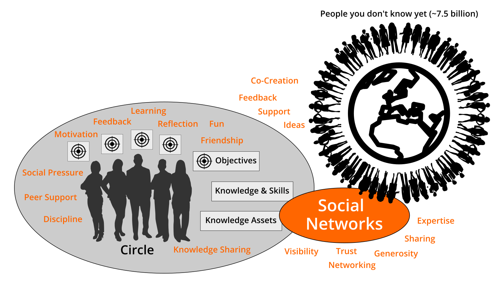
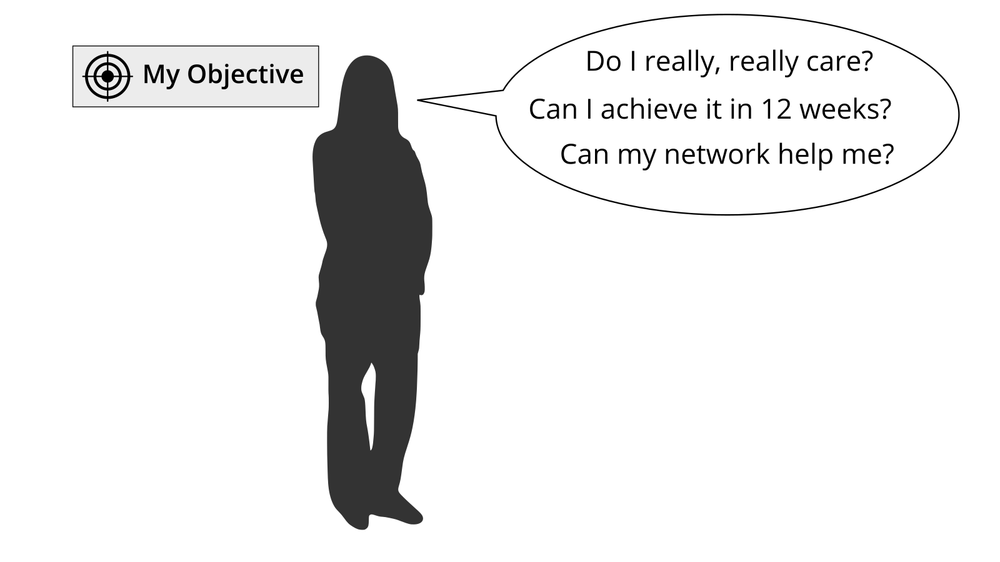

> Did your environment change a lot in the past and is still changing? 
>
> Is collaboration and mastering digital tools important for your success? 
>
> Do you have to learn new skills on an ongoing basis? 
>
> Then I wrote this guide for you! @simondueckert

# Why lernOS?
We live in a world of constant change. Technical progress like mechanization, mass production and automation led to big changes in the past. With the invention of the transistor the digital transformation started. The processing power of computers grows yearly at an exponential rate. For this reason also our environment changes faster and faster in the 21st century.

The world we live in is a world full of volatility, uncertainty, complexity, and ambiguity (VUCA). In such an environment proven methods and tools from the past have to be questioned. We have to evolve from one-time education to self-directed livelong learning. We have to acquire new skills, use new digital tools, and develop a new mindset to be successful.

lernOS can help to get fit for the 21st century. lernOS is an operating system for livelong learning and learning organizations. The phrase “mi lernos” means “I will learn” in Esperanto. lernOS helps to organize the daily tasks and to learn consciously from every activity. It will also promote networking with other people. In this way not every wheel has to be reinvented and not every mistake has to be repeated. And the best thing is: lernOS is really easy to understand. Let's begin.

# lernOS Wheel - Mindset, Skillset, and Toolset as Success Factors

Mastering the digital age and the knowledge society of the 21st century requires to be open for change and new approaches. There are a lot of tools and methods out there. But when one is not open to give it a try and to experiment with new approaches success will stay away. Like the people with the "square wheels" in the image below we are often too busy to see new possibilities and chances.

Adopting new practices is not only about using new digital tools or fancy methods like design thinking, scum, and working out loud (Remeber: A fool with a tool is still a fool). To switch from "square wheels" to "round wheels" the basic assumptions about the world, the personal skills, and the used methods and tools have to be taken into account. lernOS calls this three dimensions mindset, skillset, and toolset. Focussing on only one or two of the three dimensions might already help. But for the best results all three dimensions should be considered.

## Mindset - Your World View
The mindset can be described as the assumptions, beliefs, perceptions, thoughts, feelings, and values that lead to actions and visible artifacts. These visible artifacts is everything one can see, hear, and feel. In an organizations artifacts might be structures, hierarchies, processes, architectures, office design, physical environment, and ICT infrastructure. The necessary values to successfully use lernOS are very well described in the [Manifesto for Human Leadership](https://fuehrung-erfahren.de/wp-content/uploads/2018/02/Manifesto-for-Human-Leadership.pdf):

> We believe in the creativity and motivation of human beings. We consider human leadership
> as pivotal in a highly networked and highly complex world. We understand the task of
> leadership as serving life and striving for conditions in which people, in their diversity, can
> contribute in the best possible way and in which they can develop themselves and work
> effectively together. These values are important to us:
>
> **Unleashing human potential** over employing human resources.
>
> **Diversity and dissent** over conformity and consensus.
>
> **Purpose and trust** over command and control.
>
> **Contributions to networks** over position in hierarchies.
>
> **Growing leaders** over leading followers.
>
> **Courageously exploring the new** over efficiently exploiting the old.

**ProTip:** leadership is not assigned or bound to managers. Everybody can be a leader. Just do it! Like Grace Hopper said in 1986 "It's easier to ask forgiveness then it is to get permission".

**ProTip:** your mindset is not fixed you can develop a new mindset. Watch Carol Dweck's video on [Developing a Growth Mindset](https://www.youtube.com/watch?v=hiiEeMN7vbQ) to learn more about it.

## Skillset - Your Capabilities
To get fit for the 21st century a lot of new skills have to be acquired. On the one hand these are skills to exploit new digital opportunities also called digital skills and digital leadership. These skills are outlined in [DigiComp 2.1](https://ec.europa.eu/jrc/en/publication/eur-scientific-and-technical-research-reports/digcomp-21-digital-competence-framework-citizens-eight-proficiency-levels-and-examples-use), a digital competence framework for citizens in the 21st century:

* **Competence Area 1: Information and data literacy**
  * Browsing, searching, fltering data, information and digital content
  * Evaluating data, information and digital content
  * Managing data, information and digital content
* **Competence Area 2: Communication and collaboration**
  * Interacting through digital technologies
  * Sharing throught digital technologies
  * Engaging in citizenship through digital technologies
  * Collaborating through digital technologies
  * Netiquette
  * Managing digital identity
* **Competence Area 3: Digital content creation**
  * Developing digital content
  * Integrating and re-elaborating digital content
  * Copyright and licences
  * Programming
* **Competence Area 4: Safety**
  * Protecting devices
  * Protecting personal data and privacy
  * Protecting health and well-being
  * Protecting the environment
* **Competence Area 5: Problem solving**
  * Solving technical problems
  * Identifying needs and technological responses
  * Creatively using digital technologies
  * Identifying digital competence gaps

On the other hand automation, artificial intelligence, and machine learning will replace a lot of activities that have been done by humans in the past. The [P21 Framework for 21set Century Learning](http://www.p21.org/our-work/p21-framework) gives a good overview of the 4C learning and innovation skills (creativity, critical thinking, communication, collaboration) that will prepare citizens for increasingly life and work environments in the 21st Century:

* **Creativity and Innovation**
  * Think Creatively: Use a wide range of idea creation techniques (such as brainstorming), Create new and worthwhile ideas (both incremental and radical concepts), Elaborate, refine, analyze and evaluate their own ideas in order to improve and maximize creative efforts
  * Work Creatively with Others: Develop, implement and communicate new ideas to others effectively, Be open and responsive to new and diverse perspectives; incorporate group input and feedback into the work, Demonstrate originality and inventiveness in work and understand the real world limits to adopting new ideas, View failure as an opportunity to learn; understand that creativity and innovation is a long-term, cyclical process of small successes and frequent mistakes
  * Implement Innovations: Act on creative ideas to make a tangible and useful contribution to the field in which the innovation will occur
* **Critical Thinking and Problem Solving**
  * Reason Effectively: Use various types of reasoning (inductive, deductive, etc.) as appropriate to the situation
  * Use Systems Thinking: Analyze how parts of a whole interact with each other to produce overall outcomes in complex systems
  * Make Judgments and Decisions: Effectively analyze and evaluate evidence, arguments, claims and beliefs, Analyze and evaluate major alternative points of view, Synthesize and make connections between information and arguments, Interpret information and draw conclusions based on the best analysis, Reflect critically on learning experiences and processes
  * Solve Problems: Solve different kinds of non-familiar problems in both conventional and innovative ways, Identify and ask significant questions that clarify various points of view and lead to better solutions
* **Communication**
  * Communicate Clearly, including ...
  * Articulate thoughts and ideas effectively using oral, written and nonverbal communication skills in a variety of forms and contexts
  * Listen effectively to decipher meaning, including knowledge, values, attitudes and intentions
  * Use communication for a range of purposes (e.g. to inform, instruct, motivate and persuade)
  * Utilize multiple media and technologies, and know how to judge their effectiveness a priori as well as assess their impact
  * Communicate effectively in diverse environments (including multi-lingual)
* **Collaboration**
  * Collaborate with Others, including ...
  * Demonstrate ability to work effectively and respectfully with diverse teams
  * Exercise flexibility and willingness to be helpful in making necessary compromises to accomplish a common goal
  * Assume shared responsibility for collaborative work, and value the individual contributions made by each team member

**ProTip:** the Mozilla Foundation has developed the [Web Literacy Framework](https://learning.mozilla.org/en-US/web-literacy) with a lot of exercises for developing digital literacy and 21st century skills.

## Toolset - Methods And Tools You Use
With the emergence of [Web 2.0](https://www.oreilly.com/pub/a/web2/archive/what-is-web-20.html) in 2005 social media and new methods came up. Not everybody needs to know all tools and methods but it is a good idea to have an overview, know the principles, and choose the right tools for oneself. The conversation prism gives an overview of web 2.0 platforms available today:

For a beginner this prism with 28 categories and dozens of tools might be overwhelming. To begin with the following short list provides a compact overview of the most relevant tools (aphabetical order):

1. **Digital Notebook:** Evernote, OneNote, TiddlyWiki
1. **File Sharing:** Dropbox, Google Drive, Office 365, OneDrive, SharePoint
1. **Messenger:** Microsoft Teams, Slack, Threema, WeChat, WhatsApp, Telegram
1. **Mind Mapping:** Freemind, iThoughts, MindManager, MindMeister, XMind
1. **Social Network:** professional social Networks (LinkedIn, Xing, Twitter) as well as enterprise social networks (Jive, Yammer, IBM Connections, Workplace by Facebook)
1. **Video Sharing:** Kaltura, Vimeo, Vimp, YouTube
1. **Web Conferencing:** Google Hangout, GoToMeeting, Microsoft Teams, Skype, Skype for Business, WebEx, Zoom
1. **Weblog:** Medium, tumblr, Wordpress (tip: social networks often offer blog functions)
1. **Wiki:** Confluence, Mediawiki, Wikipedia
1. **Work Coordination:** asana, Microsoft Planner, Microsoft To-Do, Trello

**ProTip:** you find links for all the tools in the [lernOS Wiki on github](https://github.com/simondueckert/lernos/wiki).

In addition to technical tools also a new set of helpful methods is available. Good examples are barcamps, communities of practice, coworking, design thinking, shipit days (aka fedex days), future backwards, getting things done, hackathon, knowledge map, lessons learned, massive open online courses, podcast, screencast, scrum, and working out loud.

**ProTip:** feel free to choose a tool or method and try it out in your circle to upskill yourself.

Enough theory. You have read about the right mindset, skillset, and toolset for the 21st century. Now it is time to practice. You will do this in periods of three month called lernOS Sprints. To have some peer support you should not practice on your own but in a group of 4-5 people called a lernOS Circle. You will have a weekly meeting with a standard agenda to structure your learning process step by step. The next chapters will explain the practice of lernOS in detail.

# lernOS Circle - From Talking The Talk to Walking the Walk
You can practice lernOS on your own. But it's easier and more successful if you practice it in a group of 4-5 people. This group is called a lernOS Circle. A circle is a [peer support](https://en.wikipedia.org/wiki/Peer_support) group in which members help each other with feedback, experience, knowledge, and reflection. The lernOS Circle is a circle of trust: what happens in the circle stays in the circle!

The circle meets weekly in a meeting called lernOS Weekly. The weekly is a short ceremony to track results, practice exercises, and motivate yourself for the next week. In the circle each member defines personal objectives and desired results. Circle members learn to share and network to build get a network of trust and relationships that help to achieve the personal objectives. Each week has a standardized agenda with a check-in, a check-out, and suggested exercises called lernOS Katas. The timebox for the weekly can be adopted to personal needs (suggested timeslot: Friday between 11-12am):

* **15 Minute Weekly Meeting:** only Check-In and Check-Out to track progress
* **30-60 Minute Weekly Meeting:** like 15 minutes plus exercises from the lernOS Kata Catalogue

**ProTip:** in a lot of circles the timebox for running an exercise in the circle is too short. You can use the method [inverted classroom](https://en.wikipedia.org/wiki/Flipped_classroom): every circle member prepares the exercises as "homework" upfront so you will have more time to discuss results in the circle.

The weekly meeting might be face-to-face or virtual. In any case the circle should establish a digital infrastructure for communication and documentation in between the weekly meetings. The following table shows some tools that are proven in practice (find more in the [lernOS Wiki](https://github.com/simondueckert/lernos/wiki)):

| Tool A-Z | Communication | Documentation |
|------|---------------|---------------|
| Enterprise Social Network (ESN), e.g. IBM Connections, Jive, Yammer | **X** | **X** |
| appear.in | X | |
| E-mail | X | |
| Evernote | | X |
| Facebook Group | **X** | **X** |
| Facebook Messenger | X | |
| Google Doc | | X |
| Google Hangout | X | |
| GoToMeeting | X | |
| Jitsi | X | |
| Microsoft Teams | **X** | **X** |
| Skype | X | |
| Slack | X | |
| Telegram | X | |
| Threema | X | |
| WebEx | X | |
| WeChat | X | |
| WhatsApp | X | |
| Zoom | X | | |

**ProTip:** To have a good usability choose a tool that supports communication and documentation, e.g. a [Facebook Group](https://www.facebook.com/help/1629740080681586) or [Microsoft Teams](https://products.office.com/en-us/microsoft-teams/group-chat-software). In a Facebook Group you can use the activity stream for communicating and [group docs](https://www.facebook.com/help/203003559734725) for documentation. In Microsoft Teams you can use the channel "General" for communication and wiki pages or a OneNote Notebook for documentation.

# lernOS Sprint - Driving Agile Planning And Execution
Circle members should be able to switch circles if they want. Therefore the circles have to have the same rhythm. For this reason lernOS is practiced in so called sprints of on quarter of a year each (13 weeks). So one year consists of four lernOS Sprints:

| Date | Sprint |
|------|--------|
| **01.01.-31.03.:** | 01/yyyy |
| **01.04.-30.06.:** | 02/yyyy |
| **01.07.-30.09.:** | 03/yyyy |
| **01.10.-31.12.:** | 04/yyyy |

In week 0 the sprint planning takes place: Does everybody understand the process? When will the weekly meeting be? Which exercises are chosen for the weeks? Will the weekly meeting be organized face-to-face or virtual? Which tools are used for communication and documentation in the sprint? Is everybody able to use the tools? Additionally week 0 can be used for strategic planning: What is the purpose? What is the true north? What is the mission? What are breakthrough goals for the future? What might be objectives for the next sprint?

In weeks 1-12 the weekly meeting as described in the chapter "lernOS Circle" takes place. The circle members are working on their desired results during the sprint. They build a network that supports them with achieving their objectives. The two "pitstops" in week 4 and week 8 help to see if everybody is still on track. When no additional exercises are made in the weekly meeting it will take 15 minutes. If additional exercises are chosen, up to 60 minutes will be necessary for the meeting. The documentation for every exercise is in the chapter "lernOS Kata Catalogue".

# lernOS Canvas - Use it as Checklist And To Tell Your Story
A canvas is a visual structure that can be used to work through several topic areas in a systematic way (canvas as checklist). It can also be used to tell a complex story. The idea came from Alex Osterwalder who invented the [business model canvas](https://en.wikipedia.org/wiki/Business_Model_Canvas). This canvas is used to design a business model for an organization. Instead of writing a business plan in a linear document the canvas is used in a visual and agile way. The lernOS Canvas uses the same basic structure as the business model canvas. But the names of the building blocks have been changed to reflect the topics a circle works on during a sprint.

The header of the canvas contains the creation date, the number of the sprint, and the mission statement from week 0. In the building block "My Objectives & Key Results" the goals for the current sprint are documented. The building blocks "My Roles", "My Activities", "My Projects", and "My Knowledge & Skills" can be used to identify potential objectives. "My Relationships" and "My Social Networks" can be used to identify people inside and outside the organization who can help to achieve the objectives. Social networks can be internal (e.g. Enterprise Social Network, Jive, Yammer, Connections) or external (e.g. LinkedIn, Twitter, ResearchGate). Available knowledge asset (e.g. documents, checklists, videos etc.) are listed in "My Knowledge Assets". The repositories listed at "My Repositories" can be used to share assets generously with the network.

The lernOS Canvas can be downloaded from the [lernOS Repository on github](https://github.com/simondueckert/lernos) in different formats (e.g. PowerPoint, PDF, PNG). To be able to work with the canvas in an agile way one should NEVER write on a canvas ... that's why sticky notes were invented!

**ProTip:** if you use a lernOS Memex (e.g. OneNote) you can take a photo of the current version of the canvas and put it in the memex. This way the other circle members can see it as well.

# lernOS Memex - Get Things Out Of Your Head And In A System You Trust
According to David Allen our mind is good for having ideas not for holding them. Therefore we need a way to get things out of the head and into a system we trust. In his 1945 article [As We May Think](https://en.wikipedia.org/wiki/As_We_May_Think) Vannevar Bush called such a system a "memex" (memory extender). Bush's version of the memex was a personal desk based on microfilm and mechanical controls. But his memex can also be seen as an early vision of hypertext and wiki systems.

In the digital age tools like [Microsoft OneNote](https://products.office.com/en-US/onenote) can play the role of a personal memex. In contrast to the physical version OneNote can be used on a desktop computer but also mobile on a smartphone or tablet. OneNote can handle multiple notebooks at the same time. Information in a notebook can be organized in sections, pages, and subpages. With the wiki function pages can also be interlinked. The content on each page can be format freely and can also contain tables, images, audio, and video. A notebook can be shared with coworkers to work on it simultaneously. Content from the internet can be easily stored in OneNote with the [OneNote Web Clipper](https://www.onenote.com/clipper).

When using OneNote in a circle a section can be structured by the weekly meetings and the circle members. The page for each weekly meeting contains the agenda, the exercises, and the links to the exercises. Every completed agenda item can be marked as done by a checkbox. The pages for the circle members contain headings for all required documentation in the circle (e.g. goals, relationship list, social network, facts about me). This way all circle members can see the documentation of everybody else.

**ProTip:** you can download a OneNote Template that can be used for lernOS Circles and WOL Circles [from the lernOS Repository on GitHub](https://github.com/simondueckert/lernos/raw/master/lernOS%20Templates/lernOS-Circle-Template.onepkg).

# lernOS Weekly - Meet Your Circle Members Every Week

## Week 0 - Get Together & Sprint Planning
When you are new to the circle you will get to know each other in week 0. You will plan the administrative stuff like when to meet, which tools to use, who is the facilitator etc. One of the major impediments for running a circle is discipline and time management. You should define the basic rules for running the circle until the end of week 0.

* **Check-in:** Welcome Everybody! _(5 minutes)_
* **Get together:** Who are you? Introduce yourself. Five minute timebox per Circle member. _(25 minutes)_
* **Sprint Planning** see below _(25 minutes)_
* **Check-out:** What will I do until the next Weekly? One minute timebox per circle member. _(5 minutes)_

Define a circle facilitator who cares for event and time management. The facilitator is not the "boss" of the circle but just a normal member that cares for the smooth operation. Define the day and time of your weekly circle meeting (suggestion: Friday, 11-12 am). Define if you meet face-to-face or virtually. If you go for virtual Weekly discuss if weeks 4, 7 and 12 might be done face-to-face. If you meet virtually define the tool you use for the web conference (e.g. Skype for Business, Zoom, appear.in). Decide if you use further tools for communication (e.g. WhatsApp, Threema, Telegram, WeChat) and documentation (e.g. OneNote, Evernote).

* **Circle facilitator:** ...
* **Day/time of weekly meeting:** ... (put it in your calendar NOW! :-)
* **Weekly meetings are:** face-to-face / virtual
* **Tools used in circle:** ... (test if everybody is able to use the tools)

## Week 1 - Your Sprint Objectives
In this week you choose your objectives for this sprint (one or more, max. 5). The objectives might be refined until week 4 but not later in the sprint. You will also start to think about people who might help you with your objectives (remember: working alone is addition, working together is multiplication!).

* **Check-in:** What happened since the last check-in? What changed in the key results? What is slowing me down? Two minute timebox per circle member. _(10 minutes)_
* **Exercise:** [Why Are You Here?](https://github.com/simondueckert/lernos/blob/master/lernOS%20Guide/en/lernOS-Guide-en.md#why-are-you-here) _(10 minutes)_
* **Exercise:** [My Objectives For The Next 12 weeks](https://github.com/simondueckert/lernos/blob/master/lernOS%20Guide/en/lernOS-Guide-en.md#my-objectives-for-the-next-12-weeks) _(25 minutes)_
* **Exercise:** [People Related To Your Objective(s)](https://github.com/simondueckert/lernos/blob/master/lernOS%20Guide/en/lernOS-Guide-en.md#people-related-to-your-objectives) _(20 minutes)_
* **Check-out:** What will I do until the next Weekly? One minute timebox per circle member. _(5 minutes)_

## Week 2 - Sharing Is Caring
In this week you will reflect on the quantity and quality of the relationships related to your objectives. You will also start to share attention, knowledge, experiences, and assets with your network to build trust and get support.

* **Check-in:** What happened since the last check-in? What changed in the key results? What is slowing me down? Two minute timebox per circle member. _(10 minutes)_
* **Exercise:** [Strong Or Weak Ties?](https://github.com/simondueckert/lernos/blob/master/lernOS%20Guide/en/lernOS-Guide-en.md#strong-or-weak-ties) _(5 minutes)_
* **Exercise:** [Your First Sharing Experience](https://github.com/simondueckert/lernos/blob/master/lernOS%20Guide/en/lernOS-Guide-en.md#your-first-sharing-experience) _(40 minutes)_
* **Check-out:** What will I do until the next Weekly? One minute timebox per circle member. _(5 minutes)_

## Week 3 - Use The Network Effect
In this week you will make sure that you have enough time for networking, sharing, and caring for your network. You will do this by making appointments with yourself. You will also think about how to use the intranet oder internet to reach more people.

* **Check-in:** What happened since the last check-in? What changed in the key results? What is slowing me down? Two minute timebox per circle member. _(10 minutes)_
* **Exercise:** [An Appointment With Yourself](https://github.com/simondueckert/lernos/blob/master/lernOS%20Guide/en/lernOS-Guide-en.md#an-appointment-with-yourself) _(15 minutes)_
* **Exercise:** [Use Web-Scale Networking](https://github.com/simondueckert/lernos/blob/master/lernOS%20Guide/en/lernOS-Guide-en.md#use-web-scale-networking) _(15 minutes)_
* **Exercise:** [Practice Social Praise](https://github.com/simondueckert/lernos/blob/master/lernOS%20Guide/en/lernOS-Guide-en.md#practice-social-praise) _(15 minutes)_
* **Check-out:** What will I do until the next Weekly? One minute timebox per circle member. _(5 minutes)_

## Week 4 - Pitstop 1
In this week your objectives should be stable and you should have a clear idea which people in the network might help you to get your work done. Take this week for a short "pitstop" to reflect if everything works well for you and the circle. The next four weeks you will focus to work on the first iteration of your key results.

* **Check-in:** What happened since the last check-in? What changed in the key results? What is slowing me down? Two minute timebox per circle member. _(10 minutes)_
* **Exercise:** [Tone Of Voice In Online communication](https://github.com/simondueckert/lernos/blob/master/lernOS%20Guide/en/lernOS-Guide-en.md#tone-of-voice-in-online-communication) _(15 minutes)_
* **Exercise:** [Sharing A Useful Resource](https://github.com/simondueckert/lernos/blob/master/lernOS%20Guide/en/lernOS-Guide-en.md#sharing-a-useful-resource) _(30 minutes)_
* **Check-out:** What will I do until the next Weekly? One minute timebox per circle member. _(5 minutes)_

## Week 5 - Who Am I?
In this week the work on the first iteration of your key results should have started. The goal is to have a [minimum viable product](https://en.wikipedia.org/wiki/Minimum_viable_product) (something that works and that you can show) by the end of week 8. You will also start to think about which facts and personal information might be relevant for your network.

* **Check-in:** What happened since the last check-in? What changed in the key results? What is slowing me down? Two minute timebox per circle member. _(10 minutes)_
* **Exercise:** [25 Random Facts About Me](https://github.com/simondueckert/lernos/blob/master/lernOS%20Guide/en/lernOS-Guide-en.md#25-random-facts-about-me) _(25 minutes)_
* **Exercise:** [Contribute Your Self](https://github.com/simondueckert/lernos/blob/master/lernOS%20Guide/en/lernOS-Guide-en.md#contribute-your-self) _(20 minutes)_
* **Check-out:** What will I do until the next Weekly? One minute timebox per circle member. _(5 minutes)_

## Week 6 - Update Your Digital Twin
In this week you will look yourself up in the intranet or internet. If your digital twins (e.g. website, blog, profile) do not match your findings from last week you will go out and update your profiles.

* **Check-in:** What happened since the last check-in? What changed in the key results? What is slowing me down? Two minute timebox per circle member. _(10 minutes)_
* **Exercise:** [Go Google Yourself!](https://github.com/simondueckert/lernos/blob/master/lernOS%20Guide/en/lernOS-Guide-en.md#go-google-yourself) _(10 minutes)_
* **Exercise:** [Update Your Digital Twin](https://github.com/simondueckert/lernos/blob/master/lernOS%20Guide/en/lernOS-Guide-en.md#update-your-digital-twin) _(20 minutes)_
* **Exercise:** [Spend Time On Making Connections](https://github.com/simondueckert/lernos/blob/master/lernOS%20Guide/en/lernOS-Guide-en.md#spend-time-on-making-connections) _(15 minutes)_
* **Check-out:** What will I do until the next Weekly? One minute timebox per circle member. _(5 minutes)_

## Week 7 - Your Vision Goes Digital
In this week you will work on finishing the first iteration of your minimum viable product. You will also start to envision yourself in the future by writing a letter to your future self. And you will help your network to support you by making your vision and your objectives visible on your online profiles.

* **Check-in:** What happened since the last check-in? What changed in the key results? What is slowing me down? Two minute timebox per circle member. _(10 minutes)_
* **Exercise:** [Write A Letter To Your Future Self](https://github.com/simondueckert/lernos/blob/master/lernOS%20Guide/en/lernOS-Guide-en.md#write-a-letter-to-your-future-self) _(35 minutes)_
* **Exercise:** [Share Your Objectives](https://github.com/simondueckert/lernos/blob/master/lernOS%20Guide/en/lernOS-Guide-en.md#share-your-objectives) _(10 minutes)_
* **Check-out:** What will I do until the next Weekly? One minute timebox per circle member. _(5 minutes)_

## Week 8 - Pitstop 2
In this week the first iteration of your key results should be available. Talk about them or show them in the check-in. When you experienced that you procrastinated to work on your key results you will learn about some "procrastination counter measures".

* **Check-in:** What happened since the last check-in? What changed in the key results? What is slowing me down? Two minute timebox per circle member. _(10 minutes)_
* **Exercise:** [Stop Procrastination!](https://github.com/simondueckert/lernos/blob/master/lernOS%20Guide/en/lernOS-Guide-en.md#stop-procrastination) _(20 minutes)_
* **Exercise:** [Create Your Own Burn Down Chart](https://github.com/simondueckert/lernos/blob/master/lernOS%20Guide/en/lernOS-Guide-en.md#create-your-own-burn-down-chart) _(10 minutes)_
* **Exercise:** [Help Others To Connect](https://github.com/simondueckert/lernos/blob/master/lernOS%20Guide/en/lernOS-Guide-en.md#help-others-to-connect) _(15 minutes)_
* **Check-out:** What will I do until the next Weekly? One minute timebox per circle member. _(5 minutes)_

## Week 9 - Your Knowledge Assets
In this week you will start working on the second iteration of your key results. In addition you will reflect on your top 10 knowledge assets and the knowledge domains that you can contribute to your network.

* **Check-in:** What happened since the last check-in? What changed in the key results? What is slowing me down? Two minute timebox per circle member. _(10 minutes)_
* **Exercise:** [Your Top 10 Assets](https://github.com/simondueckert/lernos/blob/master/lernOS%20Guide/en/lernOS-Guide-en.md#your-top-10-assets) _(30 minutes)_
* **Exercise:** [The Dinner Table University](https://github.com/simondueckert/lernos/blob/master/lernOS%20Guide/en/lernOS-Guide-en.md#the-dinner-table-university) _(15 minutes)_
* **Check-out:** What will I do until the next Weekly? One minute timebox per circle member. _(5 minutes)_

## Week 10 - Networking And Sharing Time
In this week you will use a checklist to find more assets that can be shared in the network. You will create a time management system that makes sure you have enough time for networking and sharing. And you will learn that sometimes listening is more important then sending.

* **Check-in:** What happened since the last check-in? What changed in the key results? What is slowing me down? Two minute timebox per circle member. _(10 minutes)_
* **Exercise:** [What Can I Contribute?](https://github.com/simondueckert/lernos/blob/master/lernOS%20Guide/en/lernOS-Guide-en.md#what-can-i-contribute) _(20 minutes)_
* **Exercise:** [My Networking And Sharing Time](https://github.com/simondueckert/lernos/blob/master/lernOS%20Guide/en/lernOS-Guide-en.md#my-networking-and-sharing-time) _(10 minutes)_
* **Exercise:** [Try this crazy method called "asking"!](https://github.com/simondueckert/lernos/blob/master/lernOS%20Guide/en/lernOS-Guide-en.md#try-this-crazy-method-called-asking) _(15 minutes)_
* **Check-out:** What will I do until the next Weekly? One minute timebox per circle member. _(5 minutes)_

## Week 11 - The Power Of Communities
In this week you will search for communities that are related to your objectives. You will learn to decode the DNA of communities. You will also think about starting an own community to support your objectives.

* **Check-in:** What happened since the last check-in? What changed in the key results? What is slowing me down? Two minute timebox per circle member. _(10 minutes)_
* **Exercise:** [Find Communities Related To Your Objectives](https://github.com/simondueckert/lernos/blob/master/lernOS%20Guide/en/lernOS-Guide-en.md#find-communities-related-to-your-objectives) _(15 minutes)_
* **Exercise:** [Who Are The First And Second Dancers?](https://github.com/simondueckert/lernos/blob/master/lernOS%20Guide/en/lernOS-Guide-en.md#who-are-the-first-and-second-dancers) _(15 minutes)_
* **Exercise:** [Do You Want To Start Your Own Community?](https://github.com/simondueckert/lernos/blob/master/lernOS%20Guide/en/lernOS-Guide-en.md#do-you-want-to-start-your-own-community) _(15 minutes)_
* **Check-out:** What will I do until the next Weekly? One minute timebox per circle member. _(5 minutes)_

## Week 12 - Reflect And Celebrate
In this week the final iteration of your key results should be available. Talk about them or show them in the check-in. You will reflect on the circle experience and think about how to sustain the process. After the weekly you should take some time and celebrate your success!

* **Check-in:** What happened since the last check-in? What changed in the key results? What is slowing me down? Two minute timebox per circle member. _(10 minutes)_
* **Exercise:** [Your Eureka moment](https://github.com/simondueckert/lernos/blob/master/lernOS%20Guide/en/lernOS-Guide-en.md#your-eureka-moment) _(15 minutes)_
* **Exercise:** [Create Your Time Capsule](https://github.com/simondueckert/lernos/blob/master/lernOS%20Guide/en/lernOS-Guide-en.md#create-your-time-capsule) _(15 minutes)_
* **Exercise:** [Repetition Is The Key To Mastery](https://github.com/simondueckert/lernos/blob/master/lernOS%20Guide/en/lernOS-Guide-en.md#repetition-is-the-key-to-mastery) _(15 minutes)_
* **Check-out:** Party time! _(5 minutes)_

# lernOS Kata Catalogue - Exercises To Upskill Yourself
How do you become a great musician? It's good to know the theory and to understand the mechanics of your instrument. It also helps if you have talent. But real mastery comes from practicing, applying the theory over and over again, using feedback to get better every time. lernOS uses a catalogue of exercises called "Katas" to train new skills. Most of the exercises can be practiced in a circle or separately.

## [Why Are You Here?](#why-are-you-here)
What is your motivation for joining this circle? Too often we try to change things by start using new
methods and tools but the "Why" is unclear. Simon Sinek explained with his "golden circle" that we should start with the "Why" and then think about the "How" and the "What".

**Exercise (10 minutes):**

Complete the sentence:

_I joined this circle because ..._

Share your reasons in the circle.

**Further Information:**

* Video [How Great Leaders Inspire Action](https://www.ted.com/talks/simon_sinek_how_great_leaders_inspire_action) with Simon Sinek

## [My Objectives For The Next 12 weeks](#my-objectives-for-the-next-12-weeks)
What do you want to accomplish in the next 12 weeks? Pick an objective that you really care about and you can make progress towards in the sprint. The objective might be an open and explorative one like "I want to learn something about digital leadership". It might help you to use the SMART or FAST criteria to formulate your objective. You can also use Google's OKR method to get measurable key results (see ProTip).

**SMART criteria:**

* **Specific:** target a specific area for improvement.
* **Measurable:** quantify or at least suggest an indicator of progress.
* **Achievable:** make sure that the objective is realistic.
* **Relevant:** motivate yourself by objectives you care about.
* **Time-bound:** specify when the results can be achieved.

**FAST criteria (by The Strategic Agility Project):**

* **Frequently discussed:** Goals should be embedded in ongoing discussions to review progress, allocate resources, prioritize initiatives, and provide feedback.
* **Ambitious:** Objectives should be difficult but not impossible to achieve.
* **Specific:** Goals are translated into concrete metrics and milestones that force clarity on how to achieve each goal and measure progress.
* **Transparent:** Goals and current performance should be made public for all employees to see.

**Exercise (25 minutes):**

Select an objective for the next 12 weeks. Use the test questions "Do I really, really care?", "Can I achieve it in 12 weeks?", and "Can my network help me?" to check if the objective is appropriate for the circle. If you have problems to find a good objective think about goals that support your roles, activities, or projects.

**ProTip:** Use the principles from objective & key results (OKR) to specify your objective. Define an objective and write it down below. To help you to track progress define 2-4 key results per objective. You should be able to measure the key results on a scale from 0.0-1.0. To make sure to set yourself ambitious goals a completion rate of 0.7 is regarded as a success.

_I will (objective):_ ...

_as measured by (key results):_

1. ...
1. ...
1. ...
1. ...

Share your objective(s) in the circle.

**lernOS Canvas:** put objectives in the building block "My Objectives". You might add further sticky notes for the key results as well.

**Further Information:**

* Wikipedia Article [SMART Criteria](https://en.wikipedia.org/wiki/SMART_criteria)
* MIT Sloan Article [With Goals, FAST Beats SMART](https://sloanreview.mit.edu/article/with-goals-fast-beats-smart/)
* Video [How Google Sets Goals: OKRs](https://www.youtube.com/watch?v=mJB83EZtAjc) with Google ventures partner Rick Klau
* Book [Introduction To OKRs](https://www.oreilly.com/business/free/files/introduction-to-okrs.pdf) by Christina Wodtke
* Book [The Beginner's Guide To OKR](https://felipecastro.com/resource/The-Beginners-Guide-to-OKR.pdf) by Felipe Castro

## [People Related To Your Objective(s)](#people-related-to-your-objectives)
Most tasks we do have been done by others before. Most of the mistakes we make, have been made in the past already. You can gain access to knowledge and experiences related to your objectives by getting in touch with people inside and outside your organization. To build strong relationships is based on trust and sharing. [Dale Carnegie](https://en.wikipedia.org/wiki/Dale_Carnegie) said "You can make more friends in two months by becoming interested in other people than you can in two years by trying to get other people interested in you". So how do you get in touch with people related to your objectives?

**Exercise (20 minutes):**

Create a list of at least ten people related to your objectives. If you don't know people by name you can also put roles or descriptions on the list (e.g. "Head of HR in company XY"). Use your contact lists or internal and external social networks you use to find more people.

1. ...
1. ...
1. ...
1. ...
1. ...
1. ...
1. ...
1. ...
1. ...
1. ...

Share your list in the circle and let others help to complete it.

**lernOS Canvas:** collect people related to your objective in the building block "My Relationships". You can sort them by priority or internal/external if you like.

**Further Information:**

* Video [Social Networking In Plain English](https://www.youtube.com/watch?v=6a_KF7TYKVc)

## [Strong Or Weak Ties?](#strong-or-weak-ties)
How strong is the relationship to the people related to your objectives? The connection between people in a social network can be defined by the amount of time spent together, the emotional intensity, the level of intimacy and trust, and the reciprocal services (helping each other). There are three levels [interpersonal ties](https://en.wikipedia.org/wiki/Interpersonal_ties) can have:

1. **Absent:** you don't know each other
1. **Weak:** you are somehow connected, you had interactions in the past
1. **Strong:** you regularly interact, meet, help each other

**Exercise (5 minutes):**

Take your relationship list and grade every relationship as 1 (absent), 2 (weak), or 3 (strong) to get an idea which relationships should be deepened in the future. Mark the relationships that you want to deepen in the future.

**lernOS Canvas:** put grades (1-3) on the sticky notes in section "My Relationships".

**Further Information:**

* Video [Social Networks and Getting a Job](https://www.youtube.com/watch?v=g3bBajcR5fE) with Mark Granovetter
* Article [The Strength Of Weak Ties](http://www.cs.umd.edu/~golbeck/INST633o/granovetterTies.pdf) by Mark Granovetter

## [Your First Sharing Experience](#your-first-sharing-experience)
Sharing is caring! In the digital world sharing is often seen as giving others access to files or digital content in an online space. But it can also be as simple sharing your attention with another person by following him, liking his content or subscribing to his website. By sharing you deepen your relationships with every contribution you make and the people in your network will be more willing to support you with your objectives. Knowledge assets and digital assets have one thing in common: they are resources that increase through use! Hint: be careful of legal and data protection issues if you share knowledge or content from your organization with externals.

**Exercise (40 minutes):**

Go through your relationship list and look for some kind of online presence for each person (e.g. website, blog, profile in social network). Look for possibilities to share some attention. This might be a follow button, a like button, a subscribe field, a five star rating, a comment field or a contact form. Make at least five sharing experiences:

1. ...
1. ...
1. ...
1. ...
1. ...

Discuss your sharing experiences in the circle.

**lernOS Canvas:** if you find people from your relationship list inside an internal or external social network list the network in the building block "My Social Networks".

## [An Appointment With Yourself](#an-appointment-with-yourself)
Do you spend enough time for your personal development and for working on your personal objectives? A lot of people are busy with their day to day business and do not care enough for their strategic development and their well being. A good approach is to make an appointment with yourself and reserve that time in your calender so nobody else can invite you then. A friday afternoon or any other day with no regular meetings might work well.

**Exercise (15 minutes):**

Check your calendar and see when an appointment with yourself fits in. One hour or even 30 minutes a week is a good starting point. Put an appointment with yourself in the calender. If possible make it a recurring event so taking time for yourself can become a habit. Make at least five appointments:

1. ...
1. ...
1. ...
1. ...
1. ...

Discuss your approache in the circle.

## [Use Web-Scale Networking](#use-web-scale-networking)
When you interact with individual people you grow your network over time. But when interacting with whole groups or communities you can scale your reach. You become visible to more and more people and your contributions bring value to the group. Examples of such groups are online communities, communities of practice, user groups, discussion forums, and regular meetups.

**Exercise (15 minutes):**

Search the intranet or internet to find at least five groups that are related to your objectives:

1. ...
1. ...
1. ...
1. ...
1. ...

Discuss the lists of groups in the circle and get more suggestions. Make a small contribution to at least one of the groups afterwards.

**lernOS Canvas:** use building block "My Social Networks" to list groups or communities related to your objective.

**Further Information:**

* Sources for groups: [LinkedIn Groups](https://www.linkedin.com/groups), [Facebook Groups](https://www.facebook.com/groups), [Xing Groups](https://www.xing.com/communities) (mostly german), [meetup.com](https://www.meetup.com), [reddit.com](https://www.reddit.com/reddits/).

## [Practice Social Praise](#practice-social-praise)
How does it feel if someone uses your knowledge or your content and just says "thank you" afterwards? Almost everybody does appreciate this. So it's a good habit not take any content and contributions out there for granted but be thankful and express your thankfulness at least from time to time.

**Exercise (15 minutes):**

Think of two examples where knowledge or content from another person helped you to reach your objectives. Create a message (one private and one public) to express your thankfulness towards this person. This could be an private e-mail message and/or a comment in a blog or social profile:

1. ...
1. ...

**lernOS Canvas:** add two people who helped you before to the building block "My Relationships".

## [Tone Of Voice In Online Communication](#tone-of-voice-in-online-communication)
Do you have the same tone when you communication online then you have in real life? Do you write emails with the same tone like you would talk to the person in a face-to-face meeting? Often the tone in online communication is tougher and more rude than it should be. This is true for emails, messages, discussion forums and blog comments. It is a barrier for developing trust and a supportive network.

**Exercise (15 minutes):**

Go through your email inbox or your messages in social networks. Which email show a lack of empathy or a wrong tone? Image that you are the sender. What kind of message would have increased the chance to get a valuable answer? Find at least five examples:

1. ...
1. ...
1. ...
1. ...
1. ...

Discuss the examples in the circle.

**Further Information:**

* Video [Email In Real Life](https://www.youtube.com/watch?v=HTgYHHKs0Zw)

## [Sharing A Useful Resource](#sharing-a-useful-resource)
When was the last time you shared a valuable resource with a person or group without being asked for it? How could you present such a resource in a way to draw someone's attention to you?

**Exercise (30 minutes):**

Think of resources that might be valuable for people on your relationship list. This can be links, videos, books, articles, podcasts, documents or anything else. Put together a list of 5 resources:

1. ...
1. ...
1. ...
1. ...
1. ...

Find at least three people on your relationship list that will be interested in the resource. Send a message to these people with the resource attached or a link to the resource. Explain the context and why you send the message and also why you think the resource might be valuable for the recipient.

1. ...
1. ...
1. ...

Discuss the shared resources and how you shared it in the circle.

**lernOS Canvas:** Collect five resources that might be valuable for people in your relationship list in the building block "My Knowledge Assets".

## [25 Random Facts About Me](#25-random-facts-about-me)
What are interesting facts about you that might help you to connect with other people? If you apply to study at Fuqua Business School you have to write an essay with a list of 25 random things about yourself so the application team gets to know you better. When you write down facts about yourself you collect information that might help you in networking to make new connections based on similar interests and backgrounds (e.g. "We studied in the same place 20 years ago!"). Random things about yourself might include:

* Life experiences
* Your likes/dislikes
* Where you were born/lived
* Family, kids, parents
* Schools, universities
* Workplaces in the past
* Career challenges
* Vacations
* Hobbies
* Achievements
* Fun facts
* Anything that helps to understand what makes you who YOU are

**Exercise (25 minutes):**

Create a list of 10 random facts about yourself. Then read the [Fuqua 25 random things do's and dont's](https://stratusadmissionscounseling.com/duke-fuqua-25-random-things-dos-donts/) and expand your list to 25 things:

1. ...
1. ...
1. ...
1. ...
1. ...
1. ...
1. ...
1. ...
1. ...
1. ...
1. ...
1. ...
1. ...
1. ...
1. ...
1. ...
1. ...
1. ...
1. ...
1. ...
1. ...
1. ...
1. ...
1. ...
1. ...

Share the facts about you in the circle. You could do this by giving your list around and let other circle members write associations and connections on it.

**lernOS Canvas:** scan the list of facts about you. If any of the facts indicate knowledge domains or skills put them in the building block "My Knowledge & Skills".

**Further Information:**

* YouTube-Search ["random facts about me"](https://www.youtube.com/results?search_query=random+facts+about+me)

## [Contribute Your Self](#contribute-your-self)
Not all contributions in your network have to be about your objectives. Sometimes it's good to share something about yourself to make a personal connection. The list of facts about yourself might help to find interesting links to other people. Try to find these possible links and use them to make a connection.

**Exercise (20 minutes):**

Go through your facts about you and find at least one fact that might be of interest for a person on your relationship list. Write a message to that person and try to deepen the relationship with that fact as a contribution:

1. ...

## [Go Google Yourself!](#go-google-yourself)
What do people see when they search for you on the internet? Do they get an idea of who you are, what your objectives are and how they might help you? You can simulate that search by googling yourself, often called egosurfing, egosearching or vanity search.

**Exercise (10 minutes):**

Open your search engine of choice and enter your name. This could be internet search or also intranet search. Open at least the first 10 search results and check if your personality, your offerings and your objectives are represented in the way you want them to be:

1. ...
1. ...
1. ...
1. ...
1. ...
1. ...
1. ...
1. ...
1. ...
1. ...

Think about what your main online profile might be (e.g. LinkedIn profile, about.me profile or profile in your enterprise social network). This will be called your "digital twin" that represents you online:

*My main online profile is ...*

**lernOS Canvas:** add social networks you find profiles of yourself in the building block "My Social Networks".

**Further Information:**

* Wikipedia Article [Egosurfing](https://en.wikipedia.org/wiki/Egosurfing)
* Article [Google Yourself! Measuring the performance of personalized information resources](http://snurb.info/files/aoir2008/Google%20Yourself!%20Measuring%20the%20performance%20of%20personalized%20information%20resources%20(AoIR%202008).pdf) by Thomas Nicolai and Lars Kirchhoff.

## [Update Your Digital Twin](#update-your-digital-twin)
Does your main online profile or your "digital twin" represent you in the way you want to? A lot of people register for an account in a social network and never think about updating their profile. You should keep your profile up to date and have a look at it on a regular basis (e.g. have a recurring task every three month). The facts about you, current projects, current interests, key knowledge domains, and objectives you need support for should be visible on that profile.

**Exercise (20 minutes):**

Go through the online profile and check if you have a nice image, a short description, and a slogan. Check if your objectives and your open questions are visible in the profile. List the improvements you made or want to make:

1. ...
1. ...
1. ...
1. ...
1. ...
1. ...
1. ...
1. ...
1. ...
1. ...

**lernOS Canvas:** mark the social network that contains your main online profile in the building block "My Social Networks".

## [Spend Time On Making Connections](#spend-time-on-making-connections)
How do you connect with other people on social networks? Of courcse there is a connect button or invite button in all the networks but to just use the default message is not a very polite way to connect with strangers. Most social networks provide features to customize the message when connecting. You should always use this option.

**Exercise (10 minutes):**

Go through your relationship list and find someone you don't know yet (level 1). Search that person in social networks on the internet or intranet. Connect with the person and write a customized message (add information like: Why do I connect? What do I appreciate? What do I have to offer?):

1. ...  

## [Write A Letter To Your Future Self](#write-a-letter-to-your-future-self)
The letter to your future self is a classic method in self motivation and visioning. You reflect on your current situation and give your future self an advice. You write it down as a letter, address it to yourself and open it in the future. With the letter in the back of your mind chances are that your wishes become a [self-fulfilling prophecy](https://en.wikipedia.org/wiki/Self-fulfilling_prophecy).

**Exercise (35 minutes):**

Write a letter to your future self. Talk about who you are now (age, summary, fears, key values, beliefs, skills, abilities, goals, hopes). Then address your future self with the things you want to stop/continue/start doing. Give yourself advice and ask yourself questions. Seal the letter and store it in a safe place or use services like [futureme.org](https://futureme.org) to send it to your future self:

* ...
* ...
* ...
* ...
* ...
* ...
* ...
* ...
* ...
* ...
* ...
* ...
* ...
* ...
* ...
* ...
* ...
* ...
* ...
* ...

If you want to share the letter with your Circle members just read it out loud afterwards.

**Further Information:**

* Video [A Letter To My Future Self](https://www.youtube.com/watch?v=XwN0tJlXF-0)

## [Share Your Objectives](#share-your-objectives)
A good way to let other connect with you to help you with your objectives is to make your objectives visible openly. You can do this by putting them on your online profiles or writing a status update about it.

**Exercise (10 minutes):**

Check your objectives to see which ones should be visible for others. Check the social networks you use to find the options for documenting your objectives there. Put your objectives on your online profiles. If you know people that might help already notify them by using the @mention function if available. Find at least five possibilities:

1. ...
1. ...
1. ...
1. ...
1. ...

## [Stop Procrastination!](#stop-procrastination)
Do you sometimes feel like you voluntarily delay an intended course of action despite expecting to be worse off for the delay? That is the definition of [procrastination](https://en.wikipedia.org/wiki/Procrastination). Estimations are that more than 90% of the people procrastinate. To overcome procrastination there are some counter measures listed in the Wikipedia:

* Be aware of habits and thoughts that lead to procrastinating.
* Seek help for self-defeating problems such as fear, anxiety, difficulty in concentrating, poor time management, indecisiveness, and perfectionism.
* Evaluate your own goals, strengths, weaknesses, and priorities.
* Set realistic goals, and develop a personal positive link between the tasks and the concrete, meaningful goals.
* Restructure activities of daily life.
* Modify your environment for that newly gained perspective. For example, eliminate or minimize noise or distraction; put effort into relevant matters; reduce day-dreaming.
* Discipline yourself to the priorities you set.
* Motivate yourself with enjoyable activities, socializing and constructive hobbies.
* Tackle issues in small blocks of time, instead of trying to solve whole problems at once and then be intimidated.
* To prevent relapse, reinforce your pre-set goals based on needs and allow yourself to be rewarded in a balanced way for accomplished tasks.

**Exercise (20 minutes):**

Go through the list of procrastination counter measures and identify the ones that might help you:

1. ...
1. ...
1. ...
1. ...
1. ...
1. ...
1. ...
1. ...
1. ...
1. ...

**Further Information:**

* Video and Infographic [15 Ways to Overcome Procrastination and Get Stuff Done](https://www.entrepreneur.com/article/240262)

## [Create Your Own Burn Down Chart](#create-your-own-burn-down-chart)
How do you see if you make progress towards your objectives? In agile project management [burn down charts](https://en.wikipedia.org/wiki/Burn_down_chart) are used to represent progress in a graphical way. On a burn down chart the completed tasks are tracked over time. You start with the sum of tasks and reach zero if any task is completed.

**Exercise (10 minutes):**

Think about how you can use a burn down chart to measure and visualize progress towards your objectives. This might be the measurable key results the tasks you need to do to create the results. You can use paper or pen or any software that supports task tracking in a visual way.

**lernOS Canvas:** Mark finished key results as done in the building block "My Objectives & Key Results".

**Further Information:**
* Video [How to use The Sprint Burndown](https://www.youtube.com/watch?v=GokN-50Jt4A)

## [Help Others To Connect](#help-others-to-connect)
Did you ever use social networks to connect people with each other? Most internal and external social networks support this feature. You can pick two profiles and use a function to introduce people to each other. You might do it directly or ask ther persons for permission upfront.

**Exercise (15 minutes):**

Check the social networks you use to see if there is a function for introducing people (in LinkedIn it's called "Share Profile"). Check your relationship list to see who might profit from knowing each other. Decide if you want to ask for permission first or just introduce the selected persons. Draft a short email to connect two people from your relationship list:

* ...
* ...
* ...
* ...
* ...

## [Your Top 10 Assets](#your-top-10-assets)
What are the most valuable assets related to your objectives that you might share? An asset could be a book, a video, a link, a document, a checklist, a presentation etc. When you organize your assets in a way they are linkable and shareble it will be easy for you to contribute them to your network.

**Exercise (30 minutes):**

Chose one of your objectives and list at least ten related assets you find useful or interesting. You can write them down on paper or put it in your memex:

1. ...  
1. ...  
1. ...  
1. ...  
1. ...  
1. ...  
1. ...  
1. ...  
1. ...  
1. ...  

Present the Top 10 list in the circle and let others help to extend it.

**lernOS Canvas:** collect the valuable assets related to your objectives in the building block "My Knowledge Assets".

## [The Dinner Table University](#the-dinner-table-university)
Do you use informal situations like lunch to learn? Leo Buscaglia called this the [Dinner Table University](http://unprovenpervert.blogspot.com/2008/05/our-dinner-table-university-by-leo.html). His father said "There is so much to learn. Though we're born stupid, only the stupid remain that way". After the dinner the father asked the children "Tell me what you learned today". This way every meal becomes a learning opportunity as well. In business you can practice this with methods Lunch&Learn or Walk&Talk.

**Exercise (15 minutes):**

Think about what you learned today or the day before:

1. ...
1. ...
1. ...
1. ...
1. ...

Share the learning in the circle. Discuss if you want to share these kind of learnings in a social networking on an ongoing basis.

**lernOS Canvas:** collect knowledge domains and skills you learned in the building block "My Knowledge & Skills".

## [What Can I Contribute?](#what-can-i-contribute)
Do you have a clear idea what you can contribute to your network? Often we do not contriute because we don't know what to share or write. [Research shows](https://www.researchgate.net/publication/259390661_The_Contextual_Nature_of_Enterprise_Social_Networking_A_Multi_Case_Study_Comparison) that there are typical activities in social networks you could use as a checklist for your contributions:

* **Discussion and opinion:** Users discuss general matters, current affairs, politics, industryrelated news, etc. in social networks.
* **Event notifications:** social networks are used to send information about upcoming events (workshops, webinars etc) that might be of interest to others.
* **Idea generation:** As a part of the idea generation practice the social network is used to ask others for their input
and ideas regarding a product or project.
* **Informal talk:** The social network also makes it possible to engage in informal, non-work related conversations (e.g. about sports events, hobbies and other general interests) or to post jokes and funny utterances.
* **Information storage:** Sometimes the social network is used to store information for future reference for oneself or for others.
* **Problem-solving:** Users frequently draw on the social network to ask others for help such as by outlining a specific problem or by asking others to find a resource necessary to solve a problem.
* **Social praise:** In order to share success stories or acknowledge the achievements of people to the
wider group, users also use the social network to thank others for doing something.
* **Status updates:** Social networks on the public web are often used to report what someone is currently
doing.
**Work coordination:** Sometimes the social network is used to delegate tasks to others, post requests for interest
on tasks that need to be staffed, or ask for task assignments and offer spare capacity.

**Exercise (20 minutes):**

For every point in the checklist above write down what your possible contributions for the future might be:

1. ...  
1. ...  
1. ...  
1. ...  
1. ...  
1. ...  
1. ...  
1. ...  

Discuss your list in the Circle and let the others support you to enhance the list.

## [My Networking And Sharing Time](#my-networking-and-sharing-time)
Do you have a timeslot blocked in your calendar for networking with people and sharing in your network? Do you have a clear idea with whom to network when there is a sudden free slot in a full packed day? If you have clear timeslots and ideas when to network and what to share it will be much easier for you to make networking and sharing a habit.

**Exercise (10 minutes):**

Check your calendar for the next weeks and block at least five time slots for networking and sharing. Go through your relationship list an pick people with whom you would like to network in the near future:

1. ...
1. ...
1. ...
1. ...
1. ...

**Further Information:**

* Article [Google Took Its 20% Back, But Other Companies Are Making Employee Side Projects Work For Them](https://www.fastcompany.com/3015963/google-took-its-20-back-but-other-companies-are-making-employee-side-projects-work-for-them)

## [Try this crazy method called "asking"!](#try-this-crazy-method-called-asking)
Do you sometimes have the feeling that you could use some information, advice, or experience from somebody else? Instead of waiting and hoping try this crazy method called "asking"! If you think of some benefit the other person might have in return you normally get the support you need.

**Exercise (15 minutes):**

Find someone in your relationship list who could help you with your objective. Formulate a message that invites the other person to help you:

* ...
* ...
* ...
* ...
* ...

Discuss the messages in the circle.

## [Find Communities Related To Your Objectives](#find-communities-related-to-your-objectives)
A tribe [according to Seth Godin](https://www.ted.com/talks/seth_godin_on_the_tribes_we_lead) is a group of people connected to one another, connected to a leader, and connected to an idea. Instead of tribe the term "community" or "community of practice" is often used. A group needs only two things to be a tribe: a shared interest and a way to communicate. Tribes need leadership. Sometimes one person leads, sometimes more. People want connection and growth and something new. They want change. Which are the tribes connected to your objectives?

**Exercise (15 minutes):**

Think about and look for communities that are related to your objectives. List at least 10:

1. ...
1. ...
1. ...
1. ...
1. ...
1. ...
1. ...
1. ...
1. ...
1. ...

Talk about your lists in the circle and let the others help you to complete your list.

* Sources for communities: [LinkedIn Groups](https://www.linkedin.com/groups), [Facebook Groups](https://www.facebook.com/groups), [Xing Groups](https://www.xing.com/communities) (mostly german), [meetup.com](https://www.meetup.com), [reddit.com](https://www.reddit.com/reddits/).

## [Who Are The First And Second Dancers?](#who-are-the-first-and-second-dancers)
You can’t have a tribe without a leader - and you can’t be a leader without a tribe. Are you able to identify the leader of the tribes related to your objectives? Who was the first person that started the movement. Which people were joining the tribe at an early stage.

**Exercise (15 minutes):**

Now pick the community from your list that is most closely related to your objective.

_My community of choice is ..._

Watch the video [First Follower: Leadership Lessons from Dancing Guy](https://www.youtube.com/watch?v=fW8amMCVAJQ). Now try to find out as much as possible about that community? Who started it? Who joined early? What are the core messages? What are the ways to interact? What are the possibilities for you to join the community:

* ...
* ...
* ...
* ...
* ...

## [Do You Want To Start Your Own Community?](#do-you-want-to-start-your-own-community)
Can you imagine to start your own tribe or community? If you cannot find a community related to your objectives perhaps you have to start a new one. As you saw in examples you searched for it is possible to start your own if necessary. If so you will be the first dancer and have to think about the time and place where to start your tribe.

**Exercise (15 minutes):**

Decide if you want to start your own community:

_yes / no_

If yes create an idea how your role as "first dancer" might look like:

* ...
* ...
* ...
* ...
* ...

Create a list of at least ten people that might be your "second dancers":

1. ...
1. ...
1. ...
1. ...
1. ...
1. ...
1. ...
1. ...
1. ...
1. ...

Discuss the results in the circle.

**Further Information:**

* Article [Introduction to communities of practice](http://wenger-trayner.com/introduction-to-communities-of-practice/) by Etienne Wenger.
* Video [Situated Learning and Communities of Practice](https://www.youtube.com/watch?v=roKJbwCLNBs) with Etienne Wenger
* Infographic [Cultivating Communities of Practice - A Quick Start-Up Guide](http://ec.europa.eu/employment_social/equal_consolidated/data/document/0709-cop-guide_en.pdf) by Etienne wenger
* Website [The Community Roundtable](https://communityroundtable.com/)

## [Your Eureka Moment](#your-eureka-moment)
The [eureka moment](https://en.wikipedia.org/wiki/Eureka_effect) refers to the common human experience of suddenly understanding a previously incomprehensible problem or concept. When you think back to the first weeks of your Circle, what changed since then? Why are you part of the movement? What insights did you gain with regard to your objectives, your values, your relationships and your work practices.

**Exercise (15 minutes):**

Think about your personal "why" you are part of the movement and part of a circle:

_I am part of the movement because ..._

Reflect the last 12 weeks and think about what your "eureka moment" was. Describe it as short as possible:

_My personal eureka moment was ..._

* ...
* ...
* ...
* ...
* ...
* ...
* ...
* ...
* ...
* ...

Talk about your eureka moment in the circle.

## [Create Your Time Capsule](#create-your-time-capsule)
A [time capsule](https://en.wikipedia.org/wiki/Time_capsule) is a cache of goods or information, usually intended as a method of communication with future people - like your future self. Like the letter to your future self a time capsule can be used to support the [self-fulfilling prophecy](https://en.wikipedia.org/wiki/Self-fulfilling_prophecy): what you put in the time capsule will become reality in the future.

**Exercise (15 minutes):**
Pick a time in a future future not too far away (e.g. some sprints ahead). Who do you want to be then? What skills do you want to have developed? What relationships do you want to have? Write it down on paper or in a digital format:

* ...
* ...
* ...
* ...
* ...
* ...
* ...
* ...
* ...
* ...
* ...
* ...
* ...
* ...
* ...

Put it in a physical time capsule or envelope and write the date to open in on the capsule. If you do it the digital way you can use services like [futureme.org](https://www.futureme.org/) or just put an event with the content in your calendar.

**Further Information:**

* Video [Top 10 Most Incredible Time Capsule Findings](https://www.youtube.com/watch?v=d9tNcboMwTE)

## [Repetition Is The Key To Mastery](#repetition-is-the-key-to-mastery)
Be honest: when you started your first sprint did you think something like "OMG 13 weeks ... so long"? But you were able to finish the sprint on your own or together with your Circle. But to develop mastery in the digital connected knwowledge society of the 21st century you have to continue to practice. To become an [expert](https://en.wikipedia.org/wiki/Expert) in a domain it might take 10.000 hours or 10 years.

**Exercise (15 minutes):**

Reflect on the organization of the circle in this sprint (e.g. day&time of weekly, timeboxes, tools to use in the circle) and decide what you would continue to do or change in another sprint (please add ideas and improvements at [lernos.fider.io](https://lernos.fider.io/)):

* ...  
* ...  
* ...  

Decide if you want to stay together in this Circle for the next sprint:

_yes / no_

If yes but somebody wants to leave the circle that's totally fine. Perhaps you onboard other members to increase diversity in the circle:

1. ...
1. ...
1. ...
1. ...
1. ...

If you liked the circle experience: develp some ideas on how to spread the approach in your network or at work. What measures could help others to start a circle as well:

* ...
* ...
* ...
* ...
* ...

Celebrate the finished sprint e.g. by going out for lunch/dinner. You might also write a status update or blog post and post a selfie of your circle to let others know that you are a finisher! Keep Calm & Learn On!

**Further Information:**

* [Malcolm Gladwell on the 10,000 hour Rule](https://www.youtube.com/watch?v=XS5EsTc_-2Q)

## [Your Future Backwards](#your-future-backwards)
What is the big picture in your (work) life? Can you explain the purpose of your day-to-day activities in one sentence? A good exercise to get a clear picture is a combination of [The Future Backwards](http://cognitive-edge.com/methods/the-future-backwards/) by Dave Snowden and the [Golden Circle](https://www.youtube.com/watch?v=IPYeCltXpxw) by Simon Sinek. This can be done in a group (e.g. departement or project team) or on your own. In a very short timebox you look at your current state, your past, your desired future (vision), your anti-vision, and the major milestones towards your desired future.

**Exercise:**

1. Decide if you want to do the future backwards on operational level (1 sprint backward/forward), on tactical level (1 year backward/forward) or on strategic level (3-5 backward forward).
1. Prepare a whiteboard or an A3 paper with a horizontal line (time axis, e.g. +/-1 year), desired future, and anti-future. You can use the shape of a "Y" turned 90 degrees clockwise.
1. Take 5x5 minutes timeboxes to describe your current state, your past, your desired future (vision), your anti-vision, and your milestones or breakthrough goals towards the desired future in 3-5 bullet points each.
1. Try to describe your purpose as a mission statement that helps you to focus in your day-to-day work. The mission statement should have an action part (what you do), a product or output part (what you deliver), and a customer or target group. An example phrase might be "I provide the best pizza to customers city-wide" (source: [Business Motivation Model](https://www.omg.org/spec/BMM/1.3/PDF), p.28).

Talk about the results in the Circle.

**PRO TIP:** 30 minutes to run the future backwards in the Weekly is a very short timebox. If you want to have an in depth experience you should spent an extra 2-4 hours slot with the Circle Members to run the process.

# Stop talking, start doing!
If you read through this guide but are not practising yet you should do so NOW! To start with lernOS is really easy. These five steps will help to start smoothly:

1. **Schedule Time:** define the quarter when you begin to use lernOS. Add the time-slots for  the weekly to your calendar. This regular meeting is of particular importance if you practice in a lernOS circle.
1. **Define Objectives and Key Results:** use week 0 to define the objectives and the measurable results for the sprint. If you practice lernOS beside your daily business just choose an additional goal you really, really care about.
1. **Find a Circle:** look for 3-4 people who want to start a sprint in the same quarter. If someone has been in a circle before he can take the role of the "Circle Facilitator".
1. **Organize the Weekly Check-In:** if you don't know each other in the circle meet face-to-face for the first weekly. Use social networks or instant messengers to communicate between the meetings. Use web conferencing tools to organize virtual meetings.
1. **Plan, Do, Learn, Repeat:** Use the last meeting of the sprint to reflect the results and the collaboration in the circle. Decide if you want to run another sprint together.

Keep Calm & Learn On! :-)
