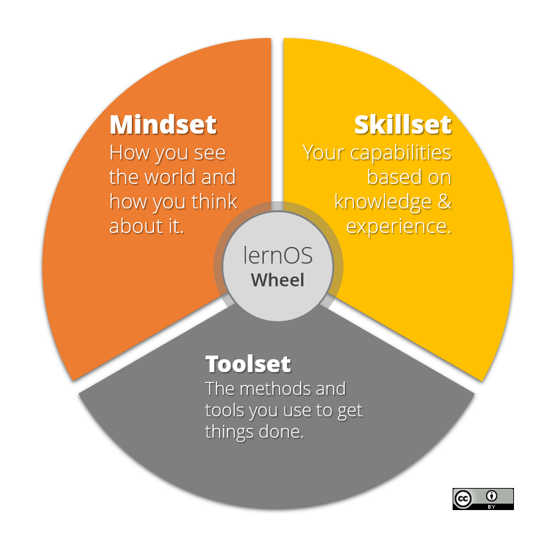

# lernOS Getting Started
We live and work in a world of constant change. With trends like globalization, digitization, and urbanization the so called VUCA world emerged. [VUCA](https://en.wikipedia.org/wiki/Volatility,_uncertainty,_complexity_and_ambiguity) stands for volatility, uncertainty, complexity, and ambiguity as described in a study by James A. Lawrence in 1991. In such an environment theories, principles, and tools for management and self-management from the 20th century have to be updated for the digital connected knowledge society of the 21st century. In his book [Drive](https://en.wikipedia.org/wiki/Drive:_The_Surprising_Truth_About_What_Motivates_Us) Daniel Pink outlined that change in 140 characters: "Carrots & Sticks are so last century. We need to upgrade to autonomy, mastery and purpose".

This is true for individuals and organizations (for-profit and non-profit). To be successful in a VUCA world you have to practice a workstyle of "self-directed lifelong learning". You have to acquire new (digital) skills and also get used to new (digital) tools. To be successful as an organization you have to become a "learning organization". A learning organization [according to David Garvin](https://hbr.org/2008/03/is-yours-a-learning-organization) is an organization skilled at creating, acquiring, and transferring knowledge, and at modifying its behavior to reflect new knowledge and insights.

In terms of learning not all knowledge has to be created from scratch, not every wheel has to be reinvented and not all mistakes have to be repeated. If you have an open mindset and connect with others inside and outside your organization you will be [standing on the shoulders of giants](https://en.wikipedia.org/wiki/Standing_on_the_shoulders_of_giants). Consultancy [McKinsey found](https://www.mckinsey.com/industries/high-tech/our-insights/the-rise-of-the-networked-enterprise-web-20-finds-its-payday) that a fully networked enterprise in contrast to companies working in silos internally and externally has a benefit of over 30%. So working in an open and connected way seems to be good for you and your organization at the same time.

The [digital transformation](https://en.wikipedia.org/wiki/Digital_transformation) enables new ways of working and new ways of learning. Digital transformation means that products, processes, and business models are digitized (e.g. transition vinyl record/compact disc/spotify, Airbnb as hotel company without buildings, Uber as taxi company without cars). To make use of these new possibilities digital skills have to be acquired by everybody. These skills can be learned with new methods like [Getting Things Done](https://gettingthingsdone.com/), [Personal Knowledge Mastery](https://jarche.com/pkm/), [Scrum](https://www.scrumguides.org/), [Holacracy](https://www.holacracy.org/constitution), and [Working Out Loud](https://workingoutloud.com/). One example: at the german engineering company Bosch 98% of employees practicing Working Out Loud say that the method helps to improve digital skills and support cultural change. You don't have to be a digital native to learn these skills. Everybody can learn them one small step at a time.

lernOS will help you and your organization to develop necessary [21st century skills](https://learning.mozilla.org/en-US/web-literacy) like problem-solving, communication, creativity, and collaboration. You can use lernOS on your own or together with 3-4 other people in a [peer support](https://en.wikipedia.org/wiki/Peer_support) group called lernOS Circle.

lernOS is an operating system (OS) for livelong learning and learning organizations. The name is derived from the Esperanto verb "to learn". Like OKR lernOS can be used on personal, team, and individual level.

# lernOS Wheel - Mindset, Skillset, and Toolset as Success Factors

Mastering the Digital Age and the Knowledge Society of the 21st century is not a matter of implementing the right (digital) tools and methods. Starting with the right mindset and learning new skills is crucial. The lernOS Wheel brings together these success factors as mindset, skillset, and toolset:

# lernOS Circle - From Talking The Talk to Walking the Walk
Of course you can practice lernOS on your own. But it is more fun and also easier if you practice it in a group of 4-5 people called a lernOS Circle. A Circle is a [peer support](https://en.wikipedia.org/wiki/Peer_support) group where people help each other by providing knowledge, experience, emotional, social and practical help. The lernOS Circle is a "circle of trust" so what happens in the Circle stays in the Circle.

In a lernOS Circle every Circle member chooses one or more individual objectives. For each objective one defines key results which measure (on a scale from 0.0 to 1.0) if the objective is reached. The objectives should be ambitious so that a key result completion rate of 0.7 is considered a success.

The lernOS Circle meets each week in a 30-60 minutes Check-In with the agenda described above. The Check-in can be face-to-face or virtual. If Circle members don't know each other it might be good to have the first Check-Ins face-to-face to get to know each others and build trust.

Tools that might help to organize communication and documentation for Circles:

* **Web Conferencing** like [Skype for Business](https://en.wikipedia.org/wiki/Skype_for_Business), [Skype](https://en.wikipedia.org/wiki/Skype), [Zoom](https://en.wikipedia.org/wiki/Zoom_Video_Communications), [GoToMeeting](https://en.wikipedia.org/wiki/GoToMeeting), [Circuit](https://circuit.com)
* **Instant Messengers** like [Threema](https://en.wikipedia.org/wiki/Threema), [MS Teams](https://en.wikipedia.org/wiki/Microsoft_Teams), [Slack](https://en.wikipedia.org/wiki/Slack_(software)), [WhatsApp](https://en.wikipedia.org/wiki/WhatsApp), [WeChat](https://en.wikipedia.org/wiki/WeChat), [Telegram](https://en.wikipedia.org/wiki/Telegram_(service)), [Signal](https://en.wikipedia.org/wiki/Signal_(software)), [RocketChat](https://rocket.chat)
* **Enterprise Social Networks** like [Jive](https://en.wikipedia.org/wiki/Jive_Software), [Yammer](https://en.wikipedia.org/wiki/Yammer), [Connections](https://en.wikipedia.org/wiki/IBM_Connections), [Lithium](https://en.wikipedia.org/wiki/Lithium_Technologies), [Workplace by Facebook](https://en.wikipedia.org/wiki/Workplace_by_Facebook)
* **Personal Notebooks** like [OneNote](https://en.wikipedia.org/wiki/Microsoft_OneNote), [Evernote](https://en.wikipedia.org/wiki/Evernote), [TiddlyWiki](https://en.wikipedia.org/wiki/TiddlyWiki), [Etherpad](https://en.wikipedia.org/wiki/Etherpad)
* **File Hosting Services** like [Dropbox](https://en.wikipedia.org/wiki/Dropbox_(service)), [OneDrive](https://en.wikipedia.org/wiki/OneDrive), [Google Drive](https://en.wikipedia.org/wiki/Google_Drive), [OwnCloud](https://en.wikipedia.org/wiki/OwnCloud)
* **Task Management Services** like [Trello](https://en.wikipedia.org/wiki/Trello), [Microsoft ToDo](https://en.wikipedia.org/wiki/Microsoft_To-Do), [Microsoft Planner](https://en.wikipedia.org/wiki/Microsoft_Planner)
* **Mind Mapping Software** like [XMind](https://en.wikipedia.org/wiki/XMind), [Freemind](https://en.wikipedia.org/wiki/FreeMind), [MindManager](https://en.wikipedia.org/wiki/MindManager), [iThoughts](https://www.toketaware.com/ithoughts-ios), [MindMeister](https://en.wikipedia.org/wiki/MindMeister)
* **Weblog Software** like [Wordpress](https://en.wikipedia.org/wiki/WordPress), [Tumblr](https://en.wikipedia.org/wiki/Tumblr)

# lernOS Sprint - Driving Agile Planning And Execution
A lernOS sprint consists of 13 weeks (week 0 -12). In week 0 all organizational issues (meetings, communication channels, documentation etc.) and a first version of your objective(s) (one or more) for the sprint are defined. The objectives for the sprint can be refined between week 0 and week 1. In week 1 the objectives are fixed for the sprint.

In week 1-12 there is a weekly 30-60-minute event called the lernOS Check-In. The Check-In is a short ceremony to track results. Every Check-In has the same agenda structure (see also [The Beginners Guide to OKR](http://felipecastro.com/resource/The-Beginners-Guide-to-OKR.pdf), page 38):

## Week 0
Agenda Item | Timebox
----------- | -------
**Warm-up:** what happend since the last check-in? | ... min
**Objective Progress:** what changed in the Key Results since the last Check-In? | ... min
**Confidence Level:** with the information I have today, how confident am I that I will reach earch Key Result? | ... min
**Impediments:** what is slowing me down? | ... min
**Initiatives:** what am I going to do to improve results? | ... min

## Week 1
Agenda Item | Timebox
----------- | -------
**Warm-up:** what happend since the last check-in? | ... min
**Objective Progress:** what changed in the Key Results since the last Check-In? | ... min
**Confidence Level:** with the information I have today, how confident am I that I will reach earch Key Result? | ... min
**Impediments:** what is slowing me down? | ... min
**Initiatives:** what am I going to do to improve results? | ... min

## Week 2
Agenda Item | Timebox
----------- | -------
**Warm-up:** what happend since the last check-in? | ... min
**Objective Progress:** what changed in the Key Results since the last Check-In? | ... min
**Confidence Level:** with the information I have today, how confident am I that I will reach earch Key Result? | ... min
**Impediments:** what is slowing me down? | ... min
**Initiatives:** what am I going to do to improve results? | ... min

## Week 3
Agenda Item | Timebox
----------- | -------
**Warm-up:** what happend since the last check-in? | ... min
**Objective Progress:** what changed in the Key Results since the last Check-In? | ... min
**Confidence Level:** with the information I have today, how confident am I that I will reach earch Key Result? | ... min
**Impediments:** what is slowing me down? | ... min
**Initiatives:** what am I going to do to improve results? | ... min

## Week 4
Agenda Item | Timebox
----------- | -------
**Warm-up:** what happend since the last check-in? | ... min
**Objective Progress:** what changed in the Key Results since the last Check-In? | ... min
**Confidence Level:** with the information I have today, how confident am I that I will reach earch Key Result? | ... min
**Impediments:** what is slowing me down? | ... min
**Initiatives:** what am I going to do to improve results? | ... min

## Week 5
Agenda Item | Timebox
----------- | -------
**Warm-up:** what happend since the last check-in? | ... min
**Objective Progress:** what changed in the Key Results since the last Check-In? | ... min
**Confidence Level:** with the information I have today, how confident am I that I will reach earch Key Result? | ... min
**Impediments:** what is slowing me down? | ... min
**Initiatives:** what am I going to do to improve results? | ... min

## Week 6
Agenda Item | Timebox
----------- | -------
**Warm-up:** what happend since the last check-in? | ... min
**Objective Progress:** what changed in the Key Results since the last Check-In? | ... min
**Confidence Level:** with the information I have today, how confident am I that I will reach earch Key Result? | ... min
**Impediments:** what is slowing me down? | ... min
**Initiatives:** what am I going to do to improve results? | ... min

## Week 7
Agenda Item | Timebox
----------- | -------
**Warm-up:** what happend since the last check-in? | ... min
**Objective Progress:** what changed in the Key Results since the last Check-In? | ... min
**Confidence Level:** with the information I have today, how confident am I that I will reach earch Key Result? | ... min
**Impediments:** what is slowing me down? | ... min
**Initiatives:** what am I going to do to improve results? | ... min

## Week 8
Agenda Item | Timebox
----------- | -------
**Warm-up:** what happend since the last check-in? | ... min
**Objective Progress:** what changed in the Key Results since the last Check-In? | ... min
**Confidence Level:** with the information I have today, how confident am I that I will reach earch Key Result? | ... min
**Impediments:** what is slowing me down? | ... min
**Initiatives:** what am I going to do to improve results? | ... min

## Week 9
Agenda Item | Timebox
----------- | -------
**Warm-up:** what happend since the last check-in? | ... min
**Objective Progress:** what changed in the Key Results since the last Check-In? | ... min
**Confidence Level:** with the information I have today, how confident am I that I will reach earch Key Result? | ... min
**Impediments:** what is slowing me down? | ... min
**Initiatives:** what am I going to do to improve results? | ... min

## Week 10
Agenda Item | Timebox
----------- | -------
**Warm-up:** what happend since the last check-in? | ... min
**Objective Progress:** what changed in the Key Results since the last Check-In? | ... min
**Confidence Level:** with the information I have today, how confident am I that I will reach earch Key Result? | ... min
**Impediments:** what is slowing me down? | ... min
**Initiatives:** what am I going to do to improve results? | ... min

## Week 11
Agenda Item | Timebox
----------- | -------
**Warm-up:** what happend since the last check-in? | ... min
**Objective Progress:** what changed in the Key Results since the last Check-In? | ... min
**Confidence Level:** with the information I have today, how confident am I that I will reach earch Key Result? | ... min
**Impediments:** what is slowing me down? | ... min
**Initiatives:** what am I going to do to improve results? | ... min

## Week 12
Agenda Item | Timebox
----------- | -------
**Warm-up:** what happend since the last check-in? | ... min
**Objective Progress:** what changed in the Key Results since the last Check-In? | ... min
**Confidence Level:** with the information I have today, how confident am I that I will reach earch Key Result? | ... min
**Impediments:** what is slowing me down? | ... min
**Initiatives:** what am I going to do to improve results? | ... min

# lernOS Canvas - Use it as Checklist And To Tell Your Story

The **lernOS Canvas** ([PDF](lernOS-mi-Canvas.pdf)) uses a similar structure as the [business model canvas](https://en.wikipedia.org/wiki/Business_Model_Canvas) by Alex Osterwalder. It can be used to systematically go through the elements of lernOS and create your personal management system with a strong focus on knowledge and learning.

The basic elements of the lernOS Canvas are:

* **Objectives & Key Results:** what you try to reach and how you measure success
* **Activities:** tasks and **roles** you have, **projects** you run
* **Knowledge:** your **expertise**, know-how between your ears or codified in **knowledge assets** (e.g. checklists, presentations) stored in your **repositories** (e.g. social intranet, onedrive, slideshare)
* **Relationships:** people in your **social network** (physical or virtual) helping you to achieve your objectives

# lernOS Memex - Get Things Out Of Your Head And In A System You Trust

Everything you define or agree upon should be documented in a system you trust. This is not for bureaucracy reasons but to keep your head free for creative knowledge work. You can use any personal notebook (paper-based or digital) as lernOS Memex (memex = memory extender).

If you do not have any tool at hand, you can download and use the [TiddlyWiki-Version of lernOS Memex](https://github.com/simondueckert/lernos/blob/master/lernOS%20Memex%20-%20en/lernOS-Memex.html) which is structured by the basic lernOS elements by default. This version is based on [TiddlyWiki](https://tiddlywiki.com/), a personal wiki that lives in a single HTML file:

# lernOS Exercises - Time And Place To Practice New Skills

How do you become a great musician? It's good to know the theory and to understand the mechanics of your instrument. It also helps if you have talent. But real mastery comes from practicing, applying the theory over and over again, using feedback to get better every time. lernOS uses a catalogue of exercises to train new skills. Exercises can be practiced in a lernOS Circle or in separate events and workshops.

## Exercise: Why Are You Here?
What is your motivation for using lernOS or being part of a lernOS Circle? Too often we try to change things by start using new
methods and tools but the WHY stays unclear. Like Simon Sinek put it in his [TEDx Talk How Great Leaders Inspire Action](https://www.ted.com/talks/simon_sinek_how_great_leaders_inspire_action) with the "Golden Circle": we should start with WHY and then think about the HOW and the WHAT.

>ToDo: Think and talk about why you want to practice lernOS and/or why you joined a Circle.

## Exercise: My Objective(s) For The Next 12 weeks
What are you trying to accomplish in the next 12 weeks of the sprint? If you start using lernOS you should pick one objective that you really care about and you can make progress towards in the sprint. If you are an experienced practitioner you can choose up to five objectives per sprint.

According to the method Objective Key Results (OKR) you should define 2-5 key results per objective. You should be able to measure the key results on a scale from 0.0-1.0. To make sure that you choose yourself ambitious goals a grade of 0.7 is seen as success in OKR (see also [With Goals, FAST beats SMART](https://sloanreview.mit.edu/article/with-goals-fast-beats-smart/)). OKR initiator John Doerr used the sentence as template "I will ... as measured by ... ." for the creation of OKRs.

>ToDo: Write down 1-4 obejectives and 2-5 key results per objective.

## Exercise: Working Alone Is Addition, Working Together Is Multiplication
Most of the tasks you have one your list, have been done by others successfully before. Most of the mistakes you might make, have been made in the past already. You can gain access to knowledge and experiences related to your objectives and avtivities by getting in touch with people inside and outside your organization in a systematic way.

To build strong relationships with people that matter you should not only market yourself and push information about yourself. You should also listen and relate contributions to information you have about others. Networking specialist [Dale Carnegie](https://en.wikipedia.org/wiki/Dale_Carnegie) put it this way: "You can make more friends in two months by becoming interested in other people than you can in two years by trying to get other people interested in you".

>ToDo: Create an overview of people related to your activities and objectives in a relationship list. Try to have a list of at least ten people. Entries in the kist might be names (if you know people already) or roles like "Head of Hr in company XY. You can use services like your Social Intranet/Enterprise Social Network, LinkedIn, Twitter, Xing, YouTube, SlideShare and ResearchGate to search for people you want in your network.

## Exercise: Strong And Weak Ties
An often quoted theory in social networking is [The Strength of Weak Ties](http://www.cs.umd.edu/~golbeck/INST633o/granovetterTies.pdf) by Mark Granovetter. According to that theory the strength of an interpersonal tie (a relationship to another person) can be defined by the amount of time spent together, the emotional intensity, the level of intimacy and trust, and the reciprocal services (helping each other) which characterize the tie.

According to Granovetter an [interpersonal tie](https://en.wikipedia.org/wiki/Interpersonal_ties) comes in three varieties:

1. **Strong** (you regularly interact, meet, help each other)
1. **Weak** (you are somehow connected, you had interactions in the past)
1. **Absent** (you don't know each other)

>ToDo: Take your relationship list from kata "Working Alone Is Addition, Working Together Is Multiplication" and grade every relationship as 1 (strong), 2 (weak), or 3 (absent) to get an idea which relationships should be deepened in the future.

## Exercise: Your First Sharing Experience
A common word of mouth says "sharing is caring". So when you invest time and effort in sharing your knowledge and knowledge assets (documents, images, videos etc.) your relationships deepen by every contribution you make and the people in your network are more willing to support you with your objectives aswell. With regard to knowledge in contrast to physical objects or money there is one big advantage: Knowledge is the only Resource that Increases through Use!

So if you share your knowledge you still have it and others have it aswell. In the [Mozilla Web Literacy Framework](https://learning.mozilla.org/en-US/web-literacy) Sharing is definied as Giving others access to files or digital content in an online space while respecting copyright and licenses. So if you share assets you have to be aware of legal issues like data protection (if you want to share assets of your organization), copyright issues and license issues.

>ToDo: Think about experiences and knowledge assets that you have and that you are willing to share. The go through your relationship list and choose one person that might like your contribution. Choose an appropriate channel (e.g. private in e-mail, semi-private in an enterprise social netowrk or public on twitter) and share your knowledge!

## Exercise: A Letter To Your Future Self
The letter to your future self is a classic method in self motivation. You reflect on your current situation and give your future self an advice. You write it down as a letter, address it to yourself and open it in the future. You can use a paper letter or services like [futureme.org](https://futureme.org) that will send you the letter as e-mail in the future:

How to write your letter to your future self (see also [tutorial on wikiHow.com](https://m.wikihow.com/Write-a-Letter-to-Your-Future-Self)):

* Talking about who you are now (age, summary, fears, key values, beliefs, skills, abilities, goals, hopes
* Addressing your future self (things you want to stop/continue/start doing, give yourself advice, ask yourself questions
* Seal the letter ans store it in a safe place or use technology to send it to you in the future

>ToDo: Create your letter to your future self and send it to the future.

## Exercise: 25 Random Things About Me

If you apply to study at Fuqua Business School you have to write an essay with a list of 25 random things about yourself so the application team gets to know you better. When you write down facts about yourself you collect information that might help you in networking to make new connections based on similar interests and backgrounds (e.g. "We studied in the same place 20 years ago!", see also [New York Times Article](https://www.nytimes.com/2009/02/05/fashion/05things.html)). Random things about yourself might include:

* Life experiences
* Your likes/dislikes
* Where you were born/lived
* Family, kids, parents
* Schools, universities
* Workplaces in the past
* Career challenges
* Vacations
* Hobbies
* Achievements
* Fun facts
* Anything that helps to understand what makes you who YOU are

>ToDo: Start creating a list of 10 random things about yourself. Read the [Fuqua 25 random things do's and dont's](https://stratusadmissionscounseling.com/duke-fuqua-25-random-things-dos-donts/). Then expand the list to 25 things.
